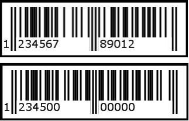
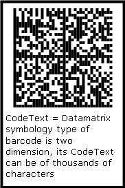

A barcode is the representation of characters in the form of bars and spaces between them. We have to assign characters to Aspose.BarCode so that the input characters are converted to a barcode. These characters make up the codetext.

**JRXML**



 <image hAlign="Center">

    <reportElement x="0" y="100" width="500" height="250" />

    <imageExpression class="net.sf.jasperreports.engine.JRRenderable"><![CDATA[new com.aspose.barcode.jr.BarCodeRenderer(com.aspose.barcode.jr.BarCodeAttributesFactory.Create("codetext","DataMatrix",java.awt.Color.BLACK))]]></imageExpression>

</image>


### **Code Text Versus Symbology**
Developers can specify any characters for codetext but only according to the symbology type. For example, if a barcode's symbology type is Symbology.EAN13, the valid character set of the EAN13 specification is limited to numeric values and 13 digits only. Set a too long codetext and the outbound part is truncated; too short and zeros are added to make 13 characters.

**When codetext is too long or too short** 

Some barcode symbologies accepts longer codetext. If the codetext is longer than the image width, it wraps to the next line.

**Wrapping codetext** 

Human readable codetext does not affect the machine scanning process. Some 2D barcodes can contain the huge chunks of data, up to thousands of characters. You might choose not to show the code text.
