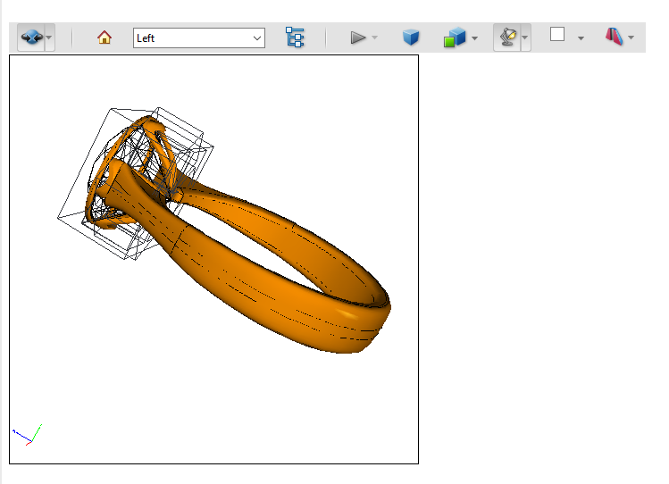

Annotations in a PDF document are contained in a [Page](https://reference.aspose.com/pdf/java/com.aspose.pdf/Page) object’s Annotations collection. This collection contains all annotations for that individual page only: every page has its own Annotations collection. To add an annotation to a particular page, add it to that page’s Annotations collection using the Add method.

Use the [ScreenAnnotation](https://reference.aspose.com/pdf/java/com.aspose.pdf.class-use/ScreenAnnotation) class in the Aspose.PDF.InteractiveFeatures.Annotations namespace to include SWF files as annotations in a PDF document instead. A screen annotation specifies a region of a page upon which media clips may be played.

When you need to add an external video link in PDF document, you can use [MovieAnnotation](https://reference.aspose.com/pdf/java/com.aspose.pdf.class-use/MovieAnnotation).
A Movie Annotation contains animated graphics and sound to be presented on the computer screen and through the speakers.

A [Sound Annotation](https://reference.aspose.com/pdf/java/com.aspose.pdf/soundannotation) shall analogous to a text annotation except that instead of a text note, it contains sound recorded from the computer’s microphone or imported from a file. When the annotation is activated, the sound shall be played. The annotation shall behave like a text annotation in most ways, with a different icon (by default, a speaker) to indicate that it represents a sound.

However, when there is a requirement to embed media inside PDF document, you need to use [RichMediaAnnotation](https://reference.aspose.com/pdf/java/com.aspose.pdf/class-use/RichMediaAnnotation).

The following methods/properties of RichMediaAnnotation class can be used.

- Stream CustomPlayer { set; }: Allows setting player used to play video.
- string CustomFlashVariables { set; }: Allows to set variables that are passed to flash application. This line is set of “key=value” pairs which are separated with ‘&'.
- void AddCustomData(strig name, Stream data):  Add additional data for the player. For example source=video.mp4&autoPlay=true&scale=100
- ActivationEvent ActivateOn { get; set}:  Event activates player; possible values are Click, PageOpen, PageVisible
- void SetContent(Stream stream, string name): Set video/audio data to be playedю
- void Update():  Create a data structure of the annotation. This method should be called last
- void SetPoster(Stream): Set poster of the video i.e. picture shown when the player is not active

## Add Screen Annotation

The following code snippet shows how to add Screen Annotation to a PDF file:

```java
package com.aspose.pdf.examples;

import java.io.FileInputStream;
import java.io.FileNotFoundException;
import java.util.*;
import com.aspose.pdf.*;

public class ExampleMultimediaAnnotation {

    // The path to the documents directory.
    private static String _dataDir = "/home/admin1/pdf-examples/Samples/";

    public static void AddScreenAnnotation() {
        // Load the PDF file
        Document document = new Document(_dataDir + "sample.pdf");
        Page page = document.getPages().get_Item(1);

        String mediaFile = _dataDir + "input.swf";
        // Create Screen Annotation
        ScreenAnnotation screenAnnotation = new ScreenAnnotation(page, new Rectangle(170, 190, 470, 380), mediaFile);
        page.getAnnotations().add(screenAnnotation);

        document.save(_dataDir + "sample_swf.pdf");
    }
}
```

## Add Sound Annotation

The following code snippet shows how to add Sound Annotation to a PDF file:

```java
          public static void AddSoundAnnotation() {
        // Load the PDF file
        Document document = new Document(_dataDir + "sample.pdf");
        Page page = document.getPages().get_Item(1);

        String mediaFile = _dataDir + "file_example_WAV_1MG.wav";

        // Create Sound Annotation
        SoundAnnotation soundAnnotation = new SoundAnnotation(page, new Rectangle(20, 700, 60, 740), mediaFile);
        soundAnnotation.setColor(Color.getBlue());
        soundAnnotation.setTitle("John Smith");
        soundAnnotation.setSubject("Sound Annotation demo");
        soundAnnotation.setPopup(new PopupAnnotation(document));

        page.getAnnotations().add(soundAnnotation);

        document.save(_dataDir + "sample_wav.pdf");
    }
```

## Add RichMediaAnnotation

The following code snippet shows how to add RichMediaAnnotation to a PDF file:

```java
     public static void AddRichMediaAnnotation() throws FileNotFoundException {
        Document doc = new Document();
        var pathToAdobeApp = "C:\\Program Files (x86)\\Adobe\\Acrobat 2017\\Acrobat\\Multimedia Skins";
        Page page = doc.getPages().add();

        // give name to video data. This data will be embedded into document with this
        // name and referenced from flash variables by this name.
        // videoName should not contain path to the file; this is rather "key" to access
        // data inside of the PDF document

        String videoName = "file_example_MP4_480_1_5MG.mp4";
        String posterName = "file_example_MP4_480_1_5MG_poster.jpg";

        // also we use skin for video player
        String skinName = "SkinOverAllNoFullNoCaption.swf";

        RichMediaAnnotation rma = new RichMediaAnnotation(page, new Rectangle(100, 500, 300, 600));

        // here we should specify stream containing code of the video player
        rma.setCustomPlayer(new FileInputStream(pathToAdobeApp + "Players" + "Videoplayer.swf"));

        // compose flash variables line for player. please note that different players
        // may have different format of the flash variables line.
        // Refer to documentation for your player.
        rma.setCustomFlashVariables("source=" + videoName + "&skin=" + skinName);

        // add skin code.
        rma.addCustomData(skinName, new FileInputStream(pathToAdobeApp + "SkinOverAllNoFullNoCaption.swf"));
        // set poster for video
        rma.setPoster(new FileInputStream(_dataDir + posterName));

        // set video content
        rma.setContent(videoName, new FileInputStream(_dataDir + videoName));

        // set type of the content (video)
        rma.setType(RichMediaAnnotation.ContentType.Video);

        // active player by click
        rma.setActivateOn(RichMediaAnnotation.ActivationEvent.Click);

        // update annotation data. This method should be called after all
        // assignments/setup. This method initializes data structure of the annotation
        // and embeds required data.
        rma.update();

        // add annotation on the page.
        page.getAnnotations().add(rma);

        doc.save(_dataDir + "RichMediaAnnotation.pdf");
    }
```

## Get MultimediaAnnotation

Please try using the following code snippet to Get MultimediaAnnotation from PDF document.

```java
public static void GetMultimediaAnnotation() {
        // Load the PDF file
        Document document = new Document(_dataDir + "RichMediaAnnotation.pdf");

        Page page = document.getPages().get_Item(1);
        AnnotationSelector annotationSelector = new AnnotationSelector(
                new RichMediaAnnotation(page, Rectangle.getTrivial()));
        page.accept(annotationSelector);
        List<Annotation> mediaAnnotations = annotationSelector.getSelected();

        for (Annotation ma : mediaAnnotations) {
            System.out.println(ma.getAnnotationType() + " " + ma.getRect());
        }
    }
```

## Delete MultimediaAnnotation

The following code snippet shows how to Delete MultimediaAnnotation from PDF file.

```java
    public static void DeletePolyAnnotation() {
        // Load the PDF file
        Document document = new Document(_dataDir + "RichMediaAnnotation.pdf");

        Page page = document.getPages().get_Item(1);
        AnnotationSelector annotationSelector = new AnnotationSelector(
                new RichMediaAnnotation(page, Rectangle.getTrivial()));
        page.accept(annotationSelector);
        List<Annotation> mediaAnnotations = annotationSelector.getSelected();
        for (Annotation ma : mediaAnnotations) {
            page.getAnnotations().delete(ma);
        }
        document.save(_dataDir + "RichMediaAnnotation_del.pdf");
    }
```

## Add Widget Annotations

Interactive forms use [Widget Annotations](https://reference.aspose.com/pdf/java/com.aspose.pdf.class-use/WidgetAnnotation) to represent the appearance of fields and to manage user interactions.
We use these form elements that add to a PDF to make it easier to enter, submit information, or perform some other user interactions.

Widget Annotations are a graphical representation of a form field on specific pages, so we cannot create it directly as an annotation.

Each Widget Annotation will have appropriate graphics (appearance) depending on its type. After creation, certain visual aspects can be changed, such as border style and background color.
Other properties such as text color and font can be changed through the field, once attached to one.

In some cases, you may want a field to appear on more than one page, repeating the same value. In that case, fields that normally have just one widget may have multiple widgets attached: a TextField, ListBox, ComboBox, and CheckBox usually have exactly one, while the RadioGroup has multiple widgets, one for each radio button.
Someone filling out the form may use any of those widgets to update the field's value, and this is reflected in all the other widgets as well.

Each form field for each place in the document represents one Widget Annotation. The location-specific data of Widget Annotation are added to the particular page. Each form field has several variations. A button can be a radio button, a checkbox, or a push-button. A choice widget can be a list box or a combo box.

In this sample, we will learn how to add the push-buttons for navigation in the document.

## Add Button to the Document

```java
package com.aspose.pdf.examples;

import com.aspose.pdf.*;
import java.util.*;

public class ExampleWidgetAnnotation {

    private static String _dataDir = "/home/admin1/pdf-examples/Samples/";

    public static void AddButton()
    {
        // Load the PDF file
        Document document = new Document(_dataDir + "sample.pdf");
        Page page = document.getPages().get_Item(1);

        Rectangle rect = new Rectangle(72, 748, 164, 768);
        ButtonField printButton = new ButtonField(page, rect);
        printButton.setAlternateName("Print current document");
        printButton.setColor(Color.getBlack());
        printButton.setPartialName("printBtn1");
        printButton.setNormalCaption("Print Document");

        Border border = new Border(printButton);
        border.setStyle(BorderStyle.Solid);
        border.setWidth(2);

        printButton.setBorder(border);
        printButton.getCharacteristics().setBorder(Color.fromArgb(255, 0, 0, 255));
        printButton.getCharacteristics().setBackground(Color.fromArgb(255, 0, 191, 255));
        document.getForm().add(printButton);

        document.save(_dataDir + "sample_textannot.pdf");
    }
}
```

This button has border and set a background. Also we set a button name (Name), a tooltip (AlternateName), a label (NormalCaption), and a color of the label text (Color).

## Using Document-navigation actions

Exist more complex example of the Widget Annotations usage - document navigation in PDF document. This may be needed to prepare a PDF document presentation.

This example shows how to create 4 buttons:

```java
public static void AddDocumentNavigationActions() {
// Load the PDF file
Document document = new Document(_dataDir + "JSON Fundamenals.pdf");

ButtonField[] buttons = new ButtonField[4];
String[] alternateNames = { "Go to first page", "Go to prev page", "Go to next page", "Go to last page" };
String[] normalCaptions = { "First", "Prev", "Next", "Last" };
int[] actions = { PredefinedAction.FirstPage, PredefinedAction.PrevPage, PredefinedAction.NextPage,
PredefinedAction.LastPage };
Color clrBorder = Color.fromArgb(255, 0, 255, 0);
Color clrBackGround = Color.fromArgb(255, 0, 96, 70);

for (int i = 0; i < 4; i++) {
buttons[i] = new ButtonField(document, new Rectangle(32 + i * 80, 28, 104 + i * 80, 68));
buttons[i].setAlternateName(alternateNames[i]);
buttons[i].setColor(Color.getWhite());
buttons[i].setNormalCaption(normalCaptions[i]);
buttons[i].setOnActivated(new NamedAction(actions[i]));
Border border = new Border(buttons[i]);
border.setStyle(BorderStyle.Solid);
border.setWidth(2);
buttons[i].setBorder(border);
buttons[i].getCharacteristics().setBorder(clrBorder);
buttons[i].getCharacteristics().setBackground(clrBackGround);
}

for (int pageIndex = 1; pageIndex <= 1; pageIndex++)
for (int i = 0; i < 4; i++)
document.getForm().add(buttons[i], "btn" + pageIndex + "_" + (i + 1), pageIndex);

document.getForm().get("btn1_1").setReadOnly(true);
document.getForm().get("btn1_2").setReadOnly(true);

document.getForm().get("btn" + document.getPages().size() + "_3").setReadOnly(true);
document.getForm().get("btn" + document.getPages().size() + "_4").setReadOnly(true);
document.save(_dataDir + "sample_widgetannot_2.pdf");
}
```

## How to delete Widget Annotation

Aspose.PDF for Java has rules for removing annotations from your file:

```java
public static void DeleteWidgetAnnotation() {
        // Load the PDF file
        Document document = new Document(_dataDir + "sample_textannot.pdf");

        // Filter annotations using AnnotationSelector
        Page page = document.getPages().get_Item(1);
        AnnotationSelector annotationSelector = new AnnotationSelector(new ButtonField(page, Rectangle.getTrivial()));
        page.accept(annotationSelector);
        List<Annotation> buttonFields = annotationSelector.getSelected();

        // delete annotations
        for (Annotation wa : buttonFields) {
            page.getAnnotations().delete(wa);
        }
        document.save(_dataDir + "sample_widgetannot_del.pdf");
    }
```

In PDF documents, you can view and manage high-quality 3D content created with 3D CAD or 3D modeling software and embedded in the PDF document. Can rotate 3D elements in all directions as if you were holding them in your hands.

Why do you need a 3D display of images at all?

Over the past few years, tech has made huge breakthroughs in all areas thanks to 3D printing. 3D printing technologies can be applied to teach technological skills in construction, mechanical engineering, design as the main tool. These technologies thanks to the emergence of personal printing devices can contribute to the introduction of new forms of organization of the educational process, increase motivation, and formation of the necessary competencies of graduates
and teachers.

The main task of 3D modeling is the idea of a future object or object because, in order to release an object, you need an understanding of its design features in all detail for successive regeneration in industrial design or architecture.

## Add 3D Annotation

3D annotation is added using a model created in the U3D format with Aspose.PDF for Java

1. Create a new [Document](https://reference.aspose.com/pdf/java/com.aspose.pdf/class-use/Document)
1. Load the data of the desired 3D model (in our case "Ring.u3d") to create [PDF3DContent](https://reference.aspose.com/pdf/java/com.aspose.pdf.class-use/PDF3DContent)
1. Create [3dArtWork](https://reference.aspose.com/pdf/java/com.aspose.pdf/PDF3DArtwork) object and link it to the document and 3DContent
1. Tune pdf3dArtWork object:

    - 3DLightingScheme - (we will set  `CAD` in example)
    - 3DRenderMode - (we will set `Solid` in example)
    - Fill `ViewArray`, create at least one [3D View](https://reference.aspose.com/pdf/java/com.aspose.pdf/PDF3DView) and add it to array.

1. Set 3 basic parameters in annotation:
    - the `page` on which the annotation will be placed,
    - the `rectangle`, inside which the annotation,
    - and the `3dArtWork` object.
1. For a better presentation of the 3D object, set the Border frame
1. Set the default view (for example - TOP)
1. Add some additional parameters: name, preview poster etc.
1. Add Annotation to the [Page](https://reference.aspose.com/pdf/java/com.aspose.pdf/Page)
1. Save the result

## Example

Please check the following code snippet to add 3D Annotation.

```java
    public class Example3DAnnotation
    {
    private static String _dataDir = "/home/aspose/pdf-examples/Samples/";
    public static void Add3dAnnotation()
    {
    // Load the PDF file
    Document document = new Document();
    PDF3DContent pdf3DContent = new PDF3DContent(_dataDir + "Ring.u3d");
    PDF3DArtwork pdf3dArtWork = new PDF3DArtwork(document, pdf3DContent);
    pdf3dArtWork.setLightingScheme(new PDF3DLightingScheme(LightingSchemeType.CAD));
    pdf3dArtWork.setRenderMode(new PDF3DRenderMode(RenderModeType.Solid));

    var topMatrix = new Matrix3D(1,0,0,0,-1,0,0,0,-1,0.10271,0.08184,0.273836);
    var frontMatrix = new Matrix3D(0, -1, 0, 0, 0, 1, -1, 0, 0, 0.332652, 0.08184, 0.085273);
    pdf3dArtWork.getViewArray().add(new PDF3DView(document, topMatrix, 0.188563, "Top")); //1
    pdf3dArtWork.getViewArray().add(new PDF3DView(document, frontMatrix, 0.188563, "Left")); //2

    var page = document.getPages().add();

    var pdf3dAnnotation = new PDF3DAnnotation(page, new Rectangle(100, 500, 300, 700), pdf3dArtWork);
    pdf3dAnnotation.setBorder(new Border(pdf3dAnnotation));
    pdf3dAnnotation.setDefaultViewIndex(1);
    pdf3dAnnotation.setFlags(com.aspose.pdf.AnnotationFlags.NoZoom);
    pdf3dAnnotation.setName("Ring.u3d");
    //set preview image if needed
    //pdf3dAnnotation.setImagePreview(_dataDir + "sample_3d.png");
    document.getPages().get_Item(1).getAnnotations().add(pdf3dAnnotation);

    document.save(_dataDir+"sample_3d.pdf");
    }
}
```

This code example showed us such a model:


