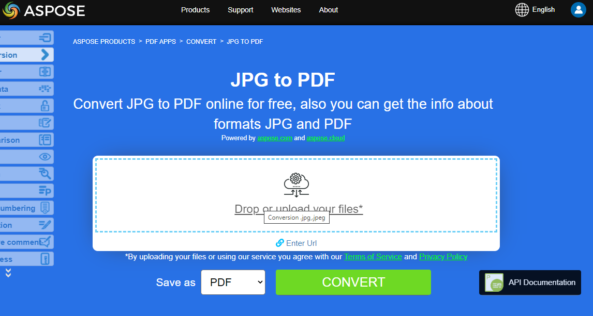

**Aspose.PDF for Java**  allows you to convert different formats of images to PDF files. Our library demonstrates code snippets for converting the most popular image formats, such as - BMP, CGM, D    MF, JPG, PNG, SVG and TIFF formats.

## Convert BMP to PDF

Convert BMP files to PDF document using **Aspose.PDF for Java** library.

<abbr title="Bitmap Image File">BMP</abbr> images are Files having extension .BMP represent Bitmap Image files that are used to store bitmap digital images. These images are independent of graphics adapter and are also called device independent bitmap (DIB) file format.
You can convert BMP to PDF with Aspose.PDF for Java API. Therefore, you can follow the following steps to convert BMP images:

1. Initialize a new Document
1. Load sample BMP image file
1. Finally, save the output PDF file

So the following code snippet follows these steps and shows how to convert BMP to PDF using Java:

```java
package com.aspose.pdf.examples;

import java.io.FileNotFoundException;
import java.nio.file.Path;
import java.nio.file.Paths;

import com.aspose.pdf.*;

public final class ConvertBMPtoPDF {

    private ConvertBMPtoPDF() {
    }

    private static Path _dataDir = Paths.get("<set path to samples>");

    public static void main(String[] args) throws FileNotFoundException {
        // Initialize document object
        Document document = new Document();

        Page page = document.getPages().add();        
        Image image = new Image();
        
        // Load sample BMP image file
        image.setFile(Paths.get(_dataDir.toString(), "Sample.bmp").toString());
        page.getParagraphs().add(image);
        
        // Save output PDF document
        document.save(Paths.get(_dataDir.toString(),"BMPtoPDF.pdf").toString());
    }
}
```

{}
**Try to convert BMP to PDF online**

Aspose presents you online free application ["BMP to PDF"](https://products.aspose.app/pdf/conversion/bmp-to-pdf/), where you may try to investigate the functionality and quality it works.

[](https://products.aspose.app/pdf/conversion/bmp-to-pdf/)
{}

## Convert CGM to PDF

<abbr title="Computer Graphics Metafile">CGM</abbr> is an ISO standard that provides a vector-based 2D image file format for the storage and retrieval of graphics information. CGM is a device-independent format. CGM is a vector graphics format that supports three different encoding methods: binary (best for program read speed), character-based (produces the smallest file size and allows for faster data transfers) or cleartext encoding (allows users to read and modify the file with a text editor)

The following code snippet shows you how to convert CGM files to PDF format using Aspose.PDF for Java.

1. Create a CGM [LoadOptions](https://reference.aspose.com/pdf/java/com.aspose.pdf.class-use/loadoptions) class.
1. Create an instance of [Document](https://reference.aspose.com/page/java/com.aspose.page/Document) class with mention source filename and options.
1. Save the document with the desired file name.

```java
package com.aspose.pdf.examples;

import java.io.FileNotFoundException;
import java.nio.file.Path;
import java.nio.file.Paths;

import com.aspose.pdf.*;

public final class ConvertCGMtoPDF {

    private ConvertCGMtoPDF() {
    }

    private static Path _dataDir = Paths.get("/home/admin1/pdf-examples/Samples");

    public static void main(String[] args) throws FileNotFoundException {
        
        // Create a CGM LoadOptions
        CgmLoadOptions options = new CgmLoadOptions();

        // Initialize document object
        String cgmFileName = Paths.get(_dataDir.toString(), "corvette.cgm").toString();
        Document document = new Document(cgmFileName, options);

        // Save output PDF document
        document.save(Paths.get(_dataDir.toString(),"CGMtoPDF.pdf").toString());
    }
}
```

## Convert DICOM to PDF

<abbr title="Digital Imaging and Communications in Medicine">DICOM</abbr> is a standard for handling, storing, printing, and transmitting information in medical imaging. It includes a file format definition and a network communications protocol.

Aspsoe.PDF for Java allows you to convert DICOM files to PDF format, check next code snippet:

1. Load image into stream
1. Initialize [`Document object`](https://reference.aspose.com/pdf/java/com.aspose.pdf/document)
1. Load sample DICOM image file
1. Save output PDF document

```java
package com.aspose.pdf.examples;

import java.io.FileInputStream;
import java.io.FileNotFoundException;
import java.nio.file.Path;
import java.nio.file.Paths;

import com.aspose.pdf.*;

public final class ConvertDICOMtoPDF {

    private ConvertDICOMtoPDF() {
    }

    private static Path _dataDir = Paths.get("/home/admin1/pdf-examples/Samples");

    public static void main(String[] args) throws FileNotFoundException {
        
        // Load image into stream
        FileInputStream imageStream = new FileInputStream(
            new java.io.File(Paths.get(_dataDir.toString(),"0002.dcm").toString()));

        // Initialize document object
        Document document = new Document();
        document.getPages().add();
        
        // Load sample DICOM image file
        Image image = new Image();
        image.setFileType(ImageFileType.Dicom);
        image.setImageStream(imageStream);

        document.getPages().get_Item(1).getParagraphs().add(image);

        // Save output PDF document
        document.save(Paths.get(_dataDir.toString(),"CGMtoPDF.pdf").toString());
    }
}
```

{}
**Try to convert DICOM to PDF online**

Aspose presents you online free application ["DICOM to PDF"](https://products.aspose.app/pdf/conversion/dicom-to-pdf/), where you may try to investigate the functionality and quality it works.

[](https://products.aspose.app/pdf/conversion/dicom-to-pdf/)
{}

## Convert EMF to PDF

Enhanced metafile format (<abbr title="Enhanced metafile format">EMF</abbr>) stores graphical images device-independently. Metafiles of EMF comprises of variable-length records in chronological order that can render the stored image after parsing on any output device.

We have several approaches to convert EMF into PDF.

## Using Image class

A PDF document comprises pages and each page contains one or more paragraph objects. A paragraph can be a text, image, table, floating box, graph, heading, form field or an attachment. 
To convert an image file into PDF format, enclose it in a paragraph.

It is possible to convert images at a physical location on the local hard
drive, found at a web URL or in a Stream instance. 

To add an image:

1. Create an object of the com.aspose.pdf.Image class. 
1. Add the image to a [Paragraphs](https://reference.aspose.com/pdf/java/com.aspose.pdf.class-use/paragraphs) collection of page instance.
1. Specify the path or source of Image.
    - If an image is at a location on the hard drive, specify the path location using the [Image.setFile(…)](https://reference.aspose.com/pdf/java/com.aspose.pdf/Image) method.
    - If an image is placed in a FileInputStream, pass the object holding the image to the [Image.setImageStream(…)](https://reference.aspose.com/pdf/java/com.aspose.pdf/Image) method.

The following code snippet shows how to load an image object, set the page margin, place the image on page and save the output as PDF.

```java
package com.aspose.pdf.examples;

import java.io.ByteArrayInputStream;
import java.io.ByteArrayOutputStream;
import java.io.File;

/**
 * Convert EMF to PDF
 */

import java.io.FileNotFoundException;
import java.io.IOException;
import java.nio.file.Path;
import java.nio.file.Paths;

import javax.imageio.ImageIO;

import com.aspose.pdf.*;

public final class ConvertEMFtoPDF {

    private ConvertEMFtoPDF() {
    }

    private static Path _dataDir = Paths.get("/home/admin1/pdf-examples/Samples");

    public static void main(String[] args) throws IOException {

        convertEMFtoPDF_01();
        convertEMFtoPDF_02();
    }

    

    public static void convertEMFtoPDF_01() throws FileNotFoundException {                
        // Instantiate Document Object
        Document doc = new Document();
        // Add a page to pages collection of document
        Page page = doc.getPages().add();
        // Load the source image file to Stream object
        java.io.FileInputStream fs = new java.io.FileInputStream(
            Paths.get(_dataDir.toString(),"source.emf").toString());

        // Set margins so image will fit, etc.
        page.getPageInfo().getMargin().setBottom(0);
        page.getPageInfo().getMargin().setTop(0);
        page.getPageInfo().getMargin().setLeft(0);
        page.getPageInfo().getMargin().setRight(0);

        page.setCropBox(new Rectangle(0, 0, 400, 400));
        // Create an image object
        Image image1 = new Image();
        // Add the image into paragraphs collection of the section
        page.getParagraphs().add(image1);
        // Set the image file stream
        image1.setImageStream(fs);
        // Save resultant PDF file
        doc.save("EMFtoPDF_01.pdf");
    }   
    public static void convertEMFtoPDF_02() throws IOException {
        // see code below
    } 
}
```

### Add image from BufferedImage

Aspose.PDF for Java also offers the feature to load image from Stream instance where an image can be loaded to BufferedImage object and can be placed inside paragraphs collection of Pdf file.

```java
public static void convertEMFtoPDF_02() throws IOException {    
    Document doc = new Document();
    // add a page to pages collection of Pdf file
    Page page = doc.getPages().add();
    // create image instance
    Image image1 = new Image();
    // create BufferedImage instance
    java.awt.image.BufferedImage bufferedImage = ImageIO.read(new File("source.emf"));
    ByteArrayOutputStream baos = new ByteArrayOutputStream();
    // write buffered Image to OutputStream instance
    ImageIO.write(bufferedImage, "emf", baos);
    baos.flush();
    ByteArrayInputStream bais = new ByteArrayInputStream(baos.toByteArray());
    // add image to paragraphs collection of first page
    page.getParagraphs().add(image1);
    // set image stream as OutputStream holding Buffered image
    image1.setImageStream(bais);
    // save resultant PDF file
    doc.save("BufferedImage.pdf");
}
```

## Add Image using PDF Operators

Every PDF page object contains the [getResources()](https://reference.aspose.com/pdf/java/com.aspose.pdf/Page#getResources--) and [getContents()](https://reference.aspose.com/pdf/java/com.aspose.pdf/Page#getContents--) methods. Resources can be images and forms, for example, while content is represented by a set of PDF operators. Each operator has its own name and argument. 

This example use operators to add an image to a PDF file.

To add an image to an existing PDF file:

1. Create a [Document](https://reference.aspose.com/pdf/java/com.aspose.pdf/Document) object and open the input PDF document.
1. Get the page you want to add an image to.
1. Add the image into the page's [getResources()](https://reference.aspose.com/pdf/java/com.aspose.pdf/Page#getResources--) collection.
1. Use operators to place the image on the page:
   1. Use the GSave operator to save the current graphical state.
   1. Use the ConcatenateMatrix operator to specify where the image is to be placed.
   1. Use the Do operator to draw the image on the page.
   1. Finally, use the GRestore operator to save the updated graphical state.
1. Save the file.

The following code snippet shows how to add image to a PDF document.

```java
// For complete examples and data files, please go to https://github.com/aspose-pdf/Aspose.Pdf-for-Java
// Open a document
Document pdfDocument1 = new Document("input.pdf");

// Set coordinates
int lowerLeftX = 100;
int lowerLeftY = 100;
int upperRightX = 200;
int upperRightY = 200;

// Get the page you want to add the image to
Page page = pdfDocument1.getPages().get_Item(1);

// Load image into stream
java.io.FileInputStream imageStream = new java.io.FileInputStream(new java.io.File("input_image1.jpg"));

// Add an image to the Images collection of the page resources
page.getResources().getImages().add(imageStream);

// Using the GSave operator: this operator saves current graphics state
page.getContents().add(new Operator.GSave());

// Create Rectangle and Matrix objects
Rectangle rectangle = new Rectangle(lowerLeftX, lowerLeftY, upperRightX, upperRightY);
Matrix matrix = new Matrix(new double[] { rectangle.getURX() - rectangle.getLLX(), 0, 0, rectangle.getURY() - rectangle.getLLY(), rectangle.getLLX(), rectangle.getLLY() });

// Using ConcatenateMatrix (concatenate matrix) operator: defines how image must be placed
page.getContents().add(new Operator.ConcatenateMatrix(matrix));
XImage ximage = page.getResources().getImages().get_Item(page.getResources().getImages().size());

// Using Do operator: this operator draws image
page.getContents().add(new Operator.Do(ximage.getName()));

// Using GRestore operator: this operator restores graphics state
page.getContents().add(new Operator.GRestore());

// Save the new PDF
pdfDocument1.save("Updated_document.pdf");

// Close image stream
imageStream.close();
```

{}
**Try to convert EMF to PDF online**

Aspose presents you online free application ["EMF to PDF"](https://products.aspose.app/pdf/conversion/emf-to-pdf/), where you may try to investigate the functionality and quality it works.

[](https://products.aspose.app/pdf/conversion/emf-to-pdf/)
{}

## Convert JPG to PDF

No need to wonder how to convert JPG to PDF, because Apose.PDF for Java library has best decision.

You can very easy convert a JPG images to PDF with Aspose.PDF for Java by following steps:

1. Initialize object of [Document](https://reference.aspose.com/pdf/java/com.aspose.pdf/Document) class
1. Load JPG image and add to paragraph
1. Save output PDF

The code snippet below shows how to convert JPG Image to PDF using Java:

```java
package com.aspose.pdf.examples;

import java.io.FileNotFoundException;
import java.nio.file.Path;
import java.nio.file.Paths;

import com.aspose.pdf.*;

public final class ConvertJPEGtoPDF {

    private static Path _dataDir = Paths.get("/home/aspose/pdf-examples/Samples");

    public static void main(String[] args) throws FileNotFoundException {
        // Initialize document object
        Document document = new Document();

        Page page = document.getPages().add();
        Image image = new Image();

        // Load sample JPEG image file
        image.setFile(Paths.get(_dataDir.toString(), "Sample.jpg").toString());
        page.getParagraphs().add(image);

        // Save output PDF document
        document.save(Paths.get(_dataDir.toString(),"JPEGtoPDF.pdf").toString());
    }
}
```

{}
**Try to convert JPG to PDF online**

Aspose presents you online free application ["JPG to PDF"](https://products.aspose.app/pdf/conversion/jpg-to-pdf/), where you may try to investigate the functionality and quality it works.

[](https://products.aspose.app/pdf/conversion/jpg-to-pdf/)
{}

## Convert PNG to PDF

**Aspose.PDF for Java** support feature to convert PNG images to PDF format. Check the next code snippet for realizing you task.

<abbr title="Portable Network Graphics">PNG</abbr> refers to a type of raster image file format that use loseless compression, that makes it popular among its users.

You can convert PNG to PDF image using the below steps:

1. Load input PNG image
1. Read height and width values
1. Create new document and add Page
1. Set page dimensions
1. Save output file

Moreover, the code snippet below shows how to convert PNG to PDF in your Java applications:

```java
package com.aspose.pdf.examples;

/**
 * Convert PNG to PDF
 */

import java.io.FileNotFoundException;
import java.nio.file.Path;
import java.nio.file.Paths;

import com.aspose.pdf.*;

public final class ConvertPNGtoPDF {

    private ConvertPNGtoPDF() {
    }

    private static Path _dataDir = Paths.get("/home/admin1/pdf-examples/Samples");

    public static void main(String[] args) throws FileNotFoundException {
        // Initialize document object
        Document document = new Document();

        Page page = document.getPages().add();
        Image image = new Image();

        // Load sample BMP image file
        image.setFile(Paths.get(_dataDir.toString(), "Sample.png").toString());


        page.getPageInfo().getMargin().setBottom(0);
        page.getPageInfo().getMargin().setTop(0);
        page.getPageInfo().getMargin().setRight (0);
        page.getPageInfo().getMargin().setLeft (0);
        page.getParagraphs().add(image);

        // Save output PDF document
        document.save(Paths.get(_dataDir.toString(), "PNGtoPDF.pdf").toString());
    }
}

```

{}
**Try to convert PNG to PDF online**

Aspose presents you online free application ["PNG to PDF"](https://products.aspose.app/pdf/conversion/png-to-pdf/), where you may try to investigate the functionality and quality it works.

[](https://products.aspose.app/pdf/conversion/png-to-pdf/)
{}

## Convert SVG to PDF

Scalable Vector Graphics (SVG) is a family of specifications of an XML-based file format for two-dimensional vector graphics, both static and dynamic (interactive or animated). The SVG specification is an open standard that has been under development by the World Wide Web Consortium (W3C) since 1999.

SVG images and their behaviors are defined in XML text files. This means that they can be searched, indexed, scripted and, if required, compressed. As XML files, SVG images can be created and edited with any text editor, but it is often more convenient to create them with drawing programs such as Inkscape

## How to convert SVG file to PDF format

To convert SVG files to PDF, use the class named [SvgLoadOptions](https://reference.aspose.com/pdf//java/com.aspose.pdf/svgsaveoptions) which is used to initialize the [LoadOptions](https://reference.aspose.com/pdf/java/com.aspose.pdf/LoadOptions) object. Later, this object is passed as an argument during the [Document](https://reference.aspose.com/pdf/java/com.aspose.pdf/document) object initialization and helps the PDF rendering engine to determine the input format of the source document.

The following code snippet shows the process of converting SVG file into PDF format.

```java
package com.aspose.pdf.examples;

/**
 * Convert SVG to PDF
 */

import java.io.FileNotFoundException;
import java.nio.file.Path;
import java.nio.file.Paths;

import com.aspose.pdf.*;

public final class ConvertSVGtoPDF {

    private ConvertSVGtoPDF() {
    }

    private static Path _dataDir = Paths.get("/home/admin1/pdf-examples/Samples");

    public static void main(String[] args) throws FileNotFoundException {
        ConvertSvgToPDF_Simple();
    }

    public static void ConvertSvgToPDF_Simple() {
        // Initialize document object

        String pdfDocumentFileName = Paths.get(_dataDir.toString(), "svg_test.pdf").toString();
        String svgDocumentFileName = Paths.get(_dataDir.toString(), "car.svg").toString();
        
        SvgLoadOptions option = new SvgLoadOptions();
        Document pdfDocument = new Document(svgDocumentFileName, option);
        pdfDocument.save(pdfDocumentFileName);
    }
```

{}
**Try to convert SVG format to PDF online**

Aspose.PDF for Java presents you online free application ["SVG to PDF"](https://products.aspose.app/pdf/conversion/svg-to-pdf), where you may try to investigate the functionality and quality it works.

[](https://products.aspose.app/pdf/conversion/svg-to-pdf)
{}

## Convert TIFF to PDF

**Aspose.PDF for Java** file format supported, be it a single frame or multi-frame <abbr title="Tag Image File Format">TIFF</abbr> image. It means that you can convert the TIFF image to PDF in your Java applications. 

TIFF or TIF, Tagged Image File Format, represents raster images that are meant for usage on a variety of devices that comply with this file format standard. TIFF image can contain several frames with different images. Aspose.PDF file format is also supported, be it a single frame or multi-frame TIFF image. So you can convert the TIFF image to PDF in your Java applications. Therefore, we will consider an example of converting multi-page TIFF image to multi-page PDF document with below steps:

1. Instantiate an instance of Document class
1. Load input TIFF image
1. Get FrameDimension of the frames
1. Add new page for each frame
1. Finally, save images to PDF pages

Moreover, the following code snippet shows how to convert multi-page or multi-frame TIFF image to PDF:

```java
package com.aspose.pdf.examples;

/**
 * Convert TIFF to PDF
 */

import java.io.IOException;
import java.nio.file.Path;
import java.nio.file.Paths;

import com.aspose.pdf.*;

public final class ConvertTIFFtoPDF {

    private ConvertTIFFtoPDF() {
    }

    final static Path _dataDir = Paths.get("/home/admin1/pdf-examples/Samples");

    public static void main(String[] args) throws IOException {
        // Initialize document object
        Document document = new Document();

        Page page = document.getPages().add();
        Image image = new Image();

        // Load sample BMP image file
        image.setFile(Paths.get(_dataDir.toString(), "Sample.tiff").toString());
        page.getParagraphs().add(image);

        // Save output PDF document
        document.save(Paths.get(_dataDir.toString(), "TIFFtoPDF.pdf").toString());
    }
}

```
