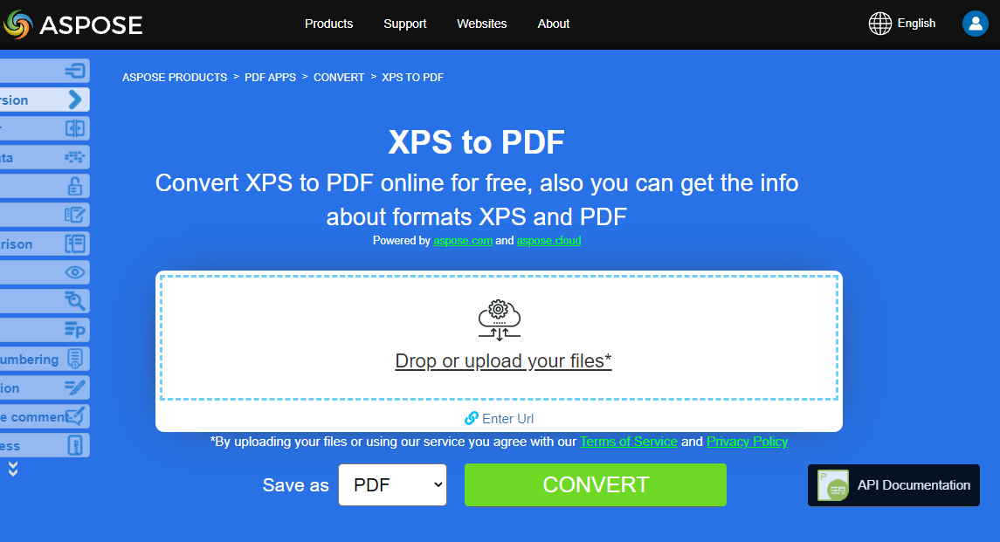

## Convert EPUB to PDF

**Aspose.PDF for Java** allows you simply convert EPUB files to PDF format.

<abbr title="electronic publication">EPUB</abbr> (short for electronic publication) is a free and open e-book standard from the International Digital Publishing Forum (IDPF). Files have the extension .epub. EPUB is designed for reflowable content, meaning that an EPUB reader can optimize text for a particular display device.

In order to convert EPUB files to PDF format, Aspose.PDF for Java has a class named [EpubLoadOptions](https://apireference.aspose.com/pdf/java/com.aspose.pdf/EpubLoadOptions) which is used to load source EPUB file. After that, the object is passed as an argument to [Document](https://apireference.aspose.com/pdf/java/com.aspose.pdf/document) object initialization, as it helps the PDF rendering engine to determine the source document's input format.

The following code snippet shows the process of converting an EPUB file into PDF format.

1. Create a EPUB [`LoadOptions`](https://apireference.aspose.com/pdf/java/com.aspose.pdf.class-use/loadoptions).
1. Initialize [`Document`](https://apireference.aspose.com/pdf/java/com.aspose.pdf.class-use/document) object.
1. Save output PDF document.

```java
package com.aspose.pdf.examples;

import java.io.FileNotFoundException;
import java.nio.file.Path;
import java.nio.file.Paths;

import com.aspose.pdf.*;

public final class ConvertEPUBtoPDF {

    private ConvertEPUBtoPDF() {
    }

    private static Path _dataDir = Paths.get("/home/admin1/pdf-examples/Samples");

    public static void main(String[] args) throws FileNotFoundException {
        
        // Create a EPUB LoadOptions
        EpubLoadOptions options = new EpubLoadOptions();

        // Initialize document object
        String epubFileName = Paths.get(_dataDir.toString(), "aliceDynamic.epub").toString();
        Document document = new Document(epubFileName, options);

        // Save output PDF document
        document.save(Paths.get(_dataDir.toString(),"EPUBtoPDF.pdf").toString());
    }
}
```

{}
**Try to convert EPUB to PDF online**

Aspose.PDF for Java presents you online free application ["EPUB to PDF"](https://products.aspose.app/pdf/conversion/epub-to-pdf), where you may try to investigate the functionality and quality it works.

[](https://products.aspose.app/pdf/conversion/epub-to-pdf)
{}

## Convert Markdown to PDF

**This feature is supported by version 19.6 or greater.**

{}
**Try to convert Markdown to PDF online**

Aspose.PDF for Java presents you online free application ["Markdown to PDF"](https://products.aspose.app/pdf/conversion/md-to-pdf), where you may try to investigate the functionality and quality it works.

[](https://products.aspose.app/pdf/conversion/md-to-pdf)
{}

Markdown is a text to HTML conversion tool for web authors. Markdown allows you to write in an easy-to-read and write plain text format and then convert it to structurally valid XHTML (or HTML).

The following code snippet shows how to use this functionality with Aspose.PDF for Java:

```java
package com.aspose.pdf.examples;

import java.io.FileNotFoundException;
import java.nio.file.Path;
import java.nio.file.Paths;

import com.aspose.pdf.*;

public final class ConvertMDtoPDF {

    private ConvertMDtoPDF() {
    }

    private static Path _dataDir = Paths.get("/home/admin1/pdf-examples/Samples");

    public static void main(String[] args) throws FileNotFoundException {
        
        // Instantiate Latex Load option object
        MdLoadOptions options = new MdLoadOptions();
        
        // Create Document object
        String markdownFileName = Paths.get(_dataDir.toString(), "samplefile.md").toString();
        Document document = new Document(markdownFileName, options);

        // Save output PDF document
        document.save(Paths.get(_dataDir.toString(),"MarkdownToPDF.pdf").toString());
    }
}

```

## Convert PCL to PDF

<abbr title="Printer Command Language">PCL</abbr>  (Printer Command Language) is a Hewlett-Packard printer language developed to access standard printer features. PCL levels 1 through 5e/5c are command-based languages that use control sequences which are processed and interpreted in the order they are received. At a consumer level, PCL data streams are generated by a print driver. PCL output can also be easily generated by custom applications.

{}
**Try to convert PCL to PDF online**

Aspose.PDF for for Java presents you online free application ["PCL to PDF"](https://products.aspose.app/pdf/conversion/pcl-to-pdf), where you may try to investigate the functionality and quality it works.

[](https://products.aspose.app/pdf/conversion/pcl-to-pdf)
{}

**Currently, only PCL5 and older versions are supported.**

|**Sets of Commands**|**Support**|**Exceptions**|**Description**|
| :- | :- | :- | :- |
|Job control commands|+|Duplex printing mode|Control print process: number of copies, output bin, simplex/duplex printing, left and top offsets etc.|
|Page control commands|+|Perforation Skip command|Specify a size of page, margins, page orientation inter -lines, -character distances etc.|
|Cursor Positioning Commands|+| |Specify cursor position and, hence, origins of the text, raster or vector images and details.|
|Font selection commands|+|<p>1. Transparent Print Data Command.</p><p>2. Embedded soft fonts. In the current version instead of creating soft font our library selects suitable font from existing "hard" TrueType fonts installed on a target machine. <br>   Suitability is defined by the width/height ratio. <br>   This feature works only for Bitmap and TrueType fonts and does not guarantee that text printed with soft font will be relevant to the one in a source file. <br>   Because character codes in the soft font can unmatched default ones.</p><p>3. User-Defined Symbol Sets.</p>|Allow loading soft (embedded) fonts from the PCL file and managing them in memory.|
|Raster graphics commands|+|Only black & white|Allow loading raster images from PCL file to memory, specify raster parameters <br>such as width, height, compression type, resolution, etc.|
|Color commands|+| |Allow coloring for all printable objects.|
|Print Model commands|+| |Allow filling text, raster images and rectangular areas with raster predefined and user-defined patterns, specify transparency mode for patterns and source raster image. <br>Predefined patterns are hatching, cross-hatch and shading ones.|
|Rectangle area fill commands|+| |Allow creation and filling rectangular areas with patterns.|
|HP-GL/2 Vector Graphics commands|+|Screened Vector Command (SV), Transparency Mode Command (TR), Transparent Data Command (TD), RO (Rotate Coordinate System), Scalable or Bitmap Fonts Command (SB), Character Slant Command (SL) and Extra Space (ES) are not implemented and DV (Define Variable Text Path) commands are realized in beta version.|<p>- Allow loading HP-GL/2 vector images from the PCL file into memory. Vector image has an origin at the lower-left corner of the printable area, can be scaled, translated, rotated and clipped.</p><p>- A vector image can contain text, as labels, and geometric figures such as rectangle, circle, ellipse, line, arc, bezier curve and complex figures composed from the simple ones.</p><p>- Closed figures including letters of labels can be filled with solid fill or vector pattern.</p><p>- The pattern can be hatching, cross-hatch, shading, raster user-defined, PCL hatching or cross-hatch and PCL user-defined. PCL patterns are raster. Labels can be individually rotated, scaled, and directed in four directions: up, down, left and right. Left and Right directions involve one-after-another letter arrangement. Up and Down directions involve one-under-another letter arrangement.</p>|
|Macross|―| |Allow loading a sequence of PCL commands into memory and use this sequence many times, for example, to print page header or set one formatting for a set of pages.|
|Unicode text|―| |Allow printing non-ASCII characters. Not implemented due to lack of sample files with <br>Unicode text|
|PCL6 (PCL-XL)| |Realized only in the Beta version because of lack in test files. Embedded fonts also are not supported. The JetReady extension is not supported because it is impossible to have JetReady specification.|Binary file format.|

### Converting a PCL file into PDF format

To allow conversion from PCL to PDF, [Aspose.PDF for Java](https://products.aspose.com/pdf/java) has the class [PclLoadOptions](https://apireference.aspose.com/pdf/java/com.aspose.pdf/PclLoadOptions) which is used to initialize the [LoadOptions](https://apireference.aspose.com/pdf/java/com.aspose.pdf/LoadOptions) object. This object is then passed as an argument during [Document](https://apireference.aspose.com/pdf/java/com.aspose.pdf/document) object initialization and helps the PDF rendering engine to determine the source document's input format.

The following code snippet shows the process of converting a PCL file into PDF format.

```java
package com.aspose.pdf.examples;

import java.io.FileNotFoundException;
import java.nio.file.Path;
import java.nio.file.Paths;

import com.aspose.pdf.*;

public final class ConvertPCLtoPDF {

    private ConvertPCLtoPDF() {
        
    }

    private static Path _dataDir = Paths.get("/home/admin1/pdf-examples/Samples");

    public static void main(String[] args) throws FileNotFoundException {        
        ConvertPCLtoPDF_Simple();
        ConvertPCLtoPDF_Advanced();
    }

    public static void ConvertPCLtoPDF_Simple() {
        PclLoadOptions options = new PclLoadOptions();
        Document pdfDocument= new Document(_dataDir + "demo.pcl", options);
        pdfDocument.save(_dataDir + "epub_test.pdf");        
    }

    public static void ConvertPCLtoPDF_Advanced() {
        PclLoadOptions options = new PclLoadOptions();
        options.SupressErrors=true;
        Document pdfDocument= new Document(_dataDir + "demo.pcl", options);
        if (options.Exceptions!=null)
            for (Exception ex : options.Exceptions)
            {
                System.out.println(ex.getMessage());
            }
        pdfDocument.save(_dataDir + "pcl_test.pdf");        
    }
}
```

### Known Issues

1. Origin of text strings and images can slightly differ from the ones in a source PCL file if the print direction is not 0º. The same refers to vector images if coordinate system of vector plot is rotated (RO command preceded).
1. Origin of labels in vector images can be differ from the ones in a source PCL file if the labels are influenced by a sequence of commands: Label Origin (LO), Define Variable Text Path (DV), Absolute Direction (DI) or Relative Direction (DR).
1. A text can be incorrectly read if it must be rendered with Bitmap or TrueType soft (embedded) font, because currently these fonts are only partially supported (see exceptions in "Supported features table"). In this situation text can be correctly read only if character codes in a soft font corresponds to default ones. A style of the read text also can be differed from the one in source PCL file because it is not necessary to set style in soft font header.
1. If parsed PCL file contains Intellifont or Universal soft fonts, an exception will be thrown, because Intellifont and Universal font are not supported at all.
1. If parsed PCL file contains macros commands the result of parsing will strongly differ from the source file, because macros commands are not supported.

## Convert Text to PDF

**Aspose.PDF for Java** provides the capability to convert Text files to PDF format. In this article, we demonstrate how easily and efficiently we can convert a text file to PDF using Aspose.PDF.

When you need to convert a Text file to PDF, initially read the source text file in some reader. We have used StringBuilder to read the Text file contents. Instantiate Document object and add a new page in the Pages collection. Create a new object of TextFragment and pass StringBuilder object to its constructor. Add a new paragraph in Paragraphs collection using TextFragment object and save the resultant PDF file using the Save method of Document class.

{}
**Try to convert TEXT to PDF online**

Aspose.PDF for Java presents you online free application ["Text to PDF"](https://products.aspose.app/pdf/conversion/txt-to-pdf), where you may try to investigate the functionality and quality it works.

[](https://products.aspose.app/pdf/conversion/txt-to-pdf)
{}

### Convert plain text file to PDF

```java
package com.aspose.pdf.examples;
/**
 * Convert TXT to PDF
 */

import java.io.IOException;
import java.nio.charset.Charset;
import java.nio.charset.StandardCharsets;
import java.nio.file.Files;
import java.nio.file.Path;
import java.nio.file.Paths;

import com.aspose.pdf.*;

public final class ConvertTextToPDF {

    private ConvertTextToPDF() {
    }

    final static Path _dataDir = Paths.get("/home/admin1/pdf-examples/Samples");
    final static Charset ENCODING = StandardCharsets.UTF_8;

    public static void main(String[] args) throws IOException {
        ConvertTXT_to_PDF_Simple();
    }

    public static void ConvertTXT_to_PDF_Simple() throws IOException {
        // Initialize document object

        String pdfDocumentFileName = Paths.get(_dataDir.toString(), "demo_txt.pdf").toString();
        Path txtDocumentFileName = Paths.get(_dataDir.toString(), "rfc822.txt");

        // Instantiate a Document object by calling its empty constructor
        Document pdfDocument = new Document();

        // Add a new page in Pages collection of Document
        Page page = pdfDocument.getPages().add();

        // Create an instance of TextFragmet and pass the text from reader object to its
        // constructor as argument
        TextFragment text = new TextFragment(Files.readString(txtDocumentFileName, ENCODING));

        // Add a new text paragraph in paragraphs collection and pass the TextFragment
        // object
        page.getParagraphs().add(text);

        // Save resultant PDF file
        pdfDocument.save(pdfDocumentFileName);
    }
```

### Convert pre-formatted text file to PDF

```java
    public static void ConvertPreFormattedTextToPdf() throws IOException {

        Path txtDocumentFileName = Paths.get(_dataDir.toString(), "rfc822.txt");
        String pdfDocumentFileName = Paths.get(_dataDir.toString(), "demo_txt.pdf").toString();

        // Read the text file as array of string
        java.util.List<String> lines = Files.readAllLines(txtDocumentFileName, ENCODING);

        // Instantiate a Document object by calling its empty constructor
        Document pdfDocument = new Document();

        // Add a new page in Pages collection of Document
        Page page = pdfDocument.getPages().add();

        // Set left and right margins for better presentation
        page.getPageInfo().getMargin().setLeft(20);
        page.getPageInfo().getMargin().setRight(10);
        page.getPageInfo().getDefaultTextState().setFont(FontRepository.findFont("Courier New"));
        page.getPageInfo().getDefaultTextState().setFontSize(12);

        for (String line : lines) {
            // check if line contains "form feed" character
            // see https://en.wikipedia.org/wiki/Page_break
            if (line.startsWith("\f")) {
                page = pdfDocument.getPages().add();
                page.getPageInfo().getMargin().setLeft(20);
                page.getPageInfo().getMargin().setRight(10);
                page.getPageInfo().getDefaultTextState().setFont(FontRepository.findFont("Courier New"));
                page.getPageInfo().getDefaultTextState().setFontSize(12);
            } else {
                // Create an instance of TextFragment and
                // pass the line to its
                // constructor as argument
                TextFragment text = new TextFragment(line);

                // Add a new text paragraph in paragraphs collection and pass the TextFragment
                // object
                page.getParagraphs().add(text);
            }

            pdfDocument.save(pdfDocumentFileName);
        }
    }
}
```

## Convert XPS to PDF

**Aspose.PDF for Java** support feature converting <abbr title="XML Paper Specification">XPS</abbr> files to PDF format. Check this article to resolve your tasks.

XPS, XML Paper Specification, is a Microsoft file format used to integrate document creation and viewing into Windows. With Aspose.PDF for Java, it is possible to convert XPS files to PDF, the portable file format from Adobe.

The file format is basically a zipped XML file, primarily used for distribution and storage. It's very difficult to edit and mostly implemented by Microsoft.

To convert an XPS file to PDF using [Aspose.PDF for Java](https://products.aspose.com/pdf/java), use [XpsLoadOptions](https://apireference.aspose.com/pdf/java/com.aspose.pdf/XpsLoadOptions) class. This is used to initialize a [LoadOptions](https://apireference.aspose.com/pdf/java/com.aspose.pdf/LoadOptions) object. Later, this object is passed as an argument during the [Document](https://apireference.aspose.com/pdf/java/com.aspose.pdf/document) object initialization and helps the PDF rendering engine to determine the source document's input format.

In both XP and Windows 7, you should find an XPS Printer pre-installed if you look in the Control Panel and then Printers. To create XPS files you can use that printer for the output device. In Windows 7, you should be able to just double-click the file to open it in an XPS viewer. You may also download [XPS viewer](http://windows.microsoft.com/en-US/windows-vista/what-is-the-xps-viewer) from Microsoft's website.

The following code snippet shows the process of converting the XPS file into PDF format.

```java
public final class ConvertXPStoPDF {

    private ConvertXPStoPDF() {
    }

    final static Path _dataDir = Paths.get("/home/aspose/pdf-examples/Samples");

    public static void main(String[] args) throws IOException {
        Convert_XSLFO_to_PDF();
    }

    public static void Convert_XSLFO_to_PDF() throws IOException {
        // Initialize document object

        String pdfDocumentFileName = Paths.get(_dataDir.toString(), "demo_txt.pdf").toString();
        String xpsDocumentFileName = Paths.get(_dataDir.toString(), "demo.xml").toString();

        // Instantiate LoadOption object using XPS load option
        LoadOptions options = new XpsLoadOptions();

        // Instantiate a Document object by calling its empty constructor
        Document pdfDocument = new Document(xpsDocumentFileName, options);

        // Save resultant PDF file
        pdfDocument.save(pdfDocumentFileName);
    }
}
```

{}
**Try to convert XPS format to PDF online**

Aspose.PDF for Java presents you online free application ["XPS to PDF"](https://products.aspose.app/pdf/conversion/xps-to-pdf/), where you may try to investigate the functionality and quality it works.

[](https://products.aspose.app/pdf/conversion/xps-to-pdf/)
{}

## Convert PostScript to PDF

**Aspose.PDF for Java** support features converting PostScript files to PDF format. One of the features from Aspose.PDF is that you can set a set of font folders to be used during conversion.

In order to convert a PostScript file to PDF format, Aspose.PDF for Java offers [PsLoadOptions](https://apireference.aspose.com/pdf/java/com.aspose.pdf/PsLoadOptions) class which is used to initialize the LoadOptions object. Later this object can be passed as an argument to Document object constructor, which will help PDF Rendering Engine to determine the format of source document.

Following code snippet can be used to convert a PostScript file into PDF format:

```java
public static void ConvertPostScriptToPDF_Simple(){
        // Initialize document object

        String pdfDocumentFileName = Paths.get(_dataDir.toString(), "demo.pdf").toString();
        String psDocumentFileName = Paths.get(_dataDir.toString(), "demo.ps").toString();
        PsLoadOptions options = new PsLoadOptions();

        // Create Document object
        Document document = new Document(psDocumentFileName, options);

        // Save output PDF document
        document.save(pdfDocumentFileName);
    }
```

Additionally, you can set a set of font folders that will be used during conversion:

```java
public static void ConvertPostscriptToPDFAvdanced() {
        String pdfDocumentFileName = Paths.get(_dataDir.toString(), "demo.pdf").toString();
        String psDocumentFileName = Paths.get(_dataDir.toString(), "demo.ps").toString();
        PsLoadOptions options = new PsLoadOptions();
        
        options.setFontsFolders(new String[] { "c:\tmp\fonts1", "c:\tmp\fonts2" });

        // Create Document object
        Document document = new Document(psDocumentFileName, options);

        // Save output PDF document
        document.save(pdfDocumentFileName);
    }
```

## Convert XML to PDF

The XML format used to store structured data. There are several ways to convert <abbr title="Extensible Markup Language">XML</abbr> to PDF in Aspose.PDF.


{}
**Try to convert XML to PDF online**

Aspose.PDF for Java presents you online free application ["XML to PDF"](https://products.aspose.app/pdf/conversion/xml-to-pdf), where you may try to investigate the functionality and quality it works.

[](https://products.aspose.app/pdf/conversion/xml-to-pdf)
{}

Consider option using XML document based on XSL-FO standard.

### Convert XSL-FO to PDF

The conversion of XSL-FO files to PDF can be implemented using [Document](https://apireference.aspose.com/pdf/java/com.aspose.pdf.class-use/document) object with [XslFoLoadOptions](https://apireference.aspose.com/pdf/java/com.aspose.pdf/xslfoloadoptions),  but sometimes you can meet with the incorrect file structure. 

```java
package com.aspose.pdf.examples;
/**
 * Convert XML to PDF
 */

import java.io.IOException;
import java.nio.file.Path;
import java.nio.file.Paths;

import com.aspose.pdf.*;

public final class ConvertXMLtoPDF {

    private ConvertXMLtoPDF() {
    }

    final static Path _dataDir = Paths.get("/home/admin1/pdf-examples/Samples");
    public static void main(String[] args) throws IOException {
        Convert_XSLFO_to_PDF();
        Convert_XSLFO_to_PDF_Adv();
    }

    public static void Convert_XSLFO_to_PDF() throws IOException {
        // Initialize document object

        String pdfDocumentFileName = Paths.get(_dataDir.toString(), "demo_txt.pdf").toString();
        String xmlDocumentFileName = Paths.get(_dataDir.toString(), "demo.xml").toString();
        String xsltDocumentFileName = Paths.get(_dataDir.toString(), "employees.xslt").toString();

        XslFoLoadOptions options = new XslFoLoadOptions(xsltDocumentFileName);

        // Instantiate a Document object by calling its empty constructor
        Document pdfDocument = new Document(xmlDocumentFileName,options);

        // Save resultant PDF file
        pdfDocument.save(pdfDocumentFileName);
    }
}
```

### Convert XSL-FO to PDF with set error handling strategy

```java
public static void Convert_XSLFO_to_PDF_Adv() throws IOException {
        // Initialize document object

        String pdfDocumentFileName = Paths.get(_dataDir.toString(), "demo_txt.pdf").toString();
        String xmlDocumentFileName = Paths.get(_dataDir.toString(), "demo.xml").toString();
        String xsltDocumentFileName = Paths.get(_dataDir.toString(), "employees.xslt").toString();

        XslFoLoadOptions options = new XslFoLoadOptions(xsltDocumentFileName);
        // Set error handling strategy
        options.ParsingErrorsHandlingType = XslFoLoadOptions.ParsingErrorsHandlingTypes.ThrowExceptionImmediately;

        // Instantiate a Document object by calling its empty constructor
        Document pdfDocument = new Document(xmlDocumentFileName,options);

        // Save resultant PDF file
        pdfDocument.save(pdfDocumentFileName);
    }
```

## Convert LaTeX/TeX to PDF

The LaTeX file format is a text file format with markup in the LaTeX derivative of the TeX family of languages and LaTeX is a derived format of the TeX system. LaTeX (ˈleɪtɛk/ lay-tek or lah-tek) is a document preparation system and document markup language. It is widely used for the communication and publication of scientific documents in many fields, including mathematics, physics, and computer science. It also has a prominent role in the preparation and publication of books and articles that contain complex multilingual materials, such as Sanskrit and Arabic, including critical editions. LaTeX uses the TeX typesetting program for formatting its output and is itself written in the TeX macro language.

**Aspose.PDF for Java** supports the feature to convert TeX files to PDF format and in order to accomplish this requirement, com.aspose.pdf package has a class named [LatexLoadOptions](https://apireference.aspose.com/pdf/java/com.aspose.pdf/LatexLoadOptions) which provides the capabilities to load LaTex files and render the output in PDF format using the [Document](https://apireference.aspose.com/pdf/java/com.aspose.pdf/document) class. The following code snippet shows the process of converting LaTex file to PDF format.

```java
package com.aspose.pdf.examples;

import java.io.FileNotFoundException;
import java.nio.file.Path;
import java.nio.file.Paths;

import com.aspose.pdf.*;

public final class ConvertLATEXtoPDF {

    private ConvertLATEXtoPDF() {
    }

    private static Path _dataDir = Paths.get("/home/admin1/pdf-examples/Samples");

    public static void main(String[] args) throws FileNotFoundException {
        
        // Instantiate Latex Load option object
        TeXLoadOptions options = new TeXLoadOptions();
        
        // Create Document object
        String latexFileName = Paths.get(_dataDir.toString(), "samplefile.tex").toString();
        Document document = new Document(latexFileName, options);

        // Save output PDF document
        document.save(Paths.get(_dataDir.toString(),"TEXtoPDF.pdf").toString());
    }
}
```

{}
**Try to convert LaTeX/TeX to PDF online**

Aspose.PDF for Java presents you online free application ["LaTex to PDF"](https://products.aspose.app/pdf/conversion/tex-to-pdf), where you may try to investigate the functionality and quality it works.

[](https://products.aspose.app/pdf/conversion/tex-to-pdf)
{}

