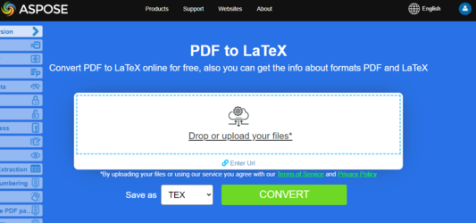
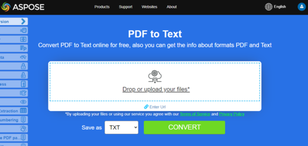

## Convert PDF to EPUB

{}
**Try to convert PDF to EPUB online**

Aspose.PDF for Java presents you online free application ["PDF to EPUB"](https://products.aspose.app/pdf/conversion/pdf-to-epub), where you may try to investigate the functionality and quality it works.

[](https://products.aspose.app/pdf/conversion/pdf-to-epub)
{}

**<abbr title="Electronic Publication">EPUB</abbr>** (short for electronic publication) is a free and open e-book standard from the International Digital Publishing Forum (IDPF). Files have the extension .epub.EPUB is designed for reflowable content, meaning that an EPUB reader can optimize text for a particular display device. EPUB also supports fixed-layout content. The format is intended as a single format that publishers and conversion houses can use in-house, as well as for distribution and sale. It supersedes the Open eBook standard.

Aspose.PDF for Java supports the feature to convert PDF documents to EPUB format. Aspose.PDF for Java has a class named [EpubSaveOptions](https://apireference.aspose.com/pdf/java/com.aspose.pdf/classes/EpubSaveOptions) which can be used as the second argument to the [Document](https://apireference.aspose.com/pdf/java/com.aspose.pdf/classes/Document).save(..) method, to generate an EPUB file. Please try using the following code snippet to accomplish this requirement.

```java
package com.aspose.pdf.examples;

import java.io.IOException;
import java.nio.file.Path;
import java.nio.file.Paths;

import com.aspose.pdf.*;

public final class ConvertPDFtoEPUB {

    private ConvertPDFtoEPUB() {

    }

    // The path to the documents directory.
    private static Path _dataDir = Paths.get("/home/admin1/pdf-examples/Samples");

    public static void main(String[] args) throws IOException {

        // Load PDF document
        Document pdfDocument = new Document(_dataDir + "PDFToEPUB.pdf");
        // Instantiate Epub Save options
        EpubSaveOptions options = new EpubSaveOptions();
        // Specify the layout for contents
        options.ContentRecognitionMode = EpubSaveOptions.RecognitionMode.Flow;
        // Save the ePUB document
        pdfDocument.save(_dataDir + "PDFToEPUB_out.epub", options);
    }
}
```

## Convert PDF to LaTeX/TeX

**Aspose.PDF for Java** support converting PDF to LaTeX/TeX.
The LaTeX file format is a text file format with the special markup and used in TeX-based document preparation system for high-quality typesetting.

To convert PDF files to TeX, Aspose.PDF has the class [TeXSaveOptions](https://apireference.aspose.com/pdf/java/com.aspose.pdf/TeXSaveOptions) which provides the method `setOutDirectoryPath` for saving temporary images during the conversion process.

The following code snippet shows the process of converting PDF files into the TEX format with Java.

```java
public static void name() {
    // Create Document object
    com.aspose.pdf.Document doc = new com.aspose.pdf.Document(_dataDir + "PDFToTeX.pdf");
        
    // Instantiate LaTex save option          
    com.aspose.pdf.TeXSaveOptions saveOptions = new com.aspose.pdf.TeXSaveOptions();
        
    // Specify the output directory
    String pathToOutputDirectory = _dataDir;
        
    // Set the output directory path for save option object
    saveOptions.setOutDirectoryPath (pathToOutputDirectory);
        
    // Save PDF file into LaTex format           
    doc.save(_dataDir + "PDFToTeX_out.tex", saveOptions);        
    }
```

{}
**Try to convert PDF to LaTeX/TeX online**

Aspose.PDF for Java presents you online free application ["PDF to LaTeX"](https://products.aspose.app/pdf/conversion/pdf-to-tex), where you may try to investigate the functionality and quality it works.

[](https://products.aspose.app/pdf/conversion/pdf-to-tex)
{}

## Convert PDF to Text

**Aspose.PDF for Java** support converting whole PDF document and single page to a Text file. 

### Convert whole PDF document to Text file

You can convert PDF document to TXT file using Visit method of [TextAbsorber](https://apireference.aspose.com/pdf/java/com.aspose.pdf/textabsorber) class.

The following code snippet explains how to extract the texts from the all pages.

```java
package com.aspose.pdf.examples;

import java.io.BufferedWriter;
import java.io.FileWriter;
import java.io.IOException;
import java.nio.file.Path;
import java.nio.file.Paths;

import com.aspose.pdf.*;

public class ConvertPDFtoTXT {
    private ConvertPDFtoTXT() {

    }

    // The path to the documents directory.
    private static Path _dataDir = Paths.get("/home/admin1/pdf-examples/Samples");

    public static void main(String[] args) throws IOException {
        ConvertPDFDoctoTXT();
        ConvertPDFPagestoTXT();
    }

    public static void ConvertPDFDoctoTXT() throws IOException {
        // Open document
        String pdfFileName = Paths.get(_dataDir.toString(), "demo.pdf").toString();
        String txtFileName = Paths.get(_dataDir.toString(), "PDFToTXT_out.txt").toString();

        // Load PDF document
        Document pdfDocument = new Document(pdfFileName);
        TextAbsorber ta = new TextAbsorber();
        ta.visit(pdfDocument);
        // Save the extracted text in text file
        BufferedWriter writer = new BufferedWriter(new FileWriter(txtFileName));
        writer.write(ta.getText());
        writer.close();
    }
}

```

{}
**Try to convert Convert PDF to Text online**

Aspose.PDF for Java presents you online free application ["PDF to Text"](https://products.aspose.app/pdf/conversion/pdf-to-txt), where you may try to investigate the functionality and quality it works.

[](https://products.aspose.app/pdf/conversion/pdf-to-txt)
{}

### Convert PDF page to text file

You can convert PDF document to TXT file with Aspose.PDF for Java. You should use Visit method of [TextAbsorber](https://apireference.aspose.com/pdf/java/com.aspose.pdf/textabsorber) class for resolve this task.

The following code snippet explains how to extract the texts from the particular pages.

```java
public static void ConvertPDFPagestoTXT() throws IOException {
        String pdfFileName = Paths.get(_dataDir.toString(), "demo.pdf").toString();
        String txtFileName = Paths.get(_dataDir.toString(), "PDFToTXT_out.txt").toString();

        // Load PDF document
        Document pdfDocument = new Document(pdfFileName);

        TextAbsorber ta = new TextAbsorber();
        int[] pages = new int[] { 1, 3, 4 };

        for (int page : pages) {
            ta.visit(pdfDocument.getPages().get_Item(page));
        }

        // Save the extracted text in text file
        BufferedWriter writer = new BufferedWriter(new FileWriter(txtFileName));
        writer.write(ta.getText());
        writer.close();
    }
```

## Convert PDF to XPS

**Aspose.PDF for Java** gives a possibility to convert PDF files to <abbr title="XML Paper Specification">XPS</abbr> format. Let try to use the presented code snippet for converting PDF files to XPS format with Java.

{}
**Try to convert PDF to XPS online**

Aspose.PDF for Java presents you online free application ["PDF to XPS"](https://products.aspose.app/pdf/conversion/pdf-to-xps), where you may try to investigate the functionality and quality it works.

[](https://products.aspose.app/pdf/conversion/pdf-to-xps)
{}

The XPS file type is primarily associated with the XML Paper Specification by Microsoft Corporation. The XML Paper Specification (XPS), formerly codenamed Metro and subsuming the Next Generation Print Path (NGPP) marketing concept, is Microsoft's initiative to integrate document creation and viewing into the Windows operating system.

To convert PDF files to XPS, Aspose.PDF has the class [XpsSaveOptions](https://apireference.aspose.com/pdf/java/com.aspose.pdf/XpsSaveOptions) class that is used as the second argument to the Document.save(..) constructor to generate the XPS file. The following code snippet shows the process of converting PDF files into XPS format.

```java
package com.aspose.pdf.examples;

import java.io.IOException;
import java.nio.file.Path;
import java.nio.file.Paths;

import com.aspose.pdf.*;

public final class ConvertPDFtoXPS {

    private ConvertPDFtoXPS() {
    }
    private static Path _dataDir = Paths.get("/home/admin1/pdf-examples/Samples");

    public static void main(String[] args) throws IOException {
        String pdfDocumentFileName = Paths.get(_dataDir.toString(), "demo.pdf").toString();
        String xpsDocumentFileName = Paths.get(_dataDir.toString(), "demo_out.xps").toString();
        
        // Create Document object
        Document doc = new Document(pdfDocumentFileName);

        // Instantiate XPS Save options
        XpsSaveOptions saveOptions = new XpsSaveOptions();

        // Save output in XML format
        doc.save(xpsDocumentFileName, saveOptions);
    }
}
```