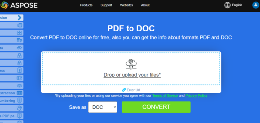
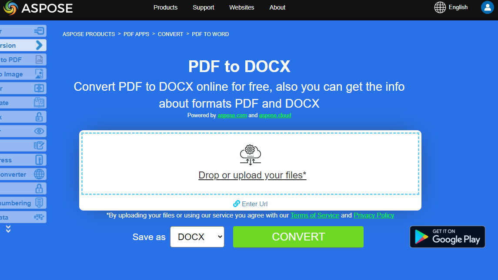

## Overview

This article explains how to convert PDF to Word using Java. The code is very simple, just load PDF to Document class and save it as output Microsoft Word DOC or DOCX format. It covers the following topics

- [Java PDF to Word](#convert-pdf-to-doc)
- [Java PDF to DOC](#convert-pdf-to-doc)
- [Java PDF to DOCX](#convert-pdf-to-docx)
- [Java Convert PDF to Word](#convert-pdf-to-docx)
- [Java Convert PDF to DOC](#convert-pdf-to-doc)
- [Java Convert PDF to DOCX](#convert-pdf-to-docx)
- [Java How to convert PDF file to Word DOC](#convert-pdf-to-doc) or [Word DOCX](#convert-pdf-to-docx)
- [Java PDF to Word Library, API or Code to Save, Generate or Create Word Documents Programmatically from PDF](#convert-pdf-to-docx)

## Convert PDF to DOC

One of the most popular feature is PDF to Microsoft Word DOC conversion, which makes the content easy to manipulate. Aspose.PDF for Java allows you to convert PDF files to DOC.

**Aspose.PDF for Java** can create PDF documents from scratch and is a great toolkit for updating, editing and manipulating existing PDF documents. An important feature is the ability to convert pages and entire PDF documents to images. Another popular feature is PDF to Microsoft Word DOC conversion, which makes the content easy to manipulate. (Most users can’t edit PDF documents but can easily work with tables, text, and images in Microsoft Word.)

To make things simple and understandable, Aspose.PDF for Java provides a two-line code for transforming a source PDF file into a DOC file. 

The following Java code snippet shows the process of converting a PDF file into DOC format.

1. Create an instance of [Document](https://reference.aspose.com/page/java/com.aspose.page/document) object with the source PDF document.
2. Save it to **SaveFormat.Doc** format by calling **Document.save()** method.

```java
public static void convertPDFtoWord() {
    // Open the source PDF document
    Document document = new Document(DATA_DIR + "PDFToDOC.pdf");
    // Save the file into MS document format
    document.save(DATA_DIR + "PDFToDOC_out.doc", SaveFormat.Doc);
    document.close();
}
```

## Using the DocSaveOptions Class

The [DocSaveOptions class](https://reference.aspose.com/pdf/java/com.aspose.pdf/DocSaveOptions) provides numerous properties that improve the process of converting PDF files to DOC format. Among these properties, Mode enables you to specify the recognition mode for PDF content. You can specify any value from the RecognitionMode enumeration for this property. Each of these values has specific benefits and limitations:

- [Textbox](https://reference.aspose.com/pdf/java/com.aspose.pdf/TextBoxField) mode is fast and good for preserving a PDF file's original look, but the editability of the resulting document could be limited. Every visually grouped block of text in the original PDF is converted into a textbox in the output document. This achieves a maximal resemblance to the original so the output document looks good, but it consists entirely of textboxes and it could make editing in Microsoft Word hard.

- Flow is full recognition mode, where the engine performs grouping and multi-level analysis to restore the original document as per the author's intent while producing an easily editable document. The limitation is that the output document might look different from the original.

- The RelativeHorizontalProximity property can be used to control the relative proximity between textual elements and means that distance is normed by the font size. Larger fonts may have bigger distances between syllables and still be considered a single whole. It is specified as a percentage of the font size, for example, 1 = 100%. This means that two characters of 12pt that are placed 12 pt apart are proximal.

- RecognitionBullets is used to switch on bullet recognition during conversion.

```java
public static void convertPDFtoWordDocAdvanced() {
    Path pdfFile = Paths.get(DATA_DIR.toString(), "PDF-to-DOC.pdf");
    Path docFile = Paths.get(DATA_DIR.toString(), "PDF-to-DOC.doc");
    Document document = new Document(pdfFile.toString());
    DocSaveOptions saveOptions = new DocSaveOptions();

    // Specify the output format as DOC
    saveOptions.setFormat(DocSaveOptions.DocFormat.Doc);
    // Set the recognition mode as Flow
    saveOptions.setMode(DocSaveOptions.RecognitionMode.Flow);

    // Set the Horizontal proximity as 2.5
    saveOptions.setRelativeHorizontalProximity(2.5f);

    // Enable the value to recognize bullets during conversion process
    saveOptions.setRecognizeBullets(true);

    document.save(docFile.toString(), saveOptions);
    document.close();
}
```

{}
**Try to convert PDF to DOC online**

Aspose.PDF for Java presents you online free application ["PDF to Word"](https://products.aspose.app/pdf/conversion/pdf-to-doc), where you may try to investigate the functionality and quality it works.

[](https://products.aspose.app/pdf/conversion/pdf-to-doc)
{}

## Convert PDF to DOCX

The DocFormat enumeration also provides the option to choose DOCX as the output format for Word documents. To render the source PDF file to DOCX format, use the code snippet specified below. 

## How to convert PDF to DOCX

The following Java code snippet shows the process of converting a PDF file into DOCX format.

1. Create an instance of [Document](https://reference.aspose.com/page/java/com.aspose.page/document) object with the source PDF document.
2. Save it to **SaveFormat.DocX** format by calling **Document.save()** method.

```java
public static void convertPDFtoWord_DOCX_Format() {
    // Open the source PDF document
    Document document = new Document(DATA_DIR + "PDFToDOC.pdf");
    // Save the resultant DOC file
    document.save(DATA_DIR + "saveOptionsOutput_out.doc", SaveFormat.DocX);
    document.close();
}
```

The [DocSaveOptions](https://reference.aspose.com/pdf/java/com.aspose.pdf/docsaveoptions) class has a property named Format which provides the capability to specify the format of the resultant document, that is, DOC or DOCX. In order to convert a PDF file to DOCX format, please pass the Docx value from the DocSaveOptions.DocFormat enumeration.

Please take a look over the following code snippet which provides the capability to convert PDF file to DOCX format with Java.

```java
public static void convertPDFtoWord_Advanced_DOCX_Format() {
    // Open the source PDF document
    Document document = new Document(DATA_DIR + "PDFToDOC.pdf");

    // Instantiate DocSaveOptions object
    DocSaveOptions saveOptions = new DocSaveOptions();
    // Specify the output format as DOCX
    saveOptions.setFormat(DocSaveOptions.DocFormat.DocX);
    // Set other DocSaveOptions params
    // ....

    // Save document in docx format
    document.save("ConvertToDOCX_out.docx", saveOptions);
    document.close();
}
```

{}
**Try to convert PDF to DOCX online**

Aspose.PDF for Java presents you online free application ["PDF to DOCX"](https://products.aspose.app/pdf/conversion/pdf-to-docx), where you may try to investigate the functionality and quality it works.

[](https://products.aspose.app/pdf/conversion/pdf-to-docx)

{}
