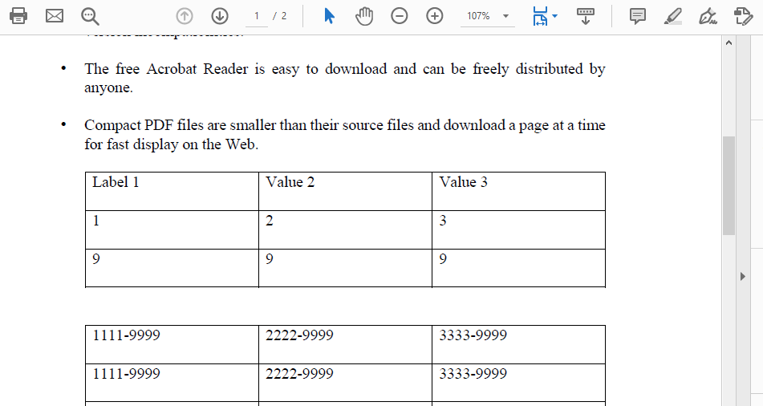

## Replace Text in an Existing PDF File (facades)

In order to replace text in an existing PDF file, you need to create an object of [pdfContentEditor](https://apireference.aspose.com/java/pdf/com.aspose.pdf.facades/PdfContentEditor) class, and bind an input PDF file using bindPdf method. After that, you need to call [replaceText](https://apireference.aspose.com/java/pdf/com.aspose.pdf.facades/PdfContentEditor#replaceText-java.lang.String-int-java.lang.String-) method.
You need to save the updated PDF file using save method of [pdfContentEditor](https://apireference.aspose.com/java/pdf/com.aspose.pdf.facades/PdfContentEditor) class. The following code snippet shows you how to replace text in an existing PDF file.

```java
package com.aspose.pdf.examples;

import com.aspose.pdf.TextState;
import com.aspose.pdf.facades.PdfContentEditor;
import com.aspose.pdf.facades.ReplaceTextStrategy;

public class PdfContentEditorText {

    private static String _dataDir = "/home/aspose/pdf-examples/Samples/";

    public static void ReplaceText01(){
        PdfContentEditor editor = new PdfContentEditor();
        editor.bindPdf(_dataDir+"sample.pdf");        
        editor.replaceText("Value", "Label");

        // save the output file
        editor.save(_dataDir+"replaced_text_demo.pdf");
    }    
```

Check how it's looks in the original document:


And check the result after replacing the text:



In the second example, you will see how, in addition to replacing the text, you can also increase or decrease the font size:

```java
public static void ReplaceText02(){
        PdfContentEditor editor = new PdfContentEditor();
        editor.bindPdf(_dataDir+"sample.pdf");        
        editor.replaceText("Value", "Label", 12);

        // save the output file
        editor.save(_dataDir+"replaced_text_demo.pdf");
    }    
```

For more advanced possibilities for working with our text, we will use the [TextState](https://apireference.aspose.com/pdf/java/com.aspose.pdf/TextState) method. With this method, we can make text bold, italic, colored, and so on.

```java
public static void ReplaceText03(){
        PdfContentEditor editor = new PdfContentEditor();
        editor.bindPdf(_dataDir+"sample.pdf");        
        TextState textState = new TextState();
        textState.setFontSize(12);
        editor.replaceText("Value", "Label", textState);

        // save the output file
        editor.save(_dataDir+"replaced_text_demo.pdf");
    }    

```

In case you need to replace all the specified text in the document, use the following code snippet. That is, the replacement of the text will take place wherever the text specified for replacement will be encountered, and it will also count the number of such replacements.

```java
    public static void ReplaceText04()
    {
        PdfContentEditor editor = new PdfContentEditor();
        editor.bindPdf(_dataDir + "sample.pdf");
        int count = 0;
        while (editor.replaceText("Value", "Label")) count++;

        System.out.println(count+" occurrences have been replaced.");

        // save the output file
        editor.save(_dataDir + "PdfContentEditorDemo04.pdf");
    }
```


The following code snippet shows how to make all the text replacements but on a specific page of your document.

```java
    public static void ReplaceText05()
    {
        PdfContentEditor editor = new PdfContentEditor();
        editor.bindPdf(_dataDir + "sample.pdf");
        int count = 0;
        while (editor.replaceText("9999", 2, "ABCDE")) count++;
        System.out.println(count+" occurrences have been replaced.");

        // save the output file
        editor.save(_dataDir + "PdfContentEditorDemo05.pdf");
    }
```

In the next code snippet, we will show how to replace, for example, a given number with the letters we need.

```java
    public static void ReplaceText06()
    {
        PdfContentEditor editor = new PdfContentEditor();
        ReplaceTextStrategy replaceTextStrategy = new ReplaceTextStrategy();
        replaceTextStrategy.setRegularExpressionUsed(true);
        replaceTextStrategy.setReplaceScope(ReplaceTextStrategy.Scope.ReplaceAll);
        editor.setReplaceTextStrategy(replaceTextStrategy);
        
        editor.bindPdf(_dataDir + "sample.pdf");
        editor.replaceText("\\d{4}", "ABCDE");

        // save the output file
        editor.save(_dataDir + "PdfContentEditorDemo06.pdf");
    }

}
```