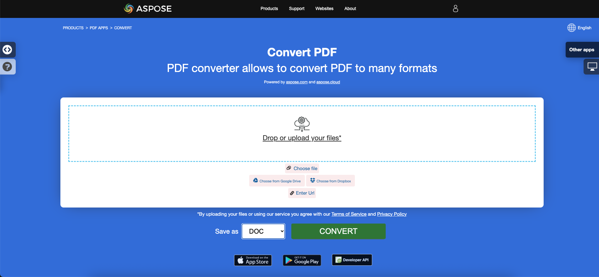

Microsoft Word 또는 DOC와 DOCX 형식을 지원하는 다른 워드 프로세서에서 PDF 파일의 내용을 편집하려면. PDF 파일은 편집이 가능하지만, DOC 및 DOCX 파일은 보다 유연하고 사용자 정의가 가능합니다.

## PDF를 DOC로 변환

제공된 Go 코드 스니펫은 Aspose.PDF 라이브러리를 사용하여 PDF 문서를 DOC로 변환하는 방법을 보여줍니다:

1. PDF 문서를 엽니다.
1. 다음을 사용하여 PDF 파일을 DOC로 변환 [SaveDoc](https://reference.aspose.com/pdf/go-cpp/convert/savedoc/) 함수.
1. PDF 문서를 닫고 할당된 모든 리소스를 해제합니다.

```go

    package main

    import "github.com/aspose-pdf/aspose-pdf-go-cpp"
    import "log"

    func main() {
      // Open(filename string) opens a PDF-document with filename
      pdf, err := asposepdf.Open("sample.pdf")
      if err != nil {
        log.Fatal(err)
      }
      // SaveDoc(filename string) saves previously opened PDF-document as Doc-document with filename
      err = pdf.SaveDoc("sample.doc")
      if err != nil {
        log.Fatal(err)
      }
      // Close() releases allocated resources for PDF-document
      defer pdf.Close()
    }
```

{}
**PDF를 DOC로 온라인 변환해 보세요**

Aspose.PDF for Go가 온라인 무료 애플리케이션을 제공합니다 ["PDF to DOC"](https://products.aspose.app/pdf/conversion/pdf-to-doc), 여기서 기능과 품질이 어떻게 작동하는지 조사해 볼 수 있습니다.

[](https://products.aspose.app/pdf/conversion/pdf-to-doc) 
{}

## PDF를 DOCX로 변환

Aspose.PDF for Go API를 사용하면 PDF 문서를 읽고 DOCX로 변환할 수 있습니다. DOCX는 Microsoft Word 문서에 널리 알려진 형식으로, 구조가 단순 바이너리에서 XML과 바이너리 파일의 조합으로 바뀌었습니다. Docx 파일은 Word 2007 및 이후 버전에서 열 수 있지만, 이전 버전의 DOC 파일 확장자를 지원하는 MS Word에서는 열 수 없습니다.

제공된 Go 코드 스니펫은 Aspose.PDF 라이브러리를 사용하여 PDF 문서를 DOCX로 변환하는 방법을 보여줍니다:

1. PDF 문서를 엽니다.
1. PDF 파일을 DOCX로 변환 using [SaveDocX](https://reference.aspose.com/pdf/go-cpp/convert/savedocx/) 함수.
1. PDF 문서를 닫고 할당된 모든 리소스를 해제합니다.

```go

    package main

    import "github.com/aspose-pdf/aspose-pdf-go-cpp"
    import "log"

    func main() {
      // Open(filename string) opens a PDF-document with filename
      pdf, err := asposepdf.Open("sample.pdf")
      if err != nil {
        log.Fatal(err)
      }
      // SaveDocX(filename string) saves previously opened PDF-document as DocX-document with filename
      err = pdf.SaveDocX("sample.docx")
      if err != nil {
        log.Fatal(err)
      }
      // Close() releases allocated resources for PDF-document
      defer pdf.Close()
    }
```

{}
**PDF를 DOCX로 온라인 변환해 보세요**

Aspose.PDF for Go가 온라인 무료 애플리케이션을 제공합니다 ["PDF를 Word로"](https://products.aspose.app/pdf/conversion/pdf-to-docx), 여기서 기능과 품질이 어떻게 작동하는지 조사해 볼 수 있습니다.

[](https://products.aspose.app/pdf/conversion/pdf-to-docx)

{}