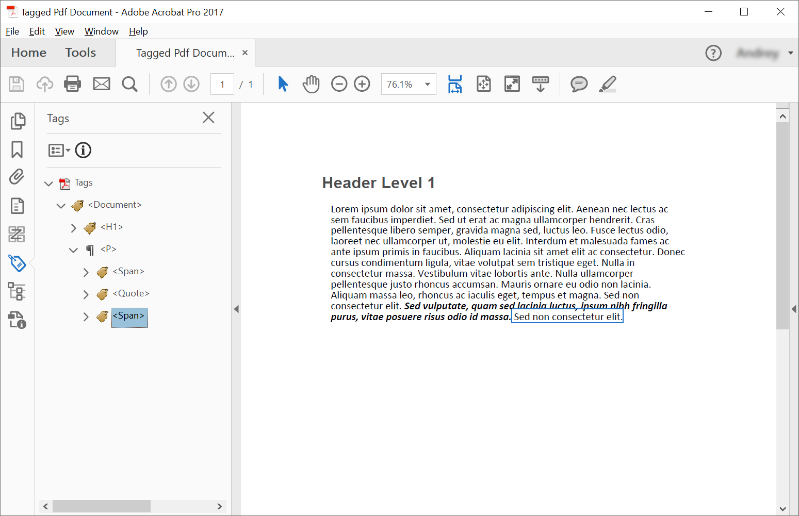

<script type="application/ld+json">
{
    "@context": "https://schema.org",
    "@type": "TechArticle",
    "headline": "Create Tagged PDF using C#",
    "alternativeHeadline": "Programmatically create tagged PDFs using C#",
    "abstract": "C# 및 Aspose.PDF를 사용하여 태그가 있는 PDF 문서를 프로그래밍 방식으로 생성하여 PDF/UA 준수를 보장합니다. 이 기능은 헤더 및 단락과 같은 요소가 포함된 구조화된 PDF 문서를 생성할 수 있게 하며, 접근성을 위한 중첩 구조 및 텍스트 스타일링을 지원합니다. 이 라이브러리는 또한 PDF/UA 표준이 충족되는지 확인하기 위한 유효성 검사를 포함합니다.",
    "author": {
        "@type": "Person",
        "name": "Anastasiia Holub",
        "givenName": "Anastasiia",
        "familyName": "Holub",
        "url": "https://www.linkedin.com/in/anastasiia-holub-750430225/"
    },
    "genre": "pdf document generation",
    "keywords": "Tagged PDF, C#, Aspose.PDF, PDF/UA, Structure Elements, ITaggedContent, AppendChild,  StructureTextState",
    "wordcount": "2552",
    "proficiencyLevel": "Beginner",
    "publisher": {
        "@type": "Organization",
        "name": "Aspose.PDF for .NET",
        "url": "https://products.aspose.com/pdf",
        "logo": "https://www.aspose.cloud/templates/aspose/img/products/pdf/aspose_pdf-for-net.svg",
        "alternateName": "Aspose",
        "sameAs": [
            "https://facebook.com/aspose.pdf/",
            "https://twitter.com/asposepdf",
            "https://www.youtube.com/channel/UCmV9sEg_QWYPi6BJJs7ELOg/featured",
            "https://www.linkedin.com/company/aspose",
            "https://stackoverflow.com/questions/tagged/aspose",
            "https://aspose.quora.com/",
            "https://aspose.github.io/"
        ],
        "contactPoint": [
            {
                "@type": "ContactPoint",
                "telephone": "+1 903 306 1676",
                "contactType": "sales",
                "areaServed": "US",
                "availableLanguage": "en"
            },
            {
                "@type": "ContactPoint",
                "telephone": "+44 141 628 8900",
                "contactType": "sales",
                "areaServed": "GB",
                "availableLanguage": "en"
            },
            {
                "@type": "ContactPoint",
                "telephone": "+61 2 8006 6987",
                "contactType": "sales",
                "areaServed": "AU",
                "availableLanguage": "en"
            }
        ]
    },
    "url": "/net/create-tagged-pdf/",
    "mainEntityOfPage": {
        "@type": "WebPage",
        "@id": "/net/create-tagged-pdf/"
    },
    "dateModified": "2025-03-24",
    "description": "이 문서에서는 Aspose.PDF for .NET를 사용하여 태그가 있는 PDF 문서의 구조 요소를 프로그래밍 방식으로 만드는 방법을 설명합니다."
}
</script>

태그가 있는 PDF를 생성하는 것은 PDF/UA 요구 사항에 따라 문서를 검증할 수 있도록 문서에 특정 요소를 추가(또는 생성)하는 것을 의미합니다. 이러한 요소는 종종 구조 요소라고 불립니다.

다음 코드 스니펫은 [Aspose.PDF.Drawing](/pdf/ko/net/drawing/) 라이브러리와 함께 작동합니다.

## 태그가 있는 PDF 만들기 (간단한 시나리오)

태그가 있는 PDF 문서에서 구조 요소를 생성하기 위해 Aspose.PDF는 [ITaggedContent](https://reference.aspose.com/pdf/ko/net/aspose.pdf.tagged/itaggedcontent) 인터페이스를 사용하여 구조 요소를 생성하는 방법을 제공합니다. 다음 코드 스니펫은 헤더와 단락의 2개 요소를 포함하는 태그가 있는 PDF를 만드는 방법을 보여줍니다.



```csharp
// For complete examples and data files, visit https://github.com/aspose-pdf/Aspose.PDF-for-.NET

private static void CreateTaggedPdfDocument01()
{
    // The path to the documents directory
    string dataDir = RunExamples.GetDataDir_AsposePdf_WorkingDocuments();

    // Create PDF document
    using (var document = new Aspose.Pdf.Document())
    {
        // Get Content for work with TaggedPdf
        Aspose.Pdf.Tagged.ITaggedContent taggedContent = document.TaggedContent;
        var rootElement = taggedContent.RootElement;

        // Set Title and Language for Document
        taggedContent.SetTitle("Tagged Pdf Document");
        taggedContent.SetLanguage("en-US");

        Aspose.Pdf.LogicalStructure.HeaderElement mainHeader = taggedContent.CreateHeaderElement();
        mainHeader.SetText("Main Header");

        Aspose.Pdf.LogicalStructure.ParagraphElement paragraphElement = taggedContent.CreateParagraphElement();
        paragraphElement.SetText("Lorem ipsum dolor sit amet, consectetur adipiscing elit. " +
            "Aenean nec lectus ac sem faucibus imperdiet. Sed ut erat ac magna ullamcorper hendrerit. " +
            "Cras pellentesque libero semper, gravida magna sed, luctus leo. Fusce lectus odio, laoreet" +
            "nec ullamcorper ut, molestie eu elit. Interdum et malesuada fames ac ante ipsum primis in faucibus." +
            "Aliquam lacinia sit amet elit ac consectetur. Donec cursus condimentum ligula, vitae volutpat" +
            "sem tristique eget. Nulla in consectetur massa. Vestibulum vitae lobortis ante. Nulla ullamcorper" +
            "pellentesque justo rhoncus accumsan. Mauris ornare eu odio non lacinia. Aliquam massa leo, rhoncus" +
            "ac iaculis eget, tempus et magna. Sed non consectetur elit. Sed vulputate, quam sed lacinia luctus," +
            "ipsum nibh fringilla purus, vitae posuere risus odio id massa. Cras sed venenatis lacus.");

        rootElement.AppendChild(mainHeader);
        rootElement.AppendChild(paragraphElement);

        // Save Tagged PDF document
        document.Save(dataDir + "TaggedPdfDocument_out.pdf");
    }
}
```



```csharp
// For complete examples and data files, visit https://github.com/aspose-pdf/Aspose.PDF-for-.NET

private static void CreateTaggedPdfDocument01()
{
    // The path to the documents directory
    string dataDir = RunExamples.GetDataDir_AsposePdf_WorkingDocuments();

    // Create PDF Document
    using var document = new Aspose.Pdf.Document();

    // Get Content for work with TaggedPdf
    Aspose.Pdf.Tagged.ITaggedContent taggedContent = document.TaggedContent;
    var rootElement = taggedContent.RootElement;

    // Set Title and Language for Document
    taggedContent.SetTitle("Tagged Pdf Document");
    taggedContent.SetLanguage("en-US");

    Aspose.Pdf.LogicalStructure.HeaderElement mainHeader = taggedContent.CreateHeaderElement();
    mainHeader.SetText("Main Header");

    Aspose.Pdf.LogicalStructure.ParagraphElement paragraphElement = taggedContent.CreateParagraphElement();
    paragraphElement.SetText("Lorem ipsum dolor sit amet, consectetur adipiscing elit. " +
        "Aenean nec lectus ac sem faucibus imperdiet. Sed ut erat ac magna ullamcorper hendrerit. " +
        "Cras pellentesque libero semper, gravida magna sed, luctus leo. Fusce lectus odio, laoreet" +
        "nec ullamcorper ut, molestie eu elit. Interdum et malesuada fames ac ante ipsum primis in faucibus." +
        "Aliquam lacinia sit amet elit ac consectetur. Donec cursus condimentum ligula, vitae volutpat" +
        "sem tristique eget. Nulla in consectetur massa. Vestibulum vitae lobortis ante. Nulla ullamcorper" +
        "pellentesque justo rhoncus accumsan. Mauris ornare eu odio non lacinia. Aliquam massa leo, rhoncus" +
        "ac iaculis eget, tempus et magna. Sed non consectetur elit. Sed vulputate, quam sed lacinia luctus," +
        "ipsum nibh fringilla purus, vitae posuere risus odio id massa. Cras sed venenatis lacus.");

    rootElement.AppendChild(mainHeader);
    rootElement.AppendChild(paragraphElement);

    // Save Tagged PDF Document
    document.Save(dataDir + "TaggedPdfDocument_out.pdf");
}
```



생성 후 다음 문서를 얻을 수 있습니다:


## 중첩 요소가 있는 태그가 있는 PDF 만들기 (구조 요소 트리 생성)

일부 경우에는 단락에 인용문을 배치하는 등 더 복잡한 구조를 생성해야 합니다. 
구조 요소 트리를 생성하기 위해 [AppendChild](https://reference.aspose.com/pdf/ko/net/aspose.pdf.logicalstructure/element/methods/appendchild) 메서드를 사용해야 합니다.
다음 코드 스니펫은 태그가 있는 PDF 문서의 구조 요소 트리를 생성하는 방법을 보여줍니다:



```csharp
// For complete examples and data files, visit https://github.com/aspose-pdf/Aspose.PDF-for-.NET

private static void CreateTaggedPdfDocument02()
{
    // The path to the documents directory
    string dataDir = RunExamples.GetDataDir_AsposePdf_WorkingDocuments();

    // Create PDF Document
    using (var document = new Aspose.Pdf.Document())
    {
        // Get Content for work with TaggedPdf
        Aspose.Pdf.Tagged.ITaggedContent taggedContent = document.TaggedContent;
        var rootElement = taggedContent.RootElement;

        // Set Title and Language for Document
        taggedContent.SetTitle("Tagged Pdf Document");
        taggedContent.SetLanguage("en-US");

        Aspose.Pdf.LogicalStructure.HeaderElement header1 = taggedContent.CreateHeaderElement(1);
        header1.SetText("Header Level 1");

        Aspose.Pdf.LogicalStructure.ParagraphElement paragraphWithQuotes = taggedContent.CreateParagraphElement();
        paragraphWithQuotes.StructureTextState.Font = Aspose.Pdf.Text.FontRepository.FindFont("Calibri");
        paragraphWithQuotes.StructureTextState.MarginInfo = new Aspose.Pdf.MarginInfo(10, 5, 10, 5);

        Aspose.Pdf.LogicalStructure.SpanElement spanElement1 = taggedContent.CreateSpanElement();
        spanElement1.SetText("Lorem ipsum dolor sit amet, consectetur adipiscing elit. Aenean nec lectus ac sem faucibus imperdiet. Sed ut erat ac magna ullamcorper hendrerit. Cras pellentesque libero semper, gravida magna sed, luctus leo. Fusce lectus odio, laoreet nec ullamcorper ut, molestie eu elit. Interdum et malesuada fames ac ante ipsum primis in faucibus. Aliquam lacinia sit amet elit ac consectetur. Donec cursus condimentum ligula, vitae volutpat sem tristique eget. Nulla in consectetur massa. Vestibulum vitae lobortis ante. Nulla ullamcorper pellentesque justo rhoncus accumsan. Mauris ornare eu odio non lacinia. Aliquam massa leo, rhoncus ac iaculis eget, tempus et magna. Sed non consectetur elit. ");

        Aspose.Pdf.LogicalStructure.QuoteElement quoteElement = taggedContent.CreateQuoteElement();
        quoteElement.SetText("Sed vulputate, quam sed lacinia luctus, ipsum nibh fringilla purus, vitae posuere risus odio id massa.");
        quoteElement.StructureTextState.FontStyle = Aspose.Pdf.Text.FontStyles.Bold | Aspose.Pdf.Text.FontStyles.Italic;
        Aspose.Pdf.LogicalStructure.SpanElement spanElement2 = taggedContent.CreateSpanElement();
        spanElement2.SetText(" Sed non consectetur elit.");

        paragraphWithQuotes.AppendChild(spanElement1);
        paragraphWithQuotes.AppendChild(quoteElement);
        paragraphWithQuotes.AppendChild(spanElement2);

        rootElement.AppendChild(header1);
        rootElement.AppendChild(paragraphWithQuotes);

        // Save Tagged PDF Document
        document.Save(dataDir + "TaggedPdfDocument_out.pdf");
    }
}
```



```csharp
// For complete examples and data files, visit https://github.com/aspose-pdf/Aspose.PDF-for-.NET

private static void CreateTaggedPdfDocument02()
{
    // The path to the documents directory
    string dataDir = RunExamples.GetDataDir_AsposePdf_WorkingDocuments();

    // Create PDF Document
    using var document = new Aspose.Pdf.Document();

    // Get Content for work with TaggedPdf
    Aspose.Pdf.Tagged.ITaggedContent taggedContent = document.TaggedContent;
    var rootElement = taggedContent.RootElement;

    // Set Title and Language for Document
    taggedContent.SetTitle("Tagged Pdf Document");
    taggedContent.SetLanguage("en-US");

    Aspose.Pdf.LogicalStructure.HeaderElement header1 = taggedContent.CreateHeaderElement(1);
    header1.SetText("Header Level 1");

    Aspose.Pdf.LogicalStructure.ParagraphElement paragraphWithQuotes = taggedContent.CreateParagraphElement();
    paragraphWithQuotes.StructureTextState.Font = Aspose.Pdf.Text.FontRepository.FindFont("Calibri");
    paragraphWithQuotes.StructureTextState.MarginInfo = new Aspose.Pdf.MarginInfo(10, 5, 10, 5);

    Aspose.Pdf.LogicalStructure.SpanElement spanElement1 = taggedContent.CreateSpanElement();
    spanElement1.SetText("Lorem ipsum dolor sit amet, consectetur adipiscing elit. Aenean nec lectus ac sem faucibus imperdiet. Sed ut erat ac magna ullamcorper hendrerit. Cras pellentesque libero semper, gravida magna sed, luctus leo. Fusce lectus odio, laoreet nec ullamcorper ut, molestie eu elit. Interdum et malesuada fames ac ante ipsum primis in faucibus. Aliquam lacinia sit amet elit ac consectetur. Donec cursus condimentum ligula, vitae volutpat sem tristique eget. Nulla in consectetur massa. Vestibulum vitae lobortis ante. Nulla ullamcorper pellentesque justo rhoncus accumsan. Mauris ornare eu odio non lacinia. Aliquam massa leo, rhoncus ac iaculis eget, tempus et magna. Sed non consectetur elit. ");

    Aspose.Pdf.LogicalStructure.QuoteElement quoteElement = taggedContent.CreateQuoteElement();
    quoteElement.SetText("Sed vulputate, quam sed lacinia luctus, ipsum nibh fringilla purus, vitae posuere risus odio id massa.");
    quoteElement.StructureTextState.FontStyle = Aspose.Pdf.Text.FontStyles.Bold | Aspose.Pdf.Text.FontStyles.Italic;
    Aspose.Pdf.LogicalStructure.SpanElement spanElement2 = taggedContent.CreateSpanElement();
    spanElement2.SetText(" Sed non consectetur elit.");

    paragraphWithQuotes.AppendChild(spanElement1);
    paragraphWithQuotes.AppendChild(quoteElement);
    paragraphWithQuotes.AppendChild(spanElement2);

    rootElement.AppendChild(header1);
    rootElement.AppendChild(paragraphWithQuotes);

    // Save Tagged PDF Document
    document.Save(dataDir + "TaggedPdfDocument_out.pdf");
}
```



생성 후 다음 문서를 얻을 수 있습니다:


## 텍스트 구조 스타일링

태그가 있는 PDF 문서에서 텍스트 구조를 스타일링하기 위해 Aspose.PDF는 [Font](https://reference.aspose.com/pdf/ko/net/aspose.pdf.logicalstructure/structuretextstate/properties/font), [FontSize](https://reference.aspose.com/pdf/ko/net/aspose.pdf.logicalstructure/structuretextstate/properties/fontsize), [FontStyle](https://reference.aspose.com/pdf/ko/net/aspose.pdf.logicalstructure/structuretextstate/properties/fontstyle) 및 [ForegroundColor](https://reference.aspose.com/pdf/ko/net/aspose.pdf.logicalstructure/structuretextstate/properties/foregroundcolor) 속성을 [StructureTextState](https://reference.aspose.com/pdf/ko/net/aspose.pdf.logicalstructure/structuretextstate) 클래스에서 제공합니다. 다음 코드 스니펫은 태그가 있는 PDF 문서에서 텍스트 구조를 스타일링하는 방법을 보여줍니다:



```csharp
// For complete examples and data files, visit https://github.com/aspose-pdf/Aspose.PDF-for-.NET

private static void AddStyle()
{
    // The path to the documents directory
    string dataDir = RunExamples.GetDataDir_AsposePdf_WorkingDocuments();

    // Create PDF Document
    using (var document = new Aspose.Pdf.Document())
    {
        // Get Content for work with TaggedPdf
        Aspose.Pdf.Tagged.ITaggedContent taggedContent = document.TaggedContent;

        // Set Title and Language for Document
        taggedContent.SetTitle("Tagged Pdf Document");
        taggedContent.SetLanguage("en-US");

        Aspose.Pdf.LogicalStructure.ParagraphElement p = taggedContent.CreateParagraphElement();
        taggedContent.RootElement.AppendChild(p);

        p.StructureTextState.FontSize = 18F;
        p.StructureTextState.ForegroundColor = Aspose.Pdf.Color.Red;
        p.StructureTextState.FontStyle = Aspose.Pdf.Text.FontStyles.Italic;

        p.SetText("Red italic text.");

        // Save Tagged Pdf Document
        document.Save(dataDir + "StyleTextStructure_out.pdf");
    }
}
```



```csharp
// For complete examples and data files, visit https://github.com/aspose-pdf/Aspose.PDF-for-.NET

private static void AddStyle()
{
    // The path to the documents directory
    string dataDir = RunExamples.GetDataDir_AsposePdf_WorkingDocuments();

    // Create PDF Document
    using var document = new Aspose.Pdf.Document();

    // Get Content for work with TaggedPdf
    Aspose.Pdf.Tagged.ITaggedContent taggedContent = document.TaggedContent;

    // Set Title and Language for Document
    taggedContent.SetTitle("Tagged Pdf Document");
    taggedContent.SetLanguage("en-US");

    Aspose.Pdf.LogicalStructure.ParagraphElement p = taggedContent.CreateParagraphElement();
    taggedContent.RootElement.AppendChild(p);

    p.StructureTextState.FontSize = 18F;
    p.StructureTextState.ForegroundColor = Aspose.Pdf.Color.Red;
    p.StructureTextState.FontStyle = Aspose.Pdf.Text.FontStyles.Italic;

    p.SetText("Red italic text.");

    // Save Tagged Pdf Document
    document.Save(dataDir + "StyleTextStructure_out.pdf");
}
```



## 구조 요소 설명

태그가 있는 PDF 문서에서 구조 요소를 설명하기 위해 Aspose.PDF는 [IllustrationElement](https://reference.aspose.com/pdf/ko/net/aspose.pdf.logicalstructure/illustrationelement) 클래스를 제공합니다. 다음 코드 스니펫은 태그가 있는 PDF 문서에서 구조 요소를 설명하는 방법을 보여줍니다:



```csharp
// For complete examples and data files, visit https://github.com/aspose-pdf/Aspose.PDF-for-.NET

private static void IllustrateStructureElements()
{
    // The path to the documents directory
    string dataDir = RunExamples.GetDataDir_AsposePdf_WorkingDocuments();

    // Create PDF Document
    using (var document = new Aspose.Pdf.Document())
    {
        // Get Content for work with TaggedPdf
        Aspose.Pdf.Tagged.ITaggedContent taggedContent = document.TaggedContent;

        // Set Title and Language for Document
        taggedContent.SetTitle("Tagged Pdf Document");
        taggedContent.SetLanguage("en-US");

        Aspose.Pdf.LogicalStructure.IllustrationElement figure1 = taggedContent.CreateFigureElement();
        taggedContent.RootElement.AppendChild(figure1);
        figure1.AlternativeText = "Figure One";
        figure1.Title = "Image 1";
        figure1.SetTag("Fig1");
        figure1.SetImage(dataDir + "image.png");

        // Save Tagged Pdf Document
        document.Save(dataDir + "IllustrationStructureElements_out.pdf");
    }
}
```



```csharp
// For complete examples and data files, visit https://github.com/aspose-pdf/Aspose.PDF-for-.NET

private static void IllustrateStructureElements()
{
    // The path to the documents directory
    string dataDir = RunExamples.GetDataDir_AsposePdf_WorkingDocuments();

    // Create PDF Document
    using var document = new Aspose.Pdf.Document();

    // Get Content for work with TaggedPdf
    Aspose.Pdf.Tagged.ITaggedContent taggedContent = document.TaggedContent;

    // Set Title and Language for Document
    taggedContent.SetTitle("Tagged Pdf Document");
    taggedContent.SetLanguage("en-US");

    Aspose.Pdf.LogicalStructure.IllustrationElement figure1 = taggedContent.CreateFigureElement();
    taggedContent.RootElement.AppendChild(figure1);
    figure1.AlternativeText = "Figure One";
    figure1.Title = "Image 1";
    figure1.SetTag("Fig1");
    figure1.SetImage(dataDir + "image.png");

    // Save Tagged Pdf Document
    document.Save(dataDir + "IllustrationStructureElements_out.pdf");
}
```



## 태그가 있는 PDF 검증

Aspose.PDF for .NET는 PDF/UA 태그가 있는 PDF 문서를 검증할 수 있는 기능을 제공합니다. PDF/UA 표준의 유효성 검사는 다음을 지원합니다:

- XObjects 확인.
- Actions 확인.
- 선택적 콘텐츠 확인.
- 포함된 파일 확인.
- Acroform 필드 확인(자연어 및 대체 이름 및 디지털 서명 검증).
- XFA 양식 필드 확인.
- 보안 설정 확인.
- 탐색 확인.
- 주석 확인.

다음 코드 스니펫은 태그가 있는 PDF 문서를 검증하는 방법을 보여줍니다. 해당 문제는 XML 로그 보고서에 표시됩니다.



```csharp
// For complete examples and data files, visit https://github.com/aspose-pdf/Aspose.PDF-for-.NET

private static void ValidateTaggedPdf()
{
    // The path to the documents directory
    string dataDir = RunExamples.GetDataDir_AsposePdf_WorkingDocuments();

    // Open PDF document
    using (var document = new Aspose.Pdf.Document(dataDir + "StructureElements.pdf"))
    {
        bool isValid = document.Validate(dataDir + "StructureElements_log.xml", Aspose.Pdf.PdfFormat.PDF_UA_1);
    }
}
```



```csharp
// For complete examples and data files, visit https://github.com/aspose-pdf/Aspose.PDF-for-.NET

private static void ValidateTaggedPdf()
{
    // The path to the documents directory
    string dataDir = RunExamples.GetDataDir_AsposePdf_WorkingDocuments();

    // Open PDF document
    using var document = new Aspose.Pdf.Document(dataDir + "StructureElements.pdf");

    bool isValid = document.Validate(dataDir + "StructureElements_log.xml", Aspose.Pdf.PdfFormat.PDF_UA_1);
}
```



## PDF/UA-1 변환으로 태그가 있는 PDF 자동 생성

Aspose.PDF는 문서가 PDF/UA-1로 변환될 때 기본 논리 구조 마크업을 자동으로 생성할 수 있도록 합니다. 사용자는 이 기본 논리 구조를 수동으로 개선하여 문서 내용에 대한 추가 통찰력을 제공할 수 있습니다.

논리 문서 구조를 생성하려면 [Aspose.Pdf.AutoTaggingSettings](https://reference.aspose.com/pdf/ko/net/aspose.pdf/autotaggingsettings/) 클래스의 인스턴스를 생성하고, [AutoTaggingSettings.EnableAutoTagging](https://reference.aspose.com/pdf/ko/net/aspose.pdf/autotaggingsettings/enableautotagging/)을 `true`로 설정한 후 [PdfFormatConversionOptions.AutoTaggingSettings](https://reference.aspose.com/pdf/ko/net/aspose.pdf/pdfformatconversionoptions/autotaggingsettings/) 속성에 할당합니다.

{}
문서에 이미 논리 구조 태그가 있는 경우 자동 태그 생성을 활성화하면 기존 논리 구조가 파괴되고 새로운 구조가 생성됩니다.
{}



```csharp
// For complete examples and data files, visit https://github.com/aspose-pdf/Aspose.PDF-for-.NET
private static void ConvertToPdfUAWithAutomaticTagging()
{
    // The path to the documents directory
    string dataDir = RunExamples.GetDataDir_AsposePdf_WorkingDocuments();

    // Open PDF document
    using (var document = new Aspose.Pdf.Document(dataDir + "BreakfastMenu.pdf"))
    {
        // Create conversion options
        Aspose.Pdf.PdfFormatConversionOptions options = new Aspose.Pdf.PdfFormatConversionOptions(dataDir + "ConvertToPdfUAWithAutomaticTagging.xml", PdfFormat.PDF_UA_1, ConvertErrorAction.Delete);

        // Create auto-tagging settings
        // Aspose.Pdf.AutoTaggingSettings.Default may be used to set the same settings as given below
        Aspose.Pdf.AutoTaggingSettings autoTaggingSettings = new Aspose.Pdf.AutoTaggingSettings();

        // Enable auto-tagging during the conversion process
        autoTaggingSettings.EnableAutoTagging = true;

        // Use the heading recognition strategy that's optimal for the given document structure
        autoTaggingSettings.HeadingRecognitionStrategy = Aspose.Pdf.HeadingRecognitionStrategy.Auto;

        // Assign auto-tagging settings to be used during the conversion process
        options.AutoTaggingSettings = autoTaggingSettings;

        // During the conversion, the document logical structure will be automatically created
        document.Convert(options);

        // Save PDF document
        document.Save(dataDir + "ConvertToPdfUAWithAutomaticTagging_out.pdf");
    }
}
```



```csharp
// For complete examples and data files, visit https://github.com/aspose-pdf/Aspose.PDF-for-.NET
private static void ConvertToPdfUAWithAutomaticTagging()
{
    // The path to the documents directory
    string dataDir = RunExamples.GetDataDir_AsposePdf_WorkingDocuments();

    // Open PDF document
    using var document = new Aspose.Pdf.Document(dataDir + "BreakfastMenu.pdf");

    // Create conversion options
    Aspose.Pdf.PdfFormatConversionOptions options = new Aspose.Pdf.PdfFormatConversionOptions(dataDir + "ConvertToPdfUAWithAutomaticTagging.xml", PdfFormat.PDF_UA_1, ConvertErrorAction.Delete);

    // Create auto-tagging settings
    // Aspose.Pdf.AutoTaggingSettings.Default may be used to set the same settings as given below
    Aspose.Pdf.AutoTaggingSettings autoTaggingSettings = new Aspose.Pdf.AutoTaggingSettings
    {
        // Enable auto-tagging during the conversion process
        EnableAutoTagging = true,

        // Use the heading recognition strategy that's optimal for the given document structure
        HeadingRecognitionStrategy = Aspose.Pdf.HeadingRecognitionStrategy.Auto
    };

    // Assign auto-tagging settings to be used during the conversion process
    options.AutoTaggingSettings = autoTaggingSettings;

    // During the conversion, the document logical structure will be automatically created
    document.Convert(options);

    // Save PDF document
    document.Save(dataDir + "ConvertToPdfUAWithAutomaticTagging_out.pdf");
}
```



<script type="application/ld+json">
{
    "@context": "http://schema.org",
    "@type": "SoftwareApplication",
    "name": "Aspose.PDF for .NET Library",
    "image": "https://www.aspose.cloud/templates/aspose/img/products/pdf/aspose_pdf-for-net.svg",
    "url": "https://www.aspose.com/",
    "publisher": {
        "@type": "Organization",
        "name": "Aspose.PDF",
        "url": "https://products.aspose.com/pdf",
        "logo": "https://www.aspose.cloud/templates/aspose/img/products/pdf/aspose_pdf-for-net.svg",
        "alternateName": "Aspose",
        "sameAs": [
            "https://facebook.com/aspose.pdf/",
            "https://twitter.com/asposepdf",
            "https://www.youtube.com/channel/UCmV9sEg_QWYPi6BJJs7ELOg/featured",
            "https://www.linkedin.com/company/aspose",
            "https://stackoverflow.com/questions/tagged/aspose",
            "https://aspose.quora.com/",
            "https://aspose.github.io/"
        ],
        "contactPoint": [
            {
                "@type": "ContactPoint",
                "telephone": "+1 903 306 1676",
                "contactType": "sales",
                "areaServed": "US",
                "availableLanguage": "en"
            },
            {
                "@type": "ContactPoint",
                "telephone": "+44 141 628 8900",
                "contactType": "sales",
                "areaServed": "GB",
                "availableLanguage": "en"
            },
            {
                "@type": "ContactPoint",
                "telephone": "+61 2 8006 6987",
                "contactType": "sales",
                "areaServed": "AU",
                "availableLanguage": "en"
            }
        ]
    },
    "offers": {
        "@type": "Offer",
        "price": "1199",
        "priceCurrency": "USD"
    },
    "applicationCategory": "PDF Manipulation Library for .NET",
    "downloadUrl": "https://www.nuget.org/packages/Aspose.PDF/",
    "operatingSystem": "Windows, MacOS, Linux",
    "screenshot": "https://docs.aspose.com/pdf/net/create-pdf-document/screenshot.png",
    "softwareVersion": "2022.1",
    "aggregateRating": {
        "@type": "AggregateRating",
        "ratingValue": "5",
        "ratingCount": "16"
    }
}
</script>