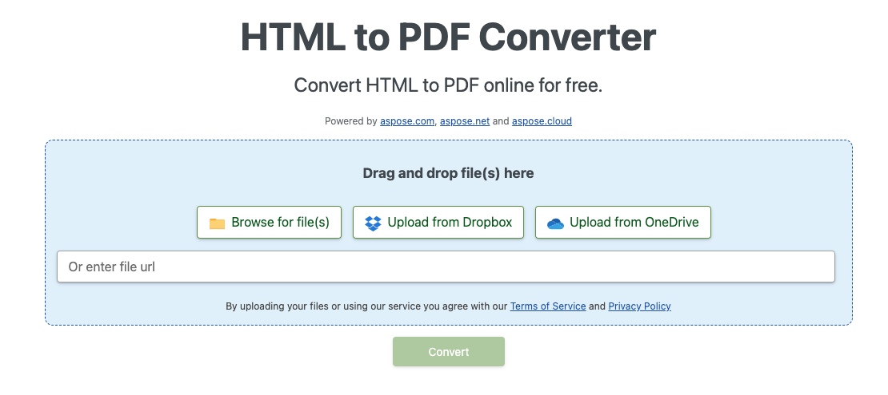

<script type="application/ld+json">
{
    "@context": "https://schema.org",
    "@type": "TechArticle",
    "headline": "Convert HTML to PDF in .NET",
    "alternativeHeadline": "Convert HTML and MHTML to PDF with C#",
    "abstract": "Aspose.PDF for .NET의 변환 기능은 HTML 및 MHTML 문서를 고품질 PDF 파일로 원활하게 변환할 수 있습니다. 고급 사용자 정의 옵션을 통해 사용자는 글꼴 포함, 미디어 쿼리 및 외부 리소스 관리를 제어할 수 있으며, 웹 페이지 또는 로컬 HTML 파일이 PDF 형식으로 정확하게 렌더링되도록 하여 특정 요구에 맞게 유연성을 보장합니다.",
    "author": {
        "@type": "Person",
        "name": "Anastasiia Holub",
        "givenName": "Anastasiia",
        "familyName": "Holub",
        "url": "https://www.linkedin.com/in/anastasiia-holub-750430225/"
    },
    "genre": "pdf document generation",
    "wordcount": "1716",
    "proficiencyLevel": "Beginner",
    "publisher": {
        "@type": "Organization",
        "name": "Aspose.PDF for .NET",
        "url": "https://products.aspose.com/pdf",
        "logo": "https://www.aspose.cloud/templates/aspose/img/products/pdf/aspose_pdf-for-net.svg",
        "alternateName": "Aspose",
        "sameAs": [
            "https://facebook.com/aspose.pdf/",
            "https://twitter.com/asposepdf",
            "https://www.youtube.com/channel/UCmV9sEg_QWYPi6BJJs7ELOg/featured",
            "https://www.linkedin.com/company/aspose",
            "https://stackoverflow.com/questions/tagged/aspose",
            "https://aspose.quora.com/",
            "https://aspose.github.io/"
        ],
        "contactPoint": [
            {
                "@type": "ContactPoint",
                "telephone": "+1 903 306 1676",
                "contactType": "sales",
                "areaServed": "US",
                "availableLanguage": "en"
            },
            {
                "@type": "ContactPoint",
                "telephone": "+44 141 628 8900",
                "contactType": "sales",
                "areaServed": "GB",
                "availableLanguage": "en"
            },
            {
                "@type": "ContactPoint",
                "telephone": "+61 2 8006 6987",
                "contactType": "sales",
                "areaServed": "AU",
                "availableLanguage": "en"
            }
        ]
    },
    "url": "/net/convert-html-to-pdf/",
    "mainEntityOfPage": {
        "@type": "WebPage",
        "@id": "/net/convert-html-to-pdf/"
    },
    "dateModified": "2025-04-04",
    "description": "Aspose.PDF는 간단하고 쉬운 작업뿐만 아니라 더 복잡한 목표도 처리할 수 있습니다. 고급 사용자 및 개발자를 위한 다음 섹션을 확인하세요."
}
</script>

## 개요 

이 문서에서는 **C#을 사용하여 HTML을 PDF로 변환하는 방법**을 설명합니다. 다음 주제를 다룹니다.

다음 코드 스니펫은 [Aspose.PDF.Drawing](/pdf/ko/net/drawing/) 라이브러리와도 작동합니다.

- [HTML을 PDF로 변환하기](#csharp-html-to-pdf)
- [웹 페이지를 PDF로 변환하기](#csharp-webpage-to-pdf)
- [MHTML을 PDF로 변환하기](#csharp-mhtml-to-pdf)

**Aspose.PDF for .NET**는 기존 HTML 문서를 PDF로 원활하게 변환할 수 있는 PDF 조작 API입니다. HTML을 PDF로 변환하는 과정은 유연하게 사용자 정의할 수 있습니다.

## HTML을 PDF로 변환하기

다음 C# 코드 샘플은 HTML 문서를 PDF로 변환하는 방법을 보여줍니다.

<a name="csharp-html-to-pdf"><strong>HTML을 PDF로 변환하기</strong></a>

1. [HtmlLoadOptions](https://reference.aspose.com/pdf/ko/net/aspose.pdf/htmlloadoptions/) 클래스의 인스턴스를 생성합니다.
2. [Document](https://reference.aspose.com/pdf/ko/net/aspose.pdf/document/) 객체를 초기화합니다.
3. **Document.Save()** 메서드를 호출하여 출력 PDF 문서를 저장합니다.

```csharp
// For complete examples and data files, visit https://github.com/aspose-pdf/Aspose.PDF-for-.NET
private static void ConvertHTMLtoPDF()
{
    // The path to the documents directory
    var dataDir = RunExamples.GetDataDir_AsposePdf();

    // Load the HTML file into a document using HtmlLoadOptions
    var options = new Aspose.Pdf.HtmlLoadOptions();

    // Open HTML document
    using (var document = new Aspose.Pdf.Document(dataDir + "test.html", options))
    {
        // Save PDF document
        document.Save(dataDir + "ConvertHTMLtoPDF_out.pdf");
    }
}
```

{}
**온라인에서 HTML을 PDF로 변환해 보세요**

Aspose는 ["HTML to PDF"](https://products.aspose.app/html/en/conversion/html-to-pdf)라는 온라인 무료 애플리케이션을 제공하여 기능과 품질을 확인할 수 있습니다.

[](https://products.aspose.app/html/en/conversion/html-to-pdf)
{}

## HTML에서 PDF로의 고급 변환

HTML 변환 엔진에는 변환 프로세스를 제어할 수 있는 여러 옵션이 있습니다.

### 미디어 쿼리 지원

미디어 쿼리는 다양한 장치에 맞춤형 스타일 시트를 제공하는 인기 있는 기술입니다. [`HtmlMediaType`](https://reference.aspose.com/pdf/ko/net/aspose.pdf/htmlloadoptions/properties/htmlmediatype) 속성을 사용하여 장치 유형을 설정할 수 있습니다.

```csharp
// For complete examples and data files, visit https://github.com/aspose-pdf/Aspose.PDF-for-.NET
private static void ConvertHTMLtoPDFAdvancedMediaType()
{
    // The path to the documents directory
    var dataDir = RunExamples.GetDataDir_AsposePdf();

    // Load the HTML file into a document using HtmlLoadOptions with Print media type
    var options = new HtmlLoadOptions
    {
        // Set Print or Screen mode
        HtmlMediaType = Aspose.Pdf.HtmlMediaType.Print
    };

    // Open HTML document
    using (var document = new Aspose.Pdf.Document(dataDir + "test.html", options))
    {
        // Save PDF document
        document.Save(dataDir + "ConvertHTMLtoPDFAdvancedMediaType_out.pdf");
    }
}
```

### 글꼴 포함 활성화(비활성화)

HTML 페이지는 종종 글꼴(예: 로컬 폴더의 글꼴, Google Fonts 등)을 사용합니다. 문서에서 글꼴 포함을 제어할 수 있는 [`IsEmbedFonts`](https://reference.aspose.com/pdf/ko/net/aspose.pdf/htmlloadoptions/properties/isembedfonts) 속성을 사용할 수 있습니다.

```csharp
 // For complete examples and data files, visit https://github.com/aspose-pdf/Aspose.PDF-for-.NET
 private static void ConvertHTMLtoPDFAdvancedEmbedFonts()
 {
     // The path to the documents directory
     var dataDir = RunExamples.GetDataDir_AsposePdf();

     // Load the HTML file into a document using HtmlLoadOptions with the font embedding option set
     var options = new Aspose.Pdf.HtmlLoadOptions
     {
         // Disable font embedding
         IsEmbedFonts = false
     };

     // Open HTML document
     using (var document = new Aspose.Pdf.Document(dataDir + "test_fonts.html", options))
     {
         // Save PDF document
         document.Save(dataDir + "ConvertHTMLtoPDFAdvanced_EmbedFonts_out.pdf");
     }
 }
```

### 외부 리소스 로딩 관리

변환 엔진은 HTML 문서와 관련된 특정 리소스의 로딩을 제어할 수 있는 메커니즘을 제공합니다. [`HtmlLoadOptions`](https://reference.aspose.com/pdf/ko/net/aspose.pdf/htmlloadoptions) 클래스에는 리소스 로더의 동작을 정의할 수 있는 [`CustomLoaderOfExternalResources`](https://reference.aspose.com/pdf/ko/net/aspose.pdf/htmlloadoptions/fields/customloaderofexternalresources) 속성이 있습니다. 모든 PNG 이미지를 단일 이미지 `test.jpg`로 교체하고 다른 리소스의 외부 URL을 내부로 교체해야 한다고 가정해 보겠습니다. 이를 위해 사용자 정의 로더 `SamePictureLoader`를 정의하고 [`CustomLoaderOfExternalResources`](https://reference.aspose.com/pdf/ko/net/aspose.pdf/htmlloadoptions/fields/customloaderofexternalresources)를 이 이름으로 지정할 수 있습니다.

```csharp
// For complete examples and data files, visit https://github.com/aspose-pdf/Aspose.PDF-for-.NET
private static void ConvertHTMLtoPDFAdvanced_DummyImage()
{
    // The path to the documents directory
    var dataDir = RunExamples.GetDataDir_AsposePdf();

    // Load the HTML file into a document with a custom resource loader for external images
    var options = new Aspose.Pdf.HtmlLoadOptions
    {
        CustomLoaderOfExternalResources = SamePictureLoader
    };

    // Open HTML document
    using (var document = new Aspose.Pdf.Document(dataDir + "test.html", options))
    {
        // Save PDF document
        document.Save(dataDir + "html_test.pdf");
    }
}

private static Aspose.Pdf.LoadOptions.ResourceLoadingResult SamePictureLoader(string resourceURI)
{
    // The path to the documents directory
    var dataDir = RunExamples.GetDataDir_AsposePdf();
    Aspose.Pdf.LoadOptions.ResourceLoadingResult result;

    if (resourceURI.EndsWith(".png"))
    {
        byte[] resultBytes = File.ReadAllBytes(dataDir + "test.jpg");
        result = new Aspose.Pdf.LoadOptions.ResourceLoadingResult(resultBytes)
        {
            // Set MIME Type
            MIMETypeIfKnown = "image/jpeg"
        };
    }
    else
    {
        result = new Aspose.Pdf.LoadOptions.ResourceLoadingResult(GetContentFromUrl(resourceURI));
    }
    return result;
}

private static byte[] GetContentFromUrl(string url)
{
    var httpClient = new System.Net.Http.HttpClient();
    return httpClient.GetByteArrayAsync(url).GetAwaiter().GetResult();
}
```

## 웹 페이지를 PDF로 변환하기

웹 페이지를 변환하는 것은 로컬 HTML 문서를 변환하는 것과 약간 다릅니다. 웹 페이지 내용을 PDF 형식으로 변환하기 위해 먼저 HttpClient 인스턴스를 사용하여 HTML 페이지 내용을 가져오고, Stream 객체를 생성한 다음, 내용을 Document 객체에 전달하고 PDF 형식으로 출력을 렌더링할 수 있습니다.

웹 서버에 호스팅된 웹 페이지를 PDF로 변환할 때:

<a name="csharp-webpage-to-pdf"><strong>웹 페이지를 PDF로 변환하기</strong></a>

1. HttpClient 객체를 사용하여 페이지의 내용을 읽습니다.
1. [HtmlLoadOptions](https://reference.aspose.com/pdf/ko/net/aspose.pdf/htmlloadoptions) 객체를 인스턴스화하고 기본 URL을 설정합니다.
1. 스트림 객체를 전달하면서 Document 객체를 초기화합니다.
1. 선택적으로 페이지 크기 및/또는 방향을 설정합니다.

```csharp
// For complete examples and data files, visit https://github.com/aspose-pdf/Aspose.PDF-for-.NET
private static void ConvertHTMLtoPDFAdvanced_WebPage()
{
    // The path to the documents directory
    var dataDir = RunExamples.GetDataDir_AsposePdf();

    const string url = "https://en.wikipedia.org/wiki/Aspose_API";

    // Set page size A3 and Landscape orientation;   
    var options = new Aspose.Pdf.HtmlLoadOptions(url)
    {
        PageInfo =
        {
            Width = 842,
            Height = 1191,
            IsLandscape = true
        }
    };

    // Load the web page content as a stream and create a PDF document
    using (var document = new Aspose.Pdf.Document(GetContentFromUrlAsStream(url), options))
    {
        // Save PDF document
        document.Save(dataDir + "html_test.pdf");
    }
}

private static Stream GetContentFromUrlAsStream(string url, System.Net.ICredentials credentials = null)
{
    using (var handler = new System.Net.Http.HttpClientHandler { Credentials = credentials })
    using (var httpClient = new System.Net.Http.HttpClient(handler))
    {
        return httpClient.GetStreamAsync(url).GetAwaiter().GetResult();
    }
}
```

### 웹 페이지 PDF 변환에 대한 자격 증명 제공

때때로 인증 및 접근 권한이 필요한 HTML 파일의 변환을 수행해야 하므로 인증된 사용자만 페이지 내용을 가져올 수 있습니다. 여기에는 HTML 내부에서 참조된 일부 리소스/데이터가 인증이 필요한 외부 서버에서 가져오는 시나리오도 포함됩니다. 이러한 요구 사항을 충족하기 위해 [`HtmlLoadOptions`](https://reference.aspose.com/pdf/ko/net/aspose.pdf/htmlloadoptions) 클래스에 [`ExternalResourcesCredentials`](https://reference.aspose.com/pdf/ko/net/aspose.pdf/htmlloadoptions/fields/externalresourcescredentials) 속성이 추가되었습니다. 다음 코드 스니펫은 HTML 파일을 PDF로 변환할 때 HTML 및 해당 리소스 요청에 자격 증명을 전달하는 단계를 보여줍니다.

```csharp
 // For complete examples and data files, visit https://github.com/aspose-pdf/Aspose.PDF-for-.NET
 private static void ConvertHTMLtoPDFAdvancedAuthorized()
 {
     // The path to the documents directory
     var dataDir = RunExamples.GetDataDir_AsposePdf();

     const string url = "http://httpbin.org/basic-auth/user1/password1";
     var credentials = new System.Net.NetworkCredential("user1", "password1");

     var options = new Aspose.Pdf.HtmlLoadOptions(url)
     {
         ExternalResourcesCredentials = credentials
     };

     using (var document = new Aspose.Pdf.Document(GetContentFromUrlAsStream(url, credentials), options))
     {
         // Save PDF document
         document.Save(dataDir + "HtmlTest_out.pdf");
     }
 }

private static Stream GetContentFromUrlAsStream(string url, System.Net.ICredentials credentials = null)
{
    using (var handler = new System.Net.Http.HttpClientHandler { Credentials = credentials })
    using (var httpClient = new System.Net.Http.HttpClient(handler))
    {
        return httpClient.GetStreamAsync(url).GetAwaiter().GetResult();
    }
}
```

### 모든 HTML 내용을 단일 페이지에 렌더링

Aspose.PDF for .NET는 HTML 파일을 PDF 형식으로 변환할 때 모든 내용을 단일 페이지에 렌더링할 수 있는 기능을 제공합니다. 예를 들어, 출력 크기가 한 페이지를 초과하는 HTML 내용이 있는 경우 출력 데이터를 단일 PDF 페이지로 렌더링하는 옵션을 사용할 수 있습니다. 이 옵션을 사용하기 위해 HtmlLoadOptions 클래스는 IsRenderToSinglePage 플래그로 확장되었습니다. 아래 코드 스니펫은 이 기능을 사용하는 방법을 보여줍니다.

```csharp
 // For complete examples and data files, visit https://github.com/aspose-pdf/Aspose.PDF-for-.NET
 private static void ConvertHTMLtoPDFAdvancedSinglePageRendering()
 {
     // The path to the documents directory
     var dataDir = RunExamples.GetDataDir_AsposePdf();

     // Initialize HtmlLoadOptions
     var options = new Aspose.Pdf.HtmlLoadOptions
     {
         // Set Render to single page property
         IsRenderToSinglePage = true
     };

     // Open PDF document
     using (var document = new Aspose.Pdf.Document(dataDir + "HTMLToPDF.html", options))
     {
         // Save PDF document
         document.Save(dataDir + "RenderContentToSamePage_out.pdf");
     }
 }
```

### SVG 데이터로 HTML 렌더링

Aspose.PDF for .NET는 HTML 페이지를 PDF 문서로 변환하는 기능을 제공합니다. HTML은 페이지에 태그로 SVG 그래픽 요소를 추가할 수 있으므로 Aspose.PDF는 이러한 데이터를 결과 PDF 파일로 변환하는 것도 지원합니다. 다음 코드 스니펫은 SVG 그래픽 태그가 포함된 HTML 파일을 태그가 있는 PDF 문서로 변환하는 방법을 보여줍니다.

```csharp
// For complete examples and data files, visit https://github.com/aspose-pdf/Aspose.PDF-for-.NET
private static void ConvertHTMLtoPDFWithSVG()
{
    // The path to the documents directory
    var dataDir = RunExamples.GetDataDir_AsposePdf();

    // Initialize HtmlLoadOptions
    var options = new Aspose.Pdf.HtmlLoadOptions(Path.GetDirectoryName(dataDir + "HTMLSVG.html"));

    // Initialize Document object
    using (var document = new Aspose.Pdf.Document(dataDir + "HTMLSVG.html", options))
    {
        // Save PDF document
        document.Save(dataDir + "RenderHTMLwithSVGData_out.pdf");
    }
}
```

## MHTML을 PDF로 변환하기 

{}
**온라인에서 MHTML을 PDF로 변환해 보세요**

Aspose.PDF for .NET는 ["MHTML to PDF"](https://products.aspose.app/pdf/conversion/mhtml-to-pdf)라는 온라인 무료 애플리케이션을 제공하여 기능과 품질을 확인할 수 있습니다.

[](https://products.aspose.app/pdf/conversion/mhtml-to-pdf)
{}

<abbr title="MIME encapsulation of aggregate HTML documents">MHTML</abbr>, MIME HTML의 약어,는 일반적으로 외부 링크(예: 이미지, Flash 애니메이션, Java 애플릿 및 오디오 파일)로 표시되는 리소스를 HTML 코드와 결합하여 단일 파일로 만드는 웹 페이지 아카이브 형식입니다. MHTML 파일의 내용은 MIME 유형 multipart/related를 사용하여 HTML 이메일 메시지처럼 인코딩됩니다. Aspose.PDF for .NET는 HTML 파일을 PDF 형식으로 변환할 수 있으며, Aspose.PDF for .NET 9.0.0의 출시와 함께 MHTML 파일을 PDF 형식으로 변환할 수 있는 새로운 기능을 도입했습니다. 다음 코드 스니펫은 C#을 사용하여 MHTML 파일을 PDF 형식으로 변환하는 방법을 보여줍니다.

<a name="csharp-mhtml-to-pdf"><strong>MHTML을 PDF로 변환하기</strong></a>

1. [MhtLoadOptions](https://reference.aspose.com/pdf/ko/net/aspose.pdf/mhtloadoptions/) 클래스의 인스턴스를 생성합니다.
2. [Document](https://reference.aspose.com/pdf/ko/net/aspose.pdf/document/) 객체를 초기화합니다.
3. **Document.Save()** 메서드를 호출하여 출력 PDF 문서를 저장합니다.

```csharp
// For complete examples and data files, visit https://github.com/aspose-pdf/Aspose.PDF-for-.NET
private static void ConvertMHTtoPDF()
{
    // The path to the documents directory
    var dataDir = RunExamples.GetDataDir_AsposePdf();

    // Initialize MhtLoadOptions with page setup
    var options = new Aspose.Pdf.MhtLoadOptions()
    {
        PageInfo = { Width = 842, Height = 1191, IsLandscape = true }
    };

    // Initialize Document object using the MHT file and options
    using (var document = new Aspose.Pdf.Document(dataDir + "fileformatinfo.mht", options))
    {
        // Save PDF document
        document.Save(dataDir + "MhtmlTest_out.pdf");
    }
}
```