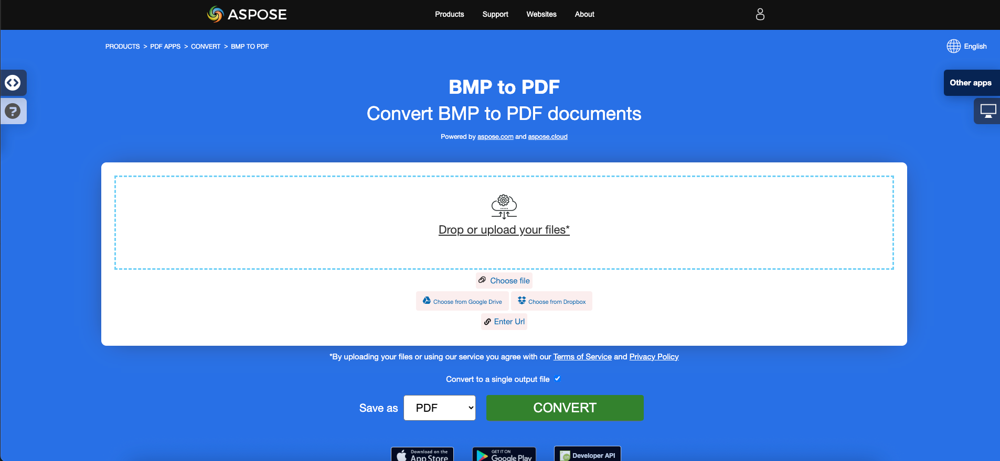

<script type="application/ld+json">
{
    "@context": "https://schema.org",
    "@type": "TechArticle",
    "headline": "Convert various Images formats to PDF in .NET",
    "alternativeHeadline": "Convert Multiple Image Formats to PDF with C#",
    "abstract": "BMP, CGM, DICOM, EMF, JPG, PNG, SVG, TIFF, CDR 및 DJVU를 포함한 다양한 이미지 형식의 원활한 변환을 가능하게 하는 강력한 기능을 소개합니다. 이 기능은 .NET 애플리케이션 내에서 이미지-투-PDF 변환을 통합하는 간단한 방법을 제공하여 다양한 그래픽 콘텐츠를 효율적으로 처리할 수 있도록 합니다.",
    "author": {
        "@type": "Person",
        "name": "Anastasiia Holub",
        "givenName": "Anastasiia",
        "familyName": "Holub",
        "url": "https://www.linkedin.com/in/anastasiia-holub-750430225/"
    },
    "genre": "pdf document generation",
    "wordcount": "5228",
    "proficiencyLevel": "Beginner",
    "publisher": {
        "@type": "Organization",
        "name": "Aspose.PDF for .NET",
        "url": "https://products.aspose.com/pdf",
        "logo": "https://www.aspose.cloud/templates/aspose/img/products/pdf/aspose_pdf-for-net.svg",
        "alternateName": "Aspose",
        "sameAs": [
            "https://facebook.com/aspose.pdf/",
            "https://twitter.com/asposepdf",
            "https://www.youtube.com/channel/UCmV9sEg_QWYPi6BJJs7ELOg/featured",
            "https://www.linkedin.com/company/aspose",
            "https://stackoverflow.com/questions/tagged/aspose",
            "https://aspose.quora.com/",
            "https://aspose.github.io/"
        ],
        "contactPoint": [
            {
                "@type": "ContactPoint",
                "telephone": "+1 903 306 1676",
                "contactType": "sales",
                "areaServed": "US",
                "availableLanguage": "en"
            },
            {
                "@type": "ContactPoint",
                "telephone": "+44 141 628 8900",
                "contactType": "sales",
                "areaServed": "GB",
                "availableLanguage": "en"
            },
            {
                "@type": "ContactPoint",
                "telephone": "+61 2 8006 6987",
                "contactType": "sales",
                "areaServed": "AU",
                "availableLanguage": "en"
            }
        ]
    },
    "url": "/net/convert-images-format-to-pdf/",
    "mainEntityOfPage": {
        "@type": "WebPage",
        "@id": "/net/convert-images-format-to-pdf/"
    },
    "dateModified": "2024-11-25",
    "description": "Aspose.PDF는 간단하고 쉬운 작업뿐만 아니라 더 복잡한 목표도 처리할 수 있습니다. 고급 사용자 및 개발자를 위한 다음 섹션을 확인하십시오."
}
</script>

## 개요

이 문서에서는 C#을 사용하여 다양한 이미지 형식을 PDF로 변환하는 방법을 설명합니다. 다음 주제를 다룹니다.

다음 코드 스니펫은 [Aspose.PDF.Drawing](/pdf/ko/net/drawing/) 라이브러리와 함께 작동합니다.

_형식_: **BMP**
- [C# BMP를 PDF로 변환하기](#csharp-bmp-to-pdf)
- [C# BMP를 PDF로 변환하기](#csharp-bmp-to-pdf)
- [C# BMP 이미지를 PDF로 변환하는 방법](#csharp-bmp-to-pdf)

_형식_: **CGM**
- [C# CGM을 PDF로 변환하기](#csharp-cgm-to-pdf)
- [C# CGM을 PDF로 변환하기](#csharp-cgm-to-pdf)
- [C# CGM 이미지를 PDF로 변환하는 방법](#csharp-cgm-to-pdf)

_형식_: **DICOM**
- [C# DICOM을 PDF로 변환하기](#csharp-dicom-to-pdf)
- [C# DICOM을 PDF로 변환하기](#csharp-dicom-to-pdf)
- [C# DICOM 이미지를 PDF로 변환하는 방법](#csharp-dicom-to-pdf)

_형식_: **EMF**
- [C# EMF를 PDF로 변환하기](#csharp-emf-to-pdf)
- [C# EMF를 PDF로 변환하기](#csharp-emf-to-pdf)
- [C# EMF 이미지를 PDF로 변환하는 방법](#csharp-emf-to-pdf)

_형식_: **GIF**
- [C# GIF를 PDF로 변환하기](#csharp-gif-to-pdf)
- [C# GIF를 PDF로 변환하기](#csharp-gif-to-pdf)
- [C# GIF 이미지를 PDF로 변환하는 방법](#csharp-gif-to-pdf)

_형식_: **JPG**
- [C# JPG를 PDF로 변환하기](#csharp-jpg-to-pdf)
- [C# JPG를 PDF로 변환하기](#csharp-jpg-to-pdf)
- [C# JPG 이미지를 PDF로 변환하는 방법](#csharp-jpg-to-pdf)

_형식_: **PNG**
- [C# PNG를 PDF로 변환하기](#csharp-png-to-pdf)
- [C# PNG를 PDF로 변환하기](#csharp-png-to-pdf)
- [C# PNG 이미지를 PDF로 변환하는 방법](#csharp-png-to-pdf)

_형식_: **SVG**
- [C# SVG를 PDF로 변환하기](#csharp-svg-to-pdf)
- [C# SVG를 PDF로 변환하기](#csharp-svg-to-pdf)
- [C# SVG 이미지를 PDF로 변환하는 방법](#csharp-svg-to-pdf)

_형식_: **TIFF**
- [C# TIFF를 PDF로 변환하기](#csharp-tiff-to-pdf)
- [C# TIFF를 PDF로 변환하기](#csharp-tiff-to-pdf)
- [C# TIFF 이미지를 PDF로 변환하는 방법](#csharp-tiff-to-pdf)

_형식_: **CDR**
- [C# CDR을 PDF로 변환하기](#csharp-cdr-to-pdf)
- [C# CDR을 PDF로 변환하기](#csharp-cdr-to-pdf)
- [C# CDR 이미지를 PDF로 변환하는 방법](#csharp-cdr-to-pdf)

_형식_: **DJVU**
- [C# DJVU를 PDF로 변환하기](#csharp-djvu-to-pdf)
- [C# DJVU를 PDF로 변환하기](#csharp-djvu-to-pdf)
- [C# DJVU 이미지를 PDF로 변환하는 방법](#csharp-djvu-to-pdf)

이 문서에서 다루는 기타 주제
- [참조](#see-also)


## C# 이미지에서 PDF로 변환

**Aspose.PDF for .NET**은 다양한 형식의 이미지를 PDF 파일로 변환할 수 있습니다. 우리의 라이브러리는 BMP, CGM, DICOM, EMF, JPG, PNG, SVG 및 TIFF 형식과 같은 가장 인기 있는 이미지 형식을 변환하는 코드 스니펫을 보여줍니다.

## BMP를 PDF로 변환하기

**Aspose.PDF for .NET** 라이브러리를 사용하여 BMP 파일을 PDF 문서로 변환합니다.

<abbr title="Bitmap Image File">BMP</abbr> 이미지는 확장자를 가진 파일입니다. BMP는 비트맵 디지털 이미지를 저장하는 데 사용되는 비트맵 이미지 파일을 나타냅니다. 이러한 이미지는 그래픽 어댑터와 독립적이며 장치 독립 비트맵(DIB) 파일 형식이라고도 합니다.
Aspose.PDF for .NET API를 사용하여 BMP를 PDF 파일로 변환할 수 있습니다. 따라서 BMP 이미지를 변환하기 위해 다음 단계를 따를 수 있습니다:

<a name="csharp-bmp-to-pdf" id="csharp-bmp-to-pdf"><strong>단계: C#에서 BMP를 PDF로 변환하기</strong></a>

1. 새로운 [Document](https://reference.aspose.com/pdf/ko/net/aspose.pdf/document) 클래스 객체를 초기화합니다.
2. 입력 **BMP** 이미지를 로드합니다.
3. 마지막으로 출력 PDF 파일을 저장합니다.

따라서 다음 코드 스니펫은 이러한 단계를 따르며 C#을 사용하여 BMP를 PDF로 변환하는 방법을 보여줍니다:

```csharp
// For complete examples and data files, visit https://github.com/aspose-pdf/Aspose.PDF-for-.NET
private static void ConvertBMPtoPDF()
{
    // The path to the documents directory
    var dataDir = RunExamples.GetDataDir_AsposePdf_WorkingDocuments();

    // Create PDF document
    using (var document = new Aspose.Pdf.Document())
    {
        // Add page
        var page = document.Pages.Add();
        var image = new Aspose.Pdf.Image();
        
        // Load BMP file
        image.File = dataDir + "BMPtoPDF.bmp";
        page.Paragraphs.Add(image);
        
        // Save PDF document
        document.Save(dataDir + "BMPtoPDF_out.pdf");
    }
}
```

{}
**온라인에서 BMP를 PDF로 변환해 보세요**

Aspose는 ["BMP to PDF"](https://products.aspose.app/pdf/conversion/bmp-to-pdf/)라는 온라인 무료 애플리케이션을 제공하여 기능과 품질을 조사해 볼 수 있습니다.

[](https://products.aspose.app/pdf/conversion/bmp-to-pdf/)
{}

## CGM을 PDF로 변환하기

<abbr title="Computer Graphics Metafile">CGM</abbr>은 CAD(컴퓨터 지원 설계) 및 프레젠테이션 그래픽 애플리케이션에서 일반적으로 사용되는 컴퓨터 그래픽 메타파일 형식의 파일 확장자입니다. CGM은 세 가지 다른 인코딩 방법을 지원하는 벡터 그래픽 형식입니다: 이진(프로그램 읽기 속도에 가장 적합), 문자 기반(가장 작은 파일 크기를 생성하고 더 빠른 데이터 전송을 허용) 또는 클리어텍스트 인코딩(사용자가 텍스트 편집기로 파일을 읽고 수정할 수 있도록 함).

CGM 파일을 PDF 형식으로 변환하는 다음 코드 스니펫을 확인하십시오.

<a name="csharp-cgm-to-pdf" id="csharp-cgm-to-pdf"><strong>단계: C#에서 CGM을 PDF로 변환하기</strong></a>

1. [CgmLoadOptions](https://reference.aspose.com/pdf/ko/net/aspose.pdf/cgmloadoptions) 클래스의 인스턴스를 생성합니다.
2. 소스 파일 이름과 옵션을 언급하여 [Document](https://reference.aspose.com/pdf/ko/net/aspose.pdf/document) 클래스의 인스턴스를 생성합니다.
3. 원하는 파일 이름으로 문서를 저장합니다.

```csharp
// For complete examples and data files, visit https://github.com/aspose-pdf/Aspose.PDF-for-.NET
private static void ConvertCGMtoPDF()
{
    // The path to the documents directory
    var dataDir = RunExamples.GetDataDir_AsposePdf_WorkingDocuments();

    var option = new Aspose.Pdf.CgmLoadOptions();

    // Open PDF document
    using (var document = new Aspose.Pdf.Document(dataDir + "CGMtoPDF.cgm", option))
    {
        // Save PDF document
        document.Save(dataDir + "CGMtoPDF_out.pdf");
    }
}
```

## DICOM을 PDF로 변환하기

<abbr title="Digital Imaging and Communications in Medicine">DICOM</abbr> 형식은 디지털 의료 이미지 및 검사된 환자의 문서 생성, 저장, 전송 및 시각화에 대한 의료 산업 표준입니다.

**Aspose.PDF for .NET**은 DICOM 및 SVG 이미지를 변환할 수 있지만, 기술적인 이유로 PDF에 추가할 이미지를 추가하려면 추가할 파일의 유형을 지정해야 합니다:

<a name="csharp-dicom-to-pdf" id="csharp-dicom-to-pdf"><strong>단계: C#에서 DICOM을 PDF로 변환하기</strong></a>

1. Image 클래스의 객체를 생성합니다.
2. 페이지의 Paragraphs 컬렉션에 이미지를 추가합니다.
3. [FileType](https://reference.aspose.com/pdf/ko/net/aspose.pdf/image/properties/filetype) 속성을 지정합니다.
4. 파일의 경로 또는 소스를 지정합니다.
    - 이미지가 하드 드라이브의 위치에 있는 경우 Image.File 속성을 사용하여 경로 위치를 지정합니다.
    - 이미지가 MemoryStream에 있는 경우 이미지를 보유하는 객체를 Image.ImageStream 속성에 전달합니다.

다음 코드 스니펫은 Aspose.PDF를 사용하여 DICOM 파일을 PDF 형식으로 변환하는 방법을 보여줍니다. DICOM 이미지를 로드하고 PDF 파일의 페이지에 이미지를 배치한 다음 출력을 PDF로 저장해야 합니다.

```csharp
// For complete examples and data files, visit https://github.com/aspose-pdf/Aspose.PDF-for-.NET
private static void ConvertDICOMtoPDF()
{
    // The path to the documents directory
    var dataDir = RunExamples.GetDataDir_AsposePdf_WorkingDocuments();

    // Create PDF document 
    using (var document = new Aspose.Pdf.Document())
    {
        // Add page
        var page = document.Pages.Add();
        
        var image = new Aspose.Pdf.Image
        {
            FileType = ImageFileType.Dicom,
            File = dataDir + "DICOMtoPDF.dcm"
        };
        page.Paragraphs.Add(image);

        // Save PDF document
        document.Save(dataDir + "DICOMtoPDF_out.pdf");
    }
}
```

{}
**온라인에서 DICOM을 PDF로 변환해 보세요**

Aspose는 ["DICOM to PDF"](https://products.aspose.app/pdf/conversion/dicom-to-pdf/)라는 온라인 무료 애플리케이션을 제공하여 기능과 품질을 조사해 볼 수 있습니다.

[](https://products.aspose.app/pdf/conversion/dicom-to-pdf/)
{}

## EMF를 PDF로 변환하기

<abbr title="Enhanced metafile format">EMF</abbr>는 그래픽 이미지를 장치 독립적으로 저장합니다. EMF의 메타파일은 저장된 이미지를 어떤 출력 장치에서든 렌더링할 수 있는 가변 길이 레코드로 구성됩니다. 또한, 아래 단계를 사용하여 EMF를 PDF 이미지로 변환할 수 있습니다:

<a name="csharp-emf-to-pdf" id="csharp-emf-to-pdf"><strong>단계: C#에서 EMF를 PDF로 변환하기</strong></a>

1. 먼저 [Document](https://reference.aspose.com/pdf/ko/net/aspose.pdf/document) 클래스 객체를 초기화합니다.
2. **EMF** 이미지 파일을 로드합니다.
3. 로드된 EMF 이미지를 페이지에 추가합니다.
4. PDF 문서를 저장합니다.

또한, 다음 코드 스니펫은 C#에서 EMF를 PDF로 변환하는 방법을 보여줍니다:

```csharp
// For complete examples and data files, visit https://github.com/aspose-pdf/Aspose.PDF-for-.NET
private static void ConvertEMFtoPDF()
{
    // The path to the documents directory
    var dataDir = RunExamples.GetDataDir_AsposePdf_WorkingDocuments();

    // Create PDF document 
    using (var document = new Aspose.Pdf.Document())
    {
        // Add page
        var page = document.Pages.Add();
        var image = new Aspose.Pdf.Image();
        // Load EMF file
        image.File = dataDir + "EMFtoPDF.emf";

        // Specify page dimension properties
        page.PageInfo.Margin.Bottom = 0;
        page.PageInfo.Margin.Top = 0;
        page.PageInfo.Margin.Left = 0;
        page.PageInfo.Margin.Right = 0;
        page.PageInfo.Width = image.BitmapSize.Width;
        page.PageInfo.Height = image.BitmapSize.Height;

        page.Paragraphs.Add(image);

        // Save PDF document
        document.Save(dataDir + "EMFtoPDF_out.pdf");
    }
}
```

{}
**온라인에서 EMF를 PDF로 변환해 보세요**

Aspose는 ["EMF to PDF"](https://products.aspose.app/pdf/conversion/emf-to-pdf/)라는 온라인 무료 애플리케이션을 제공하여 기능과 품질을 조사해 볼 수 있습니다.

[](https://products.aspose.app/pdf/conversion/emf-to-pdf/)
{}

## GIF를 PDF로 변환하기

**Aspose.PDF for .NET** 라이브러리를 사용하여 GIF 파일을 PDF 문서로 변환합니다.

<abbr title="Graphics Interchange Format">GIF</abbr>는 품질 손실 없이 최대 256색의 형식으로 압축된 데이터를 저장할 수 있습니다. 하드웨어 독립적인 GIF 형식은 1987년( GIF87a) CompuServe에 의해 비트맵 이미지를 네트워크를 통해 전송하기 위해 개발되었습니다.
Aspose.PDF for .NET API를 사용하여 GIF를 PDF 파일로 변환할 수 있습니다. 따라서 GIF 이미지를 변환하기 위해 다음 단계를 따를 수 있습니다:

<a name="csharp-gif-to-pdf" id="csharp-gif-to-pdf"><strong>단계: C#에서 GIF를 PDF로 변환하기</strong></a>

1. 새로운 [Document](https://reference.aspose.com/pdf/ko/net/aspose.pdf/document) 클래스 객체를 초기화합니다.
2. 입력 **GIF** 이미지를 로드합니다.
3. 마지막으로 출력 PDF 파일을 저장합니다.

따라서 다음 코드 스니펫은 이러한 단계를 따르며 C#을 사용하여 BMP를 PDF로 변환하는 방법을 보여줍니다:

```csharp
// For complete examples and data files, visit https://github.com/aspose-pdf/Aspose.PDF-for-.NET
private static void ConvertGIFtoPDF()
{
    // The path to the documents directory
    var dataDir = RunExamples.GetDataDir_AsposePdf_WorkingDocuments();

    // Create PDF document
    using (var document = new Aspose.Pdf.Document())
    {
        // Add page
        var page = document.Pages.Add();
        var image = new Aspose.Pdf.Image();
        
        // Load sample GIF image file
        image.File = dataDir + "GIFtoPDF.gif";
        page.Paragraphs.Add(image);

        // Save PDF document
        document.Save(dataDir + "GIFtoPDF_out.pdf");
    }
}
```

{}
**온라인에서 GIF를 PDF로 변환해 보세요**

Aspose는 ["GIF to PDF"](https://products.aspose.app/pdf/conversion/gif-to-pdf/)라는 온라인 무료 애플리케이션을 제공하여 기능과 품질을 조사해 볼 수 있습니다.

[](https://products.aspose.app/pdf/conversion/gif-to-pdf/)
{}

## JPG를 PDF로 변환하기

JPG를 PDF로 변환하는 방법에 대해 궁금해할 필요가 없습니다. 왜냐하면 **Apose.PDF for .NET** 라이브러리가 최고의 솔루션을 제공하기 때문입니다.

Aspose.PDF for .NET을 사용하여 JPG 이미지를 PDF로 매우 쉽게 변환할 수 있습니다. 다음 단계를 따르십시오:

<a name="csharp-jpg-to-pdf" id="csharp-jpg-to-pdf"><strong>단계: C#에서 JPG를 PDF로 변환하기</strong></a>

1. [Document](https://reference.aspose.com/page/net/aspose.page/document) 클래스의 객체를 초기화합니다.
2. PDF 문서에 새 페이지를 추가합니다.
3. **JPG** 이미지를 로드하고 단락에 추가합니다.
4. 출력 PDF를 저장합니다.

아래 코드 스니펫은 C#을 사용하여 JPG 이미지를 PDF로 변환하는 방법을 보여줍니다:

```csharp
// For complete examples and data files, visit https://github.com/aspose-pdf/Aspose.PDF-for-.NET
private static void ConvertJPGtoPDF()
{
    // The path to the documents directory
    var dataDir = RunExamples.GetDataDir_AsposePdf_WorkingDocuments();

    // Create PDF document 
    using (var document = new Aspose.Pdf.Document())
    {
        // Add page
        var page = document.Pages.Add();
        var image = new Aspose.Pdf.Image();
        // Load input JPG file
        image.File = dataDir + "JPGtoPDF.jpg";
        
        // Add image on a page
        page.Paragraphs.Add(image);
        
        // Save PDF document
        document.Save(dataDir + "JPGtoPDF_out.pdf");
    }
}
```

그런 다음 페이지의 **높이와 너비가 동일한** 이미지로 변환하는 방법을 볼 수 있습니다. 우리는 이미지 치수를 가져오고 그에 따라 PDF 문서의 페이지 치수를 설정할 것입니다. 아래 단계를 따르십시오:

1. 입력 이미지 파일을 로드합니다.
1. 페이지의 높이, 너비 및 여백을 설정합니다.
1. 출력 PDF 파일을 저장합니다.

다음 코드 스니펫은 C#을 사용하여 동일한 페이지 높이와 너비로 이미지를 PDF로 변환하는 방법을 보여줍니다:

```csharp
// For complete examples and data files, visit https://github.com/aspose-pdf/Aspose.PDF-for-.NET
private static void ConvertJPGtoPDF()
{
    // The path to the documents directory
    var dataDir = RunExamples.GetDataDir_AsposePdf_WorkingDocuments();

    // Create PDF document
    using (var document = new Aspose.Pdf.Document())
    {
        // Add page
        var page = document.Pages.Add();
        var image = new Aspose.Pdf.Image();
        // Load JPEG file
        image.File = dataDir + "JPGtoPDF.jpg";
        
        // Read Height of input image
        page.PageInfo.Height = image.BitmapSize.Height;
        // Read Width of input image
        page.PageInfo.Width = image.BitmapSize.Width;
        page.PageInfo.Margin.Bottom = 0;
        page.PageInfo.Margin.Top = 0;
        page.PageInfo.Margin.Right = 0;
        page.PageInfo.Margin.Left = 0;
        page.Paragraphs.Add(image);
        
        // Save PDF document
        document.Save(dataDir + "JPGtoPDF_out.pdf");
    }
}
```

{}
**온라인에서 JPG를 PDF로 변환해 보세요**

Aspose는 ["JPG to PDF"](https://products.aspose.app/pdf/conversion/jpg-to-pdf/)라는 온라인 무료 애플리케이션을 제공하여 기능과 품질을 조사해 볼 수 있습니다.

[](https://products.aspose.app/pdf/conversion/jpg-to-pdf/)
{}

## PNG를 PDF로 변환하기

**Aspose.PDF for .NET**은 PNG 이미지를 PDF 형식으로 변환하는 기능을 지원합니다. 다음 코드 스니펫을 확인하여 작업을 수행하십시오.

<abbr title="Portable Network Graphics">PNG</abbr>는 무손실 압축을 사용하는 래스터 이미지 파일 형식의 일종으로, 사용자들 사이에서 인기가 높습니다.

아래 단계를 사용하여 PNG를 PDF 이미지로 변환할 수 있습니다:

<a name="csharp-png-to-pdf" id="csharp-png-to-pdf"><strong>단계: C#에서 PNG를 PDF로 변환하기</strong></a>

1. 입력 **PNG** 이미지를 로드합니다.
2. 높이 및 너비 값을 읽습니다.
3. 새로운 [Document](https://reference.aspose.com/page/net/aspose.page/document) 객체를 생성하고 페이지를 추가합니다.
4. 페이지 치수를 설정합니다.
5. 출력 파일을 저장합니다.

또한, 아래 코드 스니펫은 .NET 애플리케이션에서 C#을 사용하여 PNG를 PDF로 변환하는 방법을 보여줍니다:

```csharp
// For complete examples and data files, visit https://github.com/aspose-pdf/Aspose.PDF-for-.NET
private static void ConvertPNGtoPDF()
{
    // The path to the documents directory
    var dataDir = RunExamples.GetDataDir_AsposePdf_WorkingDocuments();

    // Create PDF document
    using (var document = new Aspose.Pdf.Document())
    {
        // Add page
        var page = document.Pages.Add();
        var image = new Aspose.Pdf.Image();
        // Load PNG file
        image.File = dataDir + "PNGtoPDF.png";
        
        // Read Height of input image
        page.PageInfo.Height = image.BitmapSize.Height;
        // Read Width of input image
        page.PageInfo.Width = image.BitmapSize.Width;
        page.PageInfo.Margin.Bottom = 0;
        page.PageInfo.Margin.Top = 0;
        page.PageInfo.Margin.Right = 0;
        page.PageInfo.Margin.Left = 0;
        page.Paragraphs.Add(image);
        
        // Save PDF document
        document.Save(dataDir + "PNGtoPDF_out.pdf");
    }
}
```

{}
**온라인에서 PNG를 PDF로 변환해 보세요**

Aspose는 ["PNG to PDF"](https://products.aspose.app/pdf/conversion/png-to-pdf/)라는 온라인 무료 애플리케이션을 제공하여 기능과 품질을 조사해 볼 수 있습니다.

[](https://products.aspose.app/pdf/conversion/png-to-pdf/)
{}

## SVG를 PDF로 변환하기

**Aspose.PDF for .NET**은 SVG 이미지를 PDF 형식으로 변환하는 방법과 소스 <abbr title="Scalable Vector Graphics">SVG</abbr> 파일의 치수를 얻는 방법을 설명합니다.

스케일러블 벡터 그래픽(SVG)은 정적 및 동적(인터랙티브 또는 애니메이션) 2차원 벡터 그래픽을 위한 XML 기반 파일 형식의 사양 모음입니다. SVG 사양은 1999년부터 월드 와이드 웹 컨소시엄(W3C)에 의해 개발되고 있는 개방형 표준입니다.

SVG 이미지는 XML 텍스트 파일로 정의되며, 이는 검색, 색인화, 스크립팅 및 필요할 경우 압축할 수 있음을 의미합니다. XML 파일로서 SVG 이미지는 모든 텍스트 편집기로 생성 및 편집할 수 있지만, Inkscape와 같은 드로잉 프로그램을 사용하여 생성하는 것이 더 편리합니다.

{}
**온라인에서 SVG 형식을 PDF로 변환해 보세요**

Aspose.PDF for .NET은 ["SVG to PDF"](https://products.aspose.app/pdf/conversion/svg-to-pdf)라는 온라인 무료 애플리케이션을 제공하여 기능과 품질을 조사해 볼 수 있습니다.

[](https://products.aspose.app/pdf/conversion/svg-to-pdf)
{}

SVG 파일을 PDF로 변환하려면 [SvgLoadOptions](https://reference.aspose.com/net/pdf/aspose.pdf/svgloadoptions)라는 클래스를 사용하여 [`LoadOptions`](https://reference.aspose.com/pdf/ko/net/aspose.pdf/loadoptions) 객체를 초기화합니다. 이후 이 객체는 Document 객체 초기화 시 인수로 전달되어 PDF 렌더링 엔진이 소스 문서의 입력 형식을 결정하는 데 도움을 줍니다.

<a name="csharp-svg-to-pdf" id="csharp-svg-to-pdf"><strong>단계: C#에서 SVG를 PDF로 변환하기</strong></a>

1. [`SvgLoadOptions`](https://reference.aspose.com/pdf/ko/net/aspose.pdf/loadoptions) 클래스의 인스턴스를 생성합니다.
2. 소스 파일 이름과 옵션을 언급하여 [`Document`](https://reference.aspose.com/pdf/ko/net/aspose.pdf/document) 클래스의 인스턴스를 생성합니다.
3. 원하는 파일 이름으로 문서를 저장합니다.

다음 코드 스니펫은 Aspose.PDF for .NET을 사용하여 SVG 파일을 PDF 형식으로 변환하는 과정을 보여줍니다.

```csharp
// For complete examples and data files, visit https://github.com/aspose-pdf/Aspose.PDF-for-.NET
private static void ConvertSVGtoPDF()
{
    // The path to the documents directory
    var dataDir = RunExamples.GetDataDir_AsposePdf_WorkingDocuments();

    var option = new Aspose.Pdf.SvgLoadOptions();
    // Open SVG file 
    using (var document = new Aspose.Pdf.Document(dataDir + "SVGtoPDF.svg", option))
    {
        // Save PDF document
        document.Save(dataDir + "SVGtoPDF_out.pdf");
    }
}
```

## SVG 치수 가져오기

소스 SVG 파일의 치수를 가져오는 것도 가능합니다. 이 정보는 SVG가 출력 PDF의 전체 페이지를 차지하도록 하려는 경우 유용할 수 있습니다. SvgLoadOption 클래스의 AdjustPageSize 속성이 이 요구 사항을 충족합니다. 이 속성의 기본값은 false입니다. 값이 true로 설정되면 출력 PDF는 소스 SVG와 동일한 크기(치수)를 갖게 됩니다.

다음 코드 스니펫은 소스 SVG 파일의 치수를 가져오고 PDF 파일을 생성하는 과정을 보여줍니다.

```csharp
// For complete examples and data files, visit https://github.com/aspose-pdf/Aspose.PDF-for-.NET
private static void ConvertSVGtoPDF()
{
    // The path to the documents directory
    var dataDir = RunExamples.GetDataDir_AsposePdf_DocumentConversion();

    var loadopt = new Aspose.Pdf.SvgLoadOptions();
    loadopt.AdjustPageSize = true;
    // Open SVG file
    using (var document = new Aspose.Pdf.Document(dataDir + "SVGtoPDF.svg", loadopt))
    {
        document.Pages[1].PageInfo.Margin.Top = 0;
        document.Pages[1].PageInfo.Margin.Left = 0;
        document.Pages[1].PageInfo.Margin.Bottom = 0;
        document.Pages[1].PageInfo.Margin.Right = 0;

        // Save PDF document
        document.Save(dataDir + "SVGtoPDF_out.pdf");
    }
    
}
```

### SVG 지원 기능

<table>
    <thead>
        <tr>
            <th>
                <p>SVG 태그</p>
            </th>
            <th>
                <p>샘플 사용</p>
            </th>
        </tr>
    </thead>
    <tbody>
        <tr>
            <td>
                <p>circle</p>
            </td>
            <td>
                <code><pre>&lt circle id="r2" cx="10" cy="10" r="10" stroke="blue" stroke-width="2"&gt </pre></code>
            </td>
        </tr>
        <tr>
            <td>
                <p>defs</p>
            </td>
            <td>
                <code>&lt;defs&gt;&nbsp; <br> &lt;rect id="r1" width="15" height="15"
                    stroke="blue" stroke-width="2" /&gt;&nbsp; <br> &lt;circle id="r2"
                    cx="10" cy="10" r="10" stroke="blue" stroke-width="2"/&gt;&nbsp; <br>
                    &lt;circle id="r3" cx="10" cy="10" r="10" stroke="blue" stroke-width="3"/&gt;&nbsp; <br> &lt;/defs&gt;&nbsp; <br> &lt;use
                    x="25" y="40" xlink:href="#r1" fill="red"/&gt;&nbsp; <br> &lt;use
                    x="35" y="15" xlink:href="#r2" fill="green"/&gt;&nbsp; <br> &lt;use
                    x="58" y="50" xlink:href="#r3" fill="blue"/&gt;</code>
            </td>
        </tr>
        <tr>
            <td>
                <p>tref</p>
            </td>
            <td>
                <p>&lt;defs&gt;&nbsp; <br> &nbsp;&nbsp;&nbsp; &lt;text
                    id="ReferencedText"&gt;&nbsp; <br> &nbsp;&nbsp;&nbsp;&nbsp;&nbsp;
                    참조된 문자 데이터&nbsp; <br> &nbsp;&nbsp;&nbsp;
                    &lt;/text&gt;&nbsp; <br> &lt;/defs&gt;&nbsp; <br
                        class="atl-forced-newline"> &lt;text x="10" y="100" font-size="15" fill="red" &gt;&nbsp; <br
                        class="atl-forced-newline"> &nbsp;&nbsp;&nbsp; &lt;tref
                    xlink:href="#ReferencedText"/&gt;&nbsp; <br> &lt;/text&gt;</p>
            </td>
        </tr>
        <tr>
            <td>
                <p>use</p>
            </td>
            <td>
                <p>&lt;defs&gt;&nbsp; <br> &nbsp;&nbsp;&nbsp; &lt;text id="Text" x="400"
                    y="200"&nbsp; <br>
                    &nbsp;&nbsp;&nbsp;&nbsp;&nbsp;&nbsp;&nbsp;&nbsp;&nbsp; font-family="Verdana" font-size="100"
                    text-anchor="middle" &gt;&nbsp; <br> &nbsp;&nbsp;&nbsp;&nbsp;&nbsp;
                    마스킹된 텍스트&nbsp; <br> &nbsp;&nbsp;&nbsp; &lt;/text&gt;&nbsp; <br
                        class="atl-forced-newline"> &lt;use xlink:href="#Text" fill="blue"&nbsp; /&gt;</p>
            </td>
        </tr>
        <tr>
            <td>
                <p>ellipse&nbsp;</p>
            </td>
            <td>
                <p>&lt;ellipse cx="2.5" cy="1.5" rx="2" ry="1" fill="red" /&gt;</p>
            </td>
        </tr>
        <tr>
            <td>
                <p>g&nbsp;</p>
            </td>
            <td>
                <p>&lt;g fill="none" stroke="dimgray" stroke-width="1.5" &gt;&nbsp; <br>
                    &nbsp;&nbsp; &nbsp;&nbsp;&nbsp; &nbsp;&nbsp;&nbsp; &nbsp;&nbsp;&nbsp; &nbsp;&lt;line x1="-7"
                    y1="-7" x2="-3" y2="-3"/&gt;&nbsp; <br> &nbsp;&nbsp;
                    &nbsp;&nbsp;&nbsp; &nbsp;&nbsp;&nbsp; &nbsp;&nbsp;&nbsp; &nbsp;&lt;line x1="7" y1="7" x2="3"
                    y2="3"/&gt;&nbsp; <br> &nbsp;&nbsp; &nbsp;&nbsp;&nbsp;
                    &nbsp;&nbsp;&nbsp; &nbsp;&nbsp;&nbsp; &nbsp;&lt;line x1="-7" y1="7" x2="-3" y2="3"/&gt;&nbsp;
                    <br> &nbsp;&nbsp; &nbsp;&nbsp;&nbsp; &nbsp;&nbsp;&nbsp;
                    &nbsp;&nbsp;&nbsp; &nbsp;&lt;line x1="7" y1="-7" x2="3" y2="-3"/&gt;&nbsp; <br
                        class="atl-forced-newline"> &lt;/g&gt;&nbsp;</p>
            </td>
        </tr>
        <tr>
            <td>
                <p>image</p>
            </td>
            <td>
                <p>&lt;image id="ShadedRelief" x="24" y="4" width="64" height="82" xlink:href="relief.jpg"
                    /&gt;&nbsp;</p>
            </td>
        </tr>
        <tr>
            <td>
                <p>line</p>
            </td>
            <td>
                <p>&lt;line style="stroke:#eea;stroke-width:8" x1="10" y1="30" x2="260" y2="100"/&gt;&nbsp;</p>
            </td>
        </tr>
        <tr>
            <td>
                <p>path</p>
            </td>
            <td>
                <p>&lt;path style="fill:#daa;fill-rule:evenodd;stroke:red" d="M 230,150 C 290,30 10,255 110,140 z
                    "/&gt;&nbsp;</p>
            </td>
        </tr>
        <tr>
            <td>
                <p>style</p>
            </td>
            <td>
                <p>&lt;path style="fill:#daa;fill-rule:evenodd;stroke:red" d="M 230,150 C 290,30 10,255 110,140 z
                    "/&gt;</p>
            </td>
        </tr>
        <tr>
            <td>
                <p>polygon</p>
            </td>
            <td>
                <p>&lt;polygon style="stroke:#24a;stroke-width:1.5;fill:#eefefe" points="10,10 180,10 10,250 10,10"
                    /&gt;</p>
            </td>
        </tr>
        <tr>
            <td>
                <p>polyline</p>
            </td>
            <td>
                <p>&lt;polyline fill="none" stroke="dimgray" stroke-width="1" points="-3,-6 3,-6 3,1 5,1 0,7 -5,1
                    -3,1 -3,-5"/&gt;</p>
            </td>
        </tr>
        <tr>
            <td>
                <p>rect&nbsp;</p>
            </td>
            <td>
                <p>&lt;rect x="0" y="0" width="400" height="600" stroke="none" fill="aliceblue" /&gt;</p>
            </td>
        </tr>
        <tr>
            <td>
                <p>svg</p>
            </td>
            <td>
                <p>&lt;svg xmlns="http://www.w3.org/2000/svg" version="1.1" width="10cm" height="5cm" &gt;</p>
            </td>
        </tr>
        <tr>
            <td>
                <p>text</p>
            </td>
            <td>
                <p>&lt;text font-family="sans-serif" fill="dimgray" font-size="22px" font-weight="bold" x="58"
                    y="30" pointer-events="none"&gt;지도 제목&lt;/text&gt;</p>
            </td>
        </tr>
        <tr>
            <td>
                <p>font</p>
            </td>
            <td>
                <p>&lt;text x="10" y="100" font-size="15" fill="red" &gt;&nbsp; <br>
                    &nbsp;&nbsp;&nbsp; 샘플 텍스트&nbsp; <br> &lt;/text&gt;</p>
            </td>
        </tr>
        <tr>
            <td>
                <p>tspan</p>
            </td>
            <td>
                <p>&lt;tspan dy="25" x="25"&gt;여섯 잉크 색상 입력 값. 여기서 &lt;/tspan&gt;</p>
            </td>
        </tr>
    </tbody>
</table>

## TIFF를 PDF로 변환하기

**Aspose.PDF** 파일 형식은 단일 프레임 또는 다중 프레임 <abbr title="Tag Image File Format">TIFF</abbr> 이미지를 지원합니다. 즉, .NET 애플리케이션에서 TIFF 이미지를 PDF로 변환할 수 있습니다.

TIFF 또는 TIF, 태그 이미지 파일 형식은 이 파일 형식 표준을 준수하는 다양한 장치에서 사용하기 위한 래스터 이미지를 나타냅니다. TIFF 이미지는 서로 다른 이미지를 포함하는 여러 프레임을 포함할 수 있습니다. Aspose.PDF 파일 형식도 지원되며, 단일 프레임 또는 다중 프레임 TIFF 이미지 모두 지원됩니다.

다른 래스터 파일 형식 그래픽과 동일한 방식으로 TIFF를 PDF로 변환할 수 있습니다:

<a name="csharp-tiff-to-pdf" id="csharp-tiff-to-pdf"><strong>단계: C#에서 TIFF를 PDF로 변환하기</strong></a>

1. 새로운 [Document](https://reference.aspose.com/pdf/ko/net/aspose.pdf/document) 클래스 객체를 생성하고 페이지를 추가합니다.
2. 입력 **TIFF** 이미지를 로드합니다.
3. PDF 문서를 저장합니다.

```csharp
// For complete examples and data files, visit https://github.com/aspose-pdf/Aspose.PDF-for-.NET
private static void ConvertTIFFtoPDF()
{
    // The path to the documents directory
    var dataDir = RunExamples.GetDataDir_AsposePdf_WorkingDocuments();

    // Create PDF document
    using (var document = new Aspose.Pdf.Document())
    {
        document.Pages.Add();
        var image = new Aspose.Pdf.Image();
        
        // Load sample Tiff image file
        image.File = dataDir + "TIFFtoPDF.tiff";
        document.Pages[1].Paragraphs.Add(image);
        
        // Save PDF document
        document.Save(dataDir + "TIFFtoPDF_out.pdf");
    }
}
```

다중 페이지 TIFF 이미지를 다중 페이지 PDF 문서로 변환하고 일부 매개변수를 제어해야 하는 경우, 예를 들어 너비나 종횡비를 제어해야 하는 경우 다음 단계를 따르십시오:

1. Document 클래스의 인스턴스를 생성합니다.
1. 입력 TIFF 이미지를 로드합니다.
1. 프레임의 FrameDimension을 가져옵니다.
1. 각 프레임에 대해 새 페이지를 추가합니다.
1. 마지막으로 이미지를 PDF 페이지로 저장합니다.

다음 코드 스니펫은 C#을 사용하여 다중 페이지 또는 다중 프레임 TIFF 이미지를 PDF로 변환하는 방법을 보여줍니다:

```csharp
// For complete examples and data files, visit https://github.com/aspose-pdf/Aspose.PDF-for-.NET
private static void ConvertTIFFtoPDF()
{
    // The path to the documents directory
    var dataDir = RunExamples.GetDataDir_AsposePdf_WorkingDocuments();

    // Create PDF document
    using (var document = new Aspose.Pdf.Document())
    {
        using (var bitmap = new System.Drawing.Bitmap(File.OpenRead(dataDir + "TIFFtoPDF.tif")))
        {
            // Convert multi page or multi frame TIFF to PDF
            var dimension = new FrameDimension(bitmap.FrameDimensionsList[0]);
            var frameCount = bitmap.GetFrameCount(dimension);

            // Iterate through each frame
            for (int frameIdx = 0; frameIdx <= frameCount - 1; frameIdx++)
            {
                var page = document.Pages.Add();

                bitmap.SelectActiveFrame(dimension, frameIdx);

                using (var currentImage = new MemoryStream())
                {
                    bitmap.Save(currentImage, ImageFormat.Tiff);

                    var imageht = new Aspose.Pdf.Image
                    {
                        ImageStream = currentImage,
                        //Apply some other options
                        //ImageScale = 0.5
                    };
                    page.Paragraphs.Add(imageht);
                }
            }
        }

        // Save PDF document
        document.Save(dataDir + "TIFFtoPDF_out.pdf");
    }
}
```

## CDR을 PDF로 변환하기

<abbr title="CDR">CDR</abbr>은 Corel Corporation에서 개발한 파일 형식으로, 주로 벡터 그래픽 이미지 및 도면에 사용됩니다. CDR 파일 형식은 대부분의 이미지 편집 프로그램에서 인식됩니다. CDR 형식은 Corel Draw 애플리케이션의 기본 형식입니다.

CDR 파일을 PDF 형식으로 변환하는 다음 코드 스니펫을 확인하십시오.

<a name="csharp-cdr-to-pdf" id="csharp-cdr-to-pdf"><strong>단계: C#에서 CDR을 PDF로 변환하기</strong></a>

1. [CdrLoadOptions](https://reference.aspose.com/pdf/ko/net/aspose.pdf/cdrloadoptions/) 클래스의 인스턴스를 생성합니다.
2. 소스 파일 이름과 옵션을 언급하여 [Document](https://reference.aspose.com/pdf/ko/net/aspose.pdf/document) 클래스의 인스턴스를 생성합니다.
3. 원하는 파일 이름으로 문서를 저장합니다.

```csharp
// For complete examples and data files, visit https://github.com/aspose-pdf/Aspose.PDF-for-.NET
private static void ConvertCDRtoPDF()
{
    // The path to the documents directory
    var dataDir = RunExamples.GetDataDir_AsposePdf_WorkingDocuments();

    // Open CDR file
    using (var document = new Aspose.Pdf.Document(dataDir + "CDRtoPDF.cdr", new CdrLoadOptions()))
    {
        // Save PDF document
        document.Save(dataDir + "CDRtoPDF_out.pdf");
    }
}
```

## DJVU를 PDF로 변환하기

<abbr title="DJVU">DjVu</abbr>는 LizardTech에서 개발한 압축 이미지 형식입니다. 이 파일 형식은 주로 텍스트, 그림, 색인화된 컬러 이미지 및 선 그림의 조합을 포함하는 다양한 종류의 스캔된 문서를 저장하기 위해 설계되었습니다.

DJVU 파일을 PDF 형식으로 변환하는 다음 코드 스니펫을 확인하십시오.

<a name="csharp-djvu-to-pdf" id="csharp-djvu-to-pdf"><strong>단계: C#에서 DJVU를 PDF로 변환하기</strong></a>

1. [DjvuLoadOptions](https://reference.aspose.com/pdf/ko/net/aspose.pdf/djvuloadoptions/) 클래스의 인스턴스를 생성합니다.
2. 소스 파일 이름과 옵션을 언급하여 [Document](https://reference.aspose.com/pdf/ko/net/aspose.pdf/document) 클래스의 인스턴스를 생성합니다.
3. 원하는 파일 이름으로 문서를 저장합니다.

```csharp
// For complete examples and data files, visit https://github.com/aspose-pdf/Aspose.PDF-for-.NET
private static void ConvertDJVUtoPDF()
{
    // The path to the documents directory
    var dataDir = RunExamples.GetDataDir_AsposePdf_WorkingDocuments();
    
    // Open DJVU file
    using (var document = new Aspose.Pdf.Document(dataDir + "CDRtoPDF.djvu", new DjvuLoadOptions()))
    {
        // Save PDF document
        document.Save(dataDir + "CDRtoPDF_out.pdf");
    }
}
```

## HEIC를 PDF로 변환하기

HEIC 파일은 여러 이미지를 단일 파일에 컬렉션으로 저장할 수 있는 고효율 컨테이너 이미지 파일 형식입니다.
HEIC 이미지를 로드하려면 https://www.nuget.org/packages/FileFormat.Heic/ nuget 패키지에 대한 참조를 추가해야 합니다.
Aspose.PDF를 사용하여 HEIC 이미지를 PDF로 변환합니다:

```csharp
// For complete examples and data files, visit https://github.com/aspose-pdf/Aspose.PDF-for-.NET
private static void ConvertHEICtoPDF()
{
    // The path to the documents directory
    var dataDir = RunExamples.GetDataDir_AsposePdf_WorkingDocuments();

    // Open HEIC file
    using (var fs = new FileStream(dataDir + "HEICtoPDF.heic", FileMode.Open))
    {
        var image = FileFormat.Heic.Decoder.HeicImage.Load(fs);
        var pixels = image.GetByteArray(PixelFormat.Rgb24);
        var width = (int)image.Width;
        var height = (int)image.Height;

        using (var document = new Aspose.Pdf.Document())
        {
            var page = document.Pages.Add();
            var asposeImage = new Aspose.Pdf.Image();
            asposeImage.BitmapInfo = new Aspose.Pdf.BitmapInfo(pixels, width, height, Aspose.Pdf.BitmapInfo.PixelFormat.Rgb24);
            page.PageInfo.Height = height;
            page.PageInfo.Width = width;
            page.PageInfo.Margin.Bottom = 0;
            page.PageInfo.Margin.Top = 0;
            page.PageInfo.Margin.Right = 0;
            page.PageInfo.Margin.Left = 0;

            page.Paragraphs.Add(asposeImage);

            // Save PDF document
            document.Save(dataDir + "HEICtoPDF_out.pdf");
        }
    }
}
```

## 적용 대상

|**플랫폼**|**지원됨**|**비고**|
| :- | :- |:- |
|Windows .NET Framework|2.0-4.6| |
|Windows .NET Core |2.0-3.1| |
|.NET 5 Windows| |
|Linux .NET Core|2.0-3.1 | |
|.NET 5 Linux | |

## 참조

이 문서에서는 다음 주제도 다룹니다. 코드는 위와 동일합니다.

_형식_: **BMP**
- [C# BMP를 PDF로 변환하는 코드](#csharp-bmp-to-pdf)
- [C# BMP를 PDF로 변환하는 API](#csharp-bmp-to-pdf)
- [C# BMP를 PDF로 프로그래밍 방식으로 변환하기](#csharp-bmp-to-pdf)
- [C# BMP를 PDF로 변환하는 라이브러리](#csharp-bmp-to-pdf)
- [C# BMP를 PDF로 저장하기](#csharp-bmp-to-pdf)
- [C# BMP에서 PDF 생성하기](#csharp-bmp-to-pdf)
- [C# BMP에서 PDF 만들기](#csharp-bmp-to-pdf)
- [C# BMP를 PDF로 변환하는 도구](#csharp-bmp-to-pdf)

_형식_: **CGM**
- [C# CGM을 PDF로 변환하는 코드](#csharp-cgm-to-pdf)
- [C# CGM을 PDF로 변환하는 API](#csharp-cgm-to-pdf)
- [C# CGM을 PDF로 프로그래밍 방식으로 변환하기](#csharp-cgm-to-pdf)
- [C# CGM을 PDF로 변환하는 라이브러리](#csharp-cgm-to-pdf)
- [C# CGM을 PDF로 저장하기](#csharp-cgm-to-pdf)
- [C# CGM에서 PDF 생성하기](#csharp-cgm-to-pdf)
- [C# CGM에서 PDF 만들기](#csharp-cgm-to-pdf)
- [C# CGM을 PDF로 변환하는 도구](#csharp-cgm-to-pdf)

_형식_: **DICOM**
- [C# DICOM을 PDF로 변환하는 코드](#csharp-dicom-to-pdf)
- [C# DICOM을 PDF로 변환하는 API](#csharp-dicom-to-pdf)
- [C# DICOM을 PDF로 프로그래밍 방식으로 변환하기](#csharp-dicom-to-pdf)
- [C# DICOM을 PDF로 변환하는 라이브러리](#csharp-dicom-to-pdf)
- [C# DICOM을 PDF로 저장하기](#csharp-dicom-to-pdf)
- [C# DICOM에서 PDF 생성하기](#csharp-dicom-to-pdf)
- [C# DICOM에서 PDF 만들기](#csharp-dicom-to-pdf)
- [C# DICOM을 PDF로 변환하는 도구](#csharp-dicom-to-pdf)

_형식_: **EMF**
- [C# EMF를 PDF로 변환하는 코드](#csharp-emf-to-pdf)
- [C# EMF를 PDF로 변환하는 API](#csharp-emf-to-pdf)
- [C# EMF를 PDF로 프로그래밍 방식으로 변환하기](#csharp-emf-to-pdf)
- [C# EMF를 PDF로 변환하는 라이브러리](#csharp-emf-to-pdf)
- [C# EMF를 PDF로 저장하기](#csharp-emf-to-pdf)
- [C# EMF에서 PDF 생성하기](#csharp-emf-to-pdf)
- [C# EMF에서 PDF 만들기](#csharp-emf-to-pdf)
- [C# EMF를 PDF로 변환하는 도구](#csharp-emf-to-pdf)

_형식_: **DjVu**
- [C# DjVu를 PDF로 변환하는 코드](#csharp-djvu-to-pdf)
- [C# DjVu를 PDF로 변환하는 API](#csharp-djvu-to-pdf)
- [C# DjVu를 PDF로 프로그래밍 방식으로 변환하기](#csharp-djvu-to-pdf)
- [C# DjVu를 PDF로 변환하는 라이브러리](#csharp-djvu-to-pdf)
- [C# DjVu를 PDF로 저장하기](#csharp-djvu-to-pdf)
- [C# DjVu에서 PDF 생성하기](#csharp-djvu-to-pdf)
- [C# DjVu에서 PDF 만들기](#csharp-djvu-to-pdf)
- [C# DjVu를 PDF로 변환하는 도구](#csharp-djvu-to-pdf)

_형식_: **CDR**
- [C# CDR을 PDF로 변환하는 코드](#csharp-cdr-to-pdf)
- [C# CDR을 PDF로 변환하는 API](#csharp-cdr-to-pdf)
- [C# CDR을 PDF로 프로그래밍 방식으로 변환하기](#csharp-cdr-to-pdf)
- [C# CDR을 PDF로 변환하는 라이브러리](#csharp-cdr-to-pdf)
- [C# CDR을 PDF로 저장하기](#csharp-cdr-to-pdf)
- [C# CDR에서 PDF 생성하기](#csharp-cdr-to-pdf)
- [C# CDR에서 PDF 만들기](#csharp-cdr-to-pdf)
- [C# CDR을 PDF로 변환하는 도구](#csharp-cdr-to-pdf)