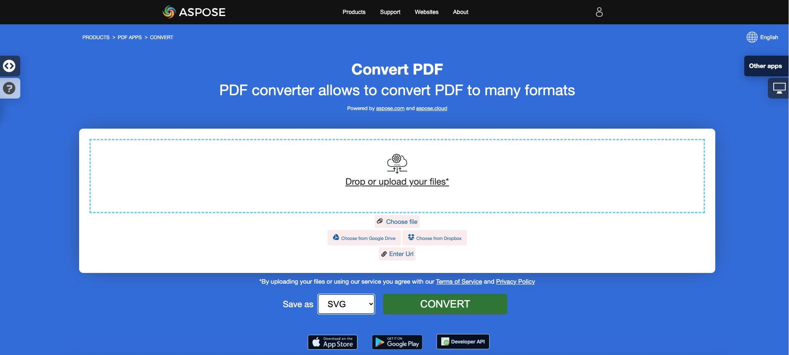

<script type="application/ld+json">
{
    "@context": "https://schema.org",
    "@type": "TechArticle",
    "headline": "Convert PDF to Different Image Formats in C#",
    "alternativeHeadline": "Convert PDF Files to Multiple Image Formats in C#",
    "abstract": "Aspose.PDF for .NET의 기능은 사용자가 PDF 파일을 TIFF, BMP, EMF, JPEG, PNG, GIF 및 SVG와 같은 여러 이미지 형식으로 원활하게 변환할 수 있도록 합니다. 이 기능은 몇 줄의 C# 코드로 변환을 가능하게 하여 문서 처리를 간소화하며, 다재다능한 PDF 처리 기능으로 애플리케이션을 향상시키려는 개발자에게 필수 도구가 됩니다.",
    "author": {
        "@type": "Person",
        "name": "Anastasiia Holub",
        "givenName": "Anastasiia",
        "familyName": "Holub",
        "url": "https://www.linkedin.com/in/anastasiia-holub-750430225/"
    },
    "genre": "pdf document generation",
    "wordcount": "1879",
    "proficiencyLevel": "Beginner",
    "publisher": {
        "@type": "Organization",
        "name": "Aspose.PDF for .NET",
        "url": "https://products.aspose.com/pdf",
        "logo": "https://www.aspose.cloud/templates/aspose/img/products/pdf/aspose_pdf-for-net.svg",
        "alternateName": "Aspose",
        "sameAs": [
            "https://facebook.com/aspose.pdf/",
            "https://twitter.com/asposepdf",
            "https://www.youtube.com/channel/UCmV9sEg_QWYPi6BJJs7ELOg/featured",
            "https://www.linkedin.com/company/aspose",
            "https://stackoverflow.com/questions/tagged/aspose",
            "https://aspose.quora.com/",
            "https://aspose.github.io/"
        ],
        "contactPoint": [
            {
                "@type": "ContactPoint",
                "telephone": "+1 903 306 1676",
                "contactType": "sales",
                "areaServed": "US",
                "availableLanguage": "en"
            },
            {
                "@type": "ContactPoint",
                "telephone": "+44 141 628 8900",
                "contactType": "sales",
                "areaServed": "GB",
                "availableLanguage": "en"
            },
            {
                "@type": "ContactPoint",
                "telephone": "+61 2 8006 6987",
                "contactType": "sales",
                "areaServed": "AU",
                "availableLanguage": "en"
            }
        ]
    },
    "url": "/net/convert-pdf-to-images-format/",
    "mainEntityOfPage": {
        "@type": "WebPage",
        "@id": "/net/convert-pdf-to-images-format/"
    },
    "dateModified": "2025-04-08",
    "description": "Aspose.PDF는 간단하고 쉬운 작업뿐만 아니라 더 복잡한 목표도 처리할 수 있습니다. 고급 사용자 및 개발자를 위한 다음 섹션을 확인하십시오."
}
</script>

## 개요

이 문서에서는 C#을 사용하여 PDF를 다양한 이미지 형식으로 변환하는 방법을 설명합니다. 다음 주제를 다룹니다.

_이미지 형식_: **TIFF**
- [C# PDF를 TIFF로 변환하기](#csharp-pdf-to-tiff)
- [C# PDF를 TIFF로 변환하기](#csharp-pdf-to-tiff)
- [C# PDF의 단일 또는 특정 페이지를 TIFF로 변환하기](#csharp-pdf-to-tiff-pages)

_이미지 형식_: **BMP**
- [C# PDF를 BMP로 변환하기](#csharp-pdf-to-bmp)
- [C# PDF를 BMP로 변환하기](#csharp-pdf-to-bmp)
- [C# PDF를 BMP로 변환하는 도구](#csharp-pdf-to-bmp)

_이미지 형식_: **EMF**
- [C# PDF를 EMF로 변환하기](#csharp-pdf-to-emf)
- [C# PDF를 EMF로 변환하기](#csharp-pdf-to-emf)
- [C# PDF를 EMF로 변환하는 도구](#csharp-pdf-to-emf)

_이미지 형식_: **JPG**
- [C# PDF를 JPG로 변환하기](#csharp-pdf-to-jpg)
- [C# PDF를 JPG로 변환하기](#csharp-pdf-to-jpg)
- [C# PDF를 JPG로 변환하는 도구](#csharp-pdf-to-jpg)

_이미지 형식_: **PNG**
- [C# PDF를 PNG로 변환하기](#csharp-pdf-to-png)
- [C# PDF를 PNG로 변환하기](#csharp-pdf-to-png)
- [C# PDF를 PNG로 변환하는 도구](#csharp-pdf-to-png)

_이미지 형식_: **GIF**
- [C# PDF를 GIF로 변환하기](#csharp-pdf-to-gif)
- [C# PDF를 GIF로 변환하기](#csharp-pdf-to-gif)
- [C# PDF를 GIF로 변환하는 도구](#csharp-pdf-to-gif)

_이미지 형식_: **SVG**
- [C# PDF를 SVG로 변환하기](#csharp-pdf-to-svg)
- [C# PDF를 SVG로 변환하기](#csharp-pdf-to-svg)
- [C# PDF를 SVG로 변환하는 도구](#csharp-pdf-to-svg)

## C# PDF를 이미지로 변환하기

다음 코드 스니펫은 [Aspose.PDF.Drawing](/pdf/ko/net/drawing/) 라이브러리와 함께 작동합니다.

**Aspose.PDF for .NET**는 PDF를 이미지로 변환하는 여러 접근 방식을 사용합니다. 일반적으로 우리는 장치 접근 방식을 사용한 변환과 SaveOption을 사용한 변환의 두 가지 접근 방식을 사용합니다. 이 섹션에서는 BMP, JPEG, GIF, PNG, EMF, TIFF 및 SVG 형식과 같은 이미지 형식으로 PDF 문서를 변환하는 방법을 보여줍니다.

라이브러리에는 이미지를 변환하기 위해 가상 장치를 사용할 수 있는 여러 클래스가 있습니다. DocumentDevice는 전체 문서 변환을 위해 설계되었지만 ImageDevice는 특정 페이지를 위해 설계되었습니다.

## DocumentDevice 클래스를 사용하여 PDF 변환하기

**Aspose.PDF for .NET**는 PDF 페이지를 TIFF 이미지로 변환할 수 있게 합니다.

TiffDevice(문서 장치 기반) 클래스는 PDF 페이지를 TIFF 이미지로 변환할 수 있게 해줍니다. 이 클래스는 PDF 파일의 모든 페이지를 단일 TIFF 이미지로 변환할 수 있는 `Process`라는 메서드를 제공합니다.

{}
**PDF를 TIFF로 온라인 변환해 보세요**

Aspose.PDF for .NET는 기능과 품질을 조사할 수 있는 온라인 무료 애플리케이션 ["PDF to TIFF"](https://products.aspose.app/pdf/conversion/pdf-to-tiff)를 제공합니다.

[](https://products.aspose.app/pdf/conversion/pdf-to-tiff)
{}

### PDF 페이지를 하나의 TIFF 이미지로 변환하기

Aspose.PDF for .NET는 PDF 파일의 모든 페이지를 단일 TIFF 이미지로 변환하는 방법을 설명합니다:

<a name="csharp-pdf-to-tiff"><strong>단계: C#에서 PDF를 TIFF로 변환하기</strong></a>

1. **Document** 클래스의 객체를 생성합니다.
2. **TiffSettings** 및 **TiffDevice** 객체를 생성합니다.
3. PDF 문서를 TIFF로 변환하기 위해 **TiffDevice.Process()** 메서드를 호출합니다.
4. 출력 파일의 속성을 설정하기 위해 **TiffSettings** 클래스를 사용합니다.

다음 코드 스니펫은 모든 PDF 페이지를 단일 TIFF 이미지로 변환하는 방법을 보여줍니다.

```csharp
public static void ConvertPDFtoTIFF()
{
    // Open document
    Document document = new Document(dataDir + "PageToTIFF.pdf");

    // Create Resolution object
    Resolution resolution = new Resolution(300);

    // Create TiffSettings object
    TiffSettings tiffSettings = new TiffSettings
    {
        Compression = CompressionType.None,
        Depth = ColorDepth.Default,
        Shape = ShapeType.Landscape,
        SkipBlankPages = false
    };

    // Create TIFF device
    TiffDevice tiffDevice = new TiffDevice(resolution, tiffSettings);

    // Convert a particular page and save the image to stream
    tiffDevice.Process(document, dataDir + "AllPagesToTIFF_out.tif");
}
```

### 한 페이지를 TIFF 이미지로 변환하기

Aspose.PDF for .NET는 PDF 파일의 특정 페이지를 TIFF 이미지로 변환할 수 있도록, 변환을 위한 페이지 번호를 인수로 받는 Process(..) 메서드의 오버로드 버전을 사용합니다. 다음 코드 스니펫은 PDF의 첫 페이지를 TIFF 형식으로 변환하는 방법을 보여줍니다.

<a name="csharp-pdf-to-tiff-pages"><strong>단계: C#에서 PDF의 단일 또는 특정 페이지를 TIFF로 변환하기</strong></a>

1. **Document** 클래스의 객체를 생성합니다.
2. **TiffSettings** 및 **TiffDevice** 객체를 생성합니다.
3. PDF 문서 페이지를 TIFF로 변환하기 위해 **fromPage** 및 **toPage** 매개변수를 사용하여 오버로드된 **TiffDevice.Process()** 메서드를 호출합니다.

```csharp
public static void ConvertPDFtoTiffSinglePage()
{
    // Open document
    Document document = new Document(dataDir + "PageToTIFF.pdf");

    // Create Resolution object
    Resolution resolution = new Resolution(300);

    // Create TiffSettings object
    TiffSettings tiffSettings = new TiffSettings
    {
        Compression = CompressionType.None,
        Depth = ColorDepth.Default,
        Shape = ShapeType.Landscape,
    };

    // Create TIFF device
    TiffDevice tiffDevice = new TiffDevice(resolution, tiffSettings);

    // Convert a particular page and save the image to stream
    tiffDevice.Process(document, 1, 1, dataDir + "PageToTIFF_out.tif");
}
```

### 변환 중 Bradley 알고리즘 사용하기

Aspose.PDF for .NET는 LZW 압축을 사용하여 PDF를 TIF로 변환하는 기능을 지원하며, AForge를 사용하여 이진화를 적용할 수 있습니다. 그러나 한 고객이 특정 이미지에 대해 Otsu를 사용하여 임계값을 얻어야 하며, Bradley를 사용하고 싶다고 요청했습니다.

```csharp
public static void ConvertPDFtoTiffBradleyBinarization()
{
    // Open document
    Document document = new Document(dataDir + "PageToTIFF.pdf");

    string outputImageFile = dataDir + "resultant_out.tif";
    string outputBinImageFile = dataDir + "37116-bin_out.tif";

    // Create Resolution object
    Resolution resolution = new Resolution(300);
    // Create TiffSettings object
    TiffSettings tiffSettings = new TiffSettings
    {
        Compression = CompressionType.LZW,
        Depth = Aspose.Pdf.Devices.ColorDepth.Format1bpp
    };
    // Create TIFF device
    TiffDevice tiffDevice = new TiffDevice(resolution, tiffSettings);
    // Convert a particular page and save the image to stream
    tiffDevice.Process(document, outputImageFile);

    using (FileStream inStream = new FileStream(outputImageFile, FileMode.Open))
    {
        using (FileStream outStream = new FileStream(outputBinImageFile, FileMode.Create))
        {
            tiffDevice.BinarizeBradley(inStream, outStream, 0.1);
        }
    }
} 
```

## ImageDevice 클래스를 사용하여 PDF 변환하기

`ImageDevice`는 `BmpDevice`, `JpegDevice`, `GifDevice`, `PngDevice` 및 `EmfDevice`의 조상입니다.

- [BmpDevice](https://reference.aspose.com/pdf/ko/net/aspose.pdf.devices/bmpdevice) 클래스는 PDF 페이지를 <abbr title="Bitmap Image File">BMP</abbr> 이미지로 변환할 수 있게 해줍니다.
- [EmfDevice](https://reference.aspose.com/pdf/ko/net/aspose.pdf.devices/emfdevice) 클래스는 PDF 페이지를 <abbr title="Enhanced Meta File">EMF</abbr> 이미지로 변환할 수 있게 해줍니다.
- [JpegDevice](https://reference.aspose.com/pdf/ko/net/aspose.pdf.devices/jpegdevice) 클래스는 PDF 페이지를 JPEG 이미지로 변환할 수 있게 해줍니다.
- [PngDevice](https://reference.aspose.com/pdf/ko/net/aspose.pdf.devices/pngdevice) 클래스는 PDF 페이지를 <abbr title="Portable Network Graphics">PNG</abbr> 이미지로 변환할 수 있게 해줍니다.
- [GifDevice](https://reference.aspose.com/pdf/ko/net/aspose.pdf.devices/gifdevice) 클래스는 PDF 페이지를 <abbr title="Graphics Interchange Format">GIF</abbr> 이미지로 변환할 수 있게 해줍니다.

PDF 페이지를 이미지로 변환하는 방법을 살펴보겠습니다.

`BmpDevice` 클래스는 PDF 파일의 특정 페이지를 BMP 이미지 형식으로 변환할 수 있는 [Process](https://reference.aspose.com/pdf/ko/net/aspose.pdf.devices/bmpdevice/methods/process)라는 메서드를 제공합니다. 다른 클래스들도 동일한 메서드를 가지고 있습니다. 따라서 PDF 페이지를 이미지로 변환해야 할 경우, 필요한 클래스를 인스턴스화하면 됩니다.

<a name="csharp-pdf-to-bmp"></a>
<a name="csharp-pdf-to-emf"></a>
<a name="csharp-pdf-to-jpg"></a>
<a name="csharp-pdf-to-png"></a>
<a name="csharp-pdf-to-gif"></a>

다음 단계와 C# 코드 스니펫은 이 가능성을 보여줍니다.

 - [C#에서 PDF를 BMP로 변환하기](#csharp-pdf-to-image)
 - [C#에서 PDF를 EMF로 변환하기](#csharp-pdf-to-image)
 - [C#에서 PDF를 JPG로 변환하기](#csharp-pdf-to-image)
 - [C#에서 PDF를 PNG로 변환하기](#csharp-pdf-to-image)
 - [C#에서 PDF를 GIF로 변환하기](#csharp-pdf-to-image)

<a name="csharp-pdf-to-image"><strong>단계: PDF를 이미지로 변환하기 (BMP, EMF, JPG, PNG, GIF) C#에서</strong></a>

1. **Document** 클래스를 사용하여 PDF 파일을 로드합니다.
2. **ImageDevice**의 하위 클래스 인스턴스를 생성합니다.
   * **BmpDevice** (PDF를 BMP로 변환하기 위해).
   * **EmfDevice** (PDF를 Emf로 변환하기 위해).
   * **JpegDevice** (PDF를 JPG로 변환하기 위해).
   * **PngDevice** (PDF를 PNG로 변환하기 위해).
   * **GifDevice** (PDF를 GIF로 변환하기 위해).
3. PDF를 이미지로 변환하기 위해 **ImageDevice.Process()** 메서드를 호출합니다.

```csharp
public static class ExampleConvertPdfToImage
{
     private static readonly string dataDir = @"C:\Samples\";
    // BMP, JPEG, GIF, PNG, EMF
    public static void ConvertPDFusingImageDevice()
    {
        // Create Resolution object            
        Resolution resolution = new Resolution(300);
        BmpDevice bmpDevice = new BmpDevice(resolution);
        JpegDevice jpegDevice = new JpegDevice(resolution);
        GifDevice gifDevice = new GifDevice(resolution);
        PngDevice pngDevice = new PngDevice(resolution);
        EmfDevice emfDevice = new EmfDevice(resolution);

        Document document = new Document(dataDir + 
            "ConvertAllPagesToBmp.pdf");
            
        ConvertPDFtoImage(bmpDevice, "bmp", document);
        ConvertPDFtoImage(jpegDevice,"jpeg", document);
        ConvertPDFtoImage(gifDevice, "gif", document);
        ConvertPDFtoImage(pngDevice, "png", document);
        ConvertPDFtoImage(emfDevice, "emf", document);
            
    }
}

public static void ConvertPDFtoImage(ImageDevice imageDevice, 
        string ext, Document document)
{
    for (int pageCount = 1; pageCount <= document.Pages.Count; pageCount++)
    {
        using (FileStream imageStream = 
            new FileStream($"{dataDir}image{pageCount}_out.{ext}", 
            FileMode.Create))
        {
            // Convert a particular page and save the image to stream
            imageDevice.Process(document.Pages[pageCount], imageStream);
        }
    }
}
```

### 투명 배경으로 PDF를 이미지로 변환하기

PDF 페이지는 흰색 대신 투명 배경을 가진 PNG 이미지로 변환할 수 있습니다.



```csharp
// For complete examples and data files, visit https://github.com/aspose-pdf/Aspose.PDF-for-.NET
private static void ConvertPDFtoImageWithTransparentBackground()
{
    // The path to the documents directory
    var dataDir = RunExamples.GetDataDir_AsposePdf_WorkingDocuments();

    // Open PDF document
    using (var document = new Aspose.Pdf.Document(dataDir + "ConvertPDFtoImageWithTransparentBackground.pdf"))
    {
        var pngDevice = new Aspose.Pdf.Devices.PngDevice();
        pngDevice.TransparentBackground = true;
        using (var pngStream = new FileStream(dataDir + "ConvertPDFtoImageWithTransparentBackground.png", FileMode.Create))
        {
            // Convert page to PNG image
            pngDevice.Process(document.Pages[1], pngStream);
        }
    }
}
```



```csharp
// For complete examples and data files, visit https://github.com/aspose-pdf/Aspose.PDF-for-.NET
private static void ConvertPDFtoImageWithTransparentBackground()
{
    // The path to the documents directory
    var dataDir = RunExamples.GetDataDir_AsposePdf_WorkingDocuments();

    // Open PDF document
    using var document = new Aspose.Pdf.Document(dataDir + "ConvertPDFtoImageWithTransparentBackground.pdf");
    var pngDevice = new Aspose.Pdf.Devices.PngDevice()
    {
        TransparentBackground = true
    };
    using var pngStream = new FileStream(dataDir + "ConvertPDFtoImageWithTransparentBackground.png", FileMode.Create);
    // Convert page to PNG image
    pngDevice.Process(document.Pages[1], pngStream);
}
```



{}
**PDF를 PNG로 온라인 변환해 보세요**

우리의 무료 애플리케이션이 어떻게 작동하는지에 대한 예로 다음 기능을 확인해 보세요.

Aspose.PDF for .NET는 기능과 품질을 조사할 수 있는 온라인 무료 애플리케이션 ["PDF to PNG"](https://products.aspose.app/pdf/conversion/pdf-to-png)를 제공합니다.

[](https://products.aspose.app/pdf/conversion/pdf-to-png)
{}

## SaveOptions 클래스를 사용하여 PDF 변환하기

이 문서의 이 부분에서는 C# 및 SaveOptions 클래스를 사용하여 PDF를 <abbr title="Scalable Vector Graphics">SVG</abbr>로 변환하는 방법을 보여줍니다.

{}
**PDF를 SVG로 온라인 변환해 보세요**

Aspose.PDF for .NET는 기능과 품질을 조사할 수 있는 온라인 무료 애플리케이션 ["PDF to SVG"](https://products.aspose.app/pdf/conversion/pdf-to-svg)를 제공합니다.

[](https://products.aspose.app/pdf/conversion/pdf-to-svg)
{}

**확장 가능한 벡터 그래픽(SVG)**는 정적 및 동적(대화형 또는 애니메이션) 2차원 벡터 그래픽을 위한 XML 기반 파일 형식의 사양 모음입니다. SVG 사양은 1999년부터 월드 와이드 웹 컨소시엄(W3C)에 의해 개발되고 있는 개방형 표준입니다.

SVG 이미지와 그 동작은 XML 텍스트 파일로 정의됩니다. 이는 검색, 인덱싱, 스크립팅이 가능하며 필요할 경우 압축할 수 있음을 의미합니다. XML 파일로서 SVG 이미지는 모든 텍스트 편집기로 생성 및 편집할 수 있지만, Inkscape와 같은 드로잉 프로그램을 사용하여 생성하는 것이 더 편리합니다.

Aspose.PDF for .NET는 SVG 이미지를 PDF 형식으로 변환하는 기능을 지원하며, PDF 파일을 SVG 형식으로 변환하는 기능도 제공합니다. 이 요구 사항을 충족하기 위해 [`SvgSaveOptions`](https://reference.aspose.com/pdf/ko/net/aspose.pdf/svgsaveoptions/methods/index) 클래스가 Aspose.PDF 네임스페이스에 도입되었습니다. SvgSaveOptions의 객체를 인스턴스화하고 이를 [`Document.Save(..)`](https://reference.aspose.com/pdf/ko/net/aspose.pdf/document/methods/save/index) 메서드의 두 번째 인수로 전달합니다.

다음 코드 스니펫은 .NET을 사용하여 PDF 파일을 SVG 형식으로 변환하는 단계를 보여줍니다.

<a name="csharp-pdf-to-svg"><strong>단계: C#에서 PDF를 SVG로 변환하기</strong></a>

1. **Document** 클래스의 객체를 생성합니다.
2. 필요한 설정으로 **SvgSaveOptions** 객체를 생성합니다.
3. **Document.Save()** 메서드를 호출하고 **SvgSaveOptions** 객체를 전달하여 PDF 문서를 SVG로 변환합니다.

```csharp
public static void ConvertPDFtoSVG()
{
    // Load PDF document
    Document document = new Document(dataDir + "input.pdf");
    // Instantiate an object of SvgSaveOptions
    SvgSaveOptions saveOptions = new SvgSaveOptions
    {
        // Do not compress SVG image to Zip archive
        CompressOutputToZipArchive = false,
        TreatTargetFileNameAsDirectory = true                
    };
            
    // Save the output in SVG files
    document.Save(dataDir + "PDFToSVG_out.svg", saveOptions);
}
```