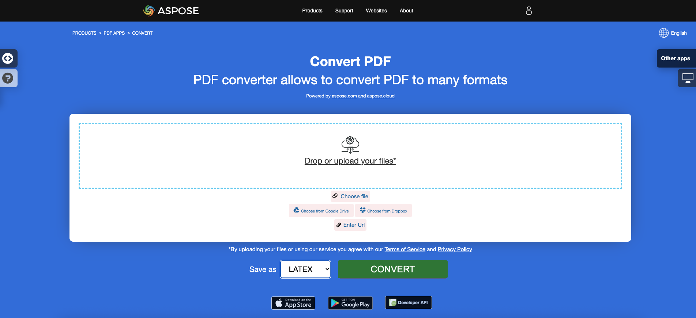

<script type="application/ld+json">
{
    "@context": "https://schema.org",
    "@type": "TechArticle",
    "headline": "Convert PDF to EPUB, LaTeX, Text, XPS in C#",
    "alternativeHeadline": "Add PDF format conversion to EPUB, LaTeX, Text, XPS in C#",
    "abstract": "Aspose.PDF for .NET는 PDF 파일을 EPUB, LaTeX, 텍스트, XPS 및 Markdown을 포함한 다양한 형식으로 원활하게 변환할 수 있는 강력한 기능을 소개합니다. 이 기능은 개발자가 C# 애플리케이션에 다양한 파일 형식 변환을 손쉽게 통합할 수 있도록 하여 더 넓은 청중을 수용하고 다양한 플랫폼에 맞게 콘텐츠를 최적화함으로써 문서 접근성과 사용성을 향상시킵니다.",
    "author": {
        "@type": "Person",
        "name": "Anastasiia Holub",
        "givenName": "Anastasiia",
        "familyName": "Holub",
        "url": "https://www.linkedin.com/in/anastasiia-holub-750430225/"
    },
    "genre": "pdf document generation",
    "wordcount": "1419",
    "proficiencyLevel": "Beginner",
    "publisher": {
        "@type": "Organization",
        "name": "Aspose.PDF for .NET",
        "url": "https://products.aspose.com/pdf",
        "logo": "https://www.aspose.cloud/templates/aspose/img/products/pdf/aspose_pdf-for-net.svg",
        "alternateName": "Aspose",
        "sameAs": [
            "https://facebook.com/aspose.pdf/",
            "https://twitter.com/asposepdf",
            "https://www.youtube.com/channel/UCmV9sEg_QWYPi6BJJs7ELOg/featured",
            "https://www.linkedin.com/company/aspose",
            "https://stackoverflow.com/questions/tagged/aspose",
            "https://aspose.quora.com/",
            "https://aspose.github.io/"
        ],
        "contactPoint": [
            {
                "@type": "ContactPoint",
                "telephone": "+1 903 306 1676",
                "contactType": "sales",
                "areaServed": "US",
                "availableLanguage": "en"
            },
            {
                "@type": "ContactPoint",
                "telephone": "+44 141 628 8900",
                "contactType": "sales",
                "areaServed": "GB",
                "availableLanguage": "en"
            },
            {
                "@type": "ContactPoint",
                "telephone": "+61 2 8006 6987",
                "contactType": "sales",
                "areaServed": "AU",
                "availableLanguage": "en"
            }
        ]
    },
    "url": "/net/convert-pdf-to-other-files/",
    "mainEntityOfPage": {
        "@type": "WebPage",
        "@id": "/net/convert-pdf-to-other-files/"
    },
    "dateModified": "2024-11-25",
    "description": "Aspose.PDF는 간단하고 쉬운 작업뿐만 아니라 더 복잡한 목표도 처리할 수 있습니다. 고급 사용자 및 개발자를 위한 다음 섹션을 확인하십시오."
}
</script>

## PDF를 EPUB로 변환

{}
**PDF를 EPUB로 온라인 변환해 보세요**

Aspose.PDF for .NET는 온라인 무료 애플리케이션 ["PDF to EPUB"](https://products.aspose.app/pdf/conversion/pdf-to-epub)를 제공하여 기능과 품질을 조사해 볼 수 있습니다.

[](https://products.aspose.app/pdf/conversion/pdf-to-epub)
{}

**<abbr title="전자 출판">EPUB</abbr>**는 국제 디지털 출판 포럼(IDPF)에서 제공하는 무료 오픈 전자책 표준입니다. 파일 확장자는 .epub입니다.
EPUB는 재흐름 가능한 콘텐츠를 위해 설계되었으며, 이는 EPUB 리더가 특정 디스플레이 장치에 맞게 텍스트를 최적화할 수 있음을 의미합니다. EPUB는 고정 레이아웃 콘텐츠도 지원합니다. 이 형식은 출판사와 변환 회사가 내부적으로 사용할 수 있는 단일 형식으로 의도되었으며, 배포 및 판매에도 사용됩니다. 이는 Open eBook 표준을 대체합니다.

다음 코드 스니펫은 [Aspose.PDF.Drawing](/pdf/ko/net/drawing/) 라이브러리와 함께 작동합니다.

Aspose.PDF for .NET는 PDF 문서를 EPUB 형식으로 변환하는 기능도 지원합니다. Aspose.PDF for .NET에는 EPUB 파일을 생성하기 위해 [`Document.Save(..)`](https://reference.aspose.com/pdf/net/aspose.pdf/document/methods/save/index) 메서드의 두 번째 인수로 사용할 수 있는 EpubSaveOptions라는 클래스가 있습니다.
다음 코드 스니펫을 사용하여 C#으로 이 요구 사항을 달성해 보세요.

```csharp
// For complete examples and data files, visit https://github.com/aspose-pdf/Aspose.PDF-for-.NET
private static void ConvertPDFtoEPUB()
{
    // The path to the documents directory
    var dataDir = RunExamples.GetDataDir_AsposePdf_DocumentConversion();

    // Open PDF document
    using (var document = new Aspose.Pdf.Document(dataDir + "PDFToEPUB.pdf"))
    {
        // Instantiate Epub Save options
        EpubSaveOptions options = new EpubSaveOptions();
        // Specify the layout for contents
        options.ContentRecognitionMode = EpubSaveOptions.RecognitionMode.Flow;

        // Save ePUB document
        document.Save(dataDir + "PDFToEPUB_out.epub", options);
    }
}
```

## PDF를 LaTeX/TeX로 변환

**Aspose.PDF for .NET**는 PDF를 LaTeX/TeX로 변환하는 것을 지원합니다.
LaTeX 파일 형식은 특별한 마크업이 있는 텍스트 파일 형식으로, 고품질 조판을 위한 TeX 기반 문서 준비 시스템에서 사용됩니다.

{}
**PDF를 LaTeX/TeX로 온라인 변환해 보세요**

Aspose.PDF for .NET는 온라인 무료 애플리케이션 ["PDF to LaTeX"](https://products.aspose.app/pdf/conversion/pdf-to-tex)를 제공하여 기능과 품질을 조사해 볼 수 있습니다.

[](https://products.aspose.app/pdf/conversion/pdf-to-tex)
{}

PDF 파일을 TeX로 변환하기 위해 Aspose.PDF는 변환 과정에서 임시 이미지를 저장하기 위한 OutDirectoryPath 속성을 제공하는 [LaTeXSaveOptions](https://reference.aspose.com/pdf/net/aspose.pdf/latexsaveoptions) 클래스를 가지고 있습니다.

다음 코드 스니펫은 C#으로 PDF 파일을 TEX 형식으로 변환하는 과정을 보여줍니다.

```csharp
// For complete examples and data files, visit https://github.com/aspose-pdf/Aspose.PDF-for-.NET
private static void ConvertPDFtoTeX()
{
    // The path to the documents directory
    var dataDir = RunExamples.GetDataDir_AsposePdf_DocumentConversion();

    // Open PDF document
    using (var document = new Aspose.Pdf.Document(dataDir + "PDFToTeX.pdf"))
    {
        // Instantiate LaTex save option          
        LaTeXSaveOptions saveOptions = new LaTeXSaveOptions();

        // Specify the output directory
        string pathToOutputDirectory = dataDir;

        // Set the output directory path for save option object
        saveOptions.OutDirectoryPath = pathToOutputDirectory;

        // Save PDF document into LaTex format           
        document.Save(dataDir + "PDFToTeX_out.tex", saveOptions);
    }
}
```

## PDF를 텍스트로 변환

**Aspose.PDF for .NET**는 전체 PDF 문서와 단일 페이지를 텍스트 파일로 변환하는 것을 지원합니다.

### 전체 PDF 문서를 텍스트 파일로 변환

[TextAbsorber](https://reference.aspose.com/pdf/net/aspose.pdf.text/textabsorber) 클래스의 [Visit](https://reference.aspose.com/pdf/net/aspose.pdf.text/textabsorber/methods/visit/index) 메서드를 사용하여 PDF 문서를 TXT 파일로 변환할 수 있습니다.

다음 코드 스니펫은 모든 페이지에서 텍스트를 추출하는 방법을 설명합니다.

```csharp
// For complete examples and data files, visit https://github.com/aspose-pdf/Aspose.PDF-for-.NET
private static void ConvertPDFtoTXT()
{
    // The path to the documents directory
    var dataDir = RunExamples.GetDataDir_AsposePdf_DocumentConversion();

    // Open PDF document
    using (var document = new Aspose.Pdf.Document(dataDir + "demo.pdf"))
    {
        var ta = new Aspose.Pdf.Text.TextAbsorber();
        ta.Visit(document);

        // Save the extracted text in text file
        File.WriteAllText(dataDir + "input_Text_Extracted_out.txt",ta.Text);
    }
}
```

{}
**PDF를 텍스트로 온라인 변환해 보세요**

Aspose.PDF for .NET는 온라인 무료 애플리케이션 ["PDF to Text"](https://products.aspose.app/pdf/conversion/pdf-to-txt)를 제공하여 기능과 품질을 조사해 볼 수 있습니다.

[](https://products.aspose.app/pdf/conversion/pdf-to-txt)
{}

### PDF 페이지를 텍스트 파일로 변환

Aspose.PDF for .NET를 사용하여 PDF 문서를 TXT 파일로 변환할 수 있습니다. 이 작업을 해결하기 위해 `TextAbsorber` 클래스의 `Visit` 메서드를 사용해야 합니다.

다음 코드 스니펫은 특정 페이지에서 텍스트를 추출하는 방법을 설명합니다.

```csharp
// For complete examples and data files, visit https://github.com/aspose-pdf/Aspose.PDF-for-.NET
private static void ConvertPDFtoTXT()
{
    // The path to the documents directory
    var dataDir = RunExamples.GetDataDir_AsposePdf_DocumentConversion();

    // Open PDF document
    using (var document = new Aspose.Pdf.Document(dataDir + "demo.pdf"))
    {
        var ta = new Aspose.Pdf.Text.TextAbsorber();
        var pages = new [] {1, 3, 4};
        foreach (var page in pages)
        {
            ta.Visit(document.Pages[page]);
        }
    
        // Save the extracted text in text file
        File.WriteAllText(dataDir + "input_Text_Extracted_out.txt", ta.Text);
    }
}
```

## PDF를 XPS로 변환

**Aspose.PDF for .NET**는 PDF 파일을 <abbr title="XML Paper Specification">XPS</abbr> 형식으로 변환할 수 있는 기능을 제공합니다. C#으로 PDF 파일을 XPS 형식으로 변환하기 위해 제공된 코드 스니펫을 사용해 보세요.

{}
**PDF를 XPS로 온라인 변환해 보세요**

Aspose.PDF for .NET는 온라인 무료 애플리케이션 ["PDF to XPS"](https://products.aspose.app/pdf/conversion/pdf-to-xps)를 제공하여 기능과 품질을 조사해 볼 수 있습니다.

[](https://products.aspose.app/pdf/conversion/pdf-to-xps)
{}

XPS 파일 형식은 주로 Microsoft Corporation의 XML Paper Specification과 관련이 있습니다. XML Paper Specification(XPS)은 이전에 Metro라는 코드명을 가지고 있었으며, 차세대 인쇄 경로(NGPP) 마케팅 개념을 포함하는 Microsoft의 문서 생성 및 보기 통합 이니셔티브입니다.

PDF 파일을 XPS로 변환하기 위해 Aspose.PDF는 [XpsSaveOptions](https://reference.aspose.com/net/pdf/aspose.pdf/xpssaveoptions) 클래스를 가지고 있으며, 이는 XPS 파일을 생성하기 위해 [Document.Save(..)](https://reference.aspose.com/pdf/net/aspose.pdf/document/methods/save/index) 메서드의 두 번째 인수로 사용됩니다.

24.2 릴리스 이후, Aspose.PDF는 결과 XPS에서 텍스트 선택 가능성을 유지하면서 검색 가능한 PDF를 XPS로 변환하는 기능을 구현했습니다. 텍스트를 보존하려면 XpsSaveOptions.SaveTransparentTexts 속성을 true로 설정해야 합니다.

다음 코드 스니펫은 PDF 파일을 XPS 형식으로 변환하는 과정을 보여줍니다.

```csharp
// For complete examples and data files, visit https://github.com/aspose-pdf/Aspose.PDF-for-.NET
private static void ConvertPDFtoXPS()
{
    // The path to the documents directory
    var dataDir = RunExamples.GetDataDir_AsposePdf_DocumentConversion();

    using (var document = new Aspose.Pdf.Document(dataDir + "demo.pdf"))
    {
        var xpsOptions = new XpsSaveOptions
        {
            SaveTransparentTexts = true
        };

        // Save XPS document
        document.Save(dataDir + "PDFtoXPS_out.xps", xpsOptions);
    }
}
```

## PDF를 Markdown으로 변환

**Aspose.PDF for .NET**는 PDF 파일을 <abbr title="Markdown">MD</abbr> 형식으로 변환할 수 있는 기능을 제공합니다. C#으로 PDF 파일을 MD 형식으로 변환하기 위해 제공된 코드 스니펫을 사용해 보세요.

Markdown은 최대한 인간 가독성과 기계 가독성을 갖춘 일반 텍스트 형식을 표현하기 위해 설계된 경량 마크업 언어입니다.

### PDF에서 Markdown 변환기를 통한 이미지 사용 최적화

이미지가 있는 디렉토리에서 이미지 수가 PDF 파일의 이미지 수보다 적다는 것을 알 수 있습니다.

Markdown 파일은 이미지 크기를 설정할 수 없기 때문에, MarkdownSaveOptions.UseImageHtmlTag 옵션 없이 동일한 종류의 이미지가 서로 다른 크기로 저장됩니다.

MarkdownSaveOptions.UseImageHtmlTag 옵션을 활성화하면 문서에서 img 태그로 크기가 조정된 고유한 이미지를 저장합니다.

코드는 PDF 문서를 열고 Markdown 파일로 변환하기 위한 매개변수를 구성하며(모든 이미지를 "images"라는 폴더에 저장), 지정된 출력 경로에 결과 Markdown 파일을 저장합니다.

다음 코드 스니펫은 PDF 파일을 MD 형식으로 변환하는 과정을 보여줍니다.

```csharp
// For complete examples and data files, visit https://github.com/aspose-pdf/Aspose.PDF-for-.NET
private static void ConvertPDFtoMarkup()
{
    // The path to the documents directory
    var dataDir = RunExamples.GetDataDir_AsposePdf_DocumentConversion();

    // Open PDF document
    using (var document = new Aspose.Pdf.Document(dataDir + "demo.pdf"))
    {
        // Create an instance of MarkdownSaveOptions to configure the Markdown export settings
        var saveOptions = new MarkdownSaveOptions()
        {
            // Set to false to prevent the use of HTML  tags for images in the Markdown output
            UseImageHtmlTag = false
        }
        
        // Specify the directory name where resources (like images) will be stored
        saveOptions.ResourcesDirectoryName = "images";

        // Save PDF document in Markdown format to the specified output file path using the defined save options   
        document.Save(dataDir + "PDFtoMarkup_out.md", saveOptions);
    }
}
```

### PDF를 MobiXml로 변환

MobiXML은 모바일 플랫폼에서 사용하기 위해 설계된 인기 있는 전자책 형식입니다.
다음 코드 스니펫은 PDF 문서를 MobiXML 파일로 변환하는 방법을 설명합니다.
```csharp
// For complete examples and data files, visit https://github.com/aspose-pdf/Aspose.PDF-for-.NET      
private static void ConvertPdfToMobiXml()
{
    // The path to the documents directory
    var dataDir = RunExamples.GetDataDir_AsposePdf_DocumentConversion();

    // Open PDF document
    using (var document = new Aspose.Pdf.Document(dataDir + "PDFToXML.pdf"))
    {
        // Save PDF document in XML format
        document.Save(dataDir + "PDFToXML_out.xml", Aspose.Pdf.SaveFormat.MobiXml);
    }
}
```