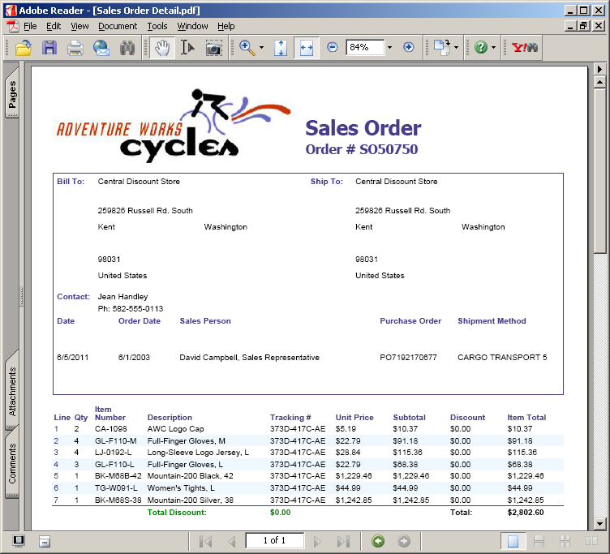
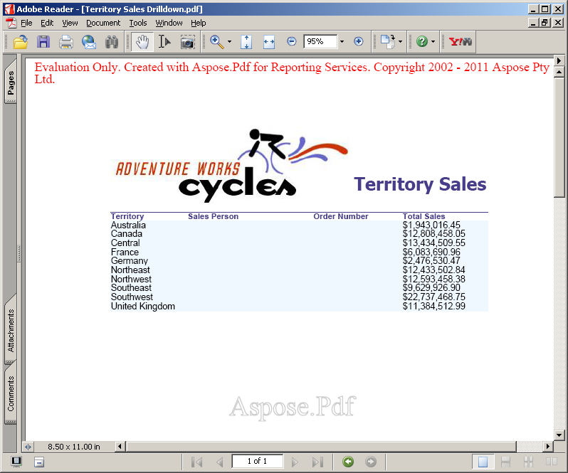

**Aspose.Pdf for Reporting Services** 평가 버전은 라이선스 버전과 동일한 기능을 제공하지만, 평가 버전을 사용할 때 결과 PDF에 평가 워터마크가 표시됩니다. 웹사이트를 방문하여 제품 버전을 다운로드하고 전체 기능을 갖춘 평가 모드에서 제품을 탐색해 보세요.

평가 결과에 만족하시면, [라이선스를 구매하십시오](https://purchase.aspose.com/buy). 구매하기 전에 라이선스 구독 조건을 이해하고 동의했는지 확인하십시오.

주문이 결제된 후 주문 페이지에서 라이선스를 다운로드할 수 있습니다. 라이선스는 일반 텍스트이며 디지털 서명된 XML 파일입니다. 라이선스에는 클라이언트 이름, 구매한 제품 및 라이선스 유형과 같은 정보가 포함됩니다. 라이선스 파일의 내용을 수정하면 라이선스가 무효화됩니다.

## 서버 라이선스 부여

라이선스 파일을 다운로드하고 C:\Program Files\Microsoft SQL Server\에 복사하십시오.```<Instance>``\Reporting Services\ReportServer\bin, or C:\Program Files\Microsoft SQL Server\SSRS\ReportServer\bin, or C:\Program Files\Microsoft Power BI Report Server\PBIRS\ReportServer\bin folder on the server (the same folder where the Aspose.Pdf.ReportingServices.dll is placed).

```<Instance>``` is the subdirectory name that corresponds to the Microsoft SQL Server 2016 instance you want to license.

The default instance directory for Microsoft SQL Server 2016 is MSRS13.MSSQLSERVER.
For the Microsoft SQL Server 2017 and later the default instance path is C:\Program Files\Microsoft SQL Server\SSRS.
For the Power BI Report Server the default instance path is C:\Program Files\Microsoft Power BI Report Server\PBIRS.

**PDF generated using “Territory sales drilldown” report**


**PDF generated using “Sales Order details” report**



If there is a problem while initializing the license, an evaluation watermark is displayed in the resultant PDF document as specified below.

**PDF document generated using “Territory Sales Drilldown” with watermark**



Please note that that supported license file names are Aspose.PDF.ReportingServices.lic, Aspose.Total.ReportingServices.lic and Aspose.Total.Product.Family.lic. If the file has any other name, please rename it.


## Temporary License

{}

You may also request a 30 days temporary license to test the product. Please visit the following link for more information on how to get Temporary license. [Get a Temporary License](https://purchase.aspose.com/temporary-license).

{}

