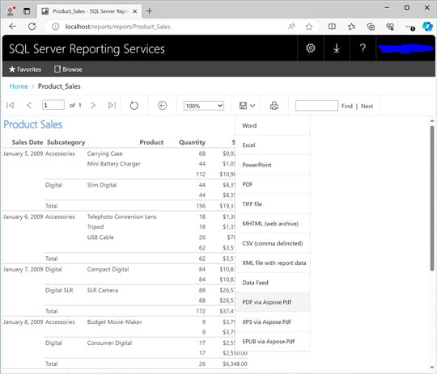

{}

{}

## Aspose.PDF for Reporting Services에 오신 것을 환영합니다!

Microsoft SQL Server Reporting Services는 많은 조직이 직면한 필요, 즉 비즈니스 인텔리전스 및 보고 솔루션을 구축해야 하는 필요를 충족합니다. 지금까지 개발자는 보고서를 애플리케이션에 삽입해야 했고, 조직은 비용이 많이 들고 때때로 문제를 일으키는 서드파티 보고 솔루션을 구매해야 했습니다. 이제 Microsoft SQL Server Reporting Services는 기업 전체에 보고서를 배포하기 위한 완전한 솔루션을 제공하여 비즈니스가 더 나은, 더 빠른 결정을 내릴 수 있게 합니다.

**Aspose.Pdf for Reporting Services**는 Aspose의 또 다른 고유한 솔루션으로, Microsoft SQL Server 2016/2017/2019/2022 Reporting Services 및 Power BI Report Server에서 PDF 보고서를 생성할 수 있게 합니다. 테이블, 매트릭스, 차트 및 이미지를 포함한 모든 RDL 보고서 기능이 최고 수준의 정밀도로 PDF로 변환됩니다.

Microsoft SQL Server Reporting Services는 보고서를 PDF 문서로 내보내는 기본 기능을 가지고 있지만, 최종 사용자에게 필요한 기술 지원을 제공하지 못합니다. Aspose.Pdf는 최고 수준의 효율적인 기술 지원을 제공하기 위해 노력합니다.

Aspose.Pdf for Reporting Services는 Adobe.Pdf SDK를 사용하지 않고 서버에서 문서를 생성합니다. Aspose.Pdf for Reporting Services는 내부적으로 Aspose.Pdf for .NET – 서버 측 문서 처리 및 변환을 위한 세계 최고 수준의 구성 요소를 사용합니다.

## Aspose.PDF for Reporting Services는 모든 보고서를 PDF 형식으로 내보낼 수 있게 합니다.

