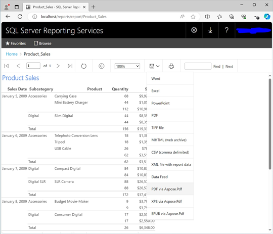

{}

{}

## 보고 서비스를 위한 Aspose.PDF에 오신 것을 환영합니다!

Microsoft SQL Server 보고 서비스는 많은 조직이 직면하고 있는 비즈니스 인텔리전스 및 보고 솔루션 구축 요구 사항을 충족합니다. 지금까지 개발자는 애플리케이션에 보고서를 포함해야 했고, 조직은 비싸고 때로는 문제가 있는 타사 보고 솔루션을 구입해야 했습니다. 이제 Microsoft SQL Server 보고 서비스는 기업 전체에 보고서를 배포하기 위한 완벽한 솔루션을 제공합니다. 기업이 더 나은 의사결정을 더 빠르게 내릴 수 있도록 지원합니다.

**Reporting Services용 Aspose.PDF**는 Aspose의 또 다른 고유한 솔루션으로, Microsoft SQL Server 2016/2017/2019/2022 Reporting Services 및 Power BI Report Server에서 PDF 보고서를 생성할 수 있습니다. 테이블, 행렬, 차트 및 이미지를 포함한 모든 RDL 보고서 기능은 가장 높은 정밀도로 PDF로 변환됩니다.

Microsoft SQL Server 보고 서비스에는 보고서를 PDF 문서로 내보내는 기능이 내장되어 있지만 최종 사용자에게 필요한 기술 지원을 제공하는 기능은 부족합니다. Aspose.Pdf는 최고이고 효율적인 기술 지원을 제공하기 위해 노력하고 있습니다.

Reporting Services용 Aspose.PDF는 Adobe.Pdf SDK를 활용하지 않고 서버에서 문서를 생성합니다. Reporting Services용 Aspose.PDF는 서버 측 문서 처리 및 변환을 위한 세계적 수준의 구성 요소인 .NET용 Aspose.PDF를 내부적으로 사용합니다.

## Reporting Services용 Aspose.PDF를 사용하면 모든 보고서를 PDF 형식으로 내보낼 수 있습니다.

