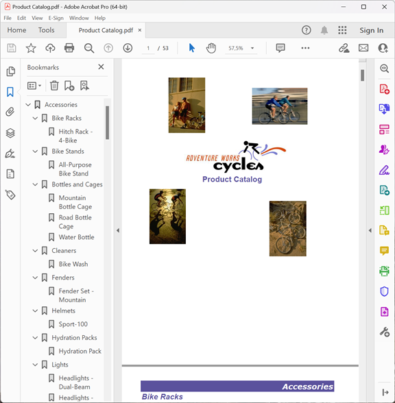

{}

이 갤러리는 Reporting Services용 Aspose.PDF로 내보낸 PDF 보고서를 보여줍니다.

{}

여기에 표시된 대부분의 보고서는 Adventure Works 데이터베이스에서 가져온 것입니다. Adventure Works는 Microsoft SQL Server용 샘플 데이터베이스로, Microsoft에서 다운로드할 수 있습니다. [여기](http://www.microsoft.com/downloads/details.aspx?familyid=E719ECF7-9F46-4312-AF89-6AD8702E4E6E&displaylang=en).

## 회사 매출

## 직원 매출 요약

## 제품 카탈로그

## 제품군 판매

## 판매 주문 세부정보

