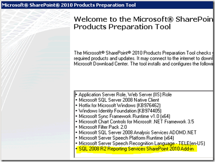

{}

Aspose.PDF for Reporting Services는 오랜 기간 동안 SQL Reporting Services를 통한 PDF 생성에 매우 뛰어나며, SQL Reporting Services에서 기본적으로 지원되지 않는 다양한 구성 및 매개변수 옵션을 제공합니다. 최근에는 Aspose.PDF for Reporting Services와 SharePoint의 통합에 대한 몇 가지 요청을 받았습니다. 이 문서에서는 MS SharePoint 2010에 중점을 둘 것입니다. 진행하기 전에 SharePoint 팜이 이미 설정되어 있다고 가정합니다. 이 예제에서는 전체 SharePoint Cloud를 사용할 것입니다. 그러나 단계는 SharePoint Foundation Server에서도 유사합니다.

{}

{}

계속 진행하기 전에, 이 문서를 준비하면서 참고한 주제들을 살펴보겠습니다.

- [Reporting Services와 SharePoint 기술 통합 개요](http://msdn.microsoft.com/en-us/library/bb326358.aspx)
- [SharePoint 통합 모드에서 Reporting Services 배포 토폴로지](http://msdn.microsoft.com/en-us/library/bb510781.aspx)
- [SharePoint 2010 통합을 위한 Reporting Services 구성](http://msdn.microsoft.com/en-us/library/bb326356.aspx)

{}

## 환경 설정

우리 설정은 4대의 서버로 구성됩니다. 여기에는 도메인 컨트롤러, SQL Server, SharePoint Server 및 Reporting Services용 서버가 포함됩니다. SharePoint와 Reporting Services를 동일한 서버에 배치할 수 있으며, 이렇게 하면 약간 단순화되고 차이점을 몇 가지 강조할 것입니다.

## 설치 전제 조건

{}

SharePoint용 Reporting Services Add-In은 통합을 올바르게 작동시키는 핵심 구성 요소 중 하나입니다. Add-In은 SharePoint 팜에 있는 모든 Web Front Ends (WFE)와 중앙 관리 서버에 설치되어야 합니다. SQL 2008 R2 & SharePoint 2010의 새로운 변경 사항 중 하나는 2008 R2 Add-In이 이제 SharePoint 설치의 전제 조건이 된다는 것입니다. 이는 SharePoint를 설치할 때 RS Add‑In이 자동으로 배포된다는 의미입니다. 아래 그림에 표시되고 강조되었습니다. 이는 실제로 SP 2007 및 RS 2008에서 Add‑In을 설치할 때 발생하던 많은 문제를 방지합니다.

**Image1 :- Share Point용 Reporting Services 애드인**
{}

## SharePoint 인증

**RS 통합 파트로 들어가기 전에 SharePoint 팜에 대해 강조하고 싶은 점은 사이트를 어떻게 설정하느냐입니다. 보다 구체적으로 사이트 인증을 어떻게 구성하느냐인데, 클래식인지 Claims인지 여부입니다. 이 선택은 초기 단계에서 중요합니다. 한 번 설정하면 변경할 수 없다고 생각합니다. 만약 변경 가능하다고 해도 간단한 과정이 아닐 것입니다.**

NOTE: ***Reporting Services 2008 R2는 Claims를 인식하지 못합니다***

SharePoint 사이트를 Claims를 사용하도록 선택하더라도 Reporting Services 자체는 Claims를 인식하지 못합니다. 그렇지만 이는 Reporting Services의 인증 방식에 영향을 미칩니다. 그렇다면 Reporting Services 관점에서는 어떤 차이가 있나요? 핵심은 사용자 자격 증명을 데이터 소스로 전달할지 여부입니다. Classic:- Kerberos를 사용할 수 있으며 사용자 자격 증명을 백엔드 데이터 소스로 전달할 수 있습니다(이를 위해 Kerberos가 필요합니다). Claims:- Claims 토큰이 사용되며 Windows 토큰이 아닙니다. RS는 이 시나리오에서 항상 Trusted Authentication을 사용하며 SPUser 토큰에만 접근할 수 있습니다. 데이터 소스 내에 자격 증명을 저장해야 합니다.

Classic :- Kerberos를 사용하여 사용자 자격 증명을 백엔드 데이터 소스로 전달할 수 있습니다(이를 위해 Kerberos가 필요합니다).

Claims :- Claims 토큰이 사용되며 Windows 토큰이 아닙니다. RS는 이 시나리오에서 항상 Trusted Authentication을 사용하며 SPUser 토큰에만 접근할 수 있습니다. 데이터 소스 내에 자격 증명을 저장해야 합니다.

우선 우리는 RS 설정에만 집중하고 싶습니다. 현재 SharePoint가 내 SharePoint Box에 설치되어 포트 80의 클래식 인증 사이트로 설정되었습니다. RS 서버에 Reporting Services를 방금 설치했으며, 그것이 전부입니다.

