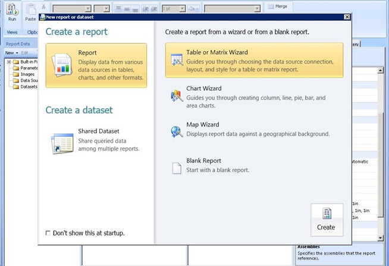
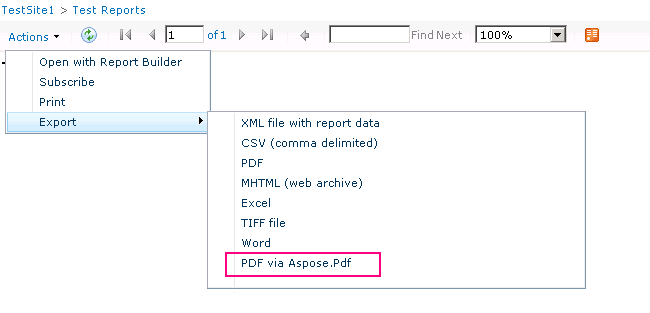

{}

이제 SharePoint가 RS 서버에 설치되고 구성되었으며, RS가 Reporting Services Configuration Manager를 통해 설정되었으니, Central Admin 내에서의 구성으로 이동할 수 있습니다. RS 2008 R2는 이 프로세스를 크게 단순화했습니다. 이전에는 작업을 수행하려면 3단계 프로세스가 필요했습니다. 이제는 한 단계만 있으면 됩니다.

{}

{}

우리는 Central Administrator 웹 사이트로 이동한 다음 General Application Settings으로 들어갑니다. 아래쪽에 Reporting Services가 표시됩니다.

**Image1**:- SharePoint 구성 대화상자

"Reporting Services Integration" 링크를 선택합니다. 다음 화면이 표시됩니다.

**Image2**:- Reporting Services 통합 자격 증명을 지정하십시오

{}

## Web 서비스 URL:

**Reporting Services 구성 관리자에서 찾은 보고서 서버의 URL을 제공하겠습니다.**

## 인증 모드:

**우리는 인증 모드도 선택합니다. 다음 MSDN 링크에서는 이것이 무엇인지 자세히 설명합니다.
SharePoint 통합 모드에서 Reporting Services에 대한 보안 개요**

{}

**간단히 말하면, 사이트가 클레임 인증을 사용하고 있다면 여기에서 무엇을 선택하든 항상 신뢰된 인증(Trusted Authentication)을 사용하게 됩니다. Windows 자격 증명을 전달하려면 Windows 인증을 선택해야 합니다. 신뢰된 인증을 사용할 경우, 우리는 Windows 자격 증명에 의존하지 않고 SPUser 토큰을 전달합니다. 클래식 모드 사이트를 NTLM으로 구성했고 RS가 NTLM으로 설정된 경우에도 신뢰된 인증을 사용해야 합니다. Windows 인증을 사용하고 데이터 소스에 전달하려면 Kerberos가 필요합니다.**

{}

## 기능 활성화:

{}

**이 옵션을 사용하면 모든 사이트 컬렉션에 Reporting Services를 활성화하거나, 활성화하고 싶은 컬렉션을 선택할 수 있습니다. 이는 실제로 어떤 사이트가 Reporting Services를 사용할 수 있는지를 의미합니다. 완료되면 다음 결과가 표시되어야 합니다**

**Image3:**- Reporting Services와 SharePoint 환경의 성공적인 통합
{}

{}

ReportServer URL로 돌아가면 다음과 유사한 것을 볼 수 있어야 합니다

**Image4:**- Reporting Services가 SharePoint 환경에 성공적으로 연결되었습니다

**NOTE:** ***SharePoint 사이트가 SSL로 구성된 경우, 이 목록에 표시되지 않습니다. 이것은 알려진 문제이며 문제가 있다는 의미는 아닙니다. 보고서는 여전히 작동해야 합니다.***
{}

{}

이제 두 제품을 성공적으로 통합했으므로 SharePoint 2010에서 Reporting Services를 사용할 준비가 되었습니다. 이전 버전과 같이 “Site Collection Feature”(Reporting Services Integration을 구성할 때 활성화됨)이라는 기능이 있습니다. 또한 설치 과정에서 우리 사이트에 추가할 3개의 콘텐츠 유형이 추가되었습니다. Image 7에서 두 개의 콘텐츠 유형이 문서 라이브러리에 추가되어 사용자 지정 보고서를 생성하는 데 사용되는 것을 볼 수 있으며, 아래 Image5에서도 확인할 수 있습니다.

**Image5:**- Report Builder

“Reporter Builder”는 ActiveX 컨트롤이므로 아래 Image 6에서 볼 수 있듯이 서버를 통해 다운로드해야 합니다.

**Image6:**- Report Builder 다운로드 및 설치
{}

{}

다운로드 과정이 완료되면 “Report Builder” 컨트롤을 로드합니다. 이제 아래 Image7에 표시된 대로 첫 번째 보고서를 디자인할 준비가 되었습니다.

**Image7:**- Report Builder – 새 보고서 생성 마법사
{}

{}

보고서를 만든 후에는 SharePoint 2010에 보고서를 저장할 문서 라이브러리에 저장할 수 있습니다. 다른 콘텐츠 유형을 사용하여 데이터 소스로 공유 연결을 만들고 이를 SharePoint의 문서 라이브러리에 저장해야 합니다. 문서 라이브러리를 만들고 이 콘텐츠 유형을 추가하면 보고서의 데이터 소스를 변경할 수 있는 연결을 사용할 수 있게 됩니다.

**Image8:**- Aspose.PDF for Reporting Services와 MS SharePoint의 성공적인 통합
{}

