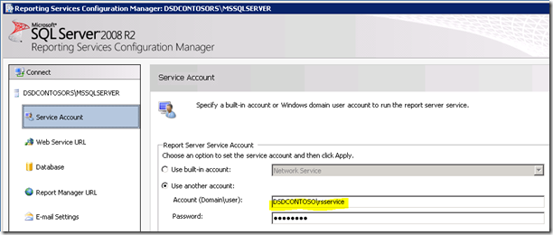
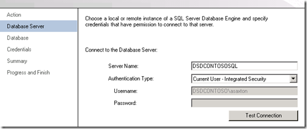
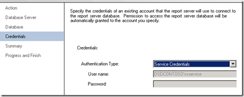

{}

Reporting Services Server에서 우리의 첫 번째 목적지는 Reporting Services Configuration Manager입니다.

{}

## 서비스 계정:

**보고 서비스에 사용하고 있는 서비스 계정을 반드시 이해하십시오. 문제가 발생하면 사용 중인 서비스 계정과 관련될 수 있습니다. 기본값은 Network Service입니다. 새 빌드를 배포할 때는 항상 Domain Accounts를 사용합니다, 왜냐하면 문제가 발생하기 쉬운 부분이기 때문입니다. 이 서버 인스턴스에서는 RSService라는 도메인 계정을 사용했습니다.**

**Image1:- 서비스 계정 설정**

## Web 서비스 URL:

{}

**Web Service URL을 구성해야 합니다. 이는 Web Services Reporting Services가 사용하는 Web Services를 호스팅하는 ReportServer 가상 디렉터리(vdir)이며, SharePoint가 통신하는 대상입니다. vdir의 속성(예: SSL, 포트, 호스트 헤더 등…)을 사용자 정의하려는 경우가 아니라면, 여기서 Apply를 클릭하면 바로 사용할 수 있습니다.**

**Image2:- Web Service URL 설정 Web service URL이 설정되면 다음 결과를 확인할 수 있습니다**

**Image3:- Web service URL 설정 성공**
{}

## 데이터베이스:

**우리는 Reporting Services Catalog Database를 생성해야 합니다. 이는 SQL 2008 또는 SQL 2008 R2 Database Engine에서 사용될 수 있습니다. SQL11도 잘 작동하지만 아직 베타 버전입니다. 이 작업은 기본적으로 두 개의 데이터베이스, ReportServer와 ReportServerTempDB를 생성합니다.**

{}
**이와 관련된 또 다른 중요한 단계는 데이터베이스 유형으로 SharePoint Integrated를 선택했는지 확인하는 것입니다. 일단 이 선택을 하면 변경할 수 없습니다.**

**Image4:- 보고서 서버 데이터베이스 생성**

**Image5:- 데이터베이스 서버 및 인증 유형 설정**

**Image6:- 데이터베이스 이름 및 모드 설정**
{}

**자격 증명의 경우, 이는 Report Server가 SQL Server와 통신하는 방식입니다. 선택한 계정은 RSExecRole을 통해 Catalog 데이터베이스 및 몇몇 시스템 데이터베이스에 특정 권한이 부여됩니다. MSDB는 SQL Agent를 사용하여 구독에 사용되는 데이터베이스 중 하나입니다.**

**Image7:- Report Server 데이터베이스 자격 증명 설정**

{}

**데이터베이스 자격 증명이 지정되면 아래에 지정된 대로 결과를 얻을 수 있어야 합니다.**

**Image8:- Report Server 데이터베이스 생성 진행 상황**

**Image9:- Report Server 데이터베이스 완료 요약**
{}

## 보고서 관리자 URL:

**우리는 SharePoint 통합 모드에 있을 때 사용되지 않으므로 Report Manager URL을 건너뛸 수 있습니다. SharePoint가 우리의 프런트엔드입니다. Report Manager는 작동하지 않습니다.**

## 암호화 키:

{}
**암호화 키를 백업하고 보관 위치를 확인하세요. 데이터베이스를 마이그레이션하거나 복원해야 하는 상황이 발생하면 이 키가 필요합니다.**

**Image10:- Report Server 암호화 키 백업**
{}

{}
**축하합니다! Configuration Manager를 사용하여 Reporting Services를 성공적으로 구성했습니다. 웹 서비스 URL 탭에서 URL을 탐색하면 다음과 유사한 화면이 표시됩니다.**

**Image11:- 설치 후 Report Server 접근**

**오류 원인: SharePoint가 우리 WFE에 설치되어 있고 Reporting Services 설정을 완료했습니다. 이 예에서는 Reporting Services와 SharePoint가 다른 머신에 있습니다. 동일한 머신에 있었다면 이 오류가 발생하지 않았을 것입니다. 실제로 RS Box에 SharePoint를 설치해야 합니다. 이는 IIS도 활성화된다는 의미입니다.**
{}

