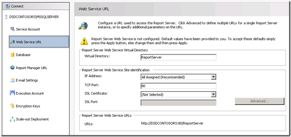
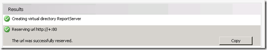
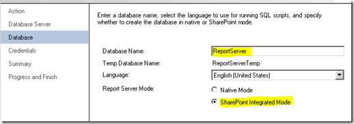
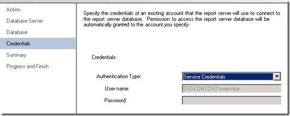

{}

보고 서비스 서버에서 가장 먼저 수행할 작업은 보고 서비스 구성 관리자입니다.

{}

## 서비스 계정:

**보고 서비스에 사용 중인 서비스 계정을 이해해야 합니다. 문제가 발생하면 사용 중인 서비스 계정과 관련이 있을 수 있습니다. 기본값은 네트워크 서비스입니다. 새 빌드를 배포할 때 문제가 발생할 가능성이 있는 도메인 계정을 항상 사용합니다. 이 서버 인스턴스에서는 RSService라는 도메인 계정을 사용했습니다.**

**이미지1:- 서비스 계정 설정**

## 웹 서비스 URL:

{}

**웹 서비스 URL을 구성해야 합니다. 이는 Reporting Services가 사용하는 웹 서비스를 호스팅하고 SharePoint가 통신하는 ReportServer 가상 디렉터리(vdir)입니다. vdir의 속성(예: SSL, 포트, 호스트 헤더 등)을 사용자 정의하려는 경우가 아니라면 여기에서 적용을 클릭하면 됩니다.**

**이미지2:- 웹 서비스 URL 설정 웹 서비스 URL이 설정되면 다음과 같은 결과를 볼 수 있습니다**

**이미지3:- 웹 서비스 URL 설정 성공**
{}

## 데이터 베이스:

**Reporting Services 카탈로그 데이터베이스를 만들어야 합니다. 이는 모든 SQL 2008 또는 SQL 2008 R2 데이터베이스 엔진에 배치될 수 있습니다. SQL11도 잘 작동하지만 아직 베타 버전입니다. 이 작업을 수행하면 기본적으로 ReportServer 및 ReportServerTempDB라는 두 개의 데이터베이스가 생성됩니다.**

{}
**이와 관련된 또 다른 중요한 단계는 데이터베이스 유형으로 SharePoint 통합을 선택했는지 확인하는 것입니다. 한번 선택하면 변경할 수 없습니다.**

**이미지4:- 보고서 서버 데이터베이스 만들기**

**이미지5:- 데이터베이스 서버 및 인증 유형 설정**

**이미지6:- 데이터베이스 이름 및 모드 설정**
{}

**자격 증명의 경우 보고서 서버가 SQL Server와 통신하는 방법입니다. 어떤 계정을 선택하든 RSExecRole을 통해 카탈로그 데이터베이스 및 일부 시스템 데이터베이스 내의 특정 권한이 부여됩니다. MSDB는 SQL 에이전트를 사용할 때 구독 사용을 위한 데이터베이스 중 하나입니다.**

**이미지7:- 보고서 서버 데이터베이스 자격 증명 설정**

{}

**데이터베이스 자격 증명이 지정되면 아래 지정된 결과를 얻을 수 있습니다.**

**이미지8:- 보고서 서버 데이터베이스 생성 진행률**

**이미지9:- 보고서 서버 데이터베이스 완료 요약**
{}

## 보고서 관리자 URL:

**SharePoint 통합 모드에서는 보고서 관리자 URL이 사용되지 않으므로 건너뛸 수 있습니다. SharePoint는 우리의 프런트엔드입니다. 보고서 관리자가 작동하지 않습니다.**

## Encryption Keys:

{}
**암호화 키를 백업하고 어디에 보관하는지 확인하세요. 데이터베이스를 마이그레이션하거나 복원해야 하는 상황에 처하게 되면 이것이 필요합니다.**

**이미지10:- 보고서 서버 암호화 키 백업**
{}

{}
**축하합니다! Configuration Manager를 사용하여 보고 서비스를 성공적으로 구성했습니다. 웹 서비스 URL 탭에서 URL을 탐색하면 다음과 유사한 내용이 표시됩니다.**

**이미지11:- 설치 후 보고서 서버 액세스**

**오류 원인: SharePoint가 WFE에 설치되었으며 보고 서비스 설정이 완료되었습니다. 이 예에서 Reporting Services와 SharePoint는 서로 다른 컴퓨터에 있습니다. 동일한 컴퓨터에 있었다면 이 오류가 표시되지 않았을 것입니다. 기술적으로 RS Box에 SharePoint를 설치해야 합니다. 이는 IIS도 활성화된다는 의미입니다.**
{}

