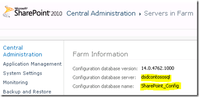

{}

이제 SharePoint WFE에서 했던 것과 유사한 단계를 수행해야 합니다. 가장 먼저 해야 할 일은 필수 구성 요소 설치를 진행하고 완료되면 SharePoint 설정을 시작하는 것입니다.

{}

저는 SharePoint용 독립 실행형 설치를 원하지 않기 때문에 설정을 위해 Server Farm과 SharePoint Box에 맞는 전체 설치를 선택했습니다.

## SharePoint 구성

{}

**SharePoint 구성 마법사에서 기존 팜에 연결하려고 합니다.**

**이미지1:- SharePoint 구성 마법사**
{}

{}

**그런 다음 팜에서 사용하는 SharePoint_Config 데이터베이스를 가리킵니다. 이곳이 어디에 있는지 모르신다면 중앙관리자에서 시스템 설정 -> 이 팜의 관리자 서버를 통해 확인하실 수 있습니다.**

**이미지2:- 데이터베이스 구성 설정 지정**

**이미지3:- SharePoint 구성 마법사**
{}

{}

**마법사가 완료되면 지금은 보고서 서버 상자에서 수행해야 할 작업이 전부입니다. ReportServer URL로 돌아가면 또 다른 오류가 표시됩니다. 이는 중앙 관리자를 통해 구성하지 않았기 때문입니다.**

**이미지4:- 보고서 서버 오류**
{}
