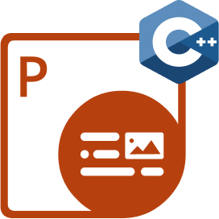

## Aspose.PDF for Rust via C++에 오신 것을 환영합니다

**Aspose.PDF for Rust via C++**은(는) 개발자가 PDF 파일을 직접 조작하고 다양한 작업을 수행할 수 있게 해주는 강력한 툴킷입니다. PDF를 다른 형식으로 변환하기 위한 고유 기능을 포함합니다.

## 챕터

- [개요](/pdf/ko/rust-cpp/overview/)
- [시작하기](/pdf/ko/rust-cpp/get-started/)
- [기본 작업](/pdf/ko/rust-cpp/basic-operations/)
- [릴리스 노트](https://releases.aspose.com/pdf/rustcpp/release-notes/)

## Aspose.PDF for Rust 리소스

다음은 작업을 수행하는 데 필요할 수 있는 유용한 리소스에 대한 링크입니다.

- [Aspose.PDF for Rust 기능](/pdf/ko/rust-cpp/key-features/)
- [Aspose.PDF for Rust 릴리스 노트](https://releases.aspose.com/pdf/rustcpp/release-notes/)
- [Aspose.PDF for Rust 다운로드](https://releases.aspose.com/pdf/rustcpp/)
- [Aspose.PDF for Rust 제품 페이지](https://products.aspose.com/pdf/rust-cpp/)
- [Aspose.PDF for Rust API 참조 가이드](https://reference.aspose.com/pdf/rust-cpp/)
- [Aspose.PDF for Rust 무료 지원 포럼](https://forum.aspose.com/c/pdf/10)
- [Aspose.PDF for Rust 유료 지원 헬프데스크](https://helpdesk.aspose.com/)
