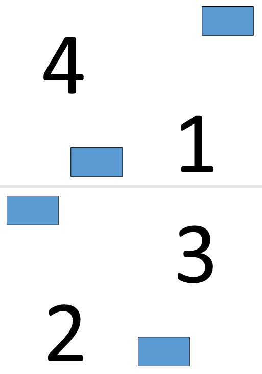

## PDF N-Up 만들기

N-Up PDF는 여러 원본 페이지를 단일 출력 페이지에 배치합니다. 이 예에서는 2 × 2 레이아웃을 사용하므로 원본 페이지 네 개가 출력 문서의 각 페이지에 결합됩니다.

1. 소스 PDF 문서를 엽니다.
1. 지정된 행과 열 수를 사용한 N-Up 레이아웃으로 문서를 저장합니다.

```rs

    use asposepdf::Document;

    fn main() -> Result<(), Box<dyn std::error::Error>> {
        // Open a PDF-document with filename
        let pdf = Document::open("sample.pdf")?;

        // Convert and save the previously opened PDF-document as N-Up PDF-document
        pdf.save_n_up("sample_n_up.pdf", 2, 2)?;

        Ok(())
    }
```

## PDF 책자 만들기

Aspose.PDF for Rust via C++는 표준 PDF 문서를 소책자 스타일 PDF로 변환하는 방법을 설명합니다.
소책자 형식은 페이지를 재배열하여 인쇄 및 접었을 때 문서가 올바른 순서의 페이지로 구성된 적절한 소책자를 형성하도록 합니다.

1. 소스 PDF 문서를 엽니다.
1. 문서를 소책자 PDF로 저장합니다.

```rs

  use asposepdf::Document;

  fn main() -> Result<(), Box<dyn std::error::Error>> {
      // Open a PDF-document with filename
      let pdf = Document::open("sample.pdf")?;

      // Convert and save the previously opened PDF-document as booklet PDF-document
      pdf.save_booklet("sample_booklet.pdf")?;

      Ok(())
  }
```

**전체 기능을 사용하려면 무료 체험 라이선스가 필요합니다.**

4페이지 소책자 만들기의 결과를 탐색하십시오.



3페이지 소책자 만들기의 결과를 탐색하십시오.

