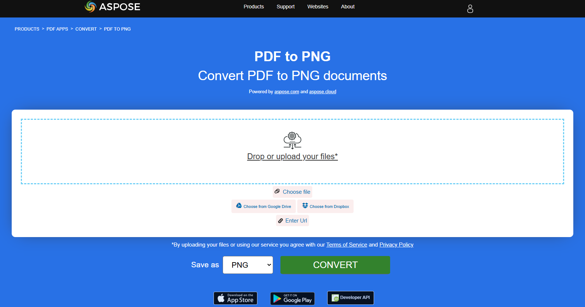

## PDF를 이미지로 변환

이 문서에서는 PDF를 이미지 형식으로 변환하는 옵션을 보여드립니다.

이전에 스캔한 문서는 종종 PDF 파일 형식으로 저장됩니다. 하지만 그래픽 편집기에서 편집하거나 이미지 형식으로 추가 전송해야 합니까? **Aspose.PDF for Rust via C++**를 사용하여 PDF를 이미지로 변환할 수 있는 범용 도구가 있습니다.
가장 일반적인 작업은 전체 PDF 문서 또는 문서의 특정 페이지를 이미지 세트로 저장해야 할 때입니다. **Aspose.PDF for Rust via C++**는 PDF를 JPG 및 PNG 형식으로 변환하여 특정 PDF 파일에서 이미지를 얻는 데 필요한 단계를 단순화합니다.

**Aspose.PDF for Rust via C++** 다양한 PDF를 이미지 형식으로 변환하는 기능을 지원합니다. 섹션을 확인하십시오. [Aspose.PDF 지원 파일 형식](https://docs.aspose.com/pdf/rust-cpp/supported-file-formats/).

### PDF를 JPEG로 변환

제공된 Rust 코드 스니펫은 Aspose.PDF 라이브러리를 사용하여 PDF 문서의 첫 페이지를 JPEG 이미지로 변환하는 방법을 보여줍니다:

1. PDF 문서를 엽니다.
1. 페이지를 JPEG로 변환하기 [page_to_jpg](https://reference.aspose.com/pdf/rust-cpp/convert/page_to_jpg/) 함수.

```rs

  use asposepdf::Document;

  fn main() -> Result<(), Box<dyn std::error::Error>> {
      // Open a PDF-document with filename
      let pdf = Document::open("sample.pdf")?;

      // Convert and save the specified page as Jpg-image
      pdf.page_to_jpg(1, 100, "sample_page1.jpg")?;

      Ok(())
  }
```

{}
**PDF를 JPEG로 온라인 변환해 보세요**

Aspose.PDF for Rust는 온라인 무료 애플리케이션을 제공합니다. ["PDF를 JPEG로"](https://products.aspose.app/pdf/conversion/pdf-to-jpg), 여기서 기능과 품질이 어떻게 작동하는지 조사해 볼 수 있습니다.

[](https://products.aspose.app/pdf/conversion/pdf-to-jpg)
{}

### PDF를 TIFF로 변환

제공된 Rust 코드 스니펫은 Aspose.PDF 라이브러리를 사용하여 PDF 문서의 첫 페이지를 TIFF 이미지로 변환하는 방법을 보여줍니다:

1. PDF 문서를 엽니다.
1. 페이지를 TIFF로 변환하기 [page_to_tiff](https://reference.aspose.com/pdf/rust-cpp/convert/page_to_tiff/) 함수.

```rs

  use asposepdf::Document;

  fn main() -> Result<(), Box<dyn std::error::Error>> {
      // Open a PDF-document with filename
      let pdf = Document::open("sample.pdf")?;

      // Convert and save the specified page as Tiff-image
      pdf.page_to_tiff(1, 100, "sample_page1.tiff")?;

      Ok(())
  }
```

{}
**PDF를 온라인으로 TIFF 변환해 보세요**

Aspose.PDF for Rust는 온라인 무료 애플리케이션을 제공합니다. ["PDF를 TIFF로"](https://products.aspose.app/pdf/conversion/pdf-to-tiff), 여기서 기능과 품질이 어떻게 작동하는지 조사해 볼 수 있습니다.

[](https://products.aspose.app/pdf/conversion/pdf-to-tiff)
{}

### PDF를 PNG로 변환

제공된 Rust 코드 스니펫은 Aspose.PDF 라이브러리를 사용하여 PDF 문서의 첫 페이지를 PNG 이미지로 변환하는 방법을 보여줍니다:

1. PDF 문서를 엽니다.
1. 페이지를 PNG로 변환하기 사용하여 [page_to_png](https://reference.aspose.com/pdf/rust-cpp/convert/page_to_png/) 함수.

```rs

  use asposepdf::Document;

  fn main() -> Result<(), Box<dyn std::error::Error>> {
      // Open a PDF-document with filename
      let pdf = Document::open("sample.pdf")?;

      // Convert and save the specified page as Png-image
      pdf.page_to_png(1, 100, "sample_page1.png")?;

      Ok(())
  }
```

{}
**온라인에서 PDF를 PNG로 변환해 보세요**

우리의 무료 애플리케이션이 작동하는 방식을 예시로, 다음 기능을 확인해 보세요.

Aspose.PDF for Rust는 온라인 무료 애플리케이션을 제공합니다. ["PDF를 PNG로"](https://products.aspose.app/pdf/conversion/pdf-to-png), 여기서 기능과 품질이 어떻게 작동하는지 조사해 볼 수 있습니다.

[](https://products.aspose.app/pdf/conversion/pdf-to-png)
{}

**Scalable Vector Graphics (SVG)**는 정적 및 동적(대화형 또는 애니메이션) 2차원 벡터 그래픽을 위한 XML 기반 파일 형식 사양군입니다. SVG 사양은 1999년부터 World Wide Web Consortium (W3C)에서 개발하고 있는 오픈 표준입니다.

### PDF를 SVG로 변환

제공된 Rust 코드 스니펫은 Aspose.PDF 라이브러리를 사용하여 PDF 문서의 첫 페이지를 SVG 이미지로 변환하는 방법을 보여줍니다:

1. PDF 문서를 엽니다.
1. 페이지를 SVG로 변환하기 [페이지를_svg로](https://reference.aspose.com/pdf/rust-cpp/convert/page_to_svg/) 함수.

```rs

  use asposepdf::Document;

  fn main() -> Result<(), Box<dyn std::error::Error>> {
      // Open a PDF-document with filename
      let pdf = Document::open("sample.pdf")?;

      // Convert and save the specified page as Svg-image
      pdf.page_to_svg(1, "sample_page1.svg")?;

      Ok(())
  }
```

{}
**PDF를 SVG로 온라인 변환해 보세요**

Aspose.PDF for Rust는 온라인 무료 애플리케이션을 제공합니다. ["PDF를 SVG로"](https://products.aspose.app/pdf/conversion/pdf-to-svg), 여기서 기능과 품질이 어떻게 작동하는지 조사해 볼 수 있습니다.

[](https://products.aspose.app/pdf/conversion/pdf-to-svg)
{}

### PDF를 SVG ZIP 아카이브로 변환

다음 예제는 PDF 문서를 SVG 아카이브로 변환하며, 각 페이지가 ZIP 컨테이너 안에 별도의 SVG 파일로 저장됩니다.

1. 소스 PDF 문서를 엽니다.
1. 문서를 SVG 파일을 포함하는 ZIP 아카이브로 저장합니다.

```rs

  use asposepdf::Document;

  fn main() -> Result<(), Box<dyn std::error::Error>> {
      // Open a PDF-document with filename
      let pdf = Document::open("sample.pdf")?;

      // Convert and save the previously opened PDF-document as SVG-archive
      pdf.save_svg_zip("sample_svg.zip")?;

      Ok(())
  }
```

### PDF를 DICOM으로 변환

제공된 Rust 코드 스니펫은 Aspose.PDF 라이브러리를 사용하여 PDF 문서의 첫 페이지를 DICOM 이미지로 변환하는 방법을 보여줍니다:

1. PDF 문서를 엽니다.
1. Page를 DICOM으로 변환하기 [page_to_dicom](https://reference.aspose.com/pdf/rust-cpp/convert/page_to_dicom/) 함수.

```rs

  use asposepdf::Document;

  fn main() -> Result<(), Box<dyn std::error::Error>> {
      // Open a PDF-document with filename
      let pdf = Document::open("sample.pdf")?;

      // Convert and save the specified page as DICOM-image
      pdf.page_to_dicom(1, 100, "sample_page1.dcm")?;

      Ok(())
  }
```

### PDF를 BMP로 변환

제공된 Rust 코드 스니펫은 Aspose.PDF 라이브러리를 사용하여 PDF 문서의 첫 페이지를 BMP 이미지로 변환하는 방법을 보여줍니다:

1. PDF 문서를 엽니다.
1. 페이지를 BMP로 변환하기 [페이지를 BMP로](https://reference.aspose.com/pdf/rust-cpp/convert/page_to_bmp/) 함수.

```rs

  use asposepdf::Document;

  fn main() -> Result<(), Box<dyn std::error::Error>> {
      // Open a PDF-document with filename
      let pdf = Document::open("sample.pdf")?;

      // Convert and save the specified page as Bmp-image
      pdf.page_to_bmp(1, 100, "sample_page1.bmp")?;

      Ok(())
  }
```