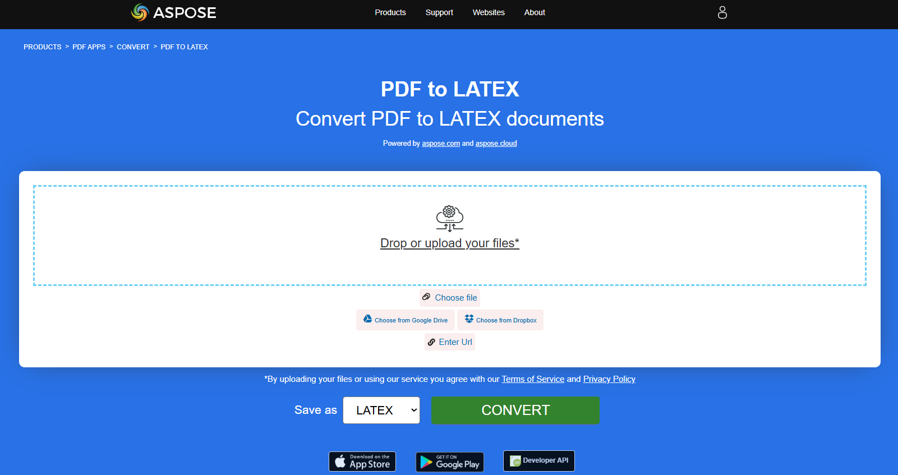
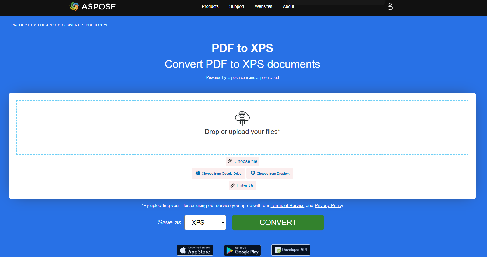
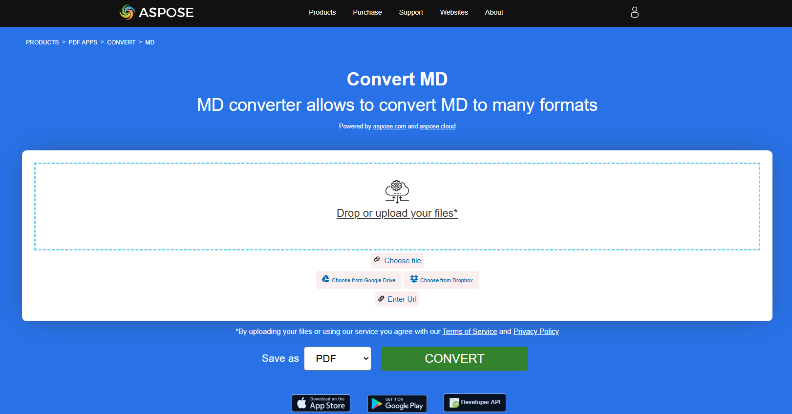

## PDF를 EPUB으로 변환

**<abbr title="Electronic Publication">EPUB</abbr>**는 International Digital Publishing Forum (IDPF)에서 제공하는 자유하고 개방된 전자책 표준입니다. 파일 확장자는 .epub입니다.
EPUB은 재흐름 가능한 콘텐츠용으로 설계되어, EPUB 리더가 특정 디스플레이 장치에 맞게 텍스트를 최적화할 수 있음을 의미합니다. EPUB은 고정 레이아웃 콘텐츠도 지원합니다. 이 형식은 출판사와 변환 업체가 내부에서 사용할 수 있는 단일 형식으로, 배포 및 판매에도 사용하도록 의도되었습니다. 이는 Open eBook 표준을 대체합니다.

제공된 Rust 코드 조각은 Aspose.PDF 라이브러리를 사용하여 PDF 문서를 EPUB으로 변환하는 방법을 보여줍니다:

1. PDF 문서를 엽니다.
1. PDF 파일을 EPUB으로 변환하기 [save_epub](https://reference.aspose.com/pdf/rust-cpp/convert/save_epub/) 함수.

```rs

  use asposepdf::Document;

  fn main() -> Result<(), Box<dyn std::error::Error>> {
      // Open a PDF-document with filename
      let pdf = Document::open("sample.pdf")?;

      // Convert and save the previously opened PDF-document as Epub-document
      pdf.save_epub("sample.epub")?;

      Ok(())
  }
```

{}
**온라인에서 PDF를 EPUB으로 변환해 보세요**

Aspose.PDF for Rust가 온라인 무료 애플리케이션을 제공합니다 ["PDF를 EPUB으로"](https://products.aspose.app/pdf/conversion/pdf-to-epub), 여기서 기능과 품질이 어떻게 작동하는지 조사해 볼 수 있습니다.

[](https://products.aspose.app/pdf/conversion/pdf-to-epub)
{}

## PDF를 TeX로 변환

**Aspose.PDF for Rust**는 PDF를 TeX로 변환하는 것을 지원합니다.
LaTeX 파일 형식은 특수 마크업이 포함된 텍스트 파일 형식이며, 고품질 조판을 위해 TeX 기반 문서 작성 시스템에서 사용됩니다.

제공된 Rust 코드 스니펫은 Aspose.PDF 라이브러리를 사용하여 PDF 문서를 TeX로 변환하는 방법을 보여줍니다:

1. PDF 문서를 엽니다.
1. PDF 파일을 TeX로 변환하려면 [save_tex](https://reference.aspose.com/pdf/rust-cpp/convert/save_tex/) 함수.

```rs

  use asposepdf::Document;

  fn main() -> Result<(), Box<dyn std::error::Error>> {
      // Open a PDF-document with filename
      let pdf = Document::open("sample.pdf")?;

      // Convert and save the previously opened PDF-document as TeX-document
      pdf.save_tex("sample.tex")?;

      Ok(())
  }
```

{}
**온라인에서 PDF를 LaTeX/TeX로 변환해 보세요**

Aspose.PDF for Rust가 온라인 무료 애플리케이션을 제공합니다 [PDF를 LaTeX로](https://products.aspose.app/pdf/conversion/pdf-to-tex), 여기서 기능과 품질이 어떻게 작동하는지 조사해 볼 수 있습니다.

[](https://products.aspose.app/pdf/conversion/pdf-to-tex)
{}

## PDF를 TXT로 변환

제공된 Rust 코드 조각은 Aspose.PDF 라이브러리를 사용하여 PDF 문서를 TXT로 변환하는 방법을 보여줍니다:

1. PDF 문서를 엽니다.
1. PDF 파일을 TXT로 변환하기 위해 [save_txt](https://reference.aspose.com/pdf/rust-cpp/convert/save_txt/) 함수.

```rs

  use asposepdf::Document;

  fn main() -> Result<(), Box<dyn std::error::Error>> {
      // Open a PDF-document with filename
      let pdf = Document::open("sample.pdf")?;

      // Convert and save the previously opened PDF-document as Txt-document
      pdf.save_txt("sample.txt")?;

      Ok(())
  }
```

{}
**온라인에서 PDF를 텍스트로 변환해 보세요**

Aspose.PDF for Rust가 온라인 무료 애플리케이션을 제공합니다 ["PDF를 텍스트로"](https://products.aspose.app/pdf/conversion/pdf-to-txt), 여기서 기능과 품질이 어떻게 작동하는지 조사해 볼 수 있습니다.

[](https://products.aspose.app/pdf/conversion/pdf-to-txt)
{}

## PDF를 XPS로 변환

XPS 파일 유형은 주로 Microsoft Corporation의 XML Paper Specification과 연관되어 있습니다. XML Paper Specification (XPS)은 이전에 Metro라는 코드명으로 불렸으며 Next Generation Print Path (NGPP) 마케팅 개념을 포함하는 Microsoft의 Windows 운영 체제에 문서 생성 및 보기 기능을 통합하려는 이니셔티브입니다.

**Aspose.PDF for Rust**는 PDF 파일을 변환할 수 있는 가능성을 제공합니다 <abbr title="XML Paper Specification">XPS</abbr> 포맷. Rust를 사용하여 PDF 파일을 XPS 포맷으로 변환하기 위해 제시된 코드 스니펫을 사용해 보자.

제공된 Rust 코드 스니펫은 Aspose.PDF 라이브러리를 사용하여 PDF 문서를 XPS로 변환하는 방법을 보여줍니다:

1. PDF 문서를 엽니다.
1. PDF 파일을 XPS로 변환하기 [save_xps](https://reference.aspose.com/pdf/rust-cpp/convert/save_xps/) 함수.

```rs

  use asposepdf::Document;

  fn main() -> Result<(), Box<dyn std::error::Error>> {
      // Open a PDF-document with filename
      let pdf = Document::open("sample.pdf")?;

      // Convert and save the previously opened PDF-document as Xps-document
      pdf.save_xps("sample.xps")?;

      Ok(())
  }
```

{}
**PDF를 XPS로 온라인 변환해 보세요**

Aspose.PDF for Rust가 온라인 무료 애플리케이션을 제공합니다 ["PDF를 XPS로"](https://products.aspose.app/pdf/conversion/pdf-to-xps), 여기서 기능과 품질이 어떻게 작동하는지 조사해 볼 수 있습니다.

[](https://products.aspose.app/pdf/conversion/pdf-to-xps)
{}

## PDF를 그레이스케일 PDF로 변환

제공된 Rust 코드 스니펫은 Aspose.PDF 라이브러리를 사용하여 PDF 문서의 첫 페이지를 그레이스케일 PDF로 변환하는 방법을 보여줍니다:

1. PDF 문서를 엽니다.
1. PDF 페이지를 그레이스케일 PDF로 변환하기 [페이지_그레이스케일](https://reference.aspose.com/pdf/rust-cpp/organize/page_grayscale/) 함수.

이 예제는 PDF의 특정 페이지를 그레이스케일로 변환합니다:

```rs

  use asposepdf::Document;

  fn main() -> Result<(), Box<dyn std::error::Error>> {
      // Open a PDF-document from file
      let pdf = Document::open("sample.pdf")?;

      // Convert page to black and white
      pdf.page_grayscale(1)?;

      // Save the previously opened PDF-document with new filename
      pdf.save_as("sample_page1_grayscale.pdf")?;

      Ok(())
  }
```

## PDF를 Markdawn으로 변환

제공된 Rust 코드 스니펫은 Aspose.PDF for Rust를 사용하여 PDF 문서를 Markdown (.md) 파일로 변환하는 방법을 보여줍니다.

1. 소스 PDF 파일을 엽니다.
1. PDF를 Markdown으로 변환합니다.
1. 열린 PDF 문서를 Markdown 파일로 저장합니다.

```rs

  use asposepdf::Document;

  fn main() -> Result<(), Box<dyn std::error::Error>> {
      // Open a PDF-document with filename
      let pdf = Document::open("sample.pdf")?;

      // Convert and save the previously opened PDF-document as Markdown-document
      pdf.save_markdown("sample.md")?;

      Ok(())
  }
```

{}
**PDF를 MD로 온라인 변환해 보세요**

Aspose.PDF for Rust가 온라인 무료 애플리케이션을 제공합니다 ["PDF를 MD로"](https://products.aspose.app/pdf/conversion/md), 여기서 기능과 품질이 어떻게 작동하는지 조사해 볼 수 있습니다.

[](https://products.aspose.app/pdf/conversion/md)
{}
