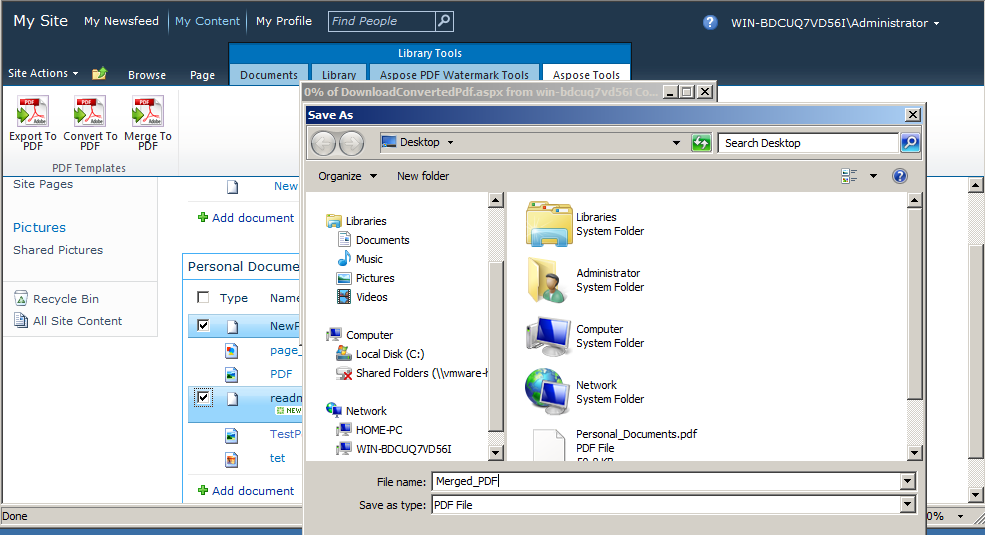

---
title: SharePoint에서 PDF 파일 병합
linktitle: PDF 파일 병합
type: docs
weight: 90
url: /ko/sharepoint/merge-pdf-files/
lastmod: "2020-12-16"
description: PDF SharePoint API를 사용하면 SharePoint 문서 라이브러리의 여러 PDF 파일을 단일 PDF로 병합할 수 있습니다.
---

{}

여러 PDF 파일을 단일 PDF 파일로 병합/연결하는 것은 PDF 파일 처리 응용 프로그램에서 매우 인기 있고 까다로운 기능입니다. 우리는 이 중요한 기능을 다음에서 소개했습니다. [SharePoint 2.2.0용 Aspose.PDF](https://releases.aspose.com/pdf/sharepoint/new-releases/aspose.pdf-for-sharepoint-2.2.0/) 버전. 두 파일을 병합하는 것은 첫 번째 파일 끝에 두 번째 파일을 추가하여 단일 파일을 만드는 것입니다.

{}

## PDF 파일 병합

다음과 같이 SharePoint 문서 라이브러리의 여러 PDF 파일을 단일 PDF로 병합합니다.

1.  병합할 SharePoint 문서 라이브러리에서 PDF 파일을 선택합니다.

2.  라이브러리 도구에서 Aspose 도구 탭을 클릭합니다.

3.  라이브러리 도구에서 PDF로 병합 옵션을 클릭하여 선택한 모든 PDF 파일을 결과 PDF로 병합합니다.

4.  결과 PDF 파일을 적절한 이름으로 다운로드/저장하라는 메시지가 표시됩니다.

