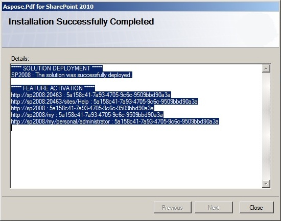

---
title: Installing Aspose.PDF for SharePoint
linktitle: SharePoint용 Aspose.PDF 설치
type: docs
weight: 20
url: /ko/sharepoint/installing-aspose-pdf-for-sharepoint/
lastmod: "2020-12-16"
description: PDF SharePoint API는 서버 팜 배포, 철회, 활성화 및 비활성화를 단순화하기 위해 SharePoint 솔루션으로 패키지됩니다.
---

{}

SharePoint용 Aspose.PDF는 Aspose.PDF.SharePoint.zip 아카이브로 다운로드할 수 있습니다.

{}

이 아카이브에는 다음이 포함되어 있습니다:

- Aspose.PDF.SharePoint.wsp
  SharePoint 솔루션 파일. SharePoint용 Aspose.PDF는 서버 팜 전반에 걸쳐 배포/철회 및 기능 활성화/비활성화를 용이하게 하기 위해 SharePoint 솔루션으로 패키지됩니다.
- Aspose_LicenseAgreement.rtf

**최종 사용자 라이센스 계약:**

- SharePoint.pdf용 Aspose.PDF

**사용자 문서:**

- SharePoint Documentation.chm용 Aspose.PDF

**공개 API 참조가 포함된 사용자 문서:**

- setup.exe

**Setup program:**

- setup.exe.config

**설정 구성 파일:**

설치 프로그램은 계속 진행하기 전에 다음 조건을 확인합니다.

- 셰어포인트 2010이 설치되어 있습니다.
- The user has permission to install SharePoint solutions.
- SharePoint 데이터베이스가 온라인 상태입니다.
- SharePoint 관리 서비스가 시작되었습니다.
- SharePoint 타이머 서비스가 시작되었습니다. 일부 설정 작업은 타이머 작업을 사용하여 서버 팜의 모든 서버에 전파되므로 SharePoint 관리 서비스 및 타이머 서비스가 필요합니다.

**To install Aspose.PDF for SharePoint:**

- Aspose.PDF.SharePoint zip을 로컬 드라이브에 압축 해제합니다.
- Run setup.exe and follow the instructions on the screen.

**The setup program performs the following actions:**

- 설치 전제조건을 확인하세요. 검사에 실패하면 설치가 계속되지 않습니다.

- 최종 사용자 라이센스 계약을 표시합니다. 계속 진행하려면 사용자가 계약에 동의해야 합니다.

- Display deployment target selection dialog. The user selects web applications and site collections where the feature shall be activated. See the figure below.

- Deploy the feature to the server farm.

- 선택한 사이트 모음에 대한 기능을 활성화하고 해당 상위 웹 응용 프로그램을 구성합니다.
- 기능이 배포되고 활성화된 웹 응용 프로그램 및 사이트 모음 목록을 표시합니다.

