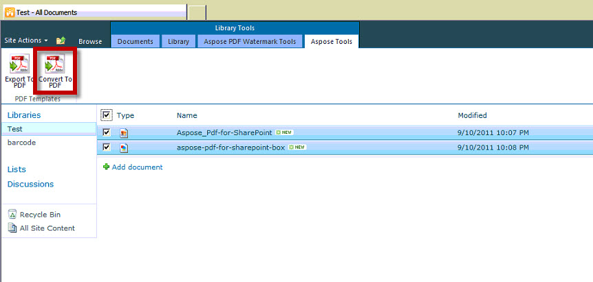

{}

이 문서는 Aspose.PDF for SharePoint를 사용하여 여러 선택된 파일을 단일 변환 작업으로 PDF 파일로 변환하는 방법을 보여줍니다.

{}

## 여러 선택된 파일을 PDF로 변환

{}

여러 선택된 파일을 변환하려면 다음 단계를 수행하십시오:

1. 변환할 파일을 선택하십시오

2. Library Tools에서 Aspose Tools 탭을 클릭하십시오

3. Convert to PDF를 클릭하여 선택된 모든 파일을 결과 PDF 파일로 변환하십시오.

4. 변환된 파일을 다운로드하기 위한 프롬프트가 표시됩니다.

{}
