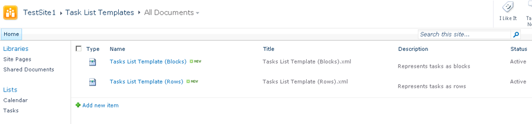

---
title: 템플릿 생성 및 내보내기
linktitle: 템플릿 생성 및 내보내기
type: docs
weight: 10
url: /ko/sharepoint/creating-and-exporting-template/
lastmod: "2020-12-16"
description: PDF SharePoint API를 사용하여 SharePoint에서 템플릿을 만들고 PDF로 내보낼 수 있습니다.
---

{}

이 문서에서는 SharePoint용 Aspose.PDF를 사용하여 템플릿을 만들고 내보내는 방법을 보여줍니다.

SharePoint 1.9.2용 Aspose.PDF의 PDF 템플릿 지원에는 SharePoint 하위 사이트도 포함됩니다.

{}

## 템플릿 생성 및 내보내기

{}

SharePoint 내보내기 기능에 Aspose.PDF를 사용하려면 먼저 "PDF 템플릿"을 사용하는 목록을 만듭니다.

PDF 템플릿을 사용하는 목록 만들기:

작업 양식 템플릿과 작업 목록 템플릿이라는 두 개의 문서 템플릿이 생성됩니다.

템플릿 양식을 사용하면 다음 정보를 입력할 수 있습니다.

- **이름**: 템플릿의 파일 이름입니다.
- **제목**: 템플릿의 제목입니다. (기본적으로 파일명과 동일합니다.)
- **설명**: 템플릿에 대한 설명입니다. 설명을 잘 작성하면 템플릿을 더 쉽게 사용할 수 있습니다.
- **할당된 목록 유형**: 쉼표로 구분된 목록 ID(템플릿과 관련됨). 이 필드에는 다음 값이 포함될 수도 있습니다.
- **모든 목록 유형**. 이 필드는 **유형** 필드가 **목록**)으로 설정된 경우에만 적용 가능합니다.
- **할당된 콘텐츠 유형**: 템플릿과 관련된 쉼표로 구분된 콘텐츠 유형 ID입니다. 이 필드에는 **AllListTypes**로 설정된 내용이 포함될 수 있습니다. 이 필드는 **유형** 필드가 **항목**으로 설정된 경우에만 적용 가능합니다.
- **유형**: 목록 템플릿 또는 항목 템플릿입니다.
- **상태**: 옵션은 활성, 비활성(모두에게 표시되지 않음) 및 디버깅(관리자에게만 표시)입니다.

작업 목록 템플릿 양식:

작업 양식 템플릿 양식:

저장되면 사용할 준비가 된 새 템플릿이 템플릿 목록에 표시됩니다.

두 가지 작업 목록 템플릿:*

작업 양식 템플릿:

### 템플릿 개발

템플릿은 Aspose XML PDF를 기반으로 한 XML 파일입니다. 목록에 대한 템플릿을 만들려면 SharePoint 대상 콘텐츠 유형 필드의 내부 이름과 관련된 특수 마커를 XML PDF 파일에 배치하세요.

### 마커

- **SPListItemsCount** – 목록 항목 수로 대체됩니다.
- **SPListTitle** – 목록 제목으로 대체됩니다.
- **SPTableIterator** – 첫 번째 테이블 셀에 배치되고 전체 반복을 위해 테이블을 표시합니다.
- **SPRowIterator** – 첫 번째 테이블 셀에 배치되고 행 반복을 위해 테이블을 표시합니다.
- **SPField** – 항목 필드의 값으로 대체됩니다.

참고로 다운받아주세요 [템플릿 XML 파일](attachments/8421394/8618082.zip).

### PDF로 내보내기

템플릿이 완전히 구성되면 목록이나 항목을 PDF 파일로 내보낼 수 있습니다.

작업 목록 템플릿을 사용하여 목록을 PDF로 내보내기:

{}

