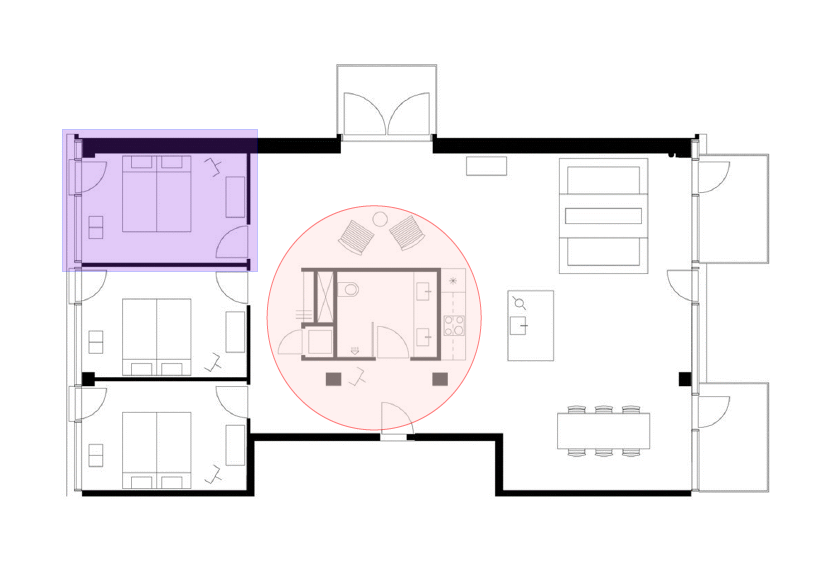

## Add Square or Circle Annotations

Square and Circle annotations shall display, respectively, a rectangle or an ellipse on the page. When opened, they shall display a pop-up window containing the text of the associated note.
Square annotations are like Circle annotations (instances of the Aspose.Pdf.Annotations.CircleAnnotation class) apart from the shape.

Steps for creating Square and Circle Annotations:

1. Load the PDF file - new [Document](https://apireference.aspose.com/pdf/net/aspose.pdf/document).
1. Create new [Circle Annotation](https://apireference.aspose.com/pdf/net/aspose.pdf.annotations/circleannotation) and set Circle parameters (new Rectangle, title, color, InteriorColor, Opacity).
1. Create a new [PopupAnnotation](https://apireference.aspose.com/pdf/net/aspose.pdf.annotations/popupannotation/methods/index).
1. Next we need to create [Square Annotation](https://apireference.aspose.com/pdf/net/aspose.pdf.annotations/squareannotation).
1. Set the same Square parameters (new Rectangle, title, color, InteriorColor, Opacity).
1. After we need to Add Square and Circle Annotations to the page.

The following code snippet shows you how to add Circle Annotations in a PDF page.

```csharp
using Aspose.Pdf.Annotations;
using System;
using System.Linq;

namespace Aspose.Pdf.Examples.Advanced
class ExampleCircleAnnotation
{
    // The path to the documents directory.
    private const string _dataDir = "..\\..\\..\\..\\Samples";
    public static void AddCirlceAnnotation()
    {
        try
        {
        // Load the PDF file
        Document document = new Document(System.IO.Path.Combine(_dataDir, "appartments.pdf"));

        // Create Cirlce Annotation
        var circleAnnotation = new CircleAnnotation(document.Pages[1], new Rectangle(270, 160, 483, 383))
        {
            Title = "John Smith",
            Color = Color.Red,
            InteriorColor = Color.MistyRose,
            Opacity = 0.5,
            Popup = new PopupAnnotation(document.Pages[1], new Rectangle(842, 316, 1021, 459))
        };

        // Create Square Annotation
        var squareAnnotation = new SquareAnnotation(document.Pages[1], new Rectangle(67, 317, 261, 459))
        {
            Title = "John Smith",
            Color = Color.Blue,
            InteriorColor = Color.BlueViolet,
            Opacity = 0.25,
            Popup = new PopupAnnotation(document.Pages[1], new Rectangle(842, 196, 1021, 338))
        };

        // Add annotation to the page
        document.Pages[1].Annotations.Add(circleAnnotation);
        document.Pages[1].Annotations.Add(squareAnnotation);
        document.Save(System.IO.Path.Combine(_dataDir, "appartments_mod.pdf"));
    }
    catch (Exception ex)
    {
        Console.WriteLine(ex.Message);
    }
  }
}
```

As an example, we will see the following result of adding Square and Circle annotations to a PDF document:



### Get Circle Annotation

Please try using the following code snippet to Get Circle Annotation from PDF document.

```csharp
public static void GetCircleAnnotation()
{
    // Load the PDF file
    Document document = new Document(System.IO.Path.Combine(_dataDir, "Appartments_mod.pdf"));
    var circleAnnotations = document.Pages[1].Annotations
        .Where(a => a.AnnotationType == AnnotationType.Circle)
        .Cast<CircleAnnotation>();
    foreach (var ca in circleAnnotations)
    {
        Console.WriteLine($"[{ca.Rect}]");
    }
}
```

### Delete Circle Annotation

The following code snippet shows how to Delete Circle Annotation from PDF file.

```csharp
public static void DeleteCircleAnnotation()
{
    // Load the PDF file
    Document document = new Document(System.IO.Path.Combine(_dataDir, "Appartments_mod.pdf"));
    var circleAnnotations = document.Pages[1].Annotations
        .Where(a => a.AnnotationType == AnnotationType.Circle)
        .Cast<CircleAnnotation>();

    foreach (var ca in circleAnnotations)
    {
        document.Pages[1].Annotations.Delete(ca);
    }
    document.Save(System.IO.Path.Combine(_dataDir, "Appartments_del.pdf"));
}
```

## Add Polygon and Polyline Annotations

The Polyline tool allows you to create shapes and outlines with an arbitrary number of sides on the document.

**Polygon Annotations** represent polygons on a page. They can have any number of vertices connected by straight lines.

**Polyline Annotations** are also similar to polygons, the only difference is that the first and last vertices are not implicitly connected.

Steps with which we create Polygon and Polyline annotations:

1. Load the PDF file - new [Document](https://apireference.aspose.com/pdf/net/aspose.pdf/document).
1. Create new [Polygon Annotation](https://apireference.aspose.com/pdf/net/aspose.pdf.annotations/polygonannotation) and set Polygon parameters (new Rectangle, new Points, title, color, InteriorColor and Opacity).
1. Create a new [PopupAnnotation](https://apireference.aspose.com/pdf/net/aspose.pdf.annotations/popupannotation/methods/index).
1. Next, Create a [PolyLine Annotation](https://apireference.aspose.com/pdf/net/aspose.pdf.annotations/polylineannotation) and repeat all actions.
1. After we can Add annotations to the page.

The following code snippet shows how to add Polygon and Polyline Annotations to a PDF file:

```csharp
using Aspose.Pdf.Annotations;
using System;
using System.Linq;

namespace Aspose.Pdf.Examples.Advanced
{
    class ExamplePolygonAnnotation
    {
        // The path to the documents directory.
        private const string _dataDir = "..\\..\\..\\..\\Samples";
        public static void AddPolynnotation()
        {
            try
            {
                // Load the PDF file
                Document document = new Document(System.IO.Path.Combine(_dataDir, "appartments.pdf"));

                // Create Polygon Annotation
                var polygonAnnotation = new PolygonAnnotation(document.Pages[1],
                    new Rectangle(270, 193, 571, 383),
                    new Point[] {
                        new Point(274, 381),
                        new Point(555, 381),
                        new Point(555, 304),
                        new Point(570, 304),
                        new Point(570, 195),
                        new Point(274, 195)})
                {
                    Title = "John Smith",
                    Color = Color.Blue,
                    InteriorColor = Color.BlueViolet,
                    Opacity = 0.25,
                    Popup = new PopupAnnotation(document.Pages[1], new Rectangle(842, 196, 1021, 338))
                };

                // Create PoliLine Annotation
                var polylineAnnotation = new PolylineAnnotation(document.Pages[1],
                    new Rectangle(270, 193, 571, 383),
                    new Point[] {
                        new Point(545,150),
                        new Point(545,190),
                        new Point(667,190),
                        new Point(667,110),
                        new Point(626,111)
                        })
                {
                    Title = "John Smith",
                    Color = Color.Red,
                    Popup = new PopupAnnotation(document.Pages[1], new Rectangle(842, 196, 1021, 338))
                };

                // Add annotation to the page
                document.Pages[1].Annotations.Add(polygonAnnotation);
                document.Pages[1].Annotations.Add(polylineAnnotation);
                document.Save(System.IO.Path.Combine(_dataDir, "appartments_mod.pdf"));
            }
            catch (Exception ex)
            {
                Console.WriteLine(ex.Message);
            }
        }
    }
}
```

### Get Polygon and Polyline Annotations

Please try using the following code snippet to Get Polygon and Polyline Annotations in PDF document.

```csharp
public static void GetPolyAnnotation()
    {
    // Load the PDF file
    Document document = new Document(System.IO.Path.Combine(_dataDir, "Appartments_mod.pdf"));
    var polyAnnotations = document.Pages[1].Annotations
        .Where(a => a.AnnotationType == AnnotationType.PolyLine)
        .Cast<PolylineAnnotation>();
        foreach (var pa in polyAnnotations)
        {
            Console.WriteLine($"[{pa.Rect}]");
        }
    }
```

### Delete Polygon and Polyline Annotations

The following code snippet shows how Delete Polygon and Polyline Annotations from a PDF file.

```csharp
    public static void DeletePolyAnnotation()
    {
        // Load the PDF file
        Document document = new Document(System.IO.Path.Combine(_dataDir, "Appartments_mod.pdf"));
        var polyAnnotations = document.Pages[1].Annotations
                        .Where(a => a.AnnotationType == AnnotationType.PolyLine)
                        .Cast<PolylineAnnotation>();

        foreach (var pa in polyAnnotations)
        {
            document.Pages[1].Annotations.Delete(pa);
        }
        document.Save(System.IO.Path.Combine(_dataDir, "Appartments_del.pdf"));
    }
```

## How to add Line Annotation into existing PDF file

The purpose of a Line Annotation is to display a single straight line on the page. When opened, it shall display a pop-up window containing the text of the associated note.
This feature additional entries specific to a line annotation. These entries are encrypted in the form of letters, for example, LL, BS, IC, and so on.

Also, Line Annotation can include a caption to a line annotation, which is specified by setting Cap to `true`.
The next feature allows the effect of applying a caption to a Line Annotation that has a leader offset.
Also, this kind of annotation allows you to define Line ending styles.

Steps with which we create an Line annotation:

1. Load the PDF file - new [Document](https://apireference.aspose.com/pdf/net/aspose.pdf/document).
1. Create new [Line Annotation](https://apireference.aspose.com/pdf/net/aspose.pdf.annotations/lineannotation/methods/index) and set Line parameters (new Rectangle, new Point, title, color, width, StartingStyle and EndingStyle).
1. Create a new [PopupAnnotation](https://apireference.aspose.com/pdf/net/aspose.pdf.annotations/popupannotation/methods/index).
1. After we can Add annotation to the page

The following code snippet shows how to add Line Annotation to a PDF file:

```csharp
using Aspose.Pdf.Annotations;
using System;
using System.Linq;

namespace Aspose.Pdf.Examples.Advanced
{
    class ExampleLineAnnotation
    {
        // The path to the documents directory.
        private const string _dataDir = "..\\..\\..\\..\\Samples";
        public static void AddLineAnnotation()
        {
            try
            {
                // Load the PDF file
                Document document = new Document(System.IO.Path.Combine(_dataDir, "Appartments.pdf"));

                // Create Line Annotation
                var lineAnnotation = new LineAnnotation(
                    document.Pages[1],
                    new Rectangle(550, 93, 562, 439),
                    new Point(556, 99), new Point(556, 443))
                {
                    Title = "John Smith",
                    Color = Color.Red,
                    Width = 3,
                    StartingStyle = LineEnding.OpenArrow,
                    EndingStyle = LineEnding.OpenArrow,
                    Popup = new PopupAnnotation(document.Pages[1], new Rectangle(842, 124, 1021, 266))
                };

                // Add annotation to the page
                document.Pages[1].Annotations.Add(lineAnnotation);
                document.Save(System.IO.Path.Combine(_dataDir, "Appartments_mod.pdf"));
            }
            catch (Exception ex)
            {
                Console.WriteLine(ex.Message);
            }
        }
    }
}
```

### Get Line Annotation

Please try using the following code snippet to Get Line Annotation in PDF document.

```csharp
    public static void GetLineAnnotation()
    {

    // Load the PDF file
        Document document = new Document(System.IO.Path.Combine(_dataDir, "Appartments_mod.pdf"));
        var lineAnnotations = document.Pages[1].Annotations
            .Where(a => a.AnnotationType == AnnotationType.Line)
            .Cast<LineAnnotation>();
        foreach (var la in lineAnnotations)
        {
            Console.WriteLine($"[{la.Starting.X},{la.Starting.Y}]-[{la.Ending.X},{la.Ending.Y}]");
        }
    }
```

### Delete Line Annotation

The following code snippet shows how Delete Line Annotation from a PDF file.

```csharp
    public static void DeleteLineAnnotation()
    {
        // Load the PDF file
        Document document = new Document(System.IO.Path.Combine(_dataDir, "Appartments_mod.pdf"));
        var lineAnnotations = document.Pages[1].Annotations
            .Where(a => a.AnnotationType == AnnotationType.Line)
            .Cast<LineAnnotation>();

        foreach (var la in lineAnnotations)
        {
            document.Pages[1].Annotations.Delete(la);
        }
        document.Save(System.IO.Path.Combine(_dataDir, "Appartments_del.pdf"));
    }
```

## How to add Ink Annotation to PDF file

An Ink Annotation represents a freehand "scribble" composed of one or more disjoint paths. When opened, it shall display a pop-up window containing the text of the associated note.

The [InkAnnotation](https://apireference.aspose.com/pdf/net/aspose.pdf.annotations/inkannotation) represents freehand scribble composed of one or more disjoint points. Please try using the following code snippet to add InkAnnotation in PDF document.

```csharp
// For complete examples and data files, please go to https://github.com/aspose-pdf/Aspose.PDF-for-.NET
// The path to the documents directory.
string dataDir = RunExamples.GetDataDir_AsposePdf_Annotations();

Document doc = new Document();
Page pdfPage = doc.Pages.Add();
System.Drawing.Rectangle drect = new System.Drawing.Rectangle();
drect.Height = (int)pdfPage.Rect.Height;
drect.Width = (int)pdfPage.Rect.Width;
drect.X = 0;
drect.Y = 0;
Aspose.Pdf.Rectangle arect = Aspose.Pdf.Rectangle.FromRect(drect);
IList<Point[]> inkList = new List<Point[]>();
Aspose.Pdf.Point[] arrpt = new Aspose.Pdf.Point[3];
inkList.Add(arrpt);
arrpt[0] = new Aspose.Pdf.Point(100, 800);
arrpt[1] = new Aspose.Pdf.Point(200, 800);
arrpt[2] = new Aspose.Pdf.Point(200, 700);
InkAnnotation ia = new InkAnnotation(pdfPage, arect, inkList);
ia.Title = "XXX";
ia.Color = Aspose.Pdf.Color.LightBlue; // (GetColorFromString(stroke.InkColor));
ia.CapStyle = CapStyle.Rounded;
Border border = new Border(ia);
border.Width = 25;
ia.Opacity = 0.5;
pdfPage.Annotations.Add(ia);

dataDir = dataDir + "AddlnkAnnotation_out.pdf";
// Save output file
doc.Save(dataDir);
```

### Set Line width of InkAnnotation

The width of [InkAnnottion](https://apireference.aspose.com/pdf/net/aspose.pdf.annotations/inkannotation) can be changed using LineInfo and Border objects.

```csharp
// For complete examples and data files, please go to https://github.com/aspose-pdf/Aspose.PDF-for-.NET
// The path to the documents directory.
string dataDir = RunExamples.GetDataDir_AsposePdf_Annotations();

Document doc = new Document();
doc.Pages.Add();
IList<Point[]> inkList = new List<Point[]>();
LineInfo lineInfo = new LineInfo();
lineInfo.VerticeCoordinate = new float[] { 55, 55, 70, 70, 70, 90, 150, 60 };
lineInfo.Visibility = true;
lineInfo.LineColor = System.Drawing.Color.Red;
lineInfo.LineWidth = 2;
int length = lineInfo.VerticeCoordinate.Length / 2;
Aspose.Pdf.Point[] gesture = new Aspose.Pdf.Point[length];
for (int i = 0; i < length; i++)
{
   gesture[i] = new Aspose.Pdf.Point(lineInfo.VerticeCoordinate[2 * i], lineInfo.VerticeCoordinate[2 * i + 1]);
}

inkList.Add(gesture);
InkAnnotation a1 = new InkAnnotation(doc.Pages[1], new Aspose.Pdf.Rectangle(100, 100, 300, 300), inkList);
a1.Subject = "Test";
a1.Title = "Title";
a1.Color = Aspose.Pdf.Color.FromRgb(System.Drawing.Color.Green);
Border border = new Border(a1);
border.Width = 3;
border.Effect = BorderEffect.Cloudy;
border.Dash = new Dash(1, 1);
border.Style = BorderStyle.Solid;
doc.Pages[1].Annotations.Add(a1);

dataDir = dataDir + "lnkAnnotationLineWidth_out.pdf";
// Save output file
doc.Save(dataDir);
```
