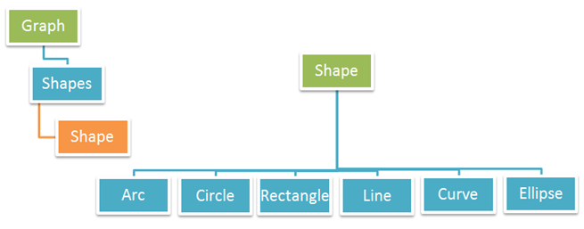

## מהו גרף

הוספת גרפים למסמכי PDF היא משימה נפוצה מאוד עבור מפתחים בעת עבודה עם Adobe Acrobat Writer או אפליקציות אחרות לעיבוד PDF. ישנם סוגים רבים של גרפים שניתן להשתמש בהם באפליקציות PDF.
[Aspose.PDF for .NET](/pdf/net/) תומך גם בהוספת גרפים למסמכי PDF. לשם כך, מסופקת המחלקה Graph. Graph הוא אלמנט ברמת פסקה וניתן להוסיף אותו לאוסף הפסקאות במופע של עמוד. מופע של Graph מכיל אוסף של צורות.

הסוגים הבאים של צורות נתמכים על ידי מחלקת [Graph](https://reference.aspose.com/pdf/net/aspose.pdf.drawing/graph):

- [Arc](/pdf/net/add-arc/) - לפעמים גם נקרא דגל הוא זוג צמוד של קודקודים סמוכים, אך לעיתים גם נקרא קו מוכוון.
- [Circle](/pdf/net/add-circle/) - מציג נתונים באמצעות מעגל המחולק למגזרים. אנו משתמשים בגרף מעגל (הנקרא גם תרשים עוגה) כדי להראות כיצד נתונים מייצגים חלקים של שלם אחד או קבוצה אחת.
- [Curve](/pdf/net/add-curve/) - הוא איחוד מחובר של קווים פרויקטיביים, כל קו נפגש עם שלושה אחרים בנקודות כפולות רגילות.
- [Curve](/pdf/net/add-curve/) - היא איחוד מחובר של קווים פרויקטיביים, כל קו נפגש עם שלושה קווים אחרים בנקודות כפולות רגילות.
- [Line](/pdf/net/add-line) - גרפים של קווים משמשים להצגת נתונים רציפים ויכולים להיות שימושיים בחיזוי אירועים עתידיים כאשר הם מציגים מגמות לאורך זמן.
- [Rectangle](/pdf/net/add-rectangle/) - הוא אחד מהצורות הבסיסיות הרבות שתראה בגרפים, יכול להיות מאוד שימושי בעזרה לך לפתור בעיה.
- [Ellipse](/pdf/net/add-ellipse/) - הוא קבוצת נקודות על מישור, יוצרת צורה עגולה, מעוקלת.

הפרטים הנ"ל מוצגים גם בדמויות שלהלן:

