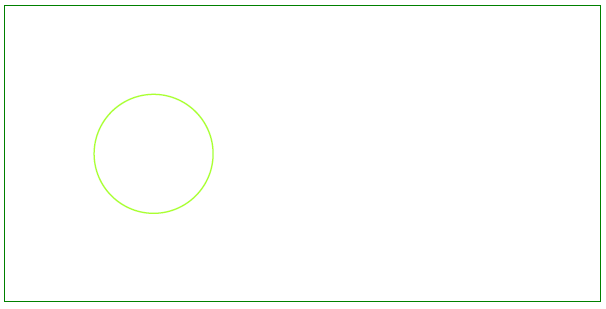

<script type="application/ld+json">
{
    "@context": "https://schema.org",
    "@type": "TechArticle",
    "headline": "הוספת אובייקט מעגל לקובץ PDF",
    "alternativeHeadline": "כיצד ליצור אובייקט מעגל בקובץ PDF",
    "author": {
        "@type": "Person",
        "name":"Anastasiia Holub",
        "givenName": "Anastasiia",
        "familyName": "Holub",
        "url":"https://www.linkedin.com/in/anastasiia-holub-750430225/"
    },
    "genre": "יצירת מסמך PDF",
    "keywords": "pdf, c#, מעגל ב-pdf",
    "wordcount": "302",
    "proficiencyLevel":"מתחיל",
    "publisher": {
        "@type": "Organization",
        "name": "צוות מסמכי Aspose.PDF",
        "url": "https://products.aspose.com/pdf",
        "logo": "https://www.aspose.cloud/templates/aspose/img/products/pdf/aspose_pdf-for-net.svg",
        "alternateName": "Aspose",
        "sameAs": [
            "https://facebook.com/aspose.pdf/",
            "https://twitter.com/asposepdf",
            "https://www.youtube.com/channel/UCmV9sEg_QWYPi6BJJs7ELOg/featured",
            "https://www.linkedin.com/company/aspose",
            "https://stackoverflow.com/questions/tagged/aspose",
            "https://aspose.quora.com/",
            "https://aspose.github.io/"
        ],
        "contactPoint": [
            {
                "@type": "ContactPoint",
                "telephone": "+1 903 306 1676",
                "contactType": "מכירות",
                "areaServed": "US",
                "availableLanguage": "en"
            },
            {
                "@type": "ContactPoint",
                "telephone": "+44 141 628 8900",
                "contactType": "מכירות",
                "areaServed": "GB",
                "availableLanguage": "en"
            },
            {
                "@type": "ContactPoint",
                "telephone": "+61 2 8006 6987",
                "contactType": "מכירות",
                "areaServed": "AU",
                "availableLanguage": "en"
            }
        ]
    },
    "url": "/net/add-circle/",
    "mainEntityOfPage": {
        "@type": "WebPage",
        "@id": "/net/add-circle/"
    },
    "dateModified": "2022-02-04",
    "description": "מאמר זה מסביר כיצד ליצור אובייקט מעגל ב-PDF שלך באמצעות Aspose.PDF עבור .NET."
}
</script>

קטע הקוד הבא עובד גם עם ספריית [Aspose.PDF.Drawing](/pdf/net/drawing/).

## הוספת אובייקט מעגל

כמו גרפים עמודיים, ניתן להשתמש בגרפים מעגליים להצגת נתונים במספר קטגוריות נפרדות. עם זאת, בניגוד לגרפים עמודיים, ניתן להשתמש בגרפים מעגליים רק כאשר יש לך נתונים עבור כל הקטגוריות שמרכיבות את השלם. בואו נסתכל על הוספת אובייקט [מעגל](https://reference.aspose.com/pdf/net/aspose.pdf.drawing/circle) עם Aspose.PDF עבור .NET.

עקוב אחר השלבים למטה:

1. צור מופע [מסמך](https://reference.aspose.com/pdf/net/aspose.pdf/document)

1. צור [אובייקט ציור](https://reference.aspose.com/pdf/net/aspose.pdf.drawing) עם ממדים מסוימים

1. הגדר [גבול](https://reference.aspose.com/pdf/net/aspose.pdf.drawing/graph/properties/border) עבור אובייקט הציור

1. הוסף אובייקט [גרף](https://reference.aspose.com/pdf/net/aspose.pdf.drawing/graph) לאוסף הפסקאות של הדף

1. שמור את קובץ ה-PDF שלנו

```csharp
        public static void Circle()
        {
            // צור מופע מסמך
            var document = new Document();

            // הוסף דף לאוסף הדפים של קובץ ה-PDF
            var page = document.Pages.Add();

            // צור אובייקט ציור עם ממדים מסוימים
            var graph = new Aspose.Pdf.Drawing.Graph(400, 200);
            // הגדר גבול עבור אובייקט הציור
            var borderInfo = new BorderInfo(BorderSide.All, Color.Green);
            graph.Border = borderInfo;

            var circle = new Circle(100, 100, 40);

            circle.GraphInfo.Color = Color.GreenYellow;
            graph.Shapes.Add(circle);

            // הוסף אובייקט גרף לאוסף הפסקאות של הדף
            page.Paragraphs.Add(graph);

            // שמור קובץ PDF
            document.Save(_dataDir + "DrawingCircle1_out.pdf");
        }
```
העיגול שצויר ייראה כך:



## יצירת אובייקט עיגול מלא

דוגמה זו מראה כיצד להוסיף אובייקט עיגול שמלא בצבע.

```csharp
        public static void CircleFilled()
        {
            // יצירת מופע מסמך
            var document = new Document();

            // הוספת דף לאוסף הדפים של קובץ PDF
            var page = document.Pages.Add();

            // יצירת אובייקט ציור עם ממדים מסוימים
            var graph = new Aspose.Pdf.Drawing.Graph(400, 200);

            // הגדרת גבול לאובייקט הציור
            var borderInfo = new BorderInfo(BorderSide.All, Color.Green);
            graph.Border = borderInfo;

            var circle = new Circle(100, 100, 40);
            circle.GraphInfo.Color = Color.GreenYellow;
            circle.GraphInfo.FillColor = Color.Green;
            circle.Text = new TextFragment("Circle");

            graph.Shapes.Add(circle);

            // הוספת אובייקט הגרפ לאוסף הפסקאות של הדף
            page.Paragraphs.Add(graph);

            // שמירת קובץ PDF
            document.Save(_dataDir + "DrawingCircle2_out.pdf");
        }
```
בואו נראה את התוצאה של הוספת מעגל מלא:


