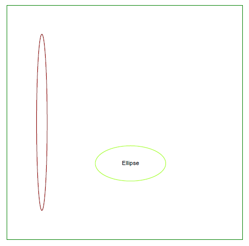
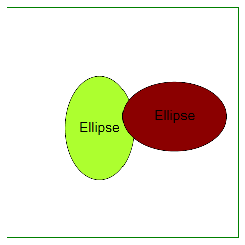

<script type="application/ld+json">
{
    "@context": "https://schema.org",
    "@type": "TechArticle",
    "headline": "הוספת אובייקט אליפסה לקובץ PDF",
    "alternativeHeadline": "כיצד ליצור אובייקט אליפסה בקובץ PDF",
    "author": {
        "@type": "Person",
        "name":"אנסטסיה הולוב",
        "givenName": "אנסטסיה",
        "familyName": "הולוב",
        "url":"https://www.linkedin.com/in/anastasiia-holub-750430225/"
    },
    "genre": "יצירת מסמכי PDF",
    "keywords": "pdf, c#, ellipse in pdf",
    "wordcount": "302",
    "proficiencyLevel":"מתחיל",
    "publisher": {
        "@type": "Organization",
        "name": "צוות מסמכי Aspose.PDF",
        "url": "https://products.aspose.com/pdf",
        "logo": "https://www.aspose.cloud/templates/aspose/img/products/pdf/aspose_pdf-for-net.svg",
        "alternateName": "Aspose",
        "sameAs": [
            "https://facebook.com/aspose.pdf/",
            "https://twitter.com/asposepdf",
            "https://www.youtube.com/channel/UCmV9sEg_QWYPi6BJJs7ELOg/featured",
            "https://www.linkedin.com/company/aspose",
            "https://stackoverflow.com/questions/tagged/aspose",
            "https://aspose.quora.com/",
            "https://aspose.github.io/"
        ],
        "contactPoint": [
            {
                "@type": "ContactPoint",
                "telephone": "+1 903 306 1676",
                "contactType": "מכירות",
                "areaServed": "US",
                "availableLanguage": "en"
            },
            {
                "@type": "ContactPoint",
                "telephone": "+44 141 628 8900",
                "contactType": "מכירות",
                "areaServed": "GB",
                "availableLanguage": "en"
            },
            {
                "@type": "ContactPoint",
                "telephone": "+61 2 8006 6987",
                "contactType": "מכירות",
                "areaServed": "AU",
                "availableLanguage": "en"
            }
        ]
    },
    "url": "/net/add-ellipse/",
    "mainEntityOfPage": {
        "@type": "WebPage",
        "@id": "/net/add-ellipse/"
    },
    "dateModified": "2022-02-04",
    "description": "המאמר מסביר כיצד ליצור אובייקט אליפסה ב-PDF שלך באמצעות Aspose.PDF עבור .NET."
}
</script>
הקוד הבא עובד גם עם ספריית [Aspose.PDF.Drawing](/pdf/net/drawing/).

## הוספת אובייקט אליפסה

Aspose.PDF עבור .NET תומך בהוספת אובייקטי [אליפסה](https://reference.aspose.com/pdf/net/aspose.pdf.drawing/ellipse) למסמכי PDF. הוא גם מציע את האפשרות למלא אובייקט אליפסה בצבע מסוים.

```csharp
 public static void Ellipse()
        {
            // יצירת מופע מסמך
            var document = new Document();

            // הוספת דף לאוסף הדפים של קובץ PDF
            var page = document.Pages.Add();

            // יצירת אובייקט ציור עם ממדים מסוימים
            var graph = new Aspose.Pdf.Drawing.Graph(400, 400);

            // הגדרת מסגרת לאובייקט הציור
            var borderInfo = new BorderInfo(BorderSide.All, Color.Green);
            graph.Border = borderInfo;

            var ellipse1 = new Ellipse(150, 100, 120, 60);
            ellipse1.GraphInfo.Color = Color.GreenYellow;
            ellipse1.Text = new TextFragment("אליפסה");
            graph.Shapes.Add(ellipse1);

            var ellipse2 = new Ellipse(50, 50, 18, 300);
            ellipse2.GraphInfo.Color = Color.DarkRed;

            graph.Shapes.Add(ellipse2);

            // הוספת אובייקט הגרף לאוסף הפסקאות של הדף
            page.Paragraphs.Add(graph);

            // שמירת קובץ PDF
            document.Save(_dataDir + "DrawingEllipse_out.pdf");

        }
```


## יצירת אובייקט אליפסה מלאה

הקטע הבא מראה איך להוסיף אובייקט [אליפסה](https://reference.aspose.com/pdf/net/aspose.pdf.drawing/ellipse) שמולא בצבע.

```csharp
     public static void EllipseFilled()
        {
            // יצירת מופע מסמך
            var document = new Document();

            // הוספת דף לאוסף הדפים של קובץ PDF
            var page = document.Pages.Add();

            // יצירת אובייקט ציור עם מידות מסוימות
            var graph = new Aspose.Pdf.Drawing.Graph(400, 400);

            // הגדרת גבול לאובייקט ציור
            var borderInfo = new BorderInfo(BorderSide.All, Color.Green);
            graph.Border = borderInfo;

            var ellipse1 = new Ellipse(100, 100, 120, 180);
            ellipse1.GraphInfo.FillColor = Color.GreenYellow;
            graph.Shapes.Add(ellipse1);

            var ellipse2 = new Ellipse(200, 150, 180, 120);
            ellipse2.GraphInfo.FillColor = Color.DarkRed;
            graph.Shapes.Add(ellipse2);

            // הוספת אובייקט ציור לאוסף הפסקאות של הדף
            page.Paragraphs.Add(graph);

            // שמירת קובץ PDF
            document.Save(_dataDir + "DrawingEllipse_out.pdf");
        }
```


## הוספת טקסט בתוך האליפסה

Aspose.PDF עבור .NET תומך בהוספת טקסט בתוך אובייקט גרפי. תכונת הטקסט של אובייקט הגרף מאפשרת להגדיר את טקסט האובייקט. קטע הקוד הבא מראה איך להוסיף טקסט בתוך אובייקט מלבן.

```csharp
        public static void EllipseWithText()
        {
            // יצירת מופע מסמך
            var document = new Document();

            // הוספת דף לאוסף הדפים של קובץ PDF
            var page = document.Pages.Add();

            // יצירת אובייקט ציור עם ממדים מסוימים
            var graph = new Aspose.Pdf.Drawing.Graph(400, 400);
            // הגדרת גבול לאובייקט הציור
            var borderInfo = new BorderInfo(BorderSide.All, Color.Green);
            graph.Border = borderInfo;

            var textFragment = new TextFragment("Ellipse");
            textFragment.TextState.Font = FontRepository.FindFont("Helvetica");
            textFragment.TextState.FontSize = 24;

            var ellipse1 = new Ellipse(100, 100, 120, 180);
            ellipse1.GraphInfo.FillColor = Color.GreenYellow;
            ellipse1.Text = textFragment;
            graph.Shapes.Add(ellipse1);


            var ellipse2 = new Ellipse(200, 150, 180, 120);
            ellipse2.GraphInfo.FillColor = Color.DarkRed;
            ellipse2.Text = textFragment;
            graph.Shapes.Add(ellipse2);

            // הוספת אובייקט הגרף לאוסף הפסקאות של הדף
            page.Paragraphs.Add(graph);

            // שמירת קובץ PDF
            document.Save(_dataDir + "DrawingEllipseText_out.pdf");

        }
 ```


<script type="application/ld+json">
{
    "@context": "http://schema.org",
    "@type": "SoftwareApplication",
    "name": "Aspose.PDF for .NET Library",
    "image": "https://www.aspose.cloud/templates/aspose/img/products/pdf/aspose_pdf-for-net.svg",
    "url": "https://www.aspose.com/",
    "publisher": {
        "@type": "Organization",
        "name": "Aspose.PDF",
        "url": "https://products.aspose.com/pdf",
        "logo": "https://www.aspose.cloud/templates/aspose/img/products/pdf/aspose_pdf-for-net.svg",
        "alternateName": "Aspose",
        "sameAs": [
            "https://facebook.com/aspose.pdf/",
            "https://twitter.com/asposepdf",
            "https://www.youtube.com/channel/UCmV9sEg_QWYPi6BJJs7ELOg/featured",
            "https://www.linkedin.com/company/aspose",
            "https://stackoverflow.com/questions/tagged/aspose",
            "https://aspose.quora.com/",
            "https://aspose.github.io/"
        ],
        "contactPoint": [
            {
                "@type": "ContactPoint",
                "telephone": "+1 903 306 1676",
                "contactType": "מכירות",
                "areaServed": "US",
                "availableLanguage": "en"
            },
            {
                "@type": "ContactPoint",
                "telephone": "+44 141 628 8900",
                "contactType": "מכירות",
                "areaServed": "GB",
                "availableLanguage": "en"
            },
            {
                "@type": "ContactPoint",
                "telephone": "+61 2 8006 6987",
                "contactType": "מכירות",
                "areaServed": "AU",
                "availableLanguage": "en"
            }
        ]
    },
    "offers": {
        "@type": "Offer",
        "price": "1199",
        "priceCurrency": "USD"
    },
    "applicationCategory": "ספרייה לעיבוד PDF עבור .NET",
    "downloadUrl": "https://www.nuget.org/packages/Aspose.PDF/",
    "operatingSystem": "Windows, MacOS, Linux",
    "screenshot": "https://docs.aspose.com/pdf/net/create-pdf-document/screenshot.png",
    "softwareVersion": "2022.1",
    "aggregateRating": {
        "@type": "AggregateRating",
        "ratingValue": "5",
        "ratingCount": "16"
    }
}
</script>


