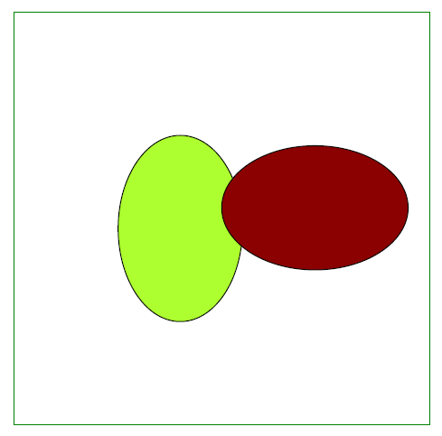
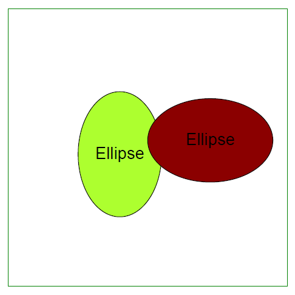

<script type="application/ld+json">
{
    "@context": "https://schema.org",
    "@type": "TechArticle",
    "headline": "PDF 파일에 타원 객체 추가",
    "alternativeHeadline": "PDF 파일에서 타원 객체 생성 방법",
    "author": {
        "@type": "Person",
        "name":"Anastasiia Holub",
        "givenName": "Anastasiia",
        "familyName": "Holub",
        "url":"https://www.linkedin.com/in/anastasiia-holub-750430225/"
    },
    "genre": "PDF 문서 생성",
    "keywords": "PDF, C#, PDF 내 타원",
    "wordcount": "302",
    "proficiencyLevel":"초급",
    "publisher": {
        "@type": "Organization",
        "name": "Aspose.PDF Doc Team",
        "url": "https://products.aspose.com/pdf",
        "logo": "https://www.aspose.cloud/templates/aspose/img/products/pdf/aspose_pdf-for-net.svg",
        "alternateName": "Aspose",
        "sameAs": [
            "https://facebook.com/aspose.pdf/",
            "https://twitter.com/asposepdf",
            "https://www.youtube.com/channel/UCmV9sEg_QWYPi6BJJs7ELOg/featured",
            "https://www.linkedin.com/company/aspose",
            "https://stackoverflow.com/questions/tagged/aspose",
            "https://aspose.quora.com/",
            "https://aspose.github.io/"
        ],
        "contactPoint": [
            {
                "@type": "ContactPoint",
                "telephone": "+1 903 306 1676",
                "contactType": "sales",
                "areaServed": "US",
                "availableLanguage": "en"
            },
            {
                "@type": "ContactPoint",
                "telephone": "+44 141 628 8900",
                "contactType": "sales",
                "areaServed": "GB",
                "availableLanguage": "en"
            },
            {
                "@type": "ContactPoint",
                "telephone": "+61 2 8006 6987",
                "contactType": "sales",
                "areaServed": "AU",
                "availableLanguage": "en"
            }
        ]
    },
    "url": "/net/add-ellipse/",
    "mainEntityOfPage": {
        "@type": "WebPage",
        "@id": "/net/add-ellipse/"
    },
    "dateModified": "2022-02-04",
    "description": "이 글은 Aspose.PDF for .NET을 사용하여 PDF에 타원 객체를 생성하는 방법을 설명합니다."
}
</script>

다음 코드 스니펫은 [Aspose.PDF.Drawing](/pdf/net/drawing/) 라이브러리와도 함께 작동합니다.

## 타원 객체 추가

Aspose.PDF for .NET은 PDF 문서에 [Ellipse](https://reference.aspose.com/pdf/net/aspose.pdf.drawing/ellipse) 객체를 추가하는 것을 지원합니다. 또한 타원 객체를 특정 색상으로 채우는 기능을 제공합니다.

```csharp
 public static void Ellipse()
        {
            // 문서 인스턴스 생성
            var document = new Document();

            // PDF 파일의 페이지 컬렉션에 페이지 추가
            var page = document.Pages.Add();

            // 특정 크기의 Drawing 객체 생성
            var graph = new Aspose.Pdf.Drawing.Graph(400, 400);

            // Drawing 객체에 테두리 설정
            var borderInfo = new BorderInfo(BorderSide.All, Color.Green);
            graph.Border = borderInfo;

            var ellipse1 = new Ellipse(150, 100, 120, 60);
            ellipse1.GraphInfo.Color = Color.GreenYellow;
            ellipse1.Text = new TextFragment("Ellipse");
            graph.Shapes.Add(ellipse1);

            var ellipse2 = new Ellipse(50, 50, 18, 300);
            ellipse2.GraphInfo.Color = Color.DarkRed;

            graph.Shapes.Add(ellipse2);

            // 페이지의 단락 컬렉션에 Graph 객체 추가
            page.Paragraphs.Add(graph);

            // PDF 파일 저장
            document.Save(_dataDir + "DrawingEllipse_out.pdf");

        }
```


## 채워진 타원 객체 생성

다음 코드 조각은 색상으로 채워진 [타원](https://reference.aspose.com/pdf/net/aspose.pdf.drawing/ellipse) 객체를 추가하는 방법을 보여줍니다.

```csharp
     public static void EllipseFilled()
        {
            // 문서 인스턴스 생성
            var document = new Document();

            // PDF 파일의 페이지 컬렉션에 페이지 추가
            var page = document.Pages.Add();

            // 특정 차원을 가진 드로잉 객체 생성
            var graph = new Aspose.Pdf.Drawing.Graph(400, 400);

            // 드로잉 객체에 테두리 설정
            var borderInfo = new BorderInfo(BorderSide.All, Color.Green);
            graph.Border = borderInfo;

            var ellipse1 = new Ellipse(100, 100, 120, 180);
            ellipse1.GraphInfo.FillColor = Color.GreenYellow;
            graph.Shapes.Add(ellipse1);

            var ellipse2 = new Ellipse(200, 150, 180, 120);
            ellipse2.GraphInfo.FillColor = Color.DarkRed;
            graph.Shapes.Add(ellipse2);

            // 그래프 객체를 페이지의 단락 컬렉션에 추가
            page.Paragraphs.Add(graph);

            // PDF 파일 저장
            document.Save(_dataDir + "DrawingEllipse_out.pdf");
        }
```


## 타원 안에 텍스트 추가하기

Aspose.PDF for .NET은 그래프 객체 안에 텍스트를 추가할 수 있도록 지원합니다. 그래프 객체의 Text 속성은 그래프 객체의 텍스트를 설정할 수 있는 옵션을 제공합니다. 다음 코드 조각은 사각형 객체 안에 텍스트를 추가하는 방법을 보여줍니다.

```csharp
        public static void EllipseWithText()
        {
            // 문서 인스턴스 생성
            var document = new Document();

            // PDF 파일의 페이지 컬렉션에 페이지 추가
            var page = document.Pages.Add();

            // 특정 치수의 Drawing 객체 생성
            var graph = new Aspose.Pdf.Drawing.Graph(400, 400);
            // Drawing 객체에 테두리 설정
            var borderInfo = new BorderInfo(BorderSide.All, Color.Green);
            graph.Border = borderInfo;

            var textFragment = new TextFragment("타원");
            textFragment.TextState.Font = FontRepository.FindFont("Helvetica");
            textFragment.TextState.FontSize = 24;

            var ellipse1 = new Ellipse(100, 100, 120, 180);
            ellipse1.GraphInfo.FillColor = Color.GreenYellow;
            ellipse1.Text = textFragment;
            graph.Shapes.Add(ellipse1);


            var ellipse2 = new Ellipse(200, 150, 180, 120);
            ellipse2.GraphInfo.FillColor = Color.DarkRed;
            ellipse2.Text = textFragment;
            graph.Shapes.Add(ellipse2);

            // 페이지의 단락 컬렉션에 그래프 객체 추가
            page.Paragraphs.Add(graph);

            // PDF 파일 저장
            document.Save(_dataDir + "DrawingEllipseText_out.pdf");

        }
 ```


<script type="application/ld+json">
{
    "@context": "http://schema.org",
    "@type": "SoftwareApplication",
    "name": "Aspose.PDF for .NET Library",
    "image": "https://www.aspose.cloud/templates/aspose/img/products/pdf/aspose_pdf-for-net.svg",
    "url": "https://www.aspose.com/",
    "publisher": {
        "@type": "Organization",
        "name": "Aspose.PDF",
        "url": "https://products.aspose.com/pdf",
        "logo": "https://www.aspose.cloud/templates/aspose/img/products/pdf/aspose_pdf-for-net.svg",
        "alternateName": "Aspose",
        "sameAs": [
            "https://facebook.com/aspose.pdf/",
            "https://twitter.com/asposepdf",
            "https://www.youtube.com/channel/UCmV9sEg_QWYPi6BJJs7ELOg/featured",
            "https://www.linkedin.com/company/aspose",
            "https://stackoverflow.com/questions/tagged/aspose",
            "https://aspose.quora.com/",
            "https://aspose.github.io/"
        ],
        "contactPoint": [
            {
                "@type": "ContactPoint",
                "telephone": "+1 903 306 1676",
                "contactType": "판매",
                "areaServed": "미국",
                "availableLanguage": "영어"
            },
            {
                "@type": "ContactPoint",
                "telephone": "+44 141 628 8900",
                "contactType": "판매",
                "areaServed": "영국",
                "availableLanguage": "영어"
            },
            {
                "@type": "ContactPoint",
                "telephone": "+61 2 8006 6987",
                "contactType": "판매",
                "areaServed": "호주",
                "availableLanguage": "영어"
            }
        ]
    },
    "offers": {
        "@type": "Offer",
        "price": "1199",
        "priceCurrency": "USD"
    },
    "applicationCategory": ".NET을 위한 PDF 조작 라이브러리",
    "downloadUrl": "https://www.nuget.org/packages/Aspose.PDF/",
    "operatingSystem": "Windows, MacOS, Linux",
    "screenshot": "https://docs.aspose.com/pdf/net/create-pdf-document/screenshot.png",
    "softwareVersion": "2022.1",
    "aggregateRating": {
        "@type": "AggregateRating",
        "ratingValue": "5",
        "ratingCount": "16"
    }
}
</script>


