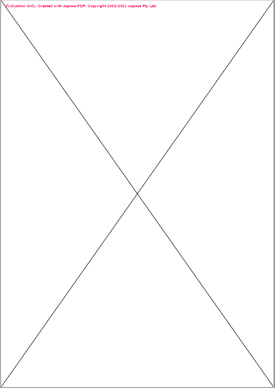

<script type="application/ld+json">
{
    "@context": "https://schema.org",
    "@type": "TechArticle",
    "headline": "Ajouter un objet ligne au fichier PDF",
    "alternativeHeadline": "Comment créer un objet ligne dans un fichier PDF",
    "author": {
        "@type": "Person",
        "name":"Anastasiia Holub",
        "givenName": "Anastasiia",
        "familyName": "Holub",
        "url":"https://www.linkedin.com/in/anastasiia-holub-750430225/"
    },
    "genre": "génération de documents PDF",
    "keywords": "pdf, c#, ligne dans pdf",
    "wordcount": "302",
    "proficiencyLevel":"Débutant",
    "publisher": {
        "@type": "Organization",
        "name": "Équipe de documentation Aspose.PDF",
        "url": "https://products.aspose.com/pdf",
        "logo": "https://www.aspose.cloud/templates/aspose/img/products/pdf/aspose_pdf-for-net.svg",
        "alternateName": "Aspose",
        "sameAs": [
            "https://facebook.com/aspose.pdf/",
            "https://twitter.com/asposepdf",
            "https://www.youtube.com/channel/UCmV9sEg_QWYPi6BJJs7ELOg/featured",
            "https://www.linkedin.com/company/aspose",
            "https://stackoverflow.com/questions/tagged/aspose",
            "https://aspose.quora.com/",
            "https://aspose.github.io/"
        ],
        "contactPoint": [
            {
                "@type": "ContactPoint",
                "telephone": "+1 903 306 1676",
                "contactType": "ventes",
                "areaServed": "US",
                "availableLanguage": "en"
            },
            {
                "@type": "ContactPoint",
                "telephone": "+44 141 628 8900",
                "contactType": "ventes",
                "areaServed": "GB",
                "availableLanguage": "en"
            },
            {
                "@type": "ContactPoint",
                "telephone": "+61 2 8006 6987",
                "contactType": "ventes",
                "areaServed": "AU",
                "availableLanguage": "en"
            }
        ]
    },
    "url": "/net/add-line/",
    "mainEntityOfPage": {
        "@type": "WebPage",
        "@id": "/net/add-line/"
    },
    "dateModified": "2022-02-04",
    "description": "Cet article explique comment créer un objet ligne dans votre PDF en utilisant Aspose.PDF pour .NET."
}
</script>

Le code suivant fonctionne également avec la bibliothèque [Aspose.PDF.Drawing](/pdf/net/drawing/).

## Ajouter un objet Ligne

Aspose.PDF pour .NET prend en charge la fonctionnalité d'ajouter des objets graphiques (par exemple un graphique, une ligne, un rectangle, etc.) aux documents PDF. Vous avez également la possibilité d'ajouter un objet [Ligne](https://reference.aspose.com/pdf/net/aspose.pdf.drawing/line) où vous pouvez également spécifier le motif en pointillé, la couleur et d'autres formatages pour l'élément Ligne.

Suivez les étapes ci-dessous :

1. Créez un nouveau [Document](https://reference.aspose.com/pdf/net/aspose.pdf/document) PDF

1. Ajoutez une [Page](https://reference.aspose.com/pdf/net/aspose.pdf/page) à la collection de pages du fichier PDF

1. Créez une instance [Graph](https://reference.aspose.com/pdf/net/aspose.pdf.drawing/graph).

1. Ajoutez l'objet Graph à la collection de paragraphes de l'instance de page.

1. Créez une instance [Rectangle](https://reference.aspose.com/pdf/net/aspose.pdf.drawing/rectangle).

1. Définissez la largeur de ligne.
1. Enregistrez votre fichier PDF.

Le code suivant montre comment ajouter un objet [Rectangle](https://reference.aspose.com/pdf/net/aspose.pdf.drawing/rectangle) rempli de couleur.

```csharp
        public static void AddLineObjectToPDF()
        {
            // Créer une instance de Document
            var document = new Document();

            // Ajouter une page à la collection de pages du fichier PDF
            var page = document.Pages.Add();

            // Créer une instance de Graph
            var graph = new Aspose.Pdf.Drawing.Graph(100, 400);

            // Ajouter l'objet graph à la collection de paragraphes de l'instance de page
            page.Paragraphs.Add(graph);

            // Créer une instance de Rectangle
            var line = new Line(new float[] { 100, 100, 200, 100 });

            // Spécifier la couleur de remplissage pour l'objet Graph
            line.GraphInfo.DashArray = new int[] { 0, 1, 0 };
            line.GraphInfo.DashPhase = 1;

            // Ajouter l'objet rectangle à la collection de formes de l'objet Graph
            graph.Shapes.Add(line);

            // Enregistrer le fichier PDF
            document.Save(_dataDir + "AddLineObject_out.pdf");
        }
```


## Comment ajouter une ligne pointillée à votre document PDF

```csharp
        public static void DashLengthInBlackAndDashLengthInWhite()
        {
            // Créer une instance de Document
            var document = new Document();

            // Ajouter une page à la collection de pages du fichier PDF
            var page = document.Pages.Add();

            // Créer un objet de dessin avec des dimensions spécifiques
            var canvas = new Aspose.Pdf.Drawing.Graph(100, 400);
            // Ajouter l'objet de dessin à la collection de paragraphes de l'instance de page
            page.Paragraphs.Add(canvas);

            // Créer un objet Ligne
            var line = new Line(new float[] { 100, 100, 200, 100 });
            // Définir la couleur pour l'objet Ligne
            line.GraphInfo.Color = Color.Red;
            // Spécifier le tableau de pointillés pour l'objet ligne
            line.GraphInfo.DashArray = new int[] { 0, 1, 0 };
            // Définir la phase de pointillés pour l'instance Ligne
            line.GraphInfo.DashPhase = 1;
            // Ajouter la ligne à la collection de formes de l'objet de dessin
            canvas.Shapes.Add(line);
            // Sauvegarder le fichier PDF
            document.Save(_dataDir + "DashLengthInBlackAndDashLengthInWhite_out.pdf");
        }
```
Vérifions le résultat :


## Dessiner une ligne sur toute la page

Nous pouvons également utiliser l'objet ligne pour dessiner une croix partant du coin inférieur gauche jusqu'au coin supérieur droit et du coin supérieur gauche au coin inférieur droit.

Veuillez regarder le morceau de code suivant pour accomplir cette exigence.

```csharp
   public static void ExampleLineAcrossPage()
        {

            // Créer une instance de Document
            var document = new Document();

            // Ajouter une page à la collection de pages du fichier PDF
            var page = document.Pages.Add();
            // Définir la marge de la page sur tous les côtés à 0

            page.PageInfo.Margin.Left = 0;
            page.PageInfo.Margin.Right = 0;
            page.PageInfo.Margin.Bottom = 0;
            page.PageInfo.Margin.Top = 0;

            // Créer un objet Graph avec une largeur et une hauteur égales aux dimensions de la page
            var graph = new Aspose.Pdf.Drawing.Graph(
                (float)page.PageInfo.Width,
                (float)page.PageInfo.Height);

            // Créer le premier objet ligne partant du coin inférieur gauche vers le coin supérieur droit de la page
            var line = new Line(
                    new float[]{
                        (float)page.Rect.LLX, 0,
                        (float)page.PageInfo.Width,
                        (float)page.Rect.URY });

            // Ajouter la ligne à la collection de formes de l'objet Graph
            graph.Shapes.Add(line);
            // Dessiner une ligne du coin supérieur gauche de la page au coin inférieur droit de la page
            var line2 = new Line(
                new float[]{ 0,
                    (float) page.Rect.URY,
                    (float) page.PageInfo.Width,
                    (float) page.Rect.LLX });

            // Ajouter la ligne à la collection de formes de l'objet Graph
            graph.Shapes.Add(line2);

            // Ajouter l'objet Graph à la collection de paragraphes de la page
            page.Paragraphs.Add(graph);

            // Enregistrer le fichier PDF
            document.Save(_dataDir + "ExampleLineAcrossPage_out.pdf");
        }
```


<script type="application/ld+json">
{
    "@context": "http://schema.org",
    "@type": "SoftwareApplication",
    "name": "Aspose.PDF for .NET Library",
    "image": "https://www.aspose.cloud/templates/aspose/img/products/pdf/aspose_pdf-for-net.svg",
    "url": "https://www.aspose.com/",
    "publisher": {
        "@type": "Organization",
        "name": "Aspose.PDF",
        "url": "https://products.aspose.com/pdf",
        "logo": "https://www.aspose.cloud/templates/aspose/img/products/pdf/aspose_pdf-for-net.svg",
        "alternateName": "Aspose",
        "sameAs": [
            "https://facebook.com/aspose.pdf/",
            "https://twitter.com/asposepdf",
            "https://www.youtube.com/channel/UCmV9sEg_QWYPi6BJJs7ELOg/featured",
            "https://www.linkedin.com/company/aspose",
            "https://stackoverflow.com/questions/tagged/aspose",
            "https://aspose.quora.com/",
            "https://aspose.github.io/"
        ],
        "contactPoint": [
            {
                "@type": "ContactPoint",
                "telephone": "+1 903 306 1676",
                "contactType": "ventes",
                "areaServed": "US",
                "availableLanguage": "en"
            },
            {
                "@type": "ContactPoint",
                "telephone": "+44 141 628 8900",
                "contactType": "ventes",
                "areaServed": "GB",
                "availableLanguage": "en"
            },
            {
                "@type": "ContactPoint",
                "telephone": "+61 2 8006 6987",
                "contactType": "ventes",
                "areaServed": "AU",
                "availableLanguage": "en"
            }
        ]
    },
    "offers": {
        "@type": "Offer",
        "price": "1199",
        "priceCurrency": "USD"
    },
    "applicationCategory": "Bibliothèque de manipulation de PDF pour .NET",
    "downloadUrl": "https://www.nuget.org/packages/Aspose.PDF/",
    "operatingSystem": "Windows, MacOS, Linux",
    "screenshot": "https://docs.aspose.com/pdf/net/create-pdf-document/screenshot.png",
    "softwareVersion": "2022.1",
    "aggregateRating": {
        "@type": "AggregateRating",
        "ratingValue": "5",
        "ratingCount": "16"
    }
}
</script>


