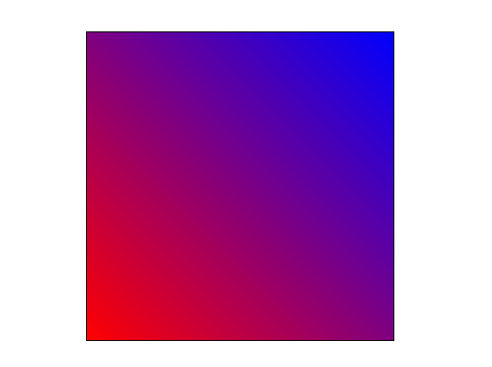
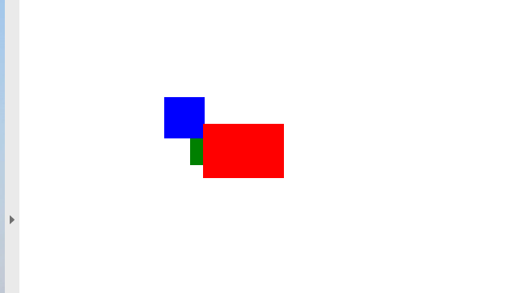

<script type="application/ld+json">
{
    "@context": "https://schema.org",
    "@type": "TechArticle",
    "headline": "הוספת אובייקט מלבן לקובץ PDF",
    "alternativeHeadline": "כיצד ליצור אובייקט מלבן בקובץ PDF",
    "author": {
        "@type": "Person",
        "name":"Anastasiia Holub",
        "givenName": "Anastasiia",
        "familyName": "Holub",
        "url":"https://www.linkedin.com/in/anastasiia-holub-750430225/"
    },
    "genre": "יצירת מסמכי PDF",
    "keywords": "pdf, c#, מלבן ב-pdf",
    "wordcount": "302",
    "proficiencyLevel":"מתחיל",
    "publisher": {
        "@type": "Organization",
        "name": "צוות מסמכי Aspose.PDF",
        "url": "https://products.aspose.com/pdf",
        "logo": "https://www.aspose.cloud/templates/aspose/img/products/pdf/aspose_pdf-for-net.svg",
        "alternateName": "Aspose",
        "sameAs": [
            "https://facebook.com/aspose.pdf/",
            "https://twitter.com/asposepdf",
            "https://www.youtube.com/channel/UCmV9sEg_QWYPi6BJJs7ELOg/featured",
            "https://www.linkedin.com/company/aspose",
            "https://stackoverflow.com/questions/tagged/aspose",
            "https://aspose.quora.com/",
            "https://aspose.github.io/"
        ],
        "contactPoint": [
            {
                "@type": "ContactPoint",
                "telephone": "+1 903 306 1676",
                "contactType": "מכירות",
                "areaServed": "US",
                "availableLanguage": "en"
            },
            {
                "@type": "ContactPoint",
                "telephone": "+44 141 628 8900",
                "contactType": "מכירות",
                "areaServed": "GB",
                "availableLanguage": "en"
            },
            {
                "@type": "ContactPoint",
                "telephone": "+61 2 8006 6987",
                "contactType": "מכירות",
                "areaServed": "AU",
                "availableLanguage": "en"
            }
        ]
    },
    "url": "/net/add-rectangle/",
    "mainEntityOfPage": {
        "@type": "WebPage",
        "@id": "/net/add-rectangle/"
    },
    "dateModified": "2022-02-04",
    "description": "המאמר מסביר כיצד ליצור אובייקט מלבן ב-PDF שלך באמצעות Aspose.PDF עבור .NET."
}
</script>
הקטע הבא בקוד עובד גם עם ספריית [Aspose.PDF.Drawing](/pdf/net/drawing/).

## הוספת אובייקט מלבן

Aspose.PDF עבור .NET תומך בתכונה להוספת אובייקטים גרפיים (לדוגמה גרף, קו, מלבן וכו') למסמכי PDF. יש לך גם את היתרון להוסיף אובייקט [מלבן](https://reference.aspose.com/pdf/net/aspose.pdf.drawing/rectangle) שם אתה מציע גם את התכונה למלא את אובייקט המלבן בצבע מסוים, לשלוט בסדר Z, להוסיף מילוי צבע גרדיאנטי וכו'.

ראשית, בואו נבחן את האפשרות ליצירת אובייקט מלבן.

עקוב אחר השלבים למטה:

1. צור מסמך [חדש](https://reference.aspose.com/pdf/net/aspose.pdf/document)

1. הוסף [דף](https://reference.aspose.com/pdf/net/aspose.pdf/page) לאוסף הדפים של קובץ PDF

1. הוסף [קטע טקסט](https://reference.aspose.com/pdf/net/aspose.pdf/texfragment) לאוסף הפסקאות של מופע הדף

1. צור מופע [גרף](https://reference.aspose.com/pdf/net/aspose.pdf.drawing/graph)

1.
1. צור מופע מלבן

1. הוסף אובייקט [מלבן](https://reference.aspose.com/pdf/net/aspose.pdf.drawing/rectangle) לאוסף הצורות של אובייקט גרף

1. הוסף אובייקט גרף לאוסף הפסקאות של מופע דף

1. הוסף [קטע טקסט](https://reference.aspose.com/pdf/net/aspose.pdf/texfragment) לאוסף הפסקאות של מופע דף

1. ושמור את קובץ ה-PDF שלך

```csharp
 private static void AddRectangle(Page page, float x, float y, float width, float height, Color color, int zindex)
        {
            // צור אובייקט גרף עם ממדים זהים לאלו שצוינו לאובייקט מלבן
            Aspose.Pdf.Drawing.Graph graph = new Aspose.Pdf.Drawing.Graph(width, height)
            {
                // האם ניתן לשנות את מיקום המופע גרף
                IsChangePosition = false,
                // הגדר את מיקום הצד השמאלי למופע גרף
                Left = x,
                // הגדר את מיקום החלק העליון לאובייקט גרף
                Top = y
            };
            // הוסף מלבן לתוך "הגרף"
            Rectangle rect = new Rectangle(0, 0, width, height);
            // הגדר צבע מילוי למלבן
            rect.GraphInfo.FillColor = color;
            // צבע של אובייקט הגרף
            rect.GraphInfo.Color = color;
            // הוסף מלבן לאוסף הצורות של מופע הגרף
            graph.Shapes.Add(rect);
            // הגדר Z-Index לאובייקט המלבן
            graph.ZIndex = zindex;
            // הוסף גרף לאוסף הפסקאות של אובייקט הדף
            page.Paragraphs.Add(graph);
        }
```


## יצירת אובייקט מלבן מלא

Aspose.PDF עבור .NET מציעה גם את האפשרות למלא אובייקט מלבן בצבע מסוים.

הקטע קוד הבא מראה כיצד להוסיף אובייקט [מלבן](https://reference.aspose.com/pdf/net/aspose.pdf.drawing/rectangle) שמולא בצבע.

```csharp
    {
        private const string _dataDir = "C:\\Samples\\";
        public static void RectangleFilled()
        {
            // יצירת מופע מסמך
            var doc = new Document();

            // הוספת דף לאוסף הדפים של קובץ ה-PDF
            var page = doc.Pages.Add();
            // יצירת מופע גרף
            var graph = new Aspose.Pdf.Drawing.Graph(100, 400);

            // הוספת אובייקט הגרף לאוסף הפסקאות של מופע הדף
            page.Paragraphs.Add(graph);

            // יצירת מופע מלבן
            var rect = new Rectangle(100, 100, 200, 120);

            // ציון צבע מילוי עבור אובייקט הגרף
            rect.GraphInfo.FillColor = Color.Red;

            // הוספת אובייקט המלבן לאוסף הצורות של אובייקט הגרף
            graph.Shapes.Add(rect);

            // שמירת קובץ ה-PDF
            doc.Save(_dataDir + "CreateFilledRectangle_out.pdf");
        }
```
הסתכל על התוצאה של מלבן שמולא בצבע סולידי:


## הוספת ציור עם מילוי גרדיאנט

Aspose.PDF עבור .NET תומך בתכונה להוסיף עצמים גרפיים למסמכי PDF ולעיתים יש צורך למלא עצמים גרפיים בצבע גרדיאנט. כדי למלא עצמים גרפיים בצבע גרדיאנט, עלינו להגדיר setPatterColorSpace עם אובייקט gradientAxialShading כפי שמוצג להלן.

הקטע קוד הבא מראה כיצד להוסיף אובייקט [מלבן](https://reference.aspose.com/pdf/net/aspose.pdf.drawing/rectangle) שמולא בצבע גרדיאנט.

```csharp
 public static void CreateFilledRectangletGradientFill()
        {
            // יצירת מופע של מסמך
            var doc = new Document();

            // הוספת דף לאוסף הדפים של קובץ ה-PDF
            var page = doc.Pages.Add();
            // יצירת מופע של גרף
            var graph = new Aspose.Pdf.Drawing.Graph(400, 400);
            // הוספת אובייקט הגרף לאוסף הפסקאות של מופע הדף
            page.Paragraphs.Add(graph);
            // יצירת מופע של מלבן
            var rect = new Rectangle(0, 0, 300, 300);
            // הגדרת צבע מילוי לאובייקט הגרף
            var gradientColor = new Color();
            var gradientSettings = new GradientAxialShading(Color.Red, Color.Blue)
            {
                Start = new Point(0, 0),
                End = new Point(350, 350)
            };
            gradientColor.PatternColorSpace = gradientSettings;
            rect.GraphInfo.FillColor = gradientColor;

            // הוספת אובייקט המלבן לאוסף הצורות של אובייקט הגרף
            graph.Shapes.Add(rect);

            // שמירת קובץ ה-PDF
            doc.Save(_dataDir + "CreateFilledRectangle_out.pdf");
        }
```


## יצירת מלבן עם ערוץ אלפא של צבע

Aspose.PDF עבור .NET תומך במילוי אובייקט מלבן בצבע מסוים. לאובייקט מלבן יכול גם להיות ערוץ צבע אלפא כדי לתת מראה שקוף. קטע הקוד הבא מראה כיצד להוסיף אובייקט [מלבן](https://reference.aspose.com/pdf/net/aspose.pdf.drawing/rectangle) עם ערוץ צבע אלפא.

פיקסלים של התמונה יכולים לאחסן מידע על השקיפות שלהם יחד עם ערך הצבע. זה מאפשר ליצור תמונות עם אזורים שקופים או חצי שקופים.

במקום להפוך צבע לשקוף, כל פיקסל שומר מידע על כמה הוא אטום. נתוני האטימות הזו נקראים ערוץ אלפא ולרוב נשמרים אחרי ערוצי הצבע של הפיקסל.

```csharp
     public static void RectangleFilled_AlphaChannel()
        {
            // יצירת מופע מסמך
            var doc = new Document();

            // הוספת דף לאוסף הדפים של קובץ PDF
            var page = doc.Pages.Add();
            // יצירת מופע גרף
            var graph = new Aspose.Pdf.Drawing.Graph(100, 400);
            // הוספת אובייקט הגרף לאוסף הפסקאות של מופע הדף
            page.Paragraphs.Add(graph);
            // יצירת מופע מלבן
            var rect = new Rectangle(100, 100, 200, 120);
            // ציון צבע מילוי עבור אובייקט הגרף
            rect.GraphInfo.FillColor = Color.FromArgb(128, 244, 180, 0);

            // הוספת אובייקט המלבן לאוסף הצורות של אובייקט הגרף
            graph.Shapes.Add(rect);

            // יצירת אובייקט מלבן שני
            var rect1 = new Rectangle(200, 150, 200, 100);
            rect1.GraphInfo.FillColor = Color.FromArgb(160, 120, 0, 120);
            graph.Shapes.Add(rect1);

            // הוספת מופע הגרף לאוסף הפסקאות של מופע הדף
            page.Paragraphs.Add(graph);

            // שמירת קובץ PDF
            doc.Save(_dataDir + "CreateFilledRectangle_out.pdf");
        }
```


## שליטה בסדר Z של מלבן

Aspose.PDF עבור .NET תומך בתכונה להוספת אובייקטים גרפיים (לדוגמה גרף, קו, מלבן וכו') למסמכי PDF. כאשר מוסיפים יותר ממופע אחד של אותו אובייקט בתוך קובץ PDF, ניתן לשלוט בסדר ההצגה שלהם על ידי ציון ה-Z-Order. ה-Z-Order משמש גם כאשר יש צורך להציג אובייקטים אחד מעל השני.

הקטע קוד הבא מציג את השלבים להצגת אובייקטים מסוג [מלבן](https://reference.aspose.com/pdf/net/aspose.pdf.drawing/rectangle) אחד מעל השני.

```csharp
 public static void AddRectangleZOrder()
        {
            // יצירת אובייקט מחלקת מסמך
            Document doc1 = new Document();
            /// הוספת דף לאוסף הדפים של קובץ PDF
            Page page1 = doc1.Pages.Add();
            // הגדרת גודל הדף של PDF
            page1.SetPageSize(375, 300);
            // הגדרת שוליים שמאליים לאובייקט הדף כ-0
            page1.PageInfo.Margin.Left = 0;
            // הגדרת שוליים עליונים של אובייקט הדף כ-0
            page1.PageInfo.Margin.Top = 0;
            // יצירת מלבן חדש עם צבע אדום, Z-Order כ-0 ומידות מסוימות
            AddRectangle(page1, 50, 40, 60, 40, Color.Red, 2);
            // יצירת מלבן חדש עם צבע כחול, Z-Order כ-0 ומידות מסוימות
            AddRectangle(page1, 20, 20, 30, 30, Color.Blue, 1);
            // יצירת מלבן חדש עם צבע ירוק, Z-Order כ-0 ומידות מסוימות
            AddRectangle(page1, 40, 40, 60, 30, Color.Green, 0);
            // שמירת קובץ PDF המתקבל
            doc1.Save(_dataDir + "ControlRectangleZOrder_out.pdf");
        }
```


<script type="application/ld+json">
{
    "@context": "http://schema.org",
    "@type": "SoftwareApplication",
    "name": "Aspose.PDF for .NET Library",
    "image": "https://www.aspose.cloud/templates/aspose/img/products/pdf/aspose_pdf-for-net.svg",
    "url": "https://www.aspose.com/",
    "publisher": {
        "@type": "Organization",
        "name": "Aspose.PDF",
        "url": "https://products.aspose.com/pdf",
        "logo": "https://www.aspose.cloud/templates/aspose/img/products/pdf/aspose_pdf-for-net.svg",
        "alternateName": "Aspose",
        "sameAs": [
            "https://facebook.com/aspose.pdf/",
            "https://twitter.com/asposepdf",
            "https://www.youtube.com/channel/UCmV9sEg_QWYPi6BJJs7ELOg/featured",
            "https://www.linkedin.com/company/aspose",
            "https://stackoverflow.com/questions/tagged/aspose",
            "https://aspose.quora.com/",
            "https://aspose.github.io/"
        ],
        "contactPoint": [
            {
                "@type": "ContactPoint",
                "telephone": "+1 903 306 1676",
                "contactType": "מכירות",
                "areaServed": "US",
                "availableLanguage": "en"
            },
            {
                "@type": "ContactPoint",
                "telephone": "+44 141 628 8900",
                "contactType": "מכירות",
                "areaServed": "GB",
                "availableLanguage": "en"
            },
            {
                "@type": "ContactPoint",
                "telephone": "+61 2 8006 6987",
                "contactType": "מכירות",
                "areaServed": "AU",
                "availableLanguage": "en"
            }
        ]
    },
    "offers": {
        "@type": "Offer",
        "price": "1199",
        "priceCurrency": "USD"
    },
    "applicationCategory": "ספריית עיבוד PDF ל-.NET",
    "downloadUrl": "https://www.nuget.org/packages/Aspose.PDF/",
    "operatingSystem": "Windows, MacOS, Linux",
    "screenshot": "https://docs.aspose.com/pdf/net/create-pdf-document/screenshot.png",
    "softwareVersion": "2022.1",
    "aggregateRating": {
        "@type": "AggregateRating",
        "ratingValue": "5",
        "ratingCount": "16"
    }
}
</script>

