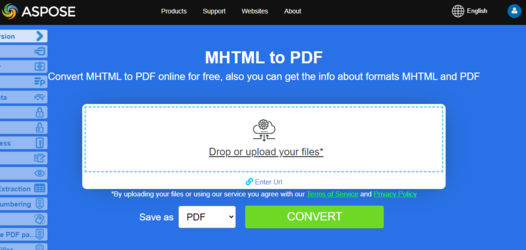

## Visión general

Este artículo explica cómo **convertir HTML a PDF usando C#**. Cubre los siguientes temas.

El siguiente fragmento de código también funciona con la biblioteca [Aspose.PDF.Drawing](/pdf/net/drawing/).

_Formato_: **HTML**
- [C# HTML a PDF](#csharp-html-to-pdf)
- [C# Convertir HTML a PDF](#csharp-html-to-pdf)
- [C# Cómo convertir HTML a PDF](#csharp-html-to-pdf)

_Formato_: **MHTML**
- [C# MHTML a PDF](#csharp-mhtml-to-pdf)
- [C# Convertir MHTML a PDF](#csharp-mhtml-to-pdf)
- [C# Cómo convertir MHTML a PDF](#csharp-mhtml-to-pdf)

_Formato_: **Página web**
- [C# Página web a PDF](#csharp-webpage-to-pdf)
- [C# Convertir página web a PDF](#csharp-webpage-to-pdf)
- [C# Cómo convertir página web a PDF](#csharp-webpage-to-pdf)

## Conversión de HTML a PDF en C#
## Conversión de HTML a PDF en C#

**Aspose.PDF para .NET** es una API de manipulación de PDF que permite convertir documentos HTML existentes a PDF de manera impecable. El proceso de conversión de HTML a PDF puede ser personalizado de manera flexible.

## Convertir HTML a PDF

El siguiente ejemplo de código C# muestra cómo convertir un documento HTML a PDF.

<a name="csharp-html-to-pdf"><strong>Pasos: Convertir HTML a PDF en C#</strong></a>

1. Crear una instancia de la clase [HtmlLoadOptions](https://reference.aspose.com/pdf/net/aspose.pdf/htmlloadoptions/).
2. Inicializar objeto [Document](https://reference.aspose.com/pdf/net/aspose.pdf/document/).
3. Guardar el documento PDF de salida llamando al método **Document.Save()**.

```csharp
public static void ConvertHTMLtoPDF()
{
    HtmlLoadOptions options= new HtmlLoadOptions();
    Document pdfDocument= new Document(_dataDir + "test.html", options);
    pdfDocument.Save(_dataDir + "html_test.PDF");
}
```

{}
**Intenta convertir HTML a PDF en línea**

Aspose te presenta la aplicación gratuita en línea ["HTML to PDF"](https://products.aspose.app/html/en/conversion/html-to-pdf), donde puedes probar a investigar la funcionalidad y calidad con la que funciona.
Aspose te presenta la aplicación gratuita en línea ["HTML a PDF"](https://products.aspose.app/html/es/conversion/html-to-pdf), donde puedes explorar la funcionalidad y la calidad con la que funciona.

[](https://products.aspose.app/html/es/conversion/html-to-pdf)

## Conversión avanzada de HTML a PDF

El motor de conversión HTML tiene varias opciones que nos permiten controlar el proceso de conversión.

### Soporte de Consultas de Medios

Las consultas de medios son una técnica popular para entregar una hoja de estilo adaptada a diferentes dispositivos. Podemos establecer el tipo de dispositivo usando la propiedad [`HtmlMediaType`](https://reference.aspose.com/pdf/net/aspose.pdf/htmlloadoptions/properties/htmlmediatype).

```csharp
public static void ConvertHTMLtoPDFAdvanced_MediaType()
{
    HtmlLoadOptions options = new HtmlLoadOptions
    {
        // establecer modo Impresión o Pantalla
        HtmlMediaType = HtmlMediaType.Print
    };
    Document pdfDocument = new Document(_dataDir + "test.html", options);
    pdfDocument.Save(_dataDir + "html_test.PDF");
}
```
### Habilitar (deshabilitar) la incrustación de fuentes

Las páginas HTML a menudo usan fuentes (por ejemplo, fuentes de una carpeta local, Google Fonts, etc.). También podemos controlar la incrustación de fuentes en un documento utilizando la propiedad [`IsEmbedFonts`](https://reference.aspose.com/pdf/net/aspose.pdf/htmlloadoptions/properties/isembedfonts).

```csharp
public static void ConvertHTMLtoPDFAdvanced_EmbedFonts()
{
    // Deshabilitar la incrustación de fuentes
    HtmlLoadOptions options = new HtmlLoadOptions {IsEmbedFonts = false};
    Document pdfDocument= new Document(_dataDir + "test_fonts.html", options);
    pdfDocument.Save(_dataDir + "html_test.PDF");
}
```

### Gestionar la carga de recursos externos

El Motor de Conversión proporciona un mecanismo que le permite controlar la carga de ciertos recursos asociados con el documento HTML.
La clase [`HtmlLoadOptions`](https://reference.aspose.com/pdf/net/aspose.pdf/htmlloadoptions) tiene la propiedad [`CustomLoaderOfExternalResources`](https://reference.aspose.com/pdf/net/aspose.pdf/htmlloadoptions/fields/customloaderofexternalresources) con la cual podemos definir el comportamiento del cargador de recursos.
La clase [`HtmlLoadOptions`](https://reference.aspose.com/pdf/net/aspose.pdf/htmlloadoptions) tiene la propiedad [`CustomLoaderOfExternalResources`](https://reference.aspose.com/pdf/net/aspose.pdf/htmlloadoptions/fields/customloaderofexternalresources) con la cual podemos definir el comportamiento del cargador de recursos.
Supongamos que necesitamos reemplazar todas las imágenes PNG con una sola imagen `test.jpg` y reemplazar la URL externa por una interna para otros recursos.
Para hacer esto, podemos definir un cargador personalizado `SamePictureLoader` y apuntar [`CustomLoaderOfExternalResources`](https://reference.aspose.com/pdf/net/aspose.pdf/htmlloadoptions/fields/customloaderofexternalresources) a este nombre.

```csharp
public static void ConvertHTMLtoPDFAdvanced_DummyImage()
{
    HtmlLoadOptions options = new HtmlLoadOptions
    {
        CustomLoaderOfExternalResources = SamePictureLoader
    };
    Document pdfDocument= new Document(_dataDir + "test.html", options);
    pdfDocument.Save(_dataDir + "html_test.PDF");
}

private static LoadOptions.ResourceLoadingResult SamePictureLoader(string resourceURI)
{
    LoadOptions.ResourceLoadingResult result;

    if (resourceURI.EndsWith(".png"))
    {
        byte[] resultBytes = File.ReadAllBytes(_dataDir + "test.jpg");
        result = new LoadOptions.ResourceLoadingResult(resultBytes)
        {
            //Establecer el tipo MIME
            MIMETypeIfKnown = "image/jpeg"
        };
    }
    else
    {
        result = new LoadOptions.ResourceLoadingResult(GetContentFromUrl(resourceURI));
    }
    return result;
}

private static byte[] GetContentFromUrl(string url)
{
    var httpClient = new HttpClient();
    return httpClient.GetByteArrayAsync(url).GetAwaiter().GetResult();
}
```
## Convertir página web a PDF

Convertir una página web es ligeramente diferente que convertir un documento HTML local. Para convertir los contenidos de una página web a formato PDF, primero podemos obtener los contenidos de la página HTML usando una instancia de HttpClient, crear un objeto Stream, pasar los contenidos al objeto Document y renderizar la salida en formato PDF.

Al convertir una página web alojada en un servidor web a PDF:

<a name="csharp-webpage-to-pdf"><strong>Pasos: Convertir Página Web a PDF en C#</strong></a>

1. Leer los contenidos de la página utilizando un objeto HttpClient.
1. Instanciar el objeto [HtmlLoadOptions](https://reference.aspose.com/pdf/net/aspose.pdf/htmlloadoptions) y establecer la URL base.
1. Inicializar un objeto Document mientras se pasa el objeto stream.
1. Opcionalmente, establecer el tamaño de página y/o la orientación.

```csharp
public static void ConvertHTMLtoPDFAdvanced_WebPage()
{
    const string url = "https://en.wikipedia.org/wiki/Aspose_API";
    // Establecer tamaño de página A3 y orientación horizontal;   
    HtmlLoadOptions options = new HtmlLoadOptions(url)
    {
        PageInfo = {Width = 842, Height = 1191, IsLandscape = true}
    };
    Document pdfDocument= new Document(GetContentFromUrlAsStream(url), options);
    pdfDocument.Save(_dataDir + "html_test.PDF");
}

private static Stream GetContentFromUrlAsStream(string url, ICredentials credentials = null)
{
    using (var handler = new HttpClientHandler { Credentials = credentials })
    using (var httpClient = new HttpClient(handler))
    {
        return httpClient.GetStreamAsync(url).GetAwaiter().GetResult();
    }
}
```
### Proporcionar credenciales para la conversión de una página web a PDF

A veces necesitamos realizar la conversión de archivos HTML que requieren autenticación y privilegios de acceso, de modo que solo los usuarios auténticos puedan obtener los contenidos de la página. Esto también incluye el escenario donde algunos recursos/datos referenciados dentro del HTML se obtienen de algún servidor externo que requiere autenticación y para atender a este requisito, se añade la propiedad [`ExternalResourcesCredentials`](https://reference.aspose.com/pdf/net/aspose.pdf/htmlloadoptions/fields/externalresourcescredentials) a la clase [`HtmlLoadOptions`](https://reference.aspose.com/pdf/net/aspose.pdf/htmlloadoptions). El siguiente fragmento de código muestra los pasos para pasar credenciales a la solicitud de HTML y sus respectivos recursos durante la conversión de un archivo HTML a PDF.

```csharp
public static void ConvertHTMLtoPDFAdvanced_Authorized()
{
    const string url = "http://httpbin.org/basic-auth/user1/password1";
    var credentials = new NetworkCredential("user1", "password1");
    HtmlLoadOptions options = new HtmlLoadOptions(url)
    {
        ExternalResourcesCredentials = credentials
    };
    Document pdfDocument= new Document(GetContentFromUrlAsStream(url, credentials), options);
    pdfDocument.Save(_dataDir + "html_test.PDF");
}

private static Stream GetContentFromUrlAsStream(string url, ICredentials credentials = null)
{
    using (var handler = new HttpClientHandler { Credentials = credentials })
    using (var httpClient = new HttpClient(handler))
    {
        return httpClient.GetStreamAsync(url).GetAwaiter().GetResult();
    }
}
```
### Renderizar todo el contenido HTML en una sola página

Aspose.PDF para .NET proporciona la capacidad de renderizar todos los contenidos en una sola página al convertir un archivo HTML a formato PDF. Por ejemplo, si tienes contenido HTML cuyo tamaño de salida es mayor que una página, puedes utilizar la opción para renderizar los datos de salida en una sola página PDF. Para usar esta opción, la clase HtmlLoadOptions fue extendida con el indicador IsRenderToSinglePage. El fragmento de código a continuación muestra cómo utilizar esta funcionalidad.

```csharp
// Para ejemplos completos y archivos de datos, por favor ve a https://github.com/aspose-pdf/Aspose.PDF-for-.NET
// La ruta al directorio de documentos.
string dataDir = RunExamples.GetDataDir_AsposePdf_DocumentConversion();
// Inicializar las opciones de carga/guardado de HTML
HtmlLoadOptions options = new HtmlLoadOptions();
// Establecer la propiedad Renderizar a una sola página
options.IsRenderToSinglePage = true;
// Cargar documento
Document pdfDocument= new Document(dataDir + "HTMLToPDF.html", options);
// Guardar
pdfDocument.Save(dataDir + "RenderContentToSamePage.pdf");
```

### Renderizar HTML con datos SVG
### Renderizar HTML con Datos SVG

Aspose.PDF para .NET proporciona la capacidad de convertir una página HTML en un documento PDF. Dado que HTML permite agregar el elemento gráfico SVG como una etiqueta en la página, Aspose.PDF también admite la conversión de dichos datos en el archivo PDF resultante. El siguiente fragmento de código muestra cómo convertir archivos HTML con etiquetas gráficas SVG a Documentos PDF Etiquetados.

```csharp
// Para ejemplos completos y archivos de datos, por favor vaya a https://github.com/aspose-pdf/Aspose.PDF-for-.NET
// La ruta al directorio de documentos.
string dataDir = RunExamples.GetDataDir_AsposePdf_DocumentConversion();
// Establecer la ruta del archivo de entrada
string inFile = dataDir + "HTMLSVG.html";
// Establecer la ruta del archivo de salida
string outFile = dataDir + "RenderHTMLwithSVGData.pdf";
// Inicializar HtmlLoadOptions
HtmlLoadOptions options = new HtmlLoadOptions(Path.GetDirectoryName(inFile));
// Inicializar el objeto Document
Document pdfDocument = new Document(inFile, options);
// guardar
pdfDocument.Save(outFile);
```

## Convertir MHTML a PDF

{}
**Intente convertir MHTML a PDF en línea**
**Intenta convertir MHTML a PDF en línea**

Aspose.PDF para .NET te presenta la aplicación gratuita en línea ["MHTML a PDF"](https://products.aspose.app/pdf/conversion/mhtml-to-pdf), donde puedes probar a investigar la funcionalidad y calidad con la que trabaja.

[](https://products.aspose.app/pdf/conversion/mhtml-to-pdf)
{}

<abbr title="Encapsulación MIME de documentos HTML agregados">MHTML</abbr>, abreviatura de MIME HTML, es un formato de archivo de archivo de página web utilizado para combinar recursos que típicamente están representados por enlaces externos (como imágenes, animaciones Flash, applets de Java y archivos de audio) con código HTML en un único archivo.
<abbr title="Encapsulación MIME de documentos HTML agregados">MHTML</abbr>, abreviatura de MIME HTML, es un formato de archivo de archivo de página web utilizado para combinar recursos que típicamente están representados por enlaces externos (como imágenes, animaciones Flash, applets de Java y archivos de audio) con código HTML en un solo archivo.

<a name="csharp-mhtml-to-pdf"><strong>Pasos: Convertir MHTML a PDF en C#</strong></a>

1. Crear una instancia de la clase [MhtLoadOptions](https://reference.aspose.com/pdf/net/aspose.pdf/mhtloadoptions/).
2. Inicializar el objeto [Document](https://reference.aspose.com/pdf/net/aspose.pdf/document/).
3. Guardar el documento PDF de salida llamando al método **Document.Save()**.

```csharp
public static void ConvertMHTtoPDF()
{
    MhtLoadOptions options = new MhtLoadOptions()
    {
        PageInfo = { Width = 842, Height = 1191, IsLandscape = true}
    };
    Document pdfDocument= new Document(_dataDir + "fileformatinfo.mht", options);
    pdfDocument.Save(_dataDir + "mhtml_test.PDF");
}
```

## Vea También

Este artículo también cubre estos temas.
Este artículo también cubre estos temas.

_Formato_: **HTML**
- [C# HTML a PDF Código](#csharp-html-to-pdf)
- [C# HTML a PDF API](#csharp-html-to-pdf)
- [C# HTML a PDF Programáticamente](#csharp-html-to-pdf)
- [C# Biblioteca HTML a PDF](#csharp-html-to-pdf)
- [C# Guardar HTML como PDF](#csharp-html-to-pdf)
- [C# Generar PDF desde HTML](#csharp-html-to-pdf)
- [C# Crear PDF desde HTML](#csharp-html-to-pdf)
- [C# Conversor de HTML a PDF](#csharp-html-to-pdf)

_Formato_: **MHTML**
- [C# MHTML a PDF Código](#csharp-mhtml-to-pdf)
- [C# MHTML a PDF API](#csharp-mhtml-to-pdf)
- [C# MHTML a PDF Programáticamente](#csharp-mhtml-to-pdf)
- [C# Biblioteca MHTML a PDF](#csharp-mhtml-to-pdf)
- [C# Guardar MHTML como PDF](#csharp-mhtml-to-pdf)
- [C# Generar PDF desde MHTML](#csharp-mhtml-to-pdf)
- [C# Crear PDF desde MHTML](#csharp-mhtml-to-pdf)
- [C# Conversor de MHTML a PDF](#csharp-mhtml-to-pdf)

_Formato_: **Página Web**
- [C# Página Web a PDF Código](#csharp-webpage-to-pdf)
- [C# Página Web a PDF API](#csharp-webpage-to-pdf)
- [C# Página Web a PDF Programáticamente](#csharp-webpage-to-pdf)
- [Página Web C# a PDF Programáticamente](#csharp-webpage-to-pdf)
- [Librería de C# para Convertir Página Web a PDF](#csharp-webpage-to-pdf)
- [C# Guardar Página Web como PDF](#csharp-webpage-to-pdf)
- [C# Generar PDF desde Página Web](#csharp-webpage-to-pdf)
- [C# Crear PDF desde Página Web](#csharp-webpage-to-pdf)
- [Convertidor de Página Web a PDF en C#](#csharp-webpage-to-pdf)
