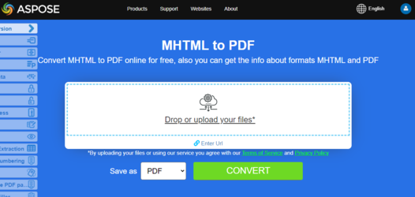

**Aspose.PDF for .NET** is a PDF manipulation API that lets you convert any existing HTML documents to PDF seamlessly.
The process of converting HTML to PDF can be flexibly customized.

## Convert HTML to PDF

Quick conversion is shown in the following example.

```csharp
public static void ConvertHTMLtoPDF()
{
    HtmlLoadOptions options= new HtmlLoadOptions();
    Document pdfDocument= new Document(_dataDir + "test.html", options);
    pdfDocument.Save(_dataDir + "html_test.PDF");
}
```

{}
**Try to convert HTML to PDF online**

Aspose presents you online free application ["HTML to PDF"](https://products.aspose.app/html/en/conversion/html-to-pdf), where you may try to investigate the functionality and quality it works.

[](https://products.aspose.app/html/en/conversion/html-to-pdf)
{}

## Advanced conversion from HTML to PDF

The HTML Conversion engine has several options that allow us to control the conversion process.

### Media Queries Support

Media queries are a popular technique for delivering a tailored style sheet to different devices. We can set device type using [`HtmlMediaType`](https://apireference.aspose.com/pdf/net/aspose.pdf/htmlloadoptions/properties/htmlmediatype) property.

```csharp
public static void ConvertHTMLtoPDFAdvanced_MediaType()
{
    HtmlLoadOptions options = new HtmlLoadOptions
    {
        // set Print or Screen mode
        HtmlMediaType = HtmlMediaType.Print
    };
    Document pdfDocument= new Document(_dataDir + "test.html", options);
    pdfDocument.Save(_dataDir + "html_test.PDF");
}
```

### Enable (disable) font embedding

HTML pages often use fonts (i.g. fonts from local folder, Google Fonts, etc). We can also control the embedding of fonts in a document using a [`IsEmbedFonts`](https://apireference.aspose.com/pdf/net/aspose.pdf/htmlloadoptions/properties/isembedfonts) property.

```csharp
public static void ConvertHTMLtoPDFAdvanced_EmbedFonts()
{
    // Disable font embedding
    HtmlLoadOptions options = new HtmlLoadOptions {IsEmbedFonts = false};
    Document pdfDocument= new Document(_dataDir + "test_fonts.html", options);
    pdfDocument.Save(_dataDir + "html_test.PDF");
}
```

### Manage external resource loading

The Conversion Engine provides a mechanism that allows you to control the loading of certain resources associated with the HTML document.
The [`HtmlLoadOptions`](https://apireference.aspose.com/pdf/net/aspose.pdf/htmlloadoptions) class has the property [`CustomLoaderOfExternalResources`](https://apireference.aspose.com/pdf/net/aspose.pdf/htmlloadoptions/fields/customloaderofexternalresources) with which we can define the behavior of the resource loader.
Assume we need to replace all PNG images with single image `test.jpg` and replace external URL to internal for other resources.
To do this we can define a custom loader `SamePictureLoader` and points [`CustomLoaderOfExternalResources`](https://apireference.aspose.com/pdf/net/aspose.pdf/htmlloadoptions/fields/customloaderofexternalresources) to this name.

```csharp
public static void ConvertHTMLtoPDFAdvanced_DummyImage()
{
    HtmlLoadOptions options = new HtmlLoadOptions
    {
        CustomLoaderOfExternalResources = SamePictureLoader
    };
    Document pdfDocument= new Document(_dataDir + "test.html", options);
    pdfDocument.Save(_dataDir + "html_test.PDF");
}

private static LoadOptions.ResourceLoadingResult SamePictureLoader(string resourceURI)
{
    LoadOptions.ResourceLoadingResult result;

    if (resourceURI.EndsWith(".png"))
    {
        byte[] resultBytes = File.ReadAllBytes(_dataDir + "test.jpg");
        result = new LoadOptions.ResourceLoadingResult(resultBytes)
        {
            //Set MIME Type
            MIMETypeIfKnown = "image/jpeg"
        };
    }
    else
    {
        result = new LoadOptions.ResourceLoadingResult(GetContentFromUrl(resourceURI));
    }
    return result;
}

private static byte[] GetContentFromUrl(string url)
{
    var httpClient = new HttpClient();
    return httpClient.GetByteArrayAsync(url).GetAwaiter().GetResult();
}
```

## Convert Web page to PDF

Converting a web page is slightly different than converting a local HTML document. In order to convert Web page contents to PDF format, we can first fetch the HTML page contents using HttpClient instance, create Stream object, pass the contents to the Document object and render the output in PDF format.

When converting a web page hosted on a webserver to PDF:

1. Read the contents of the page using an HttpClient object.
1. Instantiate the [HtmlLoadOptions](https://apireference.aspose.com/pdf/net/aspose.pdf/htmlloadoptions) object and set the base URL.
1. Initialize a Document object while passing the stream object.
1. Optionally, set the page size and/or orientation.

```csharp
public static void ConvertHTMLtoPDFAdvanced_WebPage()
{
    const string url = "https://en.wikipedia.org/wiki/Aspose_API";
    // Set page size A3 and Landscape orientation;   
    HtmlLoadOptions options = new HtmlLoadOptions(url)
    {
        PageInfo = {Width = 842, Height = 1191, IsLandscape = true}
    };
    Document pdfDocument= new Document(GetContentFromUrlAsStream(url), options);
    pdfDocument.Save(_dataDir + "html_test.PDF");
}

private static Stream GetContentFromUrlAsStream(string url, ICredentials credentials = null)
{
    using (var handler = new HttpClientHandler { Credentials = credentials })
    using (var httpClient = new HttpClient(handler))
    {
        return httpClient.GetStreamAsync(url).GetAwaiter().GetResult();
    }
}
```

### Provide credentials Web page to PDF conversion

Sometimes we need to perform the conversion of HTML files which require authentication and access privileges, so that only authentic users can fetch the page contents. It also includes the scenario where some resources/data referenced inside HTML are fetched from some external server which requires authentication and in order to cater to this requirement, the [`ExternalResourcesCredentials`](https://apireference.aspose.com/pdf/net/aspose.pdf/htmlloadoptions/fields/externalresourcescredentials) property is added to [`HtmlLoadOptions`](https://apireference.aspose.com/pdf/net/aspose.pdf/htmlloadoptions) class. Following code snippet shows the steps to pass credentials to request HTML & its respective resources while converting HTML file to PDF conversion.

```csharp
public static void ConvertHTMLtoPDFAdvanced_Authorized()
{
    const string url = "http://httpbin.org/basic-auth/user1/password1";
    var credentials = new NetworkCredential("user1", "password1");
    HtmlLoadOptions options = new HtmlLoadOptions(url)
    {
        ExternalResourcesCredentials = credentials
    };
    Document pdfDocument= new Document(GetContentFromUrlAsStream(url, credentials), options);
    pdfDocument.Save(_dataDir + "html_test.PDF");
}

private static Stream GetContentFromUrlAsStream(string url, ICredentials credentials = null)
{
    using (var handler = new HttpClientHandler { Credentials = credentials })
    using (var httpClient = new HttpClient(handler))
    {
        return httpClient.GetStreamAsync(url).GetAwaiter().GetResult();
    }
}
```

### Render all HTML content in a single Page

Aspose.PDF for .NET provides the ability to render all contents on a single page while converting HTML file to PDF format. For example, if you have some HTML content which output size is greater than one page, you can use option for rendering output data into a single PDF page. For using this option HtmlLoadOptions class was extended by IsRenderToSinglePage flag. The code snippet below shows how to use this functionality.

```csharp
// For complete examples and data files, please go to https://github.com/aspose-pdf/Aspose.PDF-for-.NET
// The path to the documents directory.
string dataDir = RunExamples.GetDataDir_AsposePdf_DocumentConversion();
// Initialize HTMLLoadSave Options
HtmlLoadOptions options = new HtmlLoadOptions();
// Set Render to single page property
options.IsRenderToSinglePage = true;
// Load document
Document pdfDocument= new Document(dataDir + "HTMLToPDF.html", options);
// Save
pdfDocument.Save(dataDir + "RenderContentToSamePage.pdf");
```

### Render HTML with SVG Data

Aspose.PDF for .NET provides ability to convert HTML page to PDF document. Since HTML allows adding SVG graphic element as a tag in the page, Aspose.PDF also supports conversion of such data into the resultant PDF file. The following code snippet shows how to convert HTML files with SVG graphic tags to Tagged PDF Documents.

```csharp
// For complete examples and data files, please go to https://github.com/aspose-pdf/Aspose.PDF-for-.NET
// The path to the documents directory.
string dataDir = RunExamples.GetDataDir_AsposePdf_DocumentConversion();
// Set input file path
string inFile = dataDir + "HTMLSVG.html";
// Set output file path
string outFile = dataDir + "RenderHTMLwithSVGData.pdf";
// Initialize HtmlLoadOptions
HtmlLoadOptions options = new HtmlLoadOptions(Path.GetDirectoryName(inFile));
// Initialize Document object
Document pdfDocument = new Document(inFile, options);
// save
pdfDocument.Save(outFile);
```

## Convert MHTML to PDF 

{}
**Try to convert MHTML to PDF online**

Aspose.PDF for .NET presents you online free application ["MHTML to PDF"](https://products.aspose.app/pdf/conversion/mhtml-to-pdf), where you may try to investigate the functionality and quality it works.

[](https://products.aspose.app/pdf/conversion/mhtml-to-pdf)
{}

<abbr title="MIME encapsulation of aggregate HTML documents">MHTML</abbr>, short for MIME HTML, is a web page archive format used to combine resources that are typically represented by external links (such as images, Flash animations, Java applets, and audio files) with HTML code into a single file. The content of an MHTML file is encoded as if it were an HTML email message, using the MIME type multipart/related. Aspose.PDF for .NET can convert HTML files to PDF format and with the release of Aspose.PDF for .NET 9.0.0, we have introduced a new feature that lets you convert MHTML files to PDF format. Next code snippet show how to covert MHTML files to PDF format with C#:

```csharp
public static void ConvertMHTtoPDF()
{
    MhtLoadOptions options = new MhtLoadOptions()
    {
        PageInfo = { Width = 842, Height = 1191, IsLandscape = true}
    };
    Document pdfDocument= new Document(_dataDir + "fileformatinfo.mht", options);
    pdfDocument.Save(_dataDir + "mhtml_test.PDF");
}
```


