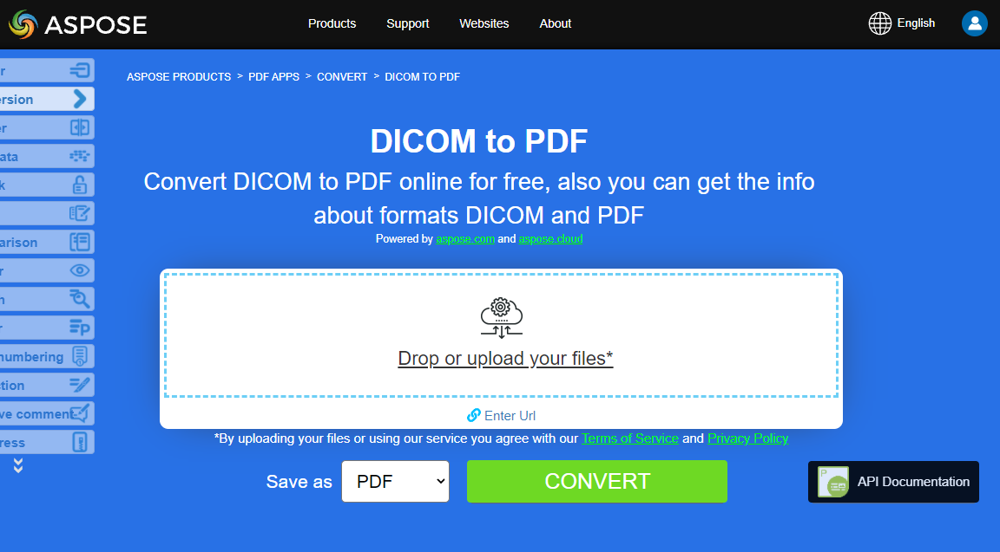

**Aspose.PDF for .NET**  allows you to convert different formats of images to PDF files. Our library demonstrates code snippets for converting the most popular image formats, such as - BMP, CGM, DICOM, EMF, JPG, PNG, SVG and TIFF formats.

## Convert BMP to PDF

Convert BMP files to PDF document using **Aspose.PDF for .NET** library.

<abbr title="Bitmap Image File">BMP</abbr> images are Files having extension. BMP represent Bitmap Image files that are used to store bitmap digital images. These images are independent of graphics adapter and are also called device independent bitmap (DIB) file format.
You can convert BMP to PDF files with Aspose.PDF for .NET API. Therefore, you can follow the following steps to convert BMP images:

1. Initialize a new [Document](https://apireference.aspose.com/pdf/net/aspose.pdf/document)
1. Load input BMP image
1. Finally, save the output PDF file

So the following code snippet follows these steps and shows how to convert BMP to PDF using C#:

```csharp
Initialize empty PDF document
using (Document pdfDocument = new Document())
{
    pdfDocument.Pages.Add();
    Aspose.Pdf.Image image = new Aspose.Pdf.Image();

    // Load sample BMP image file
    image.File = dataDir + "Sample.bmp";
    pdfDocument.Pages[1].Paragraphs.Add(image);

    // Save output PDF document
    pdfDocument.Save(dataDir + "BMPtoPDF.pdf");
}
```

{}
**Try to convert BMP to PDF online**

Aspose presents you online free application ["BMP to PDF"](https://products.aspose.app/pdf/conversion/bmp-to-pdf/), where you may try to investigate the functionality and quality it works.

[](https://products.aspose.app/pdf/conversion/bmp-to-pdf/)
{}

## Convert CGM to PDF

<abbr title="Computer Graphics Metafile">CGM</abbr> is a file extension for a Computer Graphics Metafile format commonly used in CAD (computer-aided design) and presentation graphics applications. CGM is a vector graphics format that supports three different encoding methods: binary (best for program read speed), character-based (produces the smallest file size and allows for faster data transfers) or cleartext encoding (allows users to read and modify the file with a text editor).

Check next code snippet for converting CGM files  to PDF format.

1. Create an instance of [CgmLoadOptions](https://apireference.aspose.com/pdf/net/aspose.pdf/cgmloadoptions) class.
1. Create an instance of [Document](https://apireference.aspose.com/pdf/net/aspose.pdf/document) class with mention source filename and options.
1. Save the document with the desired file name.

```csharp
public static void ConvertCGMtoPDF()
{
    CgmLoadOptions option = new CgmLoadOptions();
    Document pdfDocument= new Document(_dataDir+"corvette.cgm", option);
    pdfDocument.Save(_dataDir+"CGMtoPDF.pdf");
}
```

## Convert DICOM to PDF

<abbr title="Digital Imaging and Communications in Medicine">DICOM</abbr> format is the medical industry standard for the creation, storage, transmission, and visualization of digital medical images and documents of examined patients.

**Aspsoe.PDF for .NET** allows you to convert DICOM and SVG images, but for technical reasons to add images you need to specify the type of file to be added to PDF:

1. Create an object of the Image class.
1. Add the image to a page's Paragraphs collection.
1. Specify the [FileType](https://apireference.aspose.com/pdf/net/aspose.pdf/image/properties/filetype) property.
1. Specify the file's path or source.
    - If an image is at a location on the hard drive, specify the path location using the Image.File property.
    - If an image is placed in a MemoryStream, pass the object holding the image to the Image.ImageStream property.

The following code snippet shows how to convert DICOM files to PDF  format with Aspose.PDF. You should load DICOM image, place the image on a page in a PDF file and save the output as PDF.

```csharp
private const string _dataDir = "..\\..\\..\\..\\Samples";
// Convert DICOM images to PDF using Image class
public static void ConvertDICOMtoPDF()
{
    // Instantiate Document Object
    Document pdfDocument = new Document();

    // Add a page to pages collection of document
    Page page = pdfDocument.Pages.Add();

    Image image = new Image
    {
        FileType = ImageFileType.Dicom,
        File = System.IO.Path.Combine(_dataDir,"bmode.dcm")
    };
    pdfDocument.Pages[1].Paragraphs.Add(image);
    // Save output as PDF format
    pdfDocument.Save(System.IO.Path.Combine(_dataDir,"PDFWithDicomImage_out.pdf"));
}
```

{}
**Try to convert DICOM to PDF online**

Aspose presents you online free application ["DICOM to PDF"](https://products.aspose.app/pdf/conversion/dicom-to-pdf/), where you may try to investigate the functionality and quality it works.

[](https://products.aspose.app/pdf/conversion/dicom-to-pdf/)
{}

## Convert EMF to PDF

<abbr title="Enhanced metafile format">EMF</abbr>EMF stores graphical images device-independently. Metafiles of EMF comprises of variable-length records in chronological order that can render the stored image after parsing on any output device. Furthermore, you can convert EMF to PDF image using the below steps:

1. Firstly, initialize Document class object
1. Load EMF image file
1. Add the loaded EMF image to a Page
1. Save PDF document

Moreover, the following code snippet shows how to convert an EMF to PDF with C# in your .NET code snippet:

```csharp
// Initialize new PDF document
var doc = new Document();

// Spcify path of input EMF image file
var imageFile = dataDir + "drawing.emf";
var page = doc.Pages.Add();
string file = imageFile;
FileStream filestream = new FileStream(file, FileMode.Open, FileAccess.Read);
BinaryReader reader = new BinaryReader(filestream);
long numBytes = new FileInfo(file).Length;
byte[] bytearray = reader.ReadBytes((int)numBytes);
Stream stream = new MemoryStream(bytearray);
var b = new Bitmap(stream);

// Specify page dimesion properties
page.PageInfo.Margin.Bottom = 0;
page.PageInfo.Margin.Top = 0;
page.PageInfo.Margin.Left = 0;
page.PageInfo.Margin.Right = 0;
page.PageInfo.Width = b.Width;
page.PageInfo.Height = b.Height;
var image = new Aspose.Pdf.Image();
image.File = imageFile;
page.Paragraphs.Add(image);

//Save output PDF document
doc.Save(dataDir + "EMFtoPDF.pdf");
```

{}
**Try to convert EMF to PDF online**

Aspose presents you online free application ["EMF to PDF"](https://products.aspose.app/pdf/conversion/emf-to-pdf/), where you may try to investigate the functionality and quality it works.

[](https://products.aspose.app/pdf/conversion/emf-to-pdf/)
{}

## Convert JPG to PDF

No need to wonder how to convert JPG to PDF, because **Apose.PDF for .NET** library has best decision.

You can very easy convert a JPG images to PDF with Aspose.PDF for .NET by following steps:

1. Initialize object of [Document](https://apireference.aspose.com/page/net/aspose.page/document) class
1. Add a new Page to PDF document
1. Load JPG image and add to paragraph
1. Save output PDF

The code snippet below shows how to convert JPG Image to PDF using C#:

```csharp
// Load input JPG file
String path = dataDir + "Aspose.jpg";

// Initialize new PDF document
Document doc = new Document();

// Add empty page in empty document
Page page = doc.Pages.Add();
Aspose.Pdf.Image image = new Aspose.Pdf.Image();
image.File = (path);

// Add image on a page
page.Paragraphs.Add(image);

// Save output PDF file
doc.Save(dataDir + "ImagetoPDF.pdf");
```

Then you can see how to convert an image to PDF with the **same height and width of the page**. We will be getting the image dimensions and accordingly set the page dimensions of PDF document with the below steps:

1. Load input image file
1. Get the height and width of the image
1. Set height, width, and margins of a page
1. Save the output PDF file

Following code snippet shows how to convert an Image to PDF with same page height and width using C#:

```csharp
// Load input JPG image file
String path = dataDir + "Aspose.jpg";
System.Drawing.Image srcImage = System.Drawing.Image.FromFile(path);

// Read Height of input image
int h = srcImage.Height;

// Read Height of input image
int w = srcImage.Width;

// Initialize a new PDF document
Document doc = new Document();

// Add an empty page
Page page = doc.Pages.Add();
Aspose.Pdf.Image image = new Aspose.Pdf.Image();
image.File = (path);

// Set page dimensions and margins
page.PageInfo.Height = (h);
page.PageInfo.Width = (w);
page.PageInfo.Margin.Bottom = (0);
page.PageInfo.Margin.Top = (0);
page.PageInfo.Margin.Right = (0);
page.PageInfo.Margin.Left = (0);
page.Paragraphs.Add(image);

// Save output PDF file
doc.Save(dataDir + "ImagetoPDF_HeightWidth.pdf");
```

{}
**Try to convert JPG to PDF online**

Aspose presents you online free application ["JPG to PDF"](https://products.aspose.app/pdf/conversion/jpg-to-pdf/), where you may try to investigate the functionality and quality it works.

[](https://products.aspose.app/pdf/conversion/jpg-to-pdf/)
{}

## Convert PNG to PDF

**Aspose.PDF for .NET** support feature to convert PNG images to PDF format. Check the next code snippet for realizing you task.

<abbr title="Portable Network Graphics">PNG</abbr> refers to a type of raster image file format that use loseless compression, that makes it popular among its users.

You can convert PNG to PDF image using the below steps:

1. Load input PNG image
1. Read height and width values
1. Create new document and add Page
1. Set page dimensions
1. Save output file

Moreover, the code snippet below shows how to convert PNG to PDF with C# in your .NET applications:

```csharp
// Load input PNG file
String path = dataDir + "Aspose.png";
System.Drawing.Image srcImage = System.Drawing.Image.FromFile(path);
int h = srcImage.Height;
int w = srcImage.Width;

// Initialize new Document
Document doc = new Document();
Page page = doc.Pages.Add();
Aspose.Pdf.Image image = new Aspose.Pdf.Image();
image.File = (path);

// Set page dimensions
page.PageInfo.Height = (h);
page.PageInfo.Width = (w);
page.PageInfo.Margin.Bottom = (0);
page.PageInfo.Margin.Top = (0);
page.PageInfo.Margin.Right = (0);
page.PageInfo.Margin.Left = (0);
page.Paragraphs.Add(image);

// Save output PDF
doc.Save(dataDir + "ImagetoPDF.pdf");
```

{}
**Try to convert PNG to PDF online**

Aspose presents you online free application ["PNG to PDF"](https://products.aspose.app/pdf/conversion/png-to-pdf/), where you may try to investigate the functionality and quality it works.

[](https://products.aspose.app/pdf/conversion/png-to-pdf/)
{}

## Convert SVG to PDF

**Aspose.PDF for .NET** explains how to convert SVG images to PDF format and how to get dimensions of the source <abbr title="Scalable Vector Graphics">SVG</abbr> file.

Scalable Vector Graphics (SVG) is a family of specifications of an XML-based file format for two-dimensional vector graphics, both static and dynamic (interactive or animated). The SVG specification is an open standard that has been under development by the World Wide Web Consortium (W3C) since 1999.

SVG images and their behaviors are defined in XML text files. This means that they can be searched, indexed, scripted, and if required, compressed. As XML files, SVG images can be created and edited with any text editor, but it is often more convenient to create them with drawing programs such as Inkscape.

{}
**Try to convert SVG format to PDF online**

Aspose.PDF for .NET presents you online free application ["SVG to PDF"](https://products.aspose.app/pdf/conversion/svg-to-pdf), where you may try to investigate the functionality and quality it works.

[](https://products.aspose.app/pdf/conversion/svg-to-pdf)
{}

To convert SVG files to PDF, use the class named [SvgLoadOptions](https://apireference.aspose.com/net/pdf/aspose.pdf/svgloadoptions) which is used to initialize the [`LoadOptions`](https://apireference.aspose.com/pdf/net/aspose.pdf/loadoptions) object. Later, this object is passed as an argument during the Document object initialization and helps the PDF rendering engine to determine the input format of the source document.

1. Create an instance of [`SvgLoadOptions`](https://apireference.aspose.com/pdf/net/aspose.pdf/loadoptions) class.
1. Create an instance of [`Document`](https://apireference.aspose.com/pdf/net/aspose.pdf/document) class with mention source filename and options.
1. Save the document with the desired file name.

The following code snippet shows the process of converting SVG file into PDF format with Aspose.PDF for .NET.

```csharp
public static void ConvertSVGtoPDF()
{
    SvgLoadOptions option = new SvgLoadOptions();
    Document pdfDocument= new Document(_dataDir + "car.svg", option);
    pdfDocument.Save(_dataDir + "svgtest.pdf");
}
```

## Get SVG dimensions

It is also possible to get the dimensions of the source SVG file. This information can be useful if we want the SVG to cover the entire page of the output PDF. The ScgLoadOption class' AdjustPageSize property fulfills this requirement. The default value of this property is false. If the value is set to true, the output PDF will have the same size (dimensions) as the source SVG.

The following code snippet shows the process of getting the source SVG file's dimensions and generating a PDF file.

```csharp
public static void ConvertSVGtoPDF_Advanced()
{
    // For complete examples and data files, please go to https://github.com/aspose-pdf/Aspose.PDF-for-.NET
    // The path to the documents directory.
    string dataDir = RunExamples.GetDataDir_AsposePdf_DocumentConversion();
    var loadopt = new SvgLoadOptions();
    loadopt.AdjustPageSize = true;
    var svgDoc = new Document(dataDir + "GetSVGDimensions.svg", loadopt);
    svgDoc.Pages[1].PageInfo.Margin.Top = 0;
    svgDoc.Pages[1].PageInfo.Margin.Left = 0;
    svgDoc.Pages[1].PageInfo.Margin.Bottom = 0;
    svgDoc.Pages[1].PageInfo.Margin.Right = 0;
    svgDoc.Save(dataDir + "GetSVGDimensions_out.pdf");
}
```

### SVG Supported Features

<table>
    <thead>
        <tr>
            <th>
                <p>SVG Tag</p>
            </th>
            <th>
                <p>Sample Use</p>
            </th>
        </tr>
    </thead>
    <tbody>
        <tr>
            <td>
                <p>circle</p>
            </td>
            <td>
                <code><pre>&lt circle id="r2" cx="10" cy="10" r="10" stroke="blue" stroke-width="2"&gt </pre></code>
            </td>
        </tr>
        <tr>
            <td>
                <p>defs</p>
            </td>
            <td>
                <code>&lt;defs&gt;&nbsp; <br> &lt;rect id="r1" width="15" height="15"
                    stroke="blue" stroke-width="2" /&gt;&nbsp; <br> &lt;circle id="r2"
                    cx="10" cy="10" r="10" stroke="blue" stroke-width="2"/&gt;&nbsp; <br>
                    &lt;circle id="r3" cx="10" cy="10" r="10" stroke="blue" stroke-width="3"/&gt;&nbsp; <br> &lt;/defs&gt;&nbsp; <br> &lt;use
                    x="25" y="40" xlink:href="#r1" fill="red"/&gt;&nbsp; <br> &lt;use
                    x="35" y="15" xlink:href="#r2" fill="green"/&gt;&nbsp; <br> &lt;use
                    x="58" y="50" xlink:href="#r3" fill="blue"/&gt;</code>
            </td>
        </tr>
        <tr>
            <td>
                <p>tref</p>
            </td>
            <td>
                <p>&lt;defs&gt;&nbsp; <br> &nbsp;&nbsp;&nbsp; &lt;text
                    id="ReferencedText"&gt;&nbsp; <br> &nbsp;&nbsp;&nbsp;&nbsp;&nbsp;
                    Referenced character data&nbsp; <br> &nbsp;&nbsp;&nbsp;
                    &lt;/text&gt;&nbsp; <br> &lt;/defs&gt;&nbsp; <br
                        class="atl-forced-newline"> &lt;text x="10" y="100" font-size="15" fill="red" &gt;&nbsp; <br
                        class="atl-forced-newline"> &nbsp;&nbsp;&nbsp; &lt;tref
                    xlink:href="#ReferencedText"/&gt;&nbsp; <br> &lt;/text&gt;</p>
            </td>
        </tr>
        <tr>
            <td>
                <p>use</p>
            </td>
            <td>
                <p>&lt;defs&gt;&nbsp; <br> &nbsp;&nbsp;&nbsp; &lt;text id="Text" x="400"
                    y="200"&nbsp; <br>
                    &nbsp;&nbsp;&nbsp;&nbsp;&nbsp;&nbsp;&nbsp;&nbsp;&nbsp; font-family="Verdana" font-size="100"
                    text-anchor="middle" &gt;&nbsp; <br> &nbsp;&nbsp;&nbsp;&nbsp;&nbsp;
                    Masked text&nbsp; <br> &nbsp;&nbsp;&nbsp; &lt;/text&gt;&nbsp; <br
                        class="atl-forced-newline"> &lt;use xlink:href="#Text" fill="blue"&nbsp; /&gt;</p>
            </td>
        </tr>
        <tr>
            <td>
                <p>ellipse&nbsp;</p>
            </td>
            <td>
                <p>&lt;ellipse cx="2.5" cy="1.5" rx="2" ry="1" fill="red" /&gt;</p>
            </td>
        </tr>
        <tr>
            <td>
                <p>g&nbsp;</p>
            </td>
            <td>
                <p>&lt;g fill="none" stroke="dimgray" stroke-width="1.5" &gt;&nbsp; <br>
                    &nbsp;&nbsp; &nbsp;&nbsp;&nbsp; &nbsp;&nbsp;&nbsp; &nbsp;&nbsp;&nbsp; &nbsp;&lt;line x1="-7"
                    y1="-7" x2="-3" y2="-3"/&gt;&nbsp; <br> &nbsp;&nbsp;
                    &nbsp;&nbsp;&nbsp; &nbsp;&nbsp;&nbsp; &nbsp;&nbsp;&nbsp; &nbsp;&lt;line x1="7" y1="7" x2="3"
                    y2="3"/&gt;&nbsp; <br> &nbsp;&nbsp; &nbsp;&nbsp;&nbsp;
                    &nbsp;&nbsp;&nbsp; &nbsp;&nbsp;&nbsp; &nbsp;&lt;line x1="-7" y1="7" x2="-3" y2="3"/&gt;&nbsp;
                    <br> &nbsp;&nbsp; &nbsp;&nbsp;&nbsp; &nbsp;&nbsp;&nbsp;
                    &nbsp;&nbsp;&nbsp; &nbsp;&lt;line x1="7" y1="-7" x2="3" y2="-3"/&gt;&nbsp; <br
                        class="atl-forced-newline"> &lt;/g&gt;&nbsp;</p>
            </td>
        </tr>
        <tr>
            <td>
                <p>image</p>
            </td>
            <td>
                <p>&lt;image id="ShadedRelief" x="24" y="4" width="64" height="82" xlink:href="relief.jpg"
                    /&gt;&nbsp;</p>
            </td>
        </tr>
        <tr>
            <td>
                <p>line</p>
            </td>
            <td>
                <p>&lt;line style="stroke:#eea;stroke-width:8" x1="10" y1="30" x2="260" y2="100"/&gt;&nbsp;</p>
            </td>
        </tr>
        <tr>
            <td>
                <p>path</p>
            </td>
            <td>
                <p>&lt;path style="fill:#daa;fill-rule:evenodd;stroke:red" d="M 230,150 C 290,30 10,255 110,140 z
                    "/&gt;&nbsp;</p>
            </td>
        </tr>
        <tr>
            <td>
                <p>style</p>
            </td>
            <td>
                <p>&lt;path style="fill:#daa;fill-rule:evenodd;stroke:red" d="M 230,150 C 290,30 10,255 110,140 z
                    "/&gt;</p>
            </td>
        </tr>
        <tr>
            <td>
                <p>polygon</p>
            </td>
            <td>
                <p>&lt;polygon style="stroke:#24a;stroke-width:1.5;fill:#eefefe" points="10,10 180,10 10,250 10,10"
                    /&gt;</p>
            </td>
        </tr>
        <tr>
            <td>
                <p>polyline</p>
            </td>
            <td>
                <p>&lt;polyline fill="none" stroke="dimgray" stroke-width="1" points="-3,-6 3,-6 3,1 5,1 0,7 -5,1
                    -3,1 -3,-5"/&gt;</p>
            </td>
        </tr>
        <tr>
            <td>
                <p>rect&nbsp;</p>
            </td>
            <td>
                <p>&lt;rect x="0" y="0" width="400" height="600" stroke="none" fill="aliceblue" /&gt;</p>
            </td>
        </tr>
        <tr>
            <td>
                <p>svg</p>
            </td>
            <td>
                <p>&lt;svg xmlns="http://www.w3.org/2000/svg" version="1.1" width="10cm" height="5cm" &gt;</p>
            </td>
        </tr>
        <tr>
            <td>
                <p>text</p>
            </td>
            <td>
                <p>&lt;text font-family="sans-serif" fill="dimgray" font-size="22px" font-weight="bold" x="58"
                    y="30" pointer-events="none"&gt;Map Title&lt;/text&gt;</p>
            </td>
        </tr>
        <tr>
            <td>
                <p>font</p>
            </td>
            <td>
                <p>&lt;text x="10" y="100" font-size="15" fill="red" &gt;&nbsp; <br>
                    &nbsp;&nbsp;&nbsp; Sample text&nbsp; <br> &lt;/text&gt;</p>
            </td>
        </tr>
        <tr>
            <td>
                <p>tspan</p>
            </td>
            <td>
                <p>&lt;tspan dy="25" x="25"&gt;six ink color input value. Here it will &lt;/tspan&gt;</p>
            </td>
        </tr>
    </tbody>
</table>

## Convert TIFF to PDF

**Aspose.PDF** file format supported, be it a single frame or multi-frame <abbr title="Tag Image File Format">TIFF</abbr> image. It means that you can convert the TIFF image to PDF in your .NET applications.

TIFF or TIF, Tagged Image File Format, represents raster images that are meant for usage on a variety of devices that comply with this file format standard. TIFF image can contain several frames with different images. Aspose.PDF file format is also supported, be it a single frame or multi-frame TIFF image.

You can convert TIFF to PDF in the same manner as the rest raster file formats graphics:

```csharp
Initialize empty PDF document
using (Document pdfDocument = new Document())
{
    pdfDocument.Pages.Add();
    Aspose.Pdf.Image image = new Aspose.Pdf.Image();

    // Load sample BMP image file
    image.File = dataDir + "sample.tiff";
    pdfDocument.Pages[1].Paragraphs.Add(image);

    // Save output PDF document
    pdfDocument.Save(dataDir + "TIFFtoPDF.pdf");
}
```

In case you need to convert multi-page TIFF image to multi-page PDF document and control some params, i.g. width or aspect ratio, please follow these steps:

1. Instantiate an instance of Document class
1. Load input TIFF image
1. Get FrameDimension of the frames
1. Add new page for each frame
1. Finally, save images to PDF pages

The following code snippet shows how to convert multi-page or multi-frame TIFF image to PDF with C#:

```csharp
public static void TiffToPDF2()
{
    // Initalize new Document
    Document pdf = new Document();

    //Load TIFF image into stream
    Bitmap bitmap = new Bitmap(File.OpenRead(_dataDir+"multipage.tif"));
    // Convert multi page or multi frame TIFF to PDF
    FrameDimension dimension = new FrameDimension(bitmap.FrameDimensionsList[0]);
    int frameCount = bitmap.GetFrameCount(dimension);

    // Iterate through each frame
    for (int frameIdx = 0; frameIdx <= frameCount - 1; frameIdx++)
    {
        Page page = pdf.Pages.Add();

        bitmap.SelectActiveFrame(dimension, frameIdx);

        MemoryStream currentImage = new MemoryStream();
        bitmap.Save(currentImage, ImageFormat.Tiff);

        Aspose.Pdf.Image imageht = new Aspose.Pdf.Image
        {
            ImageStream = currentImage,
            //Apply some other options
            //ImageScale = 0.5
        };
        page.Paragraphs.Add(imageht);
    }

    // Save output PDF file
    pdf.Save(_dataDir + "TifftoPDF.pdf");
}
```

## Applies to

|**Platform**|**Supported**|**Comments**|
| :- | :- |:- |
|Windows .NET Framework|2.0-4.6| |
|Windows .NET Core |2.0-3.1| |
|.NET 5 Windows| |
|Linux .NET Core|2.0-3.1 | |
|.NET 5 Linux | |