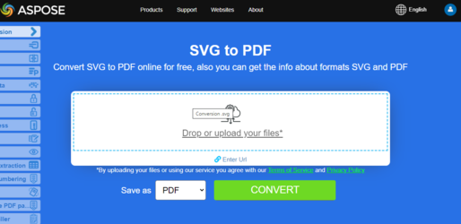

<script type="application/ld+json">
{
    "@context": "https://schema.org",
    "@type": "TechArticle",
    "headline": "Convert various Images formats to PDF in .NET",
    "alternativeHeadline": "Convert Multiple Image Formats to PDF with C#",
    "abstract": "Introducing a powerful feature in Aspose.PDF for .NET that enables seamless conversion of various image formats including BMP, CGM, DICOM, EMF, JPG, PNG, SVG, TIFF, CDR, and DJVU into high-quality PDF documents. This functionality provides a straightforward way to integrate image-to-PDF conversions within your .NET applications, ensuring efficient handling of diverse graphic content",
    "author": {
        "@type": "Person",
        "name": "Anastasiia Holub",
        "givenName": "Anastasiia",
        "familyName": "Holub",
        "url": "https://www.linkedin.com/in/anastasiia-holub-750430225/"
    },
    "genre": "pdf document generation",
    "wordcount": "5228",
    "proficiencyLevel": "Beginner",
    "publisher": {
        "@type": "Organization",
        "name": "Aspose.PDF for .NET",
        "url": "https://products.aspose.com/pdf",
        "logo": "https://www.aspose.cloud/templates/aspose/img/products/pdf/aspose_pdf-for-net.svg",
        "alternateName": "Aspose",
        "sameAs": [
            "https://facebook.com/aspose.pdf/",
            "https://twitter.com/asposepdf",
            "https://www.youtube.com/channel/UCmV9sEg_QWYPi6BJJs7ELOg/featured",
            "https://www.linkedin.com/company/aspose",
            "https://stackoverflow.com/questions/tagged/aspose",
            "https://aspose.quora.com/",
            "https://aspose.github.io/"
        ],
        "contactPoint": [
            {
                "@type": "ContactPoint",
                "telephone": "+1 903 306 1676",
                "contactType": "sales",
                "areaServed": "US",
                "availableLanguage": "en"
            },
            {
                "@type": "ContactPoint",
                "telephone": "+44 141 628 8900",
                "contactType": "sales",
                "areaServed": "GB",
                "availableLanguage": "en"
            },
            {
                "@type": "ContactPoint",
                "telephone": "+61 2 8006 6987",
                "contactType": "sales",
                "areaServed": "AU",
                "availableLanguage": "en"
            }
        ]
    },
    "url": "/net/convert-images-format-to-pdf/",
    "mainEntityOfPage": {
        "@type": "WebPage",
        "@id": "/net/convert-images-format-to-pdf/"
    },
    "dateModified": "2024-11-25",
    "description": "Aspose.PDF can perform not only simple and easy tasks but also cope with more complex goals. Check the next section for advanced users and developers."
}
</script>

## Overview

This article explains how to convert various Images formats to PDF using C#. It covers these topics.

The following code snippet also work with [Aspose.PDF.Drawing](/pdf/net/drawing/) library.

_Format_: **BMP**
- [C# BMP to PDF](#csharp-bmp-to-pdf)
- [C# Convert BMP to PDF](#csharp-bmp-to-pdf)
- [C# How to convert BMP image to PDF](#csharp-bmp-to-pdf)

_Format_: **CGM**
- [C# CGM to PDF](#csharp-cgm-to-pdf)
- [C# Convert CGM to PDF](#csharp-cgm-to-pdf)
- [C# How to convert CGM image to PDF](#csharp-cgm-to-pdf)

_Format_: **DICOM**
- [C# DICOM to PDF](#csharp-dicom-to-pdf)
- [C# Convert DICOM to PDF](#csharp-dicom-to-pdf)
- [C# How to convert DICOM image to PDF](#csharp-dicom-to-pdf)

_Format_: **EMF**
- [C# EMF to PDF](#csharp-emf-to-pdf)
- [C# Convert EMF to PDF](#csharp-emf-to-pdf)
- [C# How to convert EMF image to PDF](#csharp-emf-to-pdf)

_Format_: **GIF**
- [C# GIF to PDF](#csharp-gif-to-pdf)
- [C# Convert GIF to PDF](#csharp-gif-to-pdf)
- [C# How to convert GIF image to PDF](#csharp-gif-to-pdf)

_Format_: **JPG**
- [C# JPG to PDF](#csharp-jpg-to-pdf)
- [C# Convert JPG to PDF](#csharp-jpg-to-pdf)
- [C# How to convert JPG image to PDF](#csharp-jpg-to-pdf)

_Format_: **PNG**
- [C# PNG to PDF](#csharp-png-to-pdf)
- [C# Convert PNG to PDF](#csharp-png-to-pdf)
- [C# How to convert PNG image to PDF](#csharp-png-to-pdf)

_Format_: **SVG**
- [C# SVG to PDF](#csharp-svg-to-pdf)
- [C# Convert SVG to PDF](#csharp-svg-to-pdf)
- [C# How to convert SVG image to PDF](#csharp-svg-to-pdf)

_Format_: **TIFF**
- [C# TIFF to PDF](#csharp-tiff-to-pdf)
- [C# Convert TIFF to PDF](#csharp-tiff-to-pdf)
- [C# How to convert TIFF image to PDF](#csharp-tiff-to-pdf)

_Format_: **CDR**
- [C# CDR to PDF](#csharp-cdr-to-pdf)
- [C# Convert CDR to PDF](#csharp-cdr-to-pdf)
- [C# How to convert CDR image to PDF](#csharp-cdr-to-pdf)

_Format_: **DJVU**
- [C# DJVU to PDF](#csharp-djvu-to-pdf)
- [C# Convert DJVU to PDF](#csharp-djvu-to-pdf)
- [C# How to convert DJVU image to PDF](#csharp-djvu-to-pdf)

Other topics covered by this article
- [See Also](#see-also)


## C# Images to PDF Conversions

**Aspose.PDF for .NET**  allows you to convert different formats of images to PDF files. Our library demonstrates code snippets for converting the most popular image formats, such as - BMP, CGM, DICOM, EMF, JPG, PNG, SVG and TIFF formats.

## Convert BMP to PDF

Convert BMP files to PDF document using **Aspose.PDF for .NET** library.

<abbr title="Bitmap Image File">BMP</abbr> images are Files having extension. BMP represent Bitmap Image files that are used to store bitmap digital images. These images are independent of graphics adapter and are also called device independent bitmap (DIB) file format.
You can convert BMP to PDF files with Aspose.PDF for .NET API. Therefore, you can follow the following steps to convert BMP images:

<a name="csharp-bmp-to-pdf" id="csharp-bmp-to-pdf"><strong>Steps: Convert BMP to PDF in C#</strong></a>

1. Initialize a new [Document](https://reference.aspose.com/pdf/net/aspose.pdf/document) class object.
2. Load input **BMP** image.
3. Finally, save the output PDF file.

So the following code snippet follows these steps and shows how to convert BMP to PDF using C#:

```csharp
private static void ConvertBMPtoPDF()
{
    var dataDir = RunExamples.GetDataDir_AsposePdf_WorkingDocuments();
	//Initialize empty PDF document
	using (var document = new Aspose.Pdf.Document())
	{
		document.Pages.Add();
		Aspose.Pdf.Image image = new Aspose.Pdf.Image();
		
		// Load sample BMP image file
		image.File = dataDir + "BMPtoPDF.bmp";
		document.Pages[1].Paragraphs.Add(image);
		
		// Save output PDF document
		document.Save(dataDir + "BMPtoPDF_out.pdf");
    }
}
```

{}
**Try to convert BMP to PDF online**

Aspose presents you online free application ["BMP to PDF"](https://products.aspose.app/pdf/conversion/bmp-to-pdf/), where you may try to investigate the functionality and quality it works.

[](https://products.aspose.app/pdf/conversion/bmp-to-pdf/)
{}

## Convert CGM to PDF

<abbr title="Computer Graphics Metafile">CGM</abbr> is a file extension for a Computer Graphics Metafile format commonly used in CAD (computer-aided design) and presentation graphics applications. CGM is a vector graphics format that supports three different encoding methods: binary (best for program read speed), character-based (produces the smallest file size and allows for faster data transfers) or cleartext encoding (allows users to read and modify the file with a text editor).

Check next code snippet for converting CGM files to PDF format.

<a name="csharp-cgm-to-pdf" id="csharp-cgm-to-pdf"><strong>Steps: Convert CGM to PDF in C#</strong></a>

1. Create an instance of [CgmLoadOptions](https://reference.aspose.com/pdf/net/aspose.pdf/cgmloadoptions) class.
2. Create an instance of [Document](https://reference.aspose.com/pdf/net/aspose.pdf/document) class with mention source filename and options.
3. Save the document with the desired file name.

```csharp
private static void ConvertCGMtoPDF()
{
    var dataDir = RunExamples.GetDataDir_AsposePdf_WorkingDocuments();
	var option = new Aspose.Pdf.CgmLoadOptions();
	using (var document = new Aspose.Pdf.Document(dataDir + "CGMtoPDF.cgm", option))
	{
		document.Save(dataDir + "CGMtoPDF_out.pdf");
	}
}
```

## Convert DICOM to PDF

<abbr title="Digital Imaging and Communications in Medicine">DICOM</abbr> format is the medical industry standard for the creation, storage, transmission, and visualization of digital medical images and documents of examined patients.

**Aspsoe.PDF for .NET** allows you to convert DICOM and SVG images, but for technical reasons to add images you need to specify the type of file to be added to PDF:

<a name="csharp-dicom-to-pdf" id="csharp-dicom-to-pdf"><strong>Steps: Convert DICOM to PDF in C#</strong></a>

1. Create an object of the Image class.
2. Add the image to a page's Paragraphs collection.
3. Specify the [FileType](https://reference.aspose.com/pdf/net/aspose.pdf/image/properties/filetype) property.
4. Specify the file's path or source.
    - If an image is at a location on the hard drive, specify the path location using the Image.File property.
    - If an image is placed in a MemoryStream, pass the object holding the image to the Image.ImageStream property.

The following code snippet shows how to convert DICOM files to PDF format with Aspose.PDF. You should load DICOM image, place the image on a page in a PDF file and save the output as PDF.

```csharp
private static void ConvertDICOMtoPDF()
{
    var dataDir = RunExamples.GetDataDir_AsposePdf_WorkingDocuments();
	// Instantiate Document Object
    using (var document = new Aspose.Pdf.Document())
    {
		// Add a page to pages collection of document
		Page page = document.Pages.Add();
		
		var image = new Aspose.Pdf.Image
		{
			FileType = ImageFileType.Dicom,
			File = dataDir + "DICOMtoPDF.dcm"
		};
		document.Pages[1].Paragraphs.Add(image);
		// Save output as PDF format
		document.Save(dataDir + "DICOMtoPDF_out.pdf");
    }
}
```

{}
**Try to convert DICOM to PDF online**

Aspose presents you online free application ["DICOM to PDF"](https://products.aspose.app/pdf/conversion/dicom-to-pdf/), where you may try to investigate the functionality and quality it works.

[](https://products.aspose.app/pdf/conversion/dicom-to-pdf/)
{}

## Convert EMF to PDF

<abbr title="Enhanced metafile format">EMF</abbr> stores graphical images device-independently. Metafiles of EMF comprises of variable-length records in chronological order that can render the stored image after parsing on any output device. Furthermore, you can convert EMF to PDF image using the below steps:

<a name="csharp-emf-to-pdf" id="csharp-emf-to-pdf"><strong>Steps: Convert EMF to PDF in C#</strong></a>

1. Firstly, initialize [Document](https://reference.aspose.com/pdf/net/aspose.pdf/document) class object.
2. Load **EMF** image file.
3. Add the loaded EMF image to a Page.
4. Save PDF document.

Moreover, the following code snippet shows how to convert an EMF to PDF with C# in your .NET code snippet:

```csharp
private static void ConvertEMFtoPDF()
{
    var dataDir = RunExamples.GetDataDir_AsposePdf_WorkingDocuments();
	// Initialize new PDF document
    using (var document = new Aspose.Pdf.Document())
    {
		// Spcify path of input EMF image file
		var imageFile = dataDir + "EMFtoPDF.emf";
		var page = document.Pages.Add();
		var image = new Aspose.Pdf.Image();
		image.File = imageFile;

		// Specify page dimension properties
		page.PageInfo.Margin.Bottom = 0;
		page.PageInfo.Margin.Top = 0;
		page.PageInfo.Margin.Left = 0;
		page.PageInfo.Margin.Right = 0;
		page.PageInfo.Width = image.BitmapSize.Width;
		page.PageInfo.Height = image.BitmapSize.Height;

		page.Paragraphs.Add(image);

		//Save output PDF document
		document.Save(dataDir + "EMFtoPDF_out.pdf");
    }
}
```

{}
**Try to convert EMF to PDF online**

Aspose presents you online free application ["EMF to PDF"](https://products.aspose.app/pdf/conversion/emf-to-pdf/), where you may try to investigate the functionality and quality it works.

[](https://products.aspose.app/pdf/conversion/emf-to-pdf/)
{}

## Convert GIF to PDF

Convert GIF files to PDF document using **Aspose.PDF for .NET** library.

<abbr title="Graphics Interchange Format">GIF</abbr> is able to store compressed data without loss of quality in a format of no more than 256 colors. The hardware-independent GIF format was developed in 1987 (GIF87a) by CompuServe for transmitting bitmap images over networks.
You can convert GIF to PDF files with Aspose.PDF for .NET API. Therefore, you can follow the following steps to convert GIF images:

<a name="csharp-gif-to-pdf" id="csharp-gif-to-pdf"><strong>Steps: Convert GIF to PDF in C#</strong></a>

1. Initialize a new [Document](https://reference.aspose.com/pdf/net/aspose.pdf/document) class object.
2. Load input **GIF** image.
3. Finally, save the output PDF file.

So the following code snippet follows these steps and shows how to convert BMP to PDF using C#:

```csharp
private static void ConvertGIFtoPDF()
{
    var dataDir = RunExamples.GetDataDir_AsposePdf_WorkingDocuments();
    using (var document = new Aspose.Pdf.Document())
    {
		//Initialize empty PDF document
		document.Pages.Add();
		var image = new Aspose.Pdf.Image();
		
		// Load sample GIF image file
		image.File = dataDir + "GIFtoPDF.gif";
		document.Pages[1].Paragraphs.Add(image);
		// Save output PDF document
		document.Save(dataDir + "GIFtoPDF_out.pdf");
    }
}
```

{}
**Try to convert GIF to PDF online**

Aspose presents you online free application ["GIF to PDF"](https://products.aspose.app/pdf/conversion/gif-to-pdf/), where you may try to investigate the functionality and quality it works.

[](https://products.aspose.app/pdf/conversion/gif-to-pdf/)
{}

## Convert JPG to PDF

No need to wonder how to convert JPG to PDF, because **Apose.PDF for .NET** library has best decision.

You can very easy convert a JPG images to PDF with Aspose.PDF for .NET by following steps:

<a name="csharp-jpg-to-pdf" id="csharp-jpg-to-pdf"><strong>Steps: Convert JPG to PDF in C#</strong></a>

1. Initialize object of [Document](https://reference.aspose.com/page/net/aspose.page/document) class.
2. Add a new Page to PDF document.
3. Load **JPG** image and add to paragraph.
4. Save output PDF.

The code snippet below shows how to convert JPG Image to PDF using C#:

```csharp
private static void ConvertJPGtoPDF()
{
    var dataDir = RunExamples.GetDataDir_AsposePdf_WorkingDocuments();
	// Initialize new PDF document
    using (var document = new Aspose.Pdf.Document())
    {
		// Load input JPG file
		String path = dataDir + "JPGtoPDF.jpg";
		// Add empty page in empty document
		var page = document.Pages.Add();
		var image = new Aspose.Pdf.Image();
		image.File = path;
		
		// Add image on a page
		page.Paragraphs.Add(image);
		
		// Save output PDF file
		document.Save(dataDir + "JPGtoPDF_out.pdf");
    }
}
```

Then you can see how to convert an image to PDF with the **same height and width of the page**. We will be getting the image dimensions and accordingly set the page dimensions of PDF document with the below steps:

1. Load input image file.
1. Set height, width, and margins of a page.
1. Save the output PDF file.

Following code snippet shows how to convert an Image to PDF with same page height and width using C#:

```csharp
private static void ConvertJPGtoPDF()
{
    var dataDir = RunExamples.GetDataDir_AsposePdf_WorkingDocuments();
    using (var document = new Aspose.Pdf.Document())
    {
		var path = dataDir + "JPGtoPDF.jpg";
		// Add an empty page
		var page = document.Pages.Add();
		var image = new Aspose.Pdf.Image();
		image.File = path;
		
		// Read Height of input image
		page.PageInfo.Height = image.BitmapSize.Height;
		// Read Width of input image
		page.PageInfo.Width = image.BitmapSize.Width;
		page.PageInfo.Margin.Bottom = 0;
		page.PageInfo.Margin.Top = 0;
		page.PageInfo.Margin.Right = 0;
		page.PageInfo.Margin.Left = 0;
		page.Paragraphs.Add(image);
		
		// Save output PDF file
		document.Save(dataDir + "JPGtoPDF_out.pdf");
    }
}
```

{}
**Try to convert JPG to PDF online**

Aspose presents you online free application ["JPG to PDF"](https://products.aspose.app/pdf/conversion/jpg-to-pdf/), where you may try to investigate the functionality and quality it works.

[](https://products.aspose.app/pdf/conversion/jpg-to-pdf/)
{}

## Convert PNG to PDF

**Aspose.PDF for .NET** support feature to convert PNG images to PDF format. Check the next code snippet for realizing you task.

<abbr title="Portable Network Graphics">PNG</abbr> refers to a type of raster image file format that use loseless compression, that makes it popular among its users.

You can convert PNG to PDF image using the below steps:

<a name="csharp-png-to-pdf" id="csharp-png-to-pdf"><strong>Steps: Convert PNG to PDF in C#</strong></a>

1. Load input **PNG** image.
2. Read height and width values.
3. Create new [Document](https://reference.aspose.com/page/net/aspose.page/document) object and add Page.
4. Set page dimensions.
5. Save output file.

Moreover, the code snippet below shows how to convert PNG to PDF with C# in your .NET applications:

```csharp
private static void ConvertPNGtoPDF()
{
    var dataDir = RunExamples.GetDataDir_AsposePdf_WorkingDocuments();
    using (var document = new Aspose.Pdf.Document())
    {
		// Load input PNG file
		String path = dataDir + "PNGtoPDF.png";
		// Add an empty page
		var page = document.Pages.Add();
		var image = new Aspose.Pdf.Image();
		image.File = path;
		
		// Read Height of input image
		page.PageInfo.Height = image.BitmapSize.Height;
		// Read Width of input image
		page.PageInfo.Width = image.BitmapSize.Width;
		page.PageInfo.Margin.Bottom = 0;
		page.PageInfo.Margin.Top = 0;
		page.PageInfo.Margin.Right = 0;
		page.PageInfo.Margin.Left = 0;
		page.Paragraphs.Add(image);
		
		// Save output PDF
		document.Save(dataDir + "PNGtoPDF_out.pdf");
    }
}
```

{}
**Try to convert PNG to PDF online**

Aspose presents you online free application ["PNG to PDF"](https://products.aspose.app/pdf/conversion/png-to-pdf/), where you may try to investigate the functionality and quality it works.

[](https://products.aspose.app/pdf/conversion/png-to-pdf/)
{}

## Convert SVG to PDF

**Aspose.PDF for .NET** explains how to convert SVG images to PDF format and how to get dimensions of the source <abbr title="Scalable Vector Graphics">SVG</abbr> file.

Scalable Vector Graphics (SVG) is a family of specifications of an XML-based file format for two-dimensional vector graphics, both static and dynamic (interactive or animated). The SVG specification is an open standard that has been under development by the World Wide Web Consortium (W3C) since 1999.

SVG images and their behaviors are defined in XML text files. This means that they can be searched, indexed, scripted, and if required, compressed. As XML files, SVG images can be created and edited with any text editor, but it is often more convenient to create them with drawing programs such as Inkscape.

{}
**Try to convert SVG format to PDF online**

Aspose.PDF for .NET presents you online free application ["SVG to PDF"](https://products.aspose.app/pdf/conversion/svg-to-pdf), where you may try to investigate the functionality and quality it works.

[](https://products.aspose.app/pdf/conversion/svg-to-pdf)
{}

To convert SVG files to PDF, use the class named [SvgLoadOptions](https://reference.aspose.com/net/pdf/aspose.pdf/svgloadoptions) which is used to initialize the [`LoadOptions`](https://reference.aspose.com/pdf/net/aspose.pdf/loadoptions) object. Later, this object is passed as an argument during the Document object initialization and helps the PDF rendering engine to determine the input format of the source document.

<a name="csharp-svg-to-pdf" id="csharp-svg-to-pdf"><strong>Steps: Convert SVG to PDF in C#</strong></a>

1. Create an instance of [`SvgLoadOptions`](https://reference.aspose.com/pdf/net/aspose.pdf/loadoptions) class.
2. Create an instance of [`Document`](https://reference.aspose.com/pdf/net/aspose.pdf/document) class with mention source filename and options.
3. Save the document with the desired file name.

The following code snippet shows the process of converting SVG file into PDF format with Aspose.PDF for .NET.

```csharp
private static void ConvertSVGtoPDF()
{
    var dataDir = RunExamples.GetDataDir_AsposePdf_WorkingDocuments();
	var option = new Aspose.Pdf.SvgLoadOptions();
	using (var document = new Aspose.Pdf.Document(dataDir + "SVGtoPDF.svg", option))
	{
		document.Save(dataDir + "SVGtoPDF_out.pdf");
	}
}
```

## Get SVG dimensions

It is also possible to get the dimensions of the source SVG file. This information can be useful if we want the SVG to cover the entire page of the output PDF. The SvgLoadOption class' AdjustPageSize property fulfills this requirement. The default value of this property is false. If the value is set to true, the output PDF will have the same size (dimensions) as the source SVG.

The following code snippet shows the process of getting the source SVG file's dimensions and generating a PDF file.

```csharp
private static void ConvertSVGtoPDF()
{
    var dataDir = RunExamples.GetDataDir_AsposePdf_WorkingDocuments();
	// For complete examples and data files, please go to https://github.com/aspose-pdf/Aspose.PDF-for-.NET
	// The path to the documents directory.
	string dataDir = RunExamples.GetDataDir_AsposePdf_DocumentConversion();
	var loadopt = new Aspose.Pdf.SvgLoadOptions();
	loadopt.AdjustPageSize = true;
	using (var document = new Aspose.Pdf.Document(dataDir + "SVGtoPDF.svg", loadopt))
	{
		document.Pages[1].PageInfo.Margin.Top = 0;
		document.Pages[1].PageInfo.Margin.Left = 0;
		document.Pages[1].PageInfo.Margin.Bottom = 0;
		document.Pages[1].PageInfo.Margin.Right = 0;
		document.Save(dataDir + "SVGtoPDF_out.pdf");
	}
    
}
```

### SVG Supported Features

<table>
    <thead>
        <tr>
            <th>
                <p>SVG Tag</p>
            </th>
            <th>
                <p>Sample Use</p>
            </th>
        </tr>
    </thead>
    <tbody>
        <tr>
            <td>
                <p>circle</p>
            </td>
            <td>
                <code><pre>&lt circle id="r2" cx="10" cy="10" r="10" stroke="blue" stroke-width="2"&gt </pre></code>
            </td>
        </tr>
        <tr>
            <td>
                <p>defs</p>
            </td>
            <td>
                <code>&lt;defs&gt;&nbsp; <br> &lt;rect id="r1" width="15" height="15"
                    stroke="blue" stroke-width="2" /&gt;&nbsp; <br> &lt;circle id="r2"
                    cx="10" cy="10" r="10" stroke="blue" stroke-width="2"/&gt;&nbsp; <br>
                    &lt;circle id="r3" cx="10" cy="10" r="10" stroke="blue" stroke-width="3"/&gt;&nbsp; <br> &lt;/defs&gt;&nbsp; <br> &lt;use
                    x="25" y="40" xlink:href="#r1" fill="red"/&gt;&nbsp; <br> &lt;use
                    x="35" y="15" xlink:href="#r2" fill="green"/&gt;&nbsp; <br> &lt;use
                    x="58" y="50" xlink:href="#r3" fill="blue"/&gt;</code>
            </td>
        </tr>
        <tr>
            <td>
                <p>tref</p>
            </td>
            <td>
                <p>&lt;defs&gt;&nbsp; <br> &nbsp;&nbsp;&nbsp; &lt;text
                    id="ReferencedText"&gt;&nbsp; <br> &nbsp;&nbsp;&nbsp;&nbsp;&nbsp;
                    Referenced character data&nbsp; <br> &nbsp;&nbsp;&nbsp;
                    &lt;/text&gt;&nbsp; <br> &lt;/defs&gt;&nbsp; <br
                        class="atl-forced-newline"> &lt;text x="10" y="100" font-size="15" fill="red" &gt;&nbsp; <br
                        class="atl-forced-newline"> &nbsp;&nbsp;&nbsp; &lt;tref
                    xlink:href="#ReferencedText"/&gt;&nbsp; <br> &lt;/text&gt;</p>
            </td>
        </tr>
        <tr>
            <td>
                <p>use</p>
            </td>
            <td>
                <p>&lt;defs&gt;&nbsp; <br> &nbsp;&nbsp;&nbsp; &lt;text id="Text" x="400"
                    y="200"&nbsp; <br>
                    &nbsp;&nbsp;&nbsp;&nbsp;&nbsp;&nbsp;&nbsp;&nbsp;&nbsp; font-family="Verdana" font-size="100"
                    text-anchor="middle" &gt;&nbsp; <br> &nbsp;&nbsp;&nbsp;&nbsp;&nbsp;
                    Masked text&nbsp; <br> &nbsp;&nbsp;&nbsp; &lt;/text&gt;&nbsp; <br
                        class="atl-forced-newline"> &lt;use xlink:href="#Text" fill="blue"&nbsp; /&gt;</p>
            </td>
        </tr>
        <tr>
            <td>
                <p>ellipse&nbsp;</p>
            </td>
            <td>
                <p>&lt;ellipse cx="2.5" cy="1.5" rx="2" ry="1" fill="red" /&gt;</p>
            </td>
        </tr>
        <tr>
            <td>
                <p>g&nbsp;</p>
            </td>
            <td>
                <p>&lt;g fill="none" stroke="dimgray" stroke-width="1.5" &gt;&nbsp; <br>
                    &nbsp;&nbsp; &nbsp;&nbsp;&nbsp; &nbsp;&nbsp;&nbsp; &nbsp;&nbsp;&nbsp; &nbsp;&lt;line x1="-7"
                    y1="-7" x2="-3" y2="-3"/&gt;&nbsp; <br> &nbsp;&nbsp;
                    &nbsp;&nbsp;&nbsp; &nbsp;&nbsp;&nbsp; &nbsp;&nbsp;&nbsp; &nbsp;&lt;line x1="7" y1="7" x2="3"
                    y2="3"/&gt;&nbsp; <br> &nbsp;&nbsp; &nbsp;&nbsp;&nbsp;
                    &nbsp;&nbsp;&nbsp; &nbsp;&nbsp;&nbsp; &nbsp;&lt;line x1="-7" y1="7" x2="-3" y2="3"/&gt;&nbsp;
                    <br> &nbsp;&nbsp; &nbsp;&nbsp;&nbsp; &nbsp;&nbsp;&nbsp;
                    &nbsp;&nbsp;&nbsp; &nbsp;&lt;line x1="7" y1="-7" x2="3" y2="-3"/&gt;&nbsp; <br
                        class="atl-forced-newline"> &lt;/g&gt;&nbsp;</p>
            </td>
        </tr>
        <tr>
            <td>
                <p>image</p>
            </td>
            <td>
                <p>&lt;image id="ShadedRelief" x="24" y="4" width="64" height="82" xlink:href="relief.jpg"
                    /&gt;&nbsp;</p>
            </td>
        </tr>
        <tr>
            <td>
                <p>line</p>
            </td>
            <td>
                <p>&lt;line style="stroke:#eea;stroke-width:8" x1="10" y1="30" x2="260" y2="100"/&gt;&nbsp;</p>
            </td>
        </tr>
        <tr>
            <td>
                <p>path</p>
            </td>
            <td>
                <p>&lt;path style="fill:#daa;fill-rule:evenodd;stroke:red" d="M 230,150 C 290,30 10,255 110,140 z
                    "/&gt;&nbsp;</p>
            </td>
        </tr>
        <tr>
            <td>
                <p>style</p>
            </td>
            <td>
                <p>&lt;path style="fill:#daa;fill-rule:evenodd;stroke:red" d="M 230,150 C 290,30 10,255 110,140 z
                    "/&gt;</p>
            </td>
        </tr>
        <tr>
            <td>
                <p>polygon</p>
            </td>
            <td>
                <p>&lt;polygon style="stroke:#24a;stroke-width:1.5;fill:#eefefe" points="10,10 180,10 10,250 10,10"
                    /&gt;</p>
            </td>
        </tr>
        <tr>
            <td>
                <p>polyline</p>
            </td>
            <td>
                <p>&lt;polyline fill="none" stroke="dimgray" stroke-width="1" points="-3,-6 3,-6 3,1 5,1 0,7 -5,1
                    -3,1 -3,-5"/&gt;</p>
            </td>
        </tr>
        <tr>
            <td>
                <p>rect&nbsp;</p>
            </td>
            <td>
                <p>&lt;rect x="0" y="0" width="400" height="600" stroke="none" fill="aliceblue" /&gt;</p>
            </td>
        </tr>
        <tr>
            <td>
                <p>svg</p>
            </td>
            <td>
                <p>&lt;svg xmlns="http://www.w3.org/2000/svg" version="1.1" width="10cm" height="5cm" &gt;</p>
            </td>
        </tr>
        <tr>
            <td>
                <p>text</p>
            </td>
            <td>
                <p>&lt;text font-family="sans-serif" fill="dimgray" font-size="22px" font-weight="bold" x="58"
                    y="30" pointer-events="none"&gt;Map Title&lt;/text&gt;</p>
            </td>
        </tr>
        <tr>
            <td>
                <p>font</p>
            </td>
            <td>
                <p>&lt;text x="10" y="100" font-size="15" fill="red" &gt;&nbsp; <br>
                    &nbsp;&nbsp;&nbsp; Sample text&nbsp; <br> &lt;/text&gt;</p>
            </td>
        </tr>
        <tr>
            <td>
                <p>tspan</p>
            </td>
            <td>
                <p>&lt;tspan dy="25" x="25"&gt;six ink color input value. Here it will &lt;/tspan&gt;</p>
            </td>
        </tr>
    </tbody>
</table>

## Convert TIFF to PDF

**Aspose.PDF** file format supported, be it a single frame or multi-frame <abbr title="Tag Image File Format">TIFF</abbr> image. It means that you can convert the TIFF image to PDF in your .NET applications.

TIFF or TIF, Tagged Image File Format, represents raster images that are meant for usage on a variety of devices that comply with this file format standard. TIFF image can contain several frames with different images. Aspose.PDF file format is also supported, be it a single frame or multi-frame TIFF image.

You can convert TIFF to PDF in the same manner as the rest raster file formats graphics:

<a name="csharp-tiff-to-pdf" id="csharp-tiff-to-pdf"><strong>Steps: Convert TIFF to PDF in C#</strong></a>

1. Create new [Document](https://reference.aspose.com/pdf/net/aspose.pdf/document) class object and add Page.
2. Load input **TIFF** image.
3. Save PDF document.

```csharp
private static void ConvertTIFFtoPDF()
{
    var dataDir = RunExamples.GetDataDir_AsposePdf_WorkingDocuments();
	//Initialize empty PDF document
    using (var document = new Aspose.Pdf.Document())
    {
		document.Pages.Add();
		var image = new Aspose.Pdf.Image();
		
		// Load sample Tiff image file
		image.File = dataDir + "TIFFtoPDF.tiff";
		document.Pages[1].Paragraphs.Add(image);
		
		// Save output PDF document
		document.Save(dataDir + "TIFFtoPDF_out.pdf");
    }
}
```

In case you need to convert multi-page TIFF image to multi-page PDF document and control some params, i.g. width or aspect ratio, please follow these steps:

1. Instantiate an instance of Document class.
1. Load input TIFF image.
1. Get FrameDimension of the frames.
1. Add new page for each frame.
1. Finally, save images to PDF pages.

The following code snippet shows how to convert multi-page or multi-frame TIFF image to PDF with C#:

```csharp
private static void ConvertTIFFtoPDF()
{
	var dataDir = RunExamples.GetDataDir_AsposePdf_WorkingDocuments();

	// Load TIFF image into stream
	using (var document = new Aspose.Pdf.Document())
	{
		var bitmap = new System.Drawing.Bitmap(File.OpenRead(dataDir + "TIFFtoPDF.tif"));

		// Convert multi page or multi frame TIFF to PDF
		FrameDimension dimension = new FrameDimension(bitmap.FrameDimensionsList[0]);
		int frameCount = bitmap.GetFrameCount(dimension);

		// Iterate through each frame
		for (int frameIdx = 0; frameIdx <= frameCount - 1; frameIdx++)
		{
			Page page = document.Pages.Add();

			bitmap.SelectActiveFrame(dimension, frameIdx);

			MemoryStream currentImage = new MemoryStream();
			bitmap.Save(currentImage, ImageFormat.Tiff);

			var imageht = new Aspose.Pdf.Image
			{
				ImageStream = currentImage,
				//Apply some other options
				//ImageScale = 0.5
			};
			page.Paragraphs.Add(imageht);
		}

		// Save output PDF file
		document.Save(dataDir + "TIFFtoPDF_out.pdf");
	}
}
```

## Convert CDR to PDF

<abbr title="CDR">CDR</abbr> is a file format that was developed by the Corel Corporation and is used mainly for vector graphic images and drawings. The CDR file format is recognized by the majority of image editing programs. The CDR format is the default format for Corel Draw Applications.

Check next code snippet for converting CDR files to PDF format.

<a name="csharp-cdr-to-pdf" id="csharp-cdr-to-pdf"><strong>Steps: Convert CDR to PDF in C#</strong></a>

1. Create an instance of [CdrLoadOptions](https://reference.aspose.com/pdf/net/aspose.pdf/cdrloadoptions/) class.
2. Create an instance of [Document](https://reference.aspose.com/pdf/net/aspose.pdf/document) class with mention source filename and options.
3. Save the document with the desired file name.

```csharp
private static void ConvertCDRtoPDF()
{
    var dataDir = RunExamples.GetDataDir_AsposePdf_WorkingDocuments();
    using (var document = new Aspose.Pdf.Document(dataDir + "CDRtoPDF.cdr", new CdrLoadOptions()))
    {
        document.Save(dataDir + "CDRtoPDF_out.pdf");
    }
}
```

## Convert DJVU to PDF

<abbr title="DJVU">DjVu</abbr> is a compressed image format which was developed by LizardTech. This file format was primarily designed to store different kinds of scanned documents; especially documents that contain a combination of text, pictures, indexed color images, and line drawings.

Check next code snippet for converting DJVU files to PDF format.

<a name="csharp-djvu-to-pdf" id="csharp-djvu-to-pdf"><strong>Steps: Convert DJVU to PDF in C#</strong></a>

1. Create an instance of [DjvuLoadOptions](https://reference.aspose.com/pdf/net/aspose.pdf/djvuloadoptions/) class.
2. Create an instance of [Document](https://reference.aspose.com/pdf/net/aspose.pdf/document) class with mention source filename and options.
3. Save the document with the desired file name.

```csharp
private static void ConvertDJVUtoPDF()
{
    var dataDir = RunExamples.GetDataDir_AsposePdf_WorkingDocuments();
    
    using (var document = new Aspose.Pdf.Document(dataDir + "CDRtoPDF.djvu", new DjvuLoadOptions()))
    {
        document.Save(dataDir + "CDRtoPDF_out.pdf");
    }
}

```

## Convert HEIC to PDF

A HEIC file is a High-Efficiency Container Image file format that can store multiple images as a collection in a single file.
For loading heic images you need to add a reference to the https://www.nuget.org/packages/FileFormat.Heic/ nuget package.
Convert HEIC images to PDF using Aspose.PDF:

```cs
private static void ConvertHEICtoPDF()
{
    var dataDir = RunExamples.GetDataDir_AsposePdf_WorkingDocuments();
    
    using (var fs = new FileStream(dataDir + "HEICtoPDF.heic", FileMode.Open))
    {
        var image = FileFormat.Heic.Decoder.HeicImage.Load(fs);
        var pixels = image.GetByteArray(PixelFormat.Rgb24);
        var width = (int)image.Width;
        var height = (int)image.Height;

        using (var document = new Aspose.Pdf.Document())
        {
            var page = document.Pages.Add();
            var asposeImage = new Aspose.Pdf.Image();
            asposeImage.BitmapInfo = new Aspose.Pdf.BitmapInfo(pixels, width, height, BitmapInfo.PixelFormat.Rgb24);
            page.PageInfo.Height = height;
            page.PageInfo.Width = width;
            page.PageInfo.Margin.Bottom = 0;
            page.PageInfo.Margin.Top = 0;
            page.PageInfo.Margin.Right = 0;
            page.PageInfo.Margin.Left = 0;

            page.Paragraphs.Add(asposeImage);
            document.Save(dataDir + "HEICtoPDF_out.pdf");
        }
    }
}
```

## Applies to

|**Platform**|**Supported**|**Comments**|
| :- | :- |:- |
|Windows .NET Framework|2.0-4.6| |
|Windows .NET Core |2.0-3.1| |
|.NET 5 Windows| |
|Linux .NET Core|2.0-3.1 | |
|.NET 5 Linux | |

## See Also

This article also covers these topics. The codes are same as above.

_Format_: **BMP**
- [C# BMP to PDF Code](#csharp-bmp-to-pdf)
- [C# BMP to PDF API](#csharp-bmp-to-pdf)
- [C# BMP to PDF Programmatically](#csharp-bmp-to-pdf)
- [C# BMP to PDF Library](#csharp-bmp-to-pdf)
- [C# Save BMP as PDF](#csharp-bmp-to-pdf)
- [C# Generate PDF from BMP](#csharp-bmp-to-pdf)
- [C# Create PDF from BMP](#csharp-bmp-to-pdf)
- [C# BMP to PDF Converter](#csharp-bmp-to-pdf)

_Format_: **CGM**
- [C# CGM to PDF Code](#csharp-cgm-to-pdf)
- [C# CGM to PDF API](#csharp-cgm-to-pdf)
- [C# CGM to PDF Programmatically](#csharp-cgm-to-pdf)
- [C# CGM to PDF Library](#csharp-cgm-to-pdf)
- [C# Save CGM as PDF](#csharp-cgm-to-pdf)
- [C# Generate PDF from CGM](#csharp-cgm-to-pdf)
- [C# Create PDF from CGM](#csharp-cgm-to-pdf)
- [C# CGM to PDF Converter](#csharp-cgm-to-pdf)

_Format_: **DICOM**
- [C# DICOM to PDF Code](#csharp-dicom-to-pdf)
- [C# DICOM to PDF API](#csharp-dicom-to-pdf)
- [C# DICOM to PDF Programmatically](#csharp-dicom-to-pdf)
- [C# DICOM to PDF Library](#csharp-dicom-to-pdf)
- [C# Save DICOM as PDF](#csharp-dicom-to-pdf)
- [C# Generate PDF from DICOM](#csharp-dicom-to-pdf)
- [C# Create PDF from DICOM](#csharp-dicom-to-pdf)
- [C# DICOM to PDF Converter](#csharp-dicom-to-pdf)

_Format_: **EMF**
- [C# EMF to PDF Code](#csharp-emf-to-pdf)
- [C# EMF to PDF API](#csharp-emf-to-pdf)
- [C# EMF to PDF Programmatically](#csharp-emf-to-pdf)
- [C# EMF to PDF Library](#csharp-emf-to-pdf)
- [C# Save EMF as PDF](#csharp-emf-to-pdf)
- [C# Generate PDF from EMF](#csharp-emf-to-pdf)
- [C# Create PDF from EMF](#csharp-emf-to-pdf)
- [C# EMF to PDF Converter](#csharp-emf-to-pdf)

_Format_: **DjVu**
- [C# DjVu to PDF Code](#csharp-djvu-to-pdf)
- [C# DjVu to PDF API](#csharp-djvu-to-pdf)
- [C# DjVu to PDF Programmatically](#csharp-djvu-to-pdf)
- [C# DjVu to PDF Library](#csharp-djvu-to-pdf)
- [C# Save DjVu as PDF](#csharp-djvu-to-pdf)
- [C# Generate PDF from DjVu](#csharp-djvu-to-pdf)
- [C# Create PDF from DjVu](#csharp-djvu-to-pdf)
- [C# DjVu to PDF Converter](#csharp-djvu-to-pdf)

_Format_: **CDR**
- [C# CDR to PDF Code](#csharp-cdr-to-pdf)
- [C# CDR to PDF API](#csharp-cdr-to-pdf)
- [C# CDR to PDF Programmatically](#csharp-cdr-to-pdf)
- [C# CDR to PDF Library](#csharp-cdr-to-pdf)
- [C# Save CDR as PDF](#csharp-cdr-to-pdf)
- [C# Generate PDF from CDR](#csharp-cdr-to-pdf)
- [C# Create PDF from CDR](#csharp-cdr-to-pdf)
- [C# CDR to PDF Converter](#csharp-cdr-to-pdf)