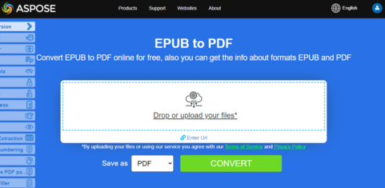
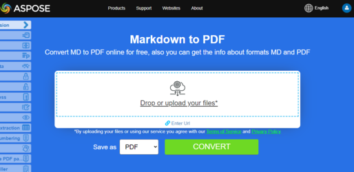

## Convert EPUB to PDF

**Aspose.PDF for .NET** allows you simply convert EPUB files to PDF format.

<abbr title="electronic publication">EPUB</abbr> (short for electronic publication) is a free and open e-book standard from the International Digital Publishing Forum (IDPF). Files have the extension .epub. EPUB is designed for reflowable content, meaning that an EPUB reader can optimize text for a particular display device.

EPUB also supports fixed-layout content. The format is intended as a single format that publishers and conversion houses can use in-house, as well as for distribution and sale. It supersedes the Open eBook standard.The version EPUB 3 is also endorsed by the Book Industry Study Group (BISG), a leading book trade association for standardized best practices, research, information and events, for packaging of content.

## Live Example

Aspose.PDF for .NET presents you online free application ["EPUB to PDF"](https://products.aspose.app/pdf/conversion/epub-to-pdf), where you may try to investigate the functionality and quality it works.

[](https://products.aspose.app/pdf/conversion/epub-to-pdf)

Conversion steps:

1. Create an instance of [EpubLoadOptions](https://apireference.aspose.com/pdf/net/aspose.pdf/epubloadoptions) class.
1. Create an instance of [Document](https://apireference.aspose.com/pdf/net/aspose.pdf/document) class with mention source filename and options.
1. Save the document with the desired file name.

Next following code snippet show you how to convert EPUB files to PDF format with C#.

```csharp
public static void ConvertEPUBtoPDF()
{
    EpubLoadOptions option = new EpubLoadOptions();
    Document pdfDocument= new Document(_dataDir + "WebAssembly.epub", option);
    pdfDocument.Save(_dataDir + "epub_test.pdf");
}
```

You can also set page size for conversion. To define new page size you `SizeF` object and pass it to [EpubLoadOptions](https://apireference.aspose.com/pdf/net/aspose.pdf/epubloadoptions/constructors/main) constructor.

```csharp
public static void ConvertEPUBtoPDFAdv()
{
    EpubLoadOptions option = new EpubLoadOptions(new SizeF(1190, 1684));
    Document pdfDocument= new Document(_dataDir + "WebAssembly.epub", option);
    pdfDocument.Save(_dataDir + "epub_test.pdf");
}
```

## Convert PDF to EPUB

## Live Example

Aspose.PDF for .NET presents you online free application ["PDF to EPUB"](https://products.aspose.app/pdf/conversion/pdf-to-epub), where you may try to investigate the functionality and quality it works.

[](https://products.aspose.app/pdf/conversion/pdf-to-epub)

<abbr title="Electronic Publication">EPUB</abbr> (short for Electronic Publication)** is a free and open e-book standard from the International Digital Publishing Forum (IDPF). Files have the extension .epub.
EPUB is designed for reflowable content, meaning that an EPUB reader can optimize text for a particular display device. EPUB also supports fixed-layout content. The format is intended as a single format that publishers and conversion houses can use in-house, as well as for distribution and sale. It supersedes the Open eBook standard.

Aspose.PDF for .NET also supports the feature to convert PDF documents to EPUB format. Aspose.PDF for .NET has a class named EpubSaveOptions which can be used as the second argument to [`Document.Save(..)`](https://apireference.aspose.com/pdf/net/aspose.pdf/document/methods/save/index) method, to generate an EPUB file.
Please try using the following code snippet to accomplish this requirement with C#.

```csharp
// For complete examples and data files, please go to https://github.com/aspose-pdf/Aspose.PDF-for-.NET
// The path to the documents directory.
string dataDir = RunExamples.GetDataDir_AsposePdf_DocumentConversion();
// Load PDF document
Document pdfDocument = new Document(dataDir + "PDFToEPUB.pdf");
// Instantiate Epub Save options
EpubSaveOptions options = new EpubSaveOptions();
// Specify the layout for contents
options.ContentRecognitionMode = EpubSaveOptions.RecognitionMode.Flow;
// Save the ePUB document
pdfDocument.Save(dataDir + "PDFToEPUB_out.epub", options);
```

## Convert HTML to PDF

**Aspose.PDF for .NET** is a PDF manipulation API that lets you convert any existing HTML documents to PDF seamlessly.
The process of converting HTML to PDF can be flexibly customized.

## Quick conversion from HTML to PDF

Quick conversion is shown in the following example.

```csharp
public static void ConvertHTMLtoPDF()
{
    HtmlLoadOptions options= new HtmlLoadOptions();
    Document pdfDocument= new Document(_dataDir + "test.html", options);
    pdfDocument.Save(_dataDir + "html_test.PDF");
}
```

## Advanced conversion from HTML to PDF

The HTML Conversion engine has several options that allow us to control the conversion process.

### Media Queries Support

Media queries are a popular technique for delivering a tailored style sheet to different devices. We can set device type using [`HtmlMediaType`](https://apireference.aspose.com/pdf/net/aspose.pdf/htmlloadoptions/properties/htmlmediatype) property.

```csharp
public static void ConvertHTMLtoPDFAdvanced_MediaType()
{
    HtmlLoadOptions options = new HtmlLoadOptions
    {
        // set Print or Screen mode
        HtmlMediaType = HtmlMediaType.Print
    };
    Document pdfDocument= new Document(_dataDir + "test.html", options);
    pdfDocument.Save(_dataDir + "html_test.PDF");
}
```

### Enable (disable) font embedding

HTML pages often use fonts (i.g. fonts from local folder, Google Fonts, etc). We can also control the embedding of fonts in a document using a [`IsEmbedFonts`](https://apireference.aspose.com/pdf/net/aspose.pdf/htmlloadoptions/properties/isembedfonts) property.

```csharp
public static void ConvertHTMLtoPDFAdvanced_EmbedFonts()
{
    // Disable font embedding
    HtmlLoadOptions options = new HtmlLoadOptions {IsEmbedFonts = false};
    Document pdfDocument= new Document(_dataDir + "test_fonts.html", options);
    pdfDocument.Save(_dataDir + "html_test.PDF");
}
```

### Manage external resource loading

The Conversion Engine provides a mechanism that allows you to control the loading of certain resources associated with the HTML document.
The [`HtmlLoadOptions`](https://apireference.aspose.com/pdf/net/aspose.pdf/htmlloadoptions) class has the property [`CustomLoaderOfExternalResources`](https://apireference.aspose.com/pdf/net/aspose.pdf/htmlloadoptions/fields/customloaderofexternalresources) with which we can define the behavior of the resource loader.
Assume we need to replace all PNG images with single image `test.jpg` and replace external URL to internal for other resources.
To do this we can define a custom loader `SamePictureLoader` and points [`CustomLoaderOfExternalResources`](https://apireference.aspose.com/pdf/net/aspose.pdf/htmlloadoptions/fields/customloaderofexternalresources) to this name.

```csharp
public static void ConvertHTMLtoPDFAdvanced_DummyImage()
{
    HtmlLoadOptions options = new HtmlLoadOptions
    {
        CustomLoaderOfExternalResources = SamePictureLoader
    };
    Document pdfDocument= new Document(_dataDir + "test.html", options);
    pdfDocument.Save(_dataDir + "html_test.PDF");
}

private static LoadOptions.ResourceLoadingResult SamePictureLoader(string resourceURI)
{
    LoadOptions.ResourceLoadingResult result;

    if (resourceURI.EndsWith(".png"))
    {
        byte[] resultBytes = File.ReadAllBytes(_dataDir + "test.jpg");
        result = new LoadOptions.ResourceLoadingResult(resultBytes)
        {
            //Set MIME Type
            MIMETypeIfKnown = "image/jpeg"
        };
    }
    else
    {
        result = new LoadOptions.ResourceLoadingResult(GetContentFromUrl(resourceURI));
    }
    return result;
}

private static byte[] GetContentFromUrl(string url)
{
    var httpClient = new HttpClient();
    return httpClient.GetByteArrayAsync(url).GetAwaiter().GetResult();
}
```

## Convert Web page to PDF

Converting a web page is slightly different than converting a local HTML document. In order to convert Web page contents to PDF format, we can first fetch the HTML page contents using HttpClient instance, create Stream object, pass the contents to the Document object and render the output in PDF format.

When converting a web page hosted on a webserver to PDF:

1. Read the contents of the page using an HttpClient object.
1. Instantiate the [HtmlLoadOptions](https://apireference.aspose.com/pdf/net/aspose.pdf/htmlloadoptions) object and set the base URL.
1. Initialize a Document object while passing the stream object.
1. Optionally, set the page size and/or orientation.

```csharp
public static void ConvertHTMLtoPDFAdvanced_WebPage()
{
    const string url = "https://en.wikipedia.org/wiki/Aspose_API";
    // Set page size A3 and Landscape orientation;   
    HtmlLoadOptions options = new HtmlLoadOptions(url)
    {
        PageInfo = {Width = 842, Height = 1191, IsLandscape = true}
    };
    Document pdfDocument= new Document(GetContentFromUrlAsStream(url), options);
    pdfDocument.Save(_dataDir + "html_test.PDF");
}

private static Stream GetContentFromUrlAsStream(string url, ICredentials credentials = null)
{
    using (var handler = new HttpClientHandler { Credentials = credentials })
    using (var httpClient = new HttpClient(handler))
    {
        return httpClient.GetStreamAsync(url).GetAwaiter().GetResult();
    }
}
```

### Provide credentials Web page to PDF conversion

Sometimes we need to perform the conversion of HTML files which require authentication and access privileges, so that only authentic users can fetch the page contents. It also includes the scenario where some resources/data referenced inside HTML are fetched from some external server which requires authentication and in order to cater to this requirement, the [`ExternalResourcesCredentials`](https://apireference.aspose.com/pdf/net/aspose.pdf/htmlloadoptions/fields/externalresourcescredentials) property is added to [`HtmlLoadOptions`](https://apireference.aspose.com/pdf/net/aspose.pdf/htmlloadoptions) class. Following code snippet shows the steps to pass credentials to request HTML & its respective resources while converting HTML file to PDF conversion.

```csharp
public static void ConvertHTMLtoPDFAdvanced_Authorized()
{
    const string url = "http://httpbin.org/basic-auth/user1/password1";
    var credentials = new NetworkCredential("user1", "password1");
    HtmlLoadOptions options = new HtmlLoadOptions(url)
    {
        ExternalResourcesCredentials = credentials
    };
    Document pdfDocument= new Document(GetContentFromUrlAsStream(url, credentials), options);
    pdfDocument.Save(_dataDir + "html_test.PDF");
}

private static Stream GetContentFromUrlAsStream(string url, ICredentials credentials = null)
{
    using (var handler = new HttpClientHandler { Credentials = credentials })
    using (var httpClient = new HttpClient(handler))
    {
        return httpClient.GetStreamAsync(url).GetAwaiter().GetResult();
    }
}
```

## Render all HTML content in a single Page

Aspose.PDF for .NET provides the ability to render all contents on a single page while converting HTML file to PDF format. For example, if you have some HTML content which output size is greater than one page, you can use option for rendering output data into a single PDF page. For using this option HtmlLoadOptions class was extended by IsRenderToSinglePage flag. The code snippet below shows how to use this functionality.

```csharp
// For complete examples and data files, please go to https://github.com/aspose-pdf/Aspose.PDF-for-.NET
// The path to the documents directory.
string dataDir = RunExamples.GetDataDir_AsposePdf_DocumentConversion();
// Initialize HTMLLoadSave Options
HtmlLoadOptions options = new HtmlLoadOptions();
// Set Render to single page property
options.IsRenderToSinglePage = true;
// Load document
Document pdfDocument= new Document(dataDir + "HTMLToPDF.html", options);
// Save
pdfDocument.Save(dataDir + "RenderContentToSamePage.pdf");
```

## Render HTML with SVG Data

Aspose.PDF for .NET provides ability to convert HTML page to PDF document. Since HTML allows adding SVG graphic element as a tag in the page, Aspose.PDF also supports conversion of such data into the resultant PDF file. The following code snippet shows how to convert HTML files with SVG graphic tags to Tagged PDF Documents.

```csharp
// For complete examples and data files, please go to https://github.com/aspose-pdf/Aspose.PDF-for-.NET
// The path to the documents directory.
string dataDir = RunExamples.GetDataDir_AsposePdf_DocumentConversion();
// Set input file path
string inFile = dataDir + "HTMLSVG.html";
// Set output file path
string outFile = dataDir + "RenderHTMLwithSVGData.pdf";
// Initialize HtmlLoadOptions
HtmlLoadOptions options = new HtmlLoadOptions(Path.GetDirectoryName(inFile));
// Initialize Document object
Document pdfDocument = new Document(inFile, options);
// save
pdfDocument.Save(outFile);
```

## Convert PDF to HTML

**Aspose.PDF for .NET** provides many features for converting various file formats into PDF documents and converting PDF files into various output formats. This article discusses how to convert a PDF file into <abbr title="HyperText Markup Language">HTML</abbr>. Aspose.PDF for .NET provides the capability to convert HTML files into PDF format using the InLineHtml approach. We have had many requests for functionality that converts a PDF file into HTML format and have provided this feature. Please note that this feature also supports XHTML 1.0.

**Aspose.PDF for .NET** support the features  to convert a PDF file into HTML. The main tasks you can accomplish with the Aspose.PDF library are listed:

- сonvert PDF to HTML;
- splitting Output to Multi-page HTML;
- specify Folder for Storing SVG Files;
- compressing SVG Images During Conversion;
- specifying the Images Folder;
- create Subsequent Files with Body Contents Only;
- transparent Text rendering;
- PDF document layers rendering.

## Live Example

Aspose.PDF for .NET presents you online free application ["PDF to HTML"](https://products.aspose.app/pdf/conversion/pdf-to-html), where you may try to investigate the functionality and quality it works.

[](https://products.aspose.app/pdf/conversion/pdf-to-html)

Aspose.PDF for .NET provides a two-line code for transforming a source PDF file to HTML. The [`SaveFormat enumeration`](https://apireference.aspose.com/pdf/net/aspose.pdf/saveformat) contains the value Html which lets you save the source file to HTML. The following code snippet shows the process of converting a PDF file into HTML.

```csharp
// For complete examples and data files, please go to https://github.com/aspose-pdf/Aspose.PDF-for-.NET
// The path to the documents directory.
string dataDir = RunExamples.GetDataDir_AsposePdf_DocumentConversion();

// Open the source PDF document
Document pdfDocument = new Document(dataDir + "PDFToHTML.pdf");

// Save the file into MS document format
pdfDocument.Save(dataDir + "output_out.html", SaveFormat.Html);
```

## Splitting Output to Multi-page HTML

When converting large PDF file with several pages to HTML format, the output appears as a single HTML page. It can end up being very long. To control page size, it is possible to split the output into several pages during PDF to HTML conversion. Please try using the following code snippet.

```csharp
// For complete examples and data files, please go to https://github.com/aspose-pdf/Aspose.PDF-for-.NET
// The path to the documents directory.
string dataDir = RunExamples.GetDataDir_AsposePdf_DocumentConversion();

// Open the source PDF document
Document pdfDocument = new Document(dataDir + "PDFToHTML.pdf");

// Instantiate HTML SaveOptions object
HtmlSaveOptions htmlOptions = new HtmlSaveOptions();

// Specify to split the output into multiple pages
htmlOptions.SplitIntoPages = true;

// Save the document
pdfDocument.Save(@"MultiPageHTML_out.html", htmlOptions);
```

## Specify Folder for Storing SVG Files

During PDF to HTML conversion, it is possible to specify the folder that SVG images should be saved to. Use the [`HtmlSaveOption class`](https://apireference.aspose.com/pdf/net/aspose.pdf/htmlsaveoptions) [`SpecialFolderForSvgImages property`](https://apireference.aspose.com/pdf/net/aspose.pdf/htmlsaveoptions/fields/specialfolderforsvgimages) to specify a special SVG image directory. This property gets or sets the path to the directory to which SVG images must be saved to when encountered during conversion. If the parameter is empty or null, then any SVG files are saved together with other image files.

```csharp
// Load the PDF file
Document doc = new Document(dataDir + "PDFToHTML.pdf");

// Instantiate HTML save options object
HtmlSaveOptions newOptions = new HtmlSaveOptions();

// Specify the folder where SVG images are saved during PDF to HTML conversion
newOptions.SpecialFolderForSvgImages = dataDir;

// Save the output file
doc.Save(dataDir + "SaveSVGFiles_out.html", newOptions);
```

## Compressing SVG Images During Conversion

To compress SVG images during PDF to HTML conversion, please try using the following code:

```csharp
// For complete examples and data files, please go to https://github.com/aspose-pdf/Aspose.PDF-for-.NET
// Create HtmlSaveOption with tested feature
HtmlSaveOptions newOptions = new HtmlSaveOptions();

// Compress the SVG images if there are any
newOptions.CompressSvgGraphicsIfAny = true;
```

## Specifying the Images Folder

We can also specify the folder that images will be saved to during PDF to HTML conversion:

```csharp
// For complete examples and data files, please go to https://github.com/aspose-pdf/Aspose.PDF-for-.NET
// Create HtmlSaveOption with tested feature
HtmlSaveOptions newOptions = new HtmlSaveOptions();

// Specify the separate folder to save images
newOptions.SpecialFolderForAllImages = dataDir;
```

## Create Subsequent Files with Body Contents Only

Recently, we were asked to introduce a feature where PDF files are converted to HTML and the user can get only the contents of the `<body>` tag for each page. This would produce one file with CSS, `<html>`, `<head>` details and all pages in other files just with `<body>` contents.

To meet this requirement, a new property, HtmlMarkupGenerationMode, was introduced to the HtmlSaveOptions class.

With the following simple code snippet, you can split the output HTML into pages. In the output pages, all HTML objects must go exactly where they go now (fonts processing and output, CSS creation and output, images creation and output), except that the output HTML will contain contents currently placed inside thetags (now “body” tags will be omitted). However, when using this approach, the link to the CSS is the responsibility of your code, because things like will be stripped out. For this purpose, you may read the CSS via File.ReadAllText() and send it via AJAX to to a web page where it will be applied by jQuery.

```csharp
// The path to the documents directory.
string dataDir = RunExamples.GetDataDir_AsposePdf_DocumentConversion();

Document doc = new Document(dataDir + "PDFToHTML.pdf");
           
HtmlSaveOptions options = new HtmlSaveOptions();
// This is the tested setting
options.HtmlMarkupGenerationMode = HtmlSaveOptions.HtmlMarkupGenerationModes.WriteOnlyBodyContent;
options.SplitIntoPages = true;

doc.Save(dataDir + "CreateSubsequentFiles_out.html", options);
```

## Transparent Text rendering

In case the source/input PDF file contains transparent texts shadowed by foreground images, then there might be text rendering issues. So in order to cater such scenarios, SaveShadowedTextsAsTransparentTexts and SaveTransparentTexts properties can be used.

```csharp
// For complete examples and data files, please go to https://github.com/aspose-pdf/Aspose.PDF-for-.NET
// The path to the documents directory.
string dataDir = RunExamples.GetDataDir_AsposePdf_DocumentConversion();

Document doc = new Document(dataDir + "PDFToHTML.pdf");
HtmlSaveOptions htmlOptions = new HtmlSaveOptions();
htmlOptions.SaveShadowedTextsAsTransparentTexts = true;
htmlOptions.SaveTransparentTexts = true;
doc.Save(dataDir + "TransparentTextRendering_out.html", htmlOptions);
```

## PDF document layers rendering

We can render PDF document layers in separate layer type element during PDF to HTML conversion:

```csharp
// For complete examples and data files, please go to https://github.com/aspose-pdf/Aspose.PDF-for-.NET
// The path to the documents directory.
string dataDir = RunExamples.GetDataDir_AsposePdf_DocumentConversion();

Document doc = new Document(dataDir + "PDFToHTML.pdf");
// Instantiate HTML SaveOptions object
HtmlSaveOptions htmlOptions = new HtmlSaveOptions();

// Specify to render PDF document layers separately in output HTML
htmlOptions.ConvertMarkedContentToLayers = true;

// Save the document
doc.Save(dataDir + "LayersRendering_out.html", htmlOptions);
```

## Convert MHTML to PDF 

## Live Example

Aspose.PDF for .NET presents you online free application ["MHTML to PDF"](https://products.aspose.app/pdf/conversion/mhtml-to-pdf), where you may try to investigate the functionality and quality it works.

[](https://products.aspose.app/pdf/conversion/mhtml-to-pdf)

<abbr title="MIME encapsulation of aggregate HTML documents">MHTML</abbr>, short for MIME HTML, is a web page archive format used to combine resources that are typically represented by external links (such as images, Flash animations, Java applets, and audio files) with HTML code into a single file. The content of an MHTML file is encoded as if it were an HTML email message, using the MIME type multipart/related. Aspose.PDF for .NET can convert HTML files to PDF format and with the release of Aspose.PDF for .NET 9.0.0, we have introduced a new feature that lets you convert MHTML files to PDF format. Next code snippet show how to covert MHTML files to PDF format with C#:

```csharp
public static void ConvertMHTtoPDF()
{
    MhtLoadOptions options = new MhtLoadOptions()
    {
        PageInfo = { Width = 842, Height = 1191, IsLandscape = true}
    };
    Document pdfDocument= new Document(_dataDir + "fileformatinfo.mht", options);
    pdfDocument.Save(_dataDir + "mhtml_test.PDF");
}
```

## Convert LaTeX/TeX to PDF

The LaTeX file format is a text file format with markup in the LaTeX derivative of the TeX family of languages and LaTeX is a derived format of the TeX system. LaTeX (ˈleɪtɛk/lay-tek or lah-tek) is a document preparation system and document markup language. It is widely used for the communication and publication of scientific documents in many fields, including mathematics, physics, and computer science. It also has a prominent role in the preparation and publication of books and articles that contain complex multilingual materials, such as Sanskrit and Arabic, including critical editions. LaTeX uses the TeX typesetting program for formatting its output, and is itself written in the TeX macro language.

## Live Example

Aspose.PDF for .NET presents you online free application ["LaTex to PDF"](https://products.aspose.app/pdf/conversion/tex-to-pdf), where you may try to investigate the functionality and quality it works.

[](https://products.aspose.app/pdf/conversion/tex-to-pdf)

Aspose.PDF for .NET supports the feature to convert TeX files to PDF format and in order to accomplish this requirement, Aspose.Pdf namespace has a class named [LatexLoadOptions](https://apireference.aspose.com/pdf/net/aspose.pdf/latexloadoptions) which provides the capabilities to load LaTex files and render the output in PDF format using [Document class](https://apireference.aspose.com/pdf/net/aspose.pdf/document).
The following code snippet shows the process of converting LaTex file to PDF format with C#.

```csharp
public static void ConvertTeXtoPDF()
{
    // Instantiate Latex Load option object
    TeXLoadOptions options = new TeXLoadOptions();
    // Create Document object
    Aspose.Pdf.Document pdfDocument= new Aspose.Pdf.Document(_dataDir + "samplefile.tex", options);
    // Save the output in PDF file
    pdfDocument.Save(_dataDir + "TeXToPDF_out.pdf");
}
```

## Convert PDF to LaTeX/TeX

**Aspose.PDF for .NET** support converting PDF to LaTeX/TeX.
The LaTeX file format is a text file format with the special markup and used in TeX-based document preparation system for high-quality typesetting.

## Live Example

Aspose.PDF for .NET presents you online free application ["PDF to LaTeX"](https://products.aspose.app/pdf/conversion/pdf-to-tex), where you may try to investigate the functionality and quality it works.

[](https://products.aspose.app/pdf/conversion/pdf-to-tex)

To convert PDF files to TeX, Aspose.PDF has the class [LaTeXSaveOptions](https://apireference.aspose.com/pdf/net/aspose.pdf/latexsaveoptions) which provides the property OutDirectoryPath for saving temporary images during the conversion process.

The following code snippet shows the process of converting PDF files into the TEX format with C#.

```csharp
// For complete examples and data files, please go to https://github.com/aspose-pdf/Aspose.PDF-for-.NET
// The path to the documents directory.
string dataDir = RunExamples.GetDataDir_AsposePdf_DocumentConversion();

// Create Document object
Aspose.Pdf.Document doc = new Aspose.Pdf.Document(dataDir + "PDFToTeX.pdf");

// Instantiate LaTex save option          
LaTeXSaveOptions saveOptions = new LaTeXSaveOptions();

// Specify the output directory
string pathToOutputDirectory = dataDir;

// Set the output directory path for save option object
saveOptions.OutDirectoryPath = pathToOutputDirectory;

// Save PDF file into LaTex format           
doc.Save(dataDir + "PDFToTeX_out.tex", saveOptions);
```

## Convert Markdown to PDF

**This feature is supported by version 19.6 or greater.**

## Live Example

Aspose.PDF for .NET presents you online free application ["Markdown to PDF"](https://products.aspose.app/pdf/conversion/md-to-pdf), where you may try to investigate the functionality and quality it works.

[](https://products.aspose.app/pdf/conversion/md-to-pdf)

Aspose.PDF for .NET provides the functionality to create a PDF document based on input [Markdown](https://daringfireball.net/projects/markdown/syntax) data file. In order to convert the Markdown to PDF, you need to initialize the [Document](https://apireference.aspose.com/pdf/net/aspose.pdf/document) using [MdLoadOptions](https://apireference.aspose.com/pdf/net/aspose.pdf/mdloadoptions).

The following code snippet shows how to use this functionality with Aspose.PDF library:

```csharp
// The path to the documents directory.
string dataDir = RunExamples.GetDataDir_AsposePdf_DocumentConversion();
// Open Markdown document
Document pdfDocument= new Document(dataDir + "sample.md", new MdLoadOptions());
// Save document in PDF format
pdfDocument.Save(dataDir + "MarkdownToPDF.pdf");
```

## Convert PCL to PDF

<abbr title="Printer Command Language">PCL</abbr> (Printer Command Language) is a Hewlett-Packard printer language developed to access standard printer features. PCL levels 1 through 5e/5c are command based languages using control sequences that are processed and interpreted in the order they are received. At a consumer level, PCL data streams are generated by a print driver. PCL output can also be easily generated by custom applications.

## Live Example

Aspose.PDF for for .NET presents you online free application ["PCL to PDF"](https://products.aspose.app/pdf/conversion/pcl-to-pdf), where you may try to investigate the functionality and quality it works.

[](https://products.aspose.app/pdf/conversion/pcl-to-pdf)

**Currently only PCL5 and older versions are supported**

<table>
    <thead>
        <tr>
            <th>
                Sets of Commands
            </th>
            <th>
                Support
            </th>
            <th>
                Exceptions
            </th>
            <th>
                Description
            </th>
        </tr>
    </thead>
    <tbody>
        <tr>
            <td>
                Job control commands
            </td>
            <td>
                +
            </td>
            <td>
                Duplex printing mode
            </td>
            <td>
                Control print process: number pf copies, output bin, simplex/duplex printing, left and top offsets
                etc.
            </td>
        </tr>
        <tr>
            <td>
                Page control commands
            </td>
            <td>
                +
            </td>
            <td>
                Perforation Skip command
            </td>
            <td>
                Specify a size of page, margins, page orientation inter -lines, -character distances etc.
            </td>
        </tr>
        <tr>
            <td>
                Cursor Positioning Commands
            </td>
            <td>
                +
            </td>
            <td>
                &nbsp;
            </td>
            <td>
                Specify cursor position and, hence, origins of text, raster or vector images and details.
            </td>
        </tr>
        <tr>
            <td>
                Font selection commands
            </td>
            <td>
                +
            </td>
            <td>
                <ol>
                    <li>Transparent Print Data Command.</li>
                    <li>Embedded soft fonts. In current version instead of creating soft font our library selects
                        suitable font from existing "hard" TrueType fonts installed on a target machine. <br/>
                        Suitability is defined by width/height ratio.<br/>
                        This feature works only for Bitmap and TrueType fonts and do not
                        guarantee that text printed with soft font will be relevant to the one in a source file.<br/>
                        Because character codes in soft font can unmatched default ones.
                    </li>
                    <li>User Defined Symbol Sets.</li>
                </ol>
            </td>
            <td>
                Allow loading soft (embedded) fonts from PCL file and managing them in memory.
            </td>
        </tr>
        <tr>
            <td>
                Raster graphics commands
            </td>
            <td>
                +
            </td>
            <td>
                Only black &amp; white
            </td>
            <td>
                Allow loading raster images from PCL file to memory, specify raster parameters. <br
                    > such as width, height, compression type, resolution etc.
            </td>
        </tr>
        <tr>
            <td>
                Color commands
            </td>
            <td>
                +
            </td>
            <td>
                &nbsp;
            </td>
            <td>
                Allow coloring for all printable objects.
            </td>
        </tr>
        <tr>
            <td>
                Print Model commands
            </td>
            <td>
                +
            </td>
            <td>
                &nbsp;
            </td>
            <td>
                Allow filling text, raster images and rectangular areas with a raster predefined and <br>
                user-defined patterns specify transparency mode for patterns and
                source raster image. <br> Predefined patterns are hatching, cross-hatch
                and shading ones.
            </td>
        </tr>
        <tr>
            <td>
                Rectangle area fill commands
            </td>
            <td>
                +
            </td>
            <td>
                &nbsp;
            </td>
            <td>
                Allow creation and filling rectangular areas with patterns.
            </td>
        </tr>
        <tr>
            <td>
                HP-GL/2 Vector Graphics commands
            </td>
            <td>
                +
            </td>
            <td>
                Screened Vector Command (SV), Transparency Mode Command (TR), Transparent Data Command (TD), RO
                (Rotate Coordinate System), Scalable or Bitmap Fonts Command (SB), Character Slant Command (SL) and
                Extra Space (ES) are not implemented and DV (Define Variable Text Path) commands are realized in
                beta version.
            </td>
            <td>
                Allow loading HP-GL/2 vector images from PCL file into memory. Vector image has an origin at lower
                left corner of the printable area, can be scaled, translated, rotated and clipped. <br>
                Vector image can contain text, as labels, and geometric figures such
                as rectangle, circle, ellipse, line, arc, bezier curve and complex figures composed from the simple
                ones. <br> Closed figures including letters of labels can be filled with
                solid fill or vector pattern. <br> Pattern can be
                hatching,&nbsp;cross-hatch, shading, raster used-defined, PCL hatching or cross-hatch and PCL
                user-defined. PCL patterns are raster. Labels can be individually rotated, scaled, and directed in
                four directions: up, down, left and right. Left and Right directions involve&nbsp;one-after-another
                letter arrangement. Up and Down directions involve one-under-another&nbsp;letter arrangement.
            </td>
        </tr>
        <tr>
            <td>
                Macroses
            </td>
            <td>
                ―
            </td>
            <td>
                &nbsp;
            </td>
            <td>
                Allow loading a sequence of PCL commands into memory and use this sequence many times, for example,
                to print page header or set one formatting for a set of pages.
            </td>
        </tr>
        <tr>
            <td>
                Unicode text
            </td>
            <td>
                ―
            </td>
            <td>
                &nbsp;
            </td>
            <td>
                Allow printing non ASCII characters. Not implemented due to lack of sample files with <br
                    > Unicode text
            </td>
        </tr>
        <tr>
            <td>
                PCL6 (PCL-XL)
            </td>
            <td>
                &nbsp;
            </td>
            <td>
                Realized only in Beta version because of lack in test files. Embedded fonts also are not
                supported.<br> JetReady extension is not supported because it is
                impossible to have JetReady specification.
            </td>
            <td>
                Binary file format.
            </td>
        </tr>
    </tbody>
</table>

## Converting a PCL file into PDF format

To allow conversion from PCL to PDF, Aspose.PDF has the class [`PclLoadOptions`](https://apireference.aspose.com/pdf/net/aspose.pdf/pclloadoptions) which is used to initialize the LoadOptions object. Later on this object is passed as an argument during Document object initialization and it helps the PDF rendering engine to determine the input format of source document.

The following code snippet shows the process of converting a PCL file into PDF format.

```csharp
public static void ConvertPCLtoPDF()
{
    PclLoadOptions options = new PclLoadOptions();
    Document pdfDocument= new Document(_dataDir + "demo.pcl", options);
    pdfDocument.Save(_dataDir + "pcl_test.pdf");
}
```

You can also monitor the detection of errors during the conversion process. To do this, you need to configure PclLoadOptions object: set or unset SupressErrors.

```csharp
public static void ConvertPCLtoPDFAvdanced()
{
    PclLoadOptions options = new PclLoadOptions { SupressErrors = true };
    Document pdfDocument= new Document(_dataDir + "demo.pcl", options);
    if (options.Exceptions!=null)
        foreach (var ex in options.Exceptions)
        {
            Console.WriteLine(ex.Message);
        }
    pdfDocument.Save(_dataDir + "pcl_test.pdf");
}
```

## Known Issues

1. Origin of text strings and images can be slightly differed from the ones in a sorce PCL file If print direction is not 0°. The same refers to vector images if coordinate system of vector plot is rotated (RO command preceded).
1. Origin of labels in vector images can be differ from the ones in a sorce PCL file If the labels are influenced by a sequence of commands: Label Origin (LO), Define Variable Text Path (DV), Absolute Direction (DI) or Relative Direction (DR).
1. A text can be incorrectly read if it must be rendered with Bitmap or TrueType soft (embedded) font, because currently these fonts are only partially supported (See exceptions in "Supported features table"). In this situation text can be correctly read only if character codes in a soft font corresponds to default ones. A style of the read text also can be differed from the one in source PCL file because it is not necessary to set style in soft font header.
1. If parsed PCL file contains Intellifont or Universal soft fonts exception will be thrown, because Intellifont and Universal font are not supported at all.
1. If parsed PCL file contains macros commands the result of parsing will strongly differ from the source file, because macros commands are not supported.

## Convert PDF to text

**Aspose.PDF for .NET** support converting whole PDF document and single page to a Text file.

## Convert whole PDF document to Text file

You can convert PDF document to TXT file using [Visit](https://apireference.aspose.com/pdf/net/aspose.pdf.text/textabsorber/methods/visit/index) method of [TextAbsorber](https://apireference.aspose.com/pdf/net/aspose.pdf.text/textabsorber) class.

The following code snippet explains how to extract the texts from the all pages.

```csharp
public static void ConvertPDFDocToTXT()
{
    // Open document
    Document pdfDocument = new Document(_dataDir + "demo.pdf");
    TextAbsorber ta = new TextAbsorber();
    ta.Visit(pdfDocument);
    // Save the extracted text in text file
    File.WriteAllText(_dataDir + "input_Text_Extracted_out.txt",ta.Text);
}
```

## Live Example

Aspose.PDF for .NET presents you online free application ["PDF to Text"](https://products.aspose.app/pdf/conversion/pdf-to-txt), where you may try to investigate the functionality and quality it works.

[](https://products.aspose.app/pdf/conversion/pdf-to-txt)

## Convert PDF page to text file

You can convert PDF document to TXT file with Aspose.PDF for .NET. You should use `Visit` method of `TextAbsorber` class for resolve this task.

The following code snippet explains how to extract the texts from the particular pages.

```csharp
public static void ConvertPDFPagestoTXT()
{
    Document pdfDocument = new Document(System.IO.Path.Combine(_dataDir, "demo.pdf"));
    TextAbsorber ta = new TextAbsorber();
    var pages = new [] {1, 3, 4};
    foreach (var page in pages)
    {
        ta.Visit(pdfDocument.Pages[page]);
    }
   
    // Save the extracted text in text file
    File.WriteAllText(System.IO.Path.Combine(_dataDir, "input_Text_Extracted_out.txt"), ta.Text);
}
```

## Convert Text to PDF

**Aspose.PDF for .NET** support the feature converting plain text and pre-formatted text file to PDF format.

Converting text to PDF means adding text fragments to the PDF page. As for text files, we are dealing with 2 types of text: pre-formatting (for example, 25 lines with 80 characters per line) and non-formatted text (plain text). Depending on our needs, we can control this addition ourselves or entrust it to the library's algorithms.

## Live Example

Aspose.PDF for .NET presents you online free application ["Text to PDF"](https://products.aspose.app/pdf/conversion/txt-to-pdf), where you may try to investigate the functionality and quality it works.

[](https://products.aspose.app/pdf/conversion/txt-to-pdf)

## Convert plain text file to PDF

In case of the plain text file, we can use the following technique:

1. use a TextReader to read the whole text;
1. instantiate Document object and add a new page in Pages collection;
1. create a new object of TextFragment and pass TextReader object to its constructor;
1. add TextFragment object as paragraph in Paragraphs collection. If the amount of text is larger than the page, library algorithm automatically adds extra pages;
1. use Save method of Document class;

```csharp
// For complete examples and data files, please go to https://github.com/aspose-pdf/Aspose.PDF-for-.NET
// The path to the documents directory.
string dataDir = RunExamples.GetDataDir_AsposePdf_DocumentConversion();
// Read the source text file
TextReader tr = new StreamReader(dataDir + "log.txt");

// Instantiate a Document object by calling its empty constructor
Document pdfDocument= new Document();

// Add a new page in Pages collection of Document
Page page = pdfDocument.Pages.Add();

// Create an instance of TextFragmet and pass the text from reader object to its constructor as argument
TextFragment text = new TextFragment(tr.ReadToEnd());

// Add a new text paragraph in paragraphs collection and pass the TextFragment object
page.Paragraphs.Add(text);

// Save resultant PDF file
pdfDocument.Save(dataDir + "TexttoPDF_out.pdf");
```

## Convert pre-formatted text file to PDF

Converting pre-formatted text is like plain text but you need to make some additional actions such as setting margins, font type and size. Obviously that font should be monospace (for example Courier New).

Follow these steps to convert pre-formatted text to PDF with C#:

1. Read the whole text as an array of strings;
1. Instantiate Document object and add a new page in Pages collection;
1. Run loop through an array of strings and add each string as a paragraph in Paragraph collection

In this case, the library's algorithm also adds extra pages, but we can control this process ourselves.
Following example shows how to convert pre-formatted text file (80x25) to PDF document with page size A4.

```csharp
public static void ConvertPreFormattedTextToPdf()
{
    // Read the text file as array of string
    var lines = System.IO.File.ReadAllLines(_dataDir + "rfc822.txt");

    // Instantiate a Document object by calling its empty constructor
    Document pdfDocument= new Document();

    // Add a new page in Pages collection of Document
    Page page = pdfDocument.Pages.Add();

    // Set left and right margins for better presentation
    page.PageInfo.Margin.Left = 20;
    page.PageInfo.Margin.Right = 10;
    page.PageInfo.DefaultTextState.Font = FontRepository.FindFont("Courier New");
    page.PageInfo.DefaultTextState.FontSize = 12;

    foreach (var line in lines)
    {
        // check if line contains "form feed" character
        // see https://en.wikipedia.org/wiki/Page_break
        if (line.StartsWith("\x0c"))
        {
            page = pdfDocument.Pages.Add();
            page.PageInfo.Margin.Left = 20;
            page.PageInfo.Margin.Right = 10;
            page.PageInfo.DefaultTextState.Font = FontRepository.FindFont("Courier New");
            page.PageInfo.DefaultTextState.FontSize = 12;
        }
        else
        {
            // Create an instance of TextFragment and
            // pass the line to its
            // constructor as argument
            TextFragment text = new TextFragment(line);

            // Add a new text paragraph in paragraphs collection and pass the TextFragment object
            page.Paragraphs.Add(text);
        }
    }

    // Save resultant PDF file
    pdfDocument.Save(_dataDir + "TexttoPDF_out.pdf");
}
```

## Convert PDF to XPS

**Aspose.PDF for .NET** gives a possibility to convert PDF files to <abbr title="XML Paper Specification">XPS</abbr> format. Let try to use the presented code snippet for converting PDF files to XPS format with C#.

## Live Example

Aspose.PDF for .NET presents you online free application ["PDF to XPS"](https://products.aspose.app/pdf/conversion/pdf-to-xps), where you may try to investigate the functionality and quality it works.

[](https://products.aspose.app/pdf/conversion/pdf-to-xps)

The XPS file type is primarily associated with the XML Paper Specification by Microsoft Corporation. The XML Paper Specification (XPS), formerly codenamed Metro and subsuming the Next Generation Print Path (NGPP) marketing concept, is Microsoft's initiative to integrate document creation and viewing into the Windows operating system.

To convert PDF files to XPS, Aspose.PDF has the class [XpsSaveOptions](https://apireference.aspose.com/net/pdf/aspose.pdf/xpssaveoptions) that is used as the second argument to the [Document.Save(..)](https://apireference.aspose.com/pdf/net/aspose.pdf/document/methods/save/index) method to generate the XPS file.

The following code snippet shows the process of converting PDF file into XPS format.

```csharp
// For complete examples and data files, please go to https://github.com/aspose-pdf/Aspose.PDF-for-.NET
// The path to the documents directory.
string dataDir = RunExamples.GetDataDir_AsposePdf_DocumentConversion();

// Load PDF document
Document pdfDocument = new Document(dataDir + "input.pdf");

// Instantiate XPS Save options
Aspose.Pdf.XpsSaveOptions saveOptions = new Aspose.Pdf.XpsSaveOptions();
// Save the XPS document
pdfDocument.Save("PDFToXPS_out.xps", saveOptions)
```

## Convert XPS to PDF

**Aspose.PDF for .NET** support feature converting <abbr title="XML Paper Specification">XPS</abbr> files to PDF format. Check this article to resolve your tasks.

The XPS file type is primarily associated with the XML Paper Specification by Microsoft Corporation. The XML Paper Specification (XPS), formerly codenamed Metro and subsuming the Next Generation Print Path (NGPP) marketing concept, is Microsoft's initiative to integrate document creation and viewing into its Windows operating system.

{}

The file format is basically a zipped XML file which is primarily used for distribution and storage. It's very difficult to edit and mostly implemented by Microsoft.

{}

In order to convert XPS to PDF with Aspose.PDF for .NET, we have introduced a class named [XpsLoadOption](https://apireference.aspose.com/pdf/net/aspose.pdf/xpsloadoptions) which is used to initialize a [LoadOptions](https://apireference.aspose.com/pdf/net/aspose.pdf/loadoptions) object. Later, this object is passed as an argument during the Document object initialization and it helps the PDF rendering engine to determine the source document's input format.

{}

In both XP and Windows 7, you should find an XPS Printer pre-installed if you look in the Control Panel and then Printers. To create these files you can use that printer for the output device. In Windows 7, you should be able to just double-click the file to open it in a XPS viewer. You may also download XPS viewer from Microsoft's website.

{}

The following code snippet shows the process of converting XPS file into PDF format with C#.

```csharp
// For complete examples and data files, please go to https://github.com/aspose-pdf/Aspose.PDF-for-.NET
// The path to the documents directory.
string dataDir = RunExamples.GetDataDir_AsposePdf_DocumentConversion();

// Instantiate LoadOption object using XPS load option
Aspose.Pdf.LoadOptions options = new XpsLoadOptions();

// Create document object
Aspose.Pdf.Document pdfDocument = new Aspose.Pdf.Document(dataDir + "XPSToPDF.xps", options);

// Save the resultant PDF document
document.Save(dataDir + "XPSToPDF_out.pdf");
```

## Convert PostScript to PDF

**Aspose.PDF for .NET** support features converting PostScript files to PDF format. One of the features from Aspose.PDF is that you can set a set of font folders to be used during conversion.

In order to convert a PostScript file to PDF format, Aspose.PDF for .NET offers [PsLoadOptions](https://apireference.aspose.com/pdf/net/aspose.pdf/psloadoptions) class which is used to initialize the LoadOptions object. Later this object can be passed as an argument to Document object constructor, which will help PDF Rendering Engine to determine the format of source document.

Following code snippet can be used to convert a PostScript file into PDF format with Aspose.PDF for .NET:

```csharp
// For complete examples and data files, please go to https://github.com/aspose-pdf/Aspose.PDF-for-.NET
// The path to the documents directory.
string _dataDir = RunExamples.GetDataDir_AsposePdf_DocumentConversion();
// Create a new instance of PsLoadOptions
PsLoadOptions options = new PsLoadOptions();
// Open .ps document with created load options
Document pdfDocument = new Document(_dataDir + "input.ps", options);
// Save document
pdfDocument.Save(dataDir + "PSToPDF.pdf");
```

Additionally, you can set a set of font folders that will be used during conversion:

```csharp
public static void ConvertPostscriptToPDFAvdanced()
{
    PsLoadOptions options = new PsLoadOptions
    {
        FontsFolders = new [] { @"c:\tmp\fonts1", @"c:\tmp\fonts2"}
    };
    Document pdfDocument = new Document(_dataDir + "input.ps", options);
    pdfDocument.Save(_dataDir + "ps_test.pdf");
}
```

## Convert XML to PDF

The XML format used to store structured data. There are several ways to convert <abbr title="Extensible Markup Language">XML</abbr> to PDF in Aspose.PDF:

1. Transform any XML data to HTML using XSLT and convert HTML to PDF as described below
1. Generate XML document using Aspose.PDF XSD Schema
1. Use XML document based on XSL-FO standard

## Live Example

Aspose.PDF for .NET presents you online free application ["XML to PDF"](https://products.aspose.app/pdf/conversion/xml-to-pdf), where you may try to investigate the functionality and quality it works.

[](https://products.aspose.app/pdf/conversion/xml-to-pdf)

## Convert XSL-FO to PDF

The conversion of XSL-FO files to PDF can be implemented using the traditional Aspose.PDF technique - instantiate [`Document`](https://apireference.aspose.com/page/net/aspose.page/document) object with [`XslFoLoadOptions`](https://apireference.aspose.com/pdf/cpp/class/aspose.pdf.xsl_fo_load_options). But sometimes you can meet with the incorrect file structure. For this case, XSL-FO converter allows setting the error handling strategy. You can choose `ThrowExceptionImmediately`, `TryIgnore` or `InvokeCustomHandler`.

```csharp
public static void Convert_XSLFO_to_PDF()
{
    // Instantiate XslFoLoadOption object
    var options = new XslFoLoadOptions(".\\samples\\employees.xslt");
    // Set error handling strategy
    options.ParsingErrorsHandlingType = XslFoLoadOptions.ParsingErrorsHandlingTypes.ThrowExceptionImmediately;
    // Create Document object
    var pdfDocument = new Aspose.Pdf.Document(".\\samples\\employees.xml", options);
    pdfDocument.Save(_dataDir + "data_xml.pdf");
}
```
