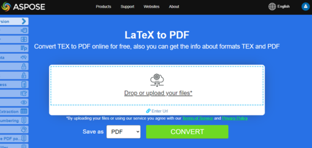

## Overview

This article explains how to **convert various other types of file formats to PDF using C#**. It covers the following topics.

The following code snippet also work with [Aspose.PDF.Drawing](/pdf/net/drawing/) library.

_Format_: **EPUB**
- [C# EPUB to PDF](#csharp-convert-epub-to-pdf)
- [C# Convert EPUB to PDF](#csharp-convert-epub-to-pdf)
- [C# How to convert EPUB file to PDF](#csharp-convert-epub-to-pdf)

_Format_: **Markdown**
- [C# Markdown to PDF](#csharp-convert-markdown-to-pdf)
- [C# Convert Markdown to PDF](#csharp-convert-markdown-to-pdf)
- [C# How to convert Markdown file to PDF](#csharp-convert-markdown-to-pdf)

_Format_: **MD**
- [C# MD to PDF](#csharp-convert-md-to-pdf)
- [C# Convert MD to PDF](#csharp-convert-md-to-pdf)
- [C# How to convert MD file to PDF](#csharp-convert-md-to-pdf)

_Format_: **PCL**
- [C# PCL to PDF](#csharp-convert-pcl-to-pdf)
- [C# Convert PCL to PDF](#csharp-convert-pcl-to-pdf)
- [C# How to convert PCL file to PDF](#csharp-convert-pcl-to-pdf)

_Format_: **Text**
- [C# Text to PDF](#csharp-convert-text-to-pdf)
- [C# Convert Text to PDF](#csharp-convert-text-to-pdf)
- [C# How to convert Text file to PDF](#csharp-convert-text-to-pdf)

_Format_: **TXT**
- [C# TXT to PDF](#csharp-convert-txt-to-pdf)
- [C# Convert TXT to PDF](#csharp-convert-txt-to-pdf)
- [C# How to convert TXT file to PDF](#csharp-convert-txt-to-pdf)

_Format_: **Plain Text**
- [C# Plain Text to PDF](#csharp-convert-plain-text-to-pdf)
- [C# Convert Plain Text to PDF](#csharp-convert-plain-text-to-pdf)
- [C# How to convert Plain Text file to PDF](#csharp-convert-plain-text-to-pdf)

_Format_: **Preformatted TXT**
- [C# Preformatted Text to PDF](#csharp-convert-pre-formatted-txt-to-pdf)
- [C# Convert Preformatted Text to PDF](#csharp-convert-pre-formatted-txt-to-pdf)
- [C# How to convert Preformatted Text file to PDF](#csharp-convert-pre-formatted-txt-to-pdf)

_Format_: **Pre Text**
- [C# Pre Text to PDF](#csharp-convert-pre-text-to-pdf)
- [C# Convert Pre Text to PDF](#csharp-convert-pre-text-to-pdf)
- [C# How to convert Pre Text file to PDF](#csharp-convert-pre-text-to-pdf)

_Format_: **XPS**
- [C# XPS to PDF](#csharp-convert-xps-to-pdf)
- [C# Convert XPS to PDF](#csharp-convert-xps-to-pdf)
- [C# How to convert XPS file to PDF](#csharp-convert-xps-to-pdf)

## Convert EPUB to PDF

**Aspose.PDF for .NET** allows you simply convert EPUB files to PDF format.

<abbr title="electronic publication">EPUB</abbr> (short for electronic publication) is a free and open e-book standard from the International Digital Publishing Forum (IDPF). Files have the extension .epub. EPUB is designed for reflowable content, meaning that an EPUB reader can optimize text for a particular display device.

EPUB also supports fixed-layout content. The format is intended as a single format that publishers and conversion houses can use in-house, as well as for distribution and sale. It supersedes the Open eBook standard.The version EPUB 3 is also endorsed by the Book Industry Study Group (BISG), a leading book trade association for standardized best practices, research, information and events, for packaging of content.

{}
**Try to convert EPUB to PDF online**

Aspose.PDF for .NET presents you online free application ["EPUB to PDF"](https://products.aspose.app/pdf/conversion/epub-to-pdf), where you may try to investigate the functionality and quality it works.

[](https://products.aspose.app/pdf/conversion/epub-to-pdf)
{}

<a name="csharp-convert-epub-to-pdf" id="csharp-convert-epub-to-pdf"><strong><em>Steps:</em> Convert EPUB to PDF in C#</strong></a>

1. Create an instance of [EpubLoadOptions](https://reference.aspose.com/pdf/net/aspose.pdf/epubloadoptions) class.
2. Create an instance of [Document](https://reference.aspose.com/pdf/net/aspose.pdf/document) class with mention source filename and options.
3. Save the document with the desired file name.

Next following code snippet show you how to convert EPUB files to PDF format with C#.

```csharp
public static void ConvertEPUBtoPDF()
{
    EpubLoadOptions option = new EpubLoadOptions();
    Document document= new Document(_dataDir + "WebAssembly.epub", option);
    document.Save(_dataDir + "epub_test.pdf");
}
```

You can also set page size for conversion. To define new page size you `SizeF` object and pass it to [EpubLoadOptions](https://reference.aspose.com/pdf/net/aspose.pdf/epubloadoptions/constructors/main) constructor.

```csharp
public static void ConvertEPUBtoPDFAdv()
{
    EpubLoadOptions option = new EpubLoadOptions(new SizeF(1190, 1684));
    Document document= new Document(_dataDir + "WebAssembly.epub", option);
    document.Save(_dataDir + "epub_test.pdf");
}
```

## Convert Markdown to PDF

**This feature is supported by version 19.6 or greater.**

{}
**Try to convert Markdown to PDF online**

Aspose.PDF for .NET presents you online free application ["Markdown to PDF"](https://products.aspose.app/pdf/conversion/md-to-pdf), where you may try to investigate the functionality and quality it works.

[](https://products.aspose.app/pdf/conversion/md-to-pdf)
{}

Aspose.PDF for .NET provides the functionality to create a PDF document based on input [Markdown](https://daringfireball.net/projects/markdown/syntax) data file. In order to convert the Markdown to PDF, you need to initialize the [Document](https://reference.aspose.com/pdf/net/aspose.pdf/document) using [MdLoadOptions](https://reference.aspose.com/pdf/net/aspose.pdf/mdloadoptions).

The following code snippet shows how to use this functionality with Aspose.PDF library:

<a name="csharp-convert-markdown-to-pdf" id="csharp-convert-markdown-to-pdf"><strong><em>Steps:</em> Convert Markdown to PDF in C#</strong></a> |
<a name="csharp-convert-md-to-pdf" id="csharp-convert-md-to-pdf"><strong><em>Steps:</em> Convert MD to PDF in C#</strong></a>

1. Create an instance of [MdLoadOptions ](https://reference.aspose.com/pdf/net/aspose.pdf/mdloadoptions/) class.
2. Create an instance of [Document](https://reference.aspose.com/pdf/net/aspose.pdf/document) class with mention source filename and options.
3. Save the document with the desired file name.

```csharp
// The path to the documents directory.
string dataDir = RunExamples.GetDataDir_AsposePdf_DocumentConversion();
// Open Markdown document
Document document= new Document(dataDir + "sample.md", new MdLoadOptions());
// Save document in PDF format
document.Save(dataDir + "MarkdownToPDF.pdf");
```

## Convert PCL to PDF

<abbr title="Printer Command Language">PCL</abbr> (Printer Command Language) is a Hewlett-Packard printer language developed to access standard printer features. PCL levels 1 through 5e/5c are command based languages using control sequences that are processed and interpreted in the order they are received. At a consumer level, PCL data streams are generated by a print driver. PCL output can also be easily generated by custom applications.

{}
**Try to convert PCL to PDF online**

Aspose.PDF for for .NET presents you online free application ["PCL to PDF"](https://products.aspose.app/pdf/conversion/pcl-to-pdf), where you may try to investigate the functionality and quality it works.

[](https://products.aspose.app/pdf/conversion/pcl-to-pdf)
{}

**Currently only PCL5 and older versions are supported**

<table>
    <thead>
        <tr>
            <th>
                Sets of Commands
            </th>
            <th>
                Support
            </th>
            <th>
                Exceptions
            </th>
            <th>
                Description
            </th>
        </tr>
    </thead>
    <tbody>
        <tr>
            <td>
                Job control commands
            </td>
            <td>
                +
            </td>
            <td>
                Duplex printing mode
            </td>
            <td>
                Control print process: number pf copies, output bin, simplex/duplex printing, left and top offsets
                etc.
            </td>
        </tr>
        <tr>
            <td>
                Page control commands
            </td>
            <td>
                +
            </td>
            <td>
                Perforation Skip command
            </td>
            <td>
                Specify a size of page, margins, page orientation inter -lines, -character distances etc.
            </td>
        </tr>
        <tr>
            <td>
                Cursor Positioning Commands
            </td>
            <td>
                +
            </td>
            <td>
                &nbsp;
            </td>
            <td>
                Specify cursor position and, hence, origins of text, raster or vector images and details.
            </td>
        </tr>
        <tr>
            <td>
                Font selection commands
            </td>
            <td>
                +
            </td>
            <td>
                <ol>
                    <li>Transparent Print Data Command.</li>
                    <li>Embedded soft fonts. In current version instead of creating soft font our library selects
                        suitable font from existing "hard" TrueType fonts installed on a target machine. <br/>
                        Suitability is defined by width/height ratio.<br/>
                        This feature works only for Bitmap and TrueType fonts and do not
                        guarantee that text printed with soft font will be relevant to the one in a source file.<br/>
                        Because character codes in soft font can unmatched default ones.
                    </li>
                    <li>User Defined Symbol Sets.</li>
                </ol>
            </td>
            <td>
                Allow loading soft (embedded) fonts from PCL file and managing them in memory.
            </td>
        </tr>
        <tr>
            <td>
                Raster graphics commands
            </td>
            <td>
                +
            </td>
            <td>
                Only black &amp; white
            </td>
            <td>
                Allow loading raster images from PCL file to memory, specify raster parameters. <br
                    > such as width, height, compression type, resolution etc.
            </td>
        </tr>
        <tr>
            <td>
                Color commands
            </td>
            <td>
                +
            </td>
            <td>
                &nbsp;
            </td>
            <td>
                Allow coloring for all printable objects.
            </td>
        </tr>
        <tr>
            <td>
                Print Model commands
            </td>
            <td>
                +
            </td>
            <td>
                &nbsp;
            </td>
            <td>
                Allow filling text, raster images and rectangular areas with a raster predefined and <br>
                user-defined patterns specify transparency mode for patterns and
                source raster image. <br> Predefined patterns are hatching, cross-hatch
                and shading ones.
            </td>
        </tr>
        <tr>
            <td>
                Rectangle area fill commands
            </td>
            <td>
                +
            </td>
            <td>
                &nbsp;
            </td>
            <td>
                Allow creation and filling rectangular areas with patterns.
            </td>
        </tr>
        <tr>
            <td>
                HP-GL/2 Vector Graphics commands
            </td>
            <td>
                +
            </td>
            <td>
                Screened Vector Command (SV), Transparency Mode Command (TR), Transparent Data Command (TD), RO
                (Rotate Coordinate System), Scalable or Bitmap Fonts Command (SB), Character Slant Command (SL) and
                Extra Space (ES) are not implemented and DV (Define Variable Text Path) commands are realized in
                beta version.
            </td>
            <td>
                Allow loading HP-GL/2 vector images from PCL file into memory. Vector image has an origin at lower
                left corner of the printable area, can be scaled, translated, rotated and clipped. <br>
                Vector image can contain text, as labels, and geometric figures such
                as rectangle, circle, ellipse, line, arc, bezier curve and complex figures composed from the simple
                ones. <br> Closed figures including letters of labels can be filled with
                solid fill or vector pattern. <br> Pattern can be
                hatching,&nbsp;cross-hatch, shading, raster used-defined, PCL hatching or cross-hatch and PCL
                user-defined. PCL patterns are raster. Labels can be individually rotated, scaled, and directed in
                four directions: up, down, left and right. Left and Right directions involve&nbsp;one-after-another
                letter arrangement. Up and Down directions involve one-under-another&nbsp;letter arrangement.
            </td>
        </tr>
        <tr>
            <td>
                Macroses
            </td>
            <td>
                ―
            </td>
            <td>
                &nbsp;
            </td>
            <td>
                Allow loading a sequence of PCL commands into memory and use this sequence many times, for example,
                to print page header or set one formatting for a set of pages.
            </td>
        </tr>
        <tr>
            <td>
                Unicode text
            </td>
            <td>
                ―
            </td>
            <td>
                &nbsp;
            </td>
            <td>
                Allow printing non ASCII characters. Not implemented due to lack of sample files with <br
                    > Unicode text
            </td>
        </tr>
        <tr>
            <td>
                PCL6 (PCL-XL)
            </td>
            <td>
                &nbsp;
            </td>
            <td>
                Realized only in Beta version because of lack in test files. Embedded fonts also are not
                supported.<br> JetReady extension is not supported because it is
                impossible to have JetReady specification.
            </td>
            <td>
                Binary file format.
            </td>
        </tr>
    </tbody>
</table>

### Converting a PCL file into PDF format

To allow conversion from PCL to PDF, Aspose.PDF has the class [`PclLoadOptions`](https://reference.aspose.com/pdf/net/aspose.pdf/pclloadoptions) which is used to initialize the LoadOptions object. Later on this object is passed as an argument during Document object initialization and it helps the PDF rendering engine to determine the input format of source document.

The following code snippet shows the process of converting a PCL file into PDF format.

<a name="csharp-convert-pcl-to-pdf" id="csharp-convert-pcl-to-pdf"><strong><em>Steps:</em> Convert PCL to PDF in C#</strong></a>

1. Create an instance of [PclLoadOptions](https://reference.aspose.com/pdf/net/aspose.pdf/pclloadoptions/) class.
2. Create an instance of [Document](https://reference.aspose.com/pdf/net/aspose.pdf/document/) class with mention source filename and options.
3. Save the document with the desired file name.

```csharp
public static void ConvertPCLtoPDF()
{
    PclLoadOptions options = new PclLoadOptions();
    Document document= new Document(_dataDir + "demo.pcl", options);
    document.Save(_dataDir + "pcl_test.pdf");
}
```

You can also monitor the detection of errors during the conversion process. To do this, you need to configure PclLoadOptions object: set or unset SupressErrors.

```csharp
public static void ConvertPCLtoPDFAvdanced()
{
    PclLoadOptions options = new PclLoadOptions { SupressErrors = true };
    Document document= new Document(_dataDir + "demo.pcl", options);
    if (options.Exceptions!=null)
    {
        foreach (var ex in options.Exceptions)
        {
            Console.WriteLine(ex.Message);
        }
    }
    document.Save(_dataDir + "pcl_test.pdf");
}
```

### Known Issues

1. Origin of text strings and images can be slightly differed from the ones in a sorce PCL file If print direction is not 0°. The same refers to vector images if coordinate system of vector plot is rotated (RO command preceded).
1. Origin of labels in vector images can be differ from the ones in a sorce PCL file If the labels are influenced by a sequence of commands: Label Origin (LO), Define Variable Text Path (DV), Absolute Direction (DI) or Relative Direction (DR).
1. A text can be incorrectly read if it must be rendered with Bitmap or TrueType soft (embedded) font, because currently these fonts are only partially supported (See exceptions in "Supported features table"). In this situation text can be correctly read only if character codes in a soft font corresponds to default ones. A style of the read text also can be differed from the one in source PCL file because it is not necessary to set style in soft font header.
1. If parsed PCL file contains Intellifont or Universal soft fonts exception will be thrown, because Intellifont and Universal font are not supported at all.
1. If parsed PCL file contains macros commands the result of parsing will strongly differ from the source file, because macros commands are not supported.

## Convert Text to PDF

**Aspose.PDF for .NET** support the feature converting plain text and pre-formatted text file to PDF format.

Converting text to PDF means adding text fragments to the PDF page. As for text files, we are dealing with 2 types of text: pre-formatting (for example, 25 lines with 80 characters per line) and non-formatted text (plain text). Depending on our needs, we can control this addition ourselves or entrust it to the library's algorithms.

{}
**Try to convert TEXT to PDF online**

Aspose.PDF for .NET presents you online free application ["Text to PDF"](https://products.aspose.app/pdf/conversion/txt-to-pdf), where you may try to investigate the functionality and quality it works.

[](https://products.aspose.app/pdf/conversion/txt-to-pdf)
{}

### Convert plain text file to PDF

In case of the plain text file, we can use the following technique:

<a name="csharp-convert-text-to-pdf" id="csharp-convert-text-to-pdf"><strong><em>Steps:</em> Convert Text to PDF in C#</strong></a> |
<a name="csharp-convert-txt-to-pdf" id="csharp-convert-txt-to-pdf"><strong><em>Steps:</em> Convert TXT to PDF in C#</strong></a> |
<a name="csharp-convert-plain-text-to-pdf" id="csharp-convert-plain-text-to-pdf"><strong><em>Steps:</em> Convert Plain Text to PDF in C#</strong></a>

1. Use a _TextReader_ to read the whole text.
2. Instantiate [Document](https://reference.aspose.com/pdf/net/aspose.pdf/document/) object and add a new page in Pages collection.
3. Create a new object of [TextFragment](https://reference.aspose.com/pdf/net/aspose.pdf.text/textfragment/) and pass _TextReader_ object to its constructor.
4. Add _TextFragment_ object as paragraph in _Paragraphs_ collection. If the amount of text is larger than the page, library algorithm automatically adds extra pages.
5. Use **Save** method of [Document](https://reference.aspose.com/pdf/net/aspose.pdf/document/) class.

```csharp
// For complete examples and data files, please go to https://github.com/aspose-pdf/Aspose.PDF-for-.NET
// The path to the documents directory.
string dataDir = RunExamples.GetDataDir_AsposePdf_DocumentConversion();
// Read the source text file
TextReader tr = new StreamReader(dataDir + "log.txt");

// Instantiate a Document object by calling its empty constructor
Document document= new Document();

// Add a new page in Pages collection of Document
Page page = document.Pages.Add();

// Create an instance of TextFragmet and pass the text from reader object to its constructor as argument
TextFragment text = new TextFragment(tr.ReadToEnd());

// Add a new text paragraph in paragraphs collection and pass the TextFragment object
page.Paragraphs.Add(text);

// Save resultant PDF file
document.Save(dataDir + "TexttoPDF_out.pdf");
```

### Convert pre-formatted text file to PDF

Converting pre-formatted text is like plain text but you need to make some additional actions such as setting margins, font type and size. Obviously that font should be monospace (for example Courier New).

Follow these steps to convert pre-formatted text to PDF with C#:

<a name="csharp-convert-pre-text-to-pdf" id="csharp-convert-pre-text-to-pdf"><strong><em>Steps:</em> Convert Pre Text to PDF in C#</strong></a> |
<a name="csharp-convert-pre-formatted-txt-to-pdf" id="csharp-convert-pre-formatted-txt-to-pdf"><strong><em>Steps:</em> Convert Pre-formatted TXT to PDF in C#</strong></a>

1. Read the whole text as an array of strings.
2. Instantiate [Document](https://reference.aspose.com/pdf/net/aspose.pdf/document/) object and add a new page in [Pages](https://reference.aspose.com/pdf/net/aspose.pdf/document/pages/) collection.
3. Run loop through an array of strings and add each string as a paragraph in [Paragraphs](https://reference.aspose.com/pdf/net/aspose.pdf/paragraphs/) collection.

In this case, the library's algorithm also adds extra pages, but we can control this process ourselves.
Following example shows how to convert pre-formatted text file (80x25) to PDF document with page size A4.

```csharp
public static void ConvertPreFormattedTextToPdf()
{
    // Read the text file as array of string
    var lines = System.IO.File.ReadAllLines(_dataDir + "rfc822.txt");

    // Instantiate a Document object by calling its empty constructor
    Document document= new Document();

    // Add a new page in Pages collection of Document
    Page page = document.Pages.Add();

    // Set left and right margins for better presentation
    page.PageInfo.Margin.Left = 20;
    page.PageInfo.Margin.Right = 10;
    page.PageInfo.DefaultTextState.Font = FontRepository.FindFont("Courier New");
    page.PageInfo.DefaultTextState.FontSize = 12;

    foreach (var line in lines)
    {
        // check if line contains "form feed" character
        // see https://en.wikipedia.org/wiki/Page_break
        if (line.StartsWith("\x0c"))
        {
            page = document.Pages.Add();
            page.PageInfo.Margin.Left = 20;
            page.PageInfo.Margin.Right = 10;
            page.PageInfo.DefaultTextState.Font = FontRepository.FindFont("Courier New");
            page.PageInfo.DefaultTextState.FontSize = 12;
        }
        else
        {
            // Create an instance of TextFragment and
            // pass the line to its
            // constructor as argument
            TextFragment text = new TextFragment(line);

            // Add a new text paragraph in paragraphs collection and pass the TextFragment object
            page.Paragraphs.Add(text);
        }
    }

    // Save resultant PDF file
    document.Save(_dataDir + "TexttoPDF_out.pdf");
}
```

## Convert XPS to PDF

**Aspose.PDF for .NET** support feature converting <abbr title="XML Paper Specification">XPS</abbr> files to PDF format. Check this article to resolve your tasks.

The XPS file type is primarily associated with the XML Paper Specification by Microsoft Corporation. The XML Paper Specification (XPS), formerly codenamed Metro and subsuming the Next Generation Print Path (NGPP) marketing concept, is Microsoft's initiative to integrate document creation and viewing into its Windows operating system.

{}

The file format is basically a zipped XML file which is primarily used for distribution and storage. It's very difficult to edit and mostly implemented by Microsoft.

{}

In order to convert XPS to PDF with Aspose.PDF for .NET, we have introduced a class named [XpsLoadOption](https://reference.aspose.com/pdf/net/aspose.pdf/xpsloadoptions) which is used to initialize a [LoadOptions](https://reference.aspose.com/pdf/net/aspose.pdf/loadoptions) object. Later, this object is passed as an argument during the Document object initialization and it helps the PDF rendering engine to determine the source document's input format.

{}

In both XP and Windows 7, you should find an XPS Printer pre-installed if you look in the Control Panel and then Printers. To create these files you can use that printer for the output device. In Windows 7, you should be able to just double-click the file to open it in a XPS viewer. You may also download XPS viewer from Microsoft's website.

{}

The following code snippet shows the process of converting XPS file into PDF format with C#.

<a name="csharp-convert-xps-to-pdf" id="csharp-convert-xps-to-pdf"><strong><em>Steps:</em> Convert XPS to PDF in C#</strong></a>

1. Create an instance of [XpsLoadOptions](https://reference.aspose.com/pdf/net/aspose.pdf/xpsloadoptions/) class.
2. Create an instance of [Document](https://reference.aspose.com/pdf/net/aspose.pdf/document/) class with mention source filename and options.
3. Save the document to PDF format with the desired file name.

```csharp
// For complete examples and data files, please go to https://github.com/aspose-pdf/Aspose.PDF-for-.NET
// The path to the documents directory.
string dataDir = RunExamples.GetDataDir_AsposePdf_DocumentConversion();

// Instantiate LoadOption object using XPS load option
Aspose.Pdf.LoadOptions options = new XpsLoadOptions();

// Create document object
Aspose.Pdf.Document document = new Aspose.Pdf.Document(dataDir + "XPSToPDF.xps", options);

// Save the resultant PDF document
document.Save(dataDir + "XPSToPDF_out.pdf");
```

{}
**Try to convert XPS format to PDF online**

Aspose.PDF for .NET presents you online free application ["XPS to PDF"](https://products.aspose.app/pdf/conversion/xps-to-pdf/), where you may try to investigate the functionality and quality it works.

[](https://products.aspose.app/pdf/conversion/xps-to-pdf/)
{}

## Convert PostScript to PDF

**Aspose.PDF for .NET** support features converting PostScript files to PDF format. One of the features from Aspose.PDF is that you can set a set of font folders to be used during conversion.

In order to convert a PostScript file to PDF format, Aspose.PDF for .NET offers [PsLoadOptions](https://reference.aspose.com/pdf/net/aspose.pdf/psloadoptions) class which is used to initialize the LoadOptions object. Later this object can be passed as an argument to Document object constructor, which will help PDF Rendering Engine to determine the format of source document.

Following code snippet can be used to convert a PostScript file into PDF format with Aspose.PDF for .NET:

```csharp
// For complete examples and data files, please go to https://github.com/aspose-pdf/Aspose.PDF-for-.NET
// The path to the documents directory.
string _dataDir = RunExamples.GetDataDir_AsposePdf_DocumentConversion();
// Create a new instance of PsLoadOptions
PsLoadOptions options = new PsLoadOptions();
// Open .ps document with created load options
Document document = new Document(_dataDir + "input.ps", options);
// Save document
document.Save(dataDir + "PSToPDF.pdf");
```

Additionally, you can set a set of font folders that will be used during conversion:

```csharp
public static void ConvertPostscriptToPDFAvdanced()
{
    PsLoadOptions options = new PsLoadOptions
    {
        FontsFolders = new [] { @"c:\tmp\fonts1", @"c:\tmp\fonts2"}
    };
    Document document = new Document(_dataDir + "input.ps", options);
    document.Save(_dataDir + "ps_test.pdf");
}
```

## Convert XML to PDF

The XML format used to store structured data. There are several ways to convert <abbr title="Extensible Markup Language">XML</abbr> to PDF in Aspose.PDF:

1. Transform any XML data to HTML using XSLT and convert HTML to PDF as described below.
1. Generate XML document using Aspose.PDF XSD Schema.
1. Use XML document based on XSL-FO standard.

{}
**Try to convert XML to PDF online**

Aspose.PDF for .NET presents you online free application ["XML to PDF"](https://products.aspose.app/pdf/conversion/xml-to-pdf), where you may try to investigate the functionality and quality it works.

[](https://products.aspose.app/pdf/conversion/xml-to-pdf)
{}


## Convert XSL-FO to PDF

The conversion of XSL-FO files to PDF can be implemented using the traditional Aspose.PDF technique - instantiate [Document](https://reference.aspose.com/page/net/aspose.page/document) object with [XslFoLoadOptions](https://reference.aspose.com/pdf/net/aspose.pdf/xslfoloadoptions). But sometimes you can meet with the incorrect file structure. For this case, XSL-FO converter allows setting the error handling strategy. You can choose `ThrowExceptionImmediately`, `TryIgnore` or `InvokeCustomHandler`.

```csharp
public static void Convert_XSLFO_to_PDF()
{
    // Instantiate XslFoLoadOption object
    var options = new XslFoLoadOptions(".\\samples\\employees.xslt");
    // Set error handling strategy
    options.ParsingErrorsHandlingType = XslFoLoadOptions.ParsingErrorsHandlingTypes.ThrowExceptionImmediately;
    // Create Document object
    var document = new Aspose.Pdf.Document(".\\samples\\employees.xml", options);
    document.Save(_dataDir + "data_xml.pdf");
}
```

## Convert LaTeX/TeX to PDF

The LaTeX file format is a text file format with markup in the LaTeX derivative of the TeX family of languages and LaTeX is a derived format of the TeX system. LaTeX (ˈleɪtɛk/lay-tek or lah-tek) is a document preparation system and document markup language. It is widely used for the communication and publication of scientific documents in many fields, including mathematics, physics, and computer science. It also has a prominent role in the preparation and publication of books and articles that contain complex multilingual materials, such as Sanskrit and Arabic, including critical editions. LaTeX uses the TeX typesetting program for formatting its output, and is itself written in the TeX macro language.

{}
**Try to convert LaTeX/TeX to PDF online**

Aspose.PDF for .NET presents you online free application ["LaTex to PDF"](https://products.aspose.app/pdf/conversion/tex-to-pdf), where you may try to investigate the functionality and quality it works.

[](https://products.aspose.app/pdf/conversion/tex-to-pdf)
{}

Aspose.PDF for .NET supports the feature to convert TeX files to PDF format and in order to accomplish this requirement, Aspose.Pdf namespace has a class named [LatexLoadOptions](https://reference.aspose.com/pdf/net/aspose.pdf/latexloadoptions) which provides the capabilities to load LaTex files and render the output in PDF format using [Document class](https://reference.aspose.com/pdf/net/aspose.pdf/document).
The following code snippet shows the process of converting LaTex file to PDF format with C#.

```csharp
public static void ConvertTeXtoPDF()
{
    // Instantiate Latex Load option object
    TeXLoadOptions options = new TeXLoadOptions();
    // Create Document object
    Aspose.Pdf.Document document= new Aspose.Pdf.Document(_dataDir + "samplefile.tex", options);
    // Save the output in PDF file
    document.Save(_dataDir + "TeXToPDF_out.pdf");
}
```

## Convert OFD to PDF

OFD format refers to "Open Fixed-layout Document," established as China's national standard for electronic file storage,  used as an alternative to the popular PDF format. It supports fixed-layout documents, ensuring consistent display across different platforms. OFD files are utilized for various purposes, including digital documents and business applications.

Aspose.PDF for .NET supports the feature to convert OFD files to PDF format and in order to accomplish this requirement, Aspose.Pdf namespace has a class named [OfdLoadOptions](https://reference.aspose.com/pdf/net/aspose.pdf/ofdloadoptions/) which provides the capabilities to load OFD files and render the output in PDF format using [Document class](https://reference.aspose.com/pdf/net/aspose.pdf/document).

The following code snippet shows the process of converting OFD file to PDF format with C#.

```csharp
var document = new Document("test.ofd", new OfdLoadOptions());
document.Save("test.pdf");
```

