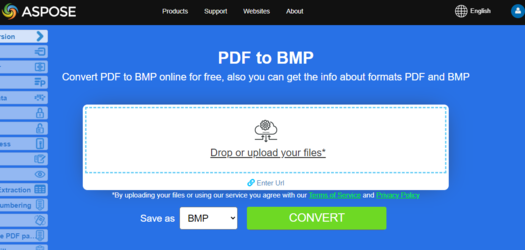
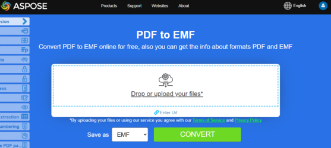
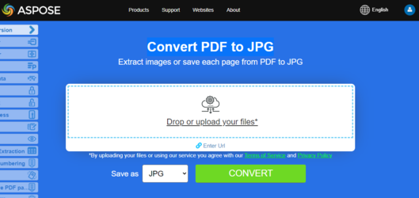

## Convert PDF to TIFF

**Aspose.PDF for .NET** makes a possible to convert PDF Pages to TIFF  images.

The TiffDevice class allows you to convert PDF pages to TIFF images. This class provides a method named Process which allows you to convert all the pages in a PDF file to a single TIFF image.

{}
**Try to convert PDF to TIFF online**

Aspose.PDF for .NET presents you online free application ["PDF to TIFF"](https://products.aspose.app/pdf/conversion/pdf-to-tiff), where you may try to investigate the functionality and quality it works.

[](https://products.aspose.app/pdf/conversion/pdf-to-tiff)
{}

### Convert PDF Pages to One TIFF Image

Aspose.PDF for .NET explain how to convert all pages in a PDF file to a single TIFF image:

1. Create an object of the Document class.
1. Call the Process method to convert the document.
1. To set the output file's properties, use the TiffSettings class.

The following code snippet shows how to convert all the PDF pages to a single TIFF image.

```csharp
public static void ConvertPDFtoTIFF()
{
    // Open document
    Document pdfDocument = new Document(_dataDir + "PageToTIFF.pdf");

    // Create Resolution object
    Resolution resolution = new Resolution(300);

    // Create TiffSettings object
    TiffSettings tiffSettings = new TiffSettings
    {
        Compression = CompressionType.None,
        Depth = ColorDepth.Default,
        Shape = ShapeType.Landscape,
        SkipBlankPages = false
    };

    // Create TIFF device
    TiffDevice tiffDevice = new TiffDevice(resolution, tiffSettings);

    // Convert a particular page and save the image to stream
    tiffDevice.Process(pdfDocument, _dataDir + "AllPagesToTIFF_out.tif");
}
```

## Convert One Page to TIFF Image

Aspose.PDF for .NET allows to convert a particular page in a PDF file to a TIFF image, use an overloaded version of the Process(..) method which takes a page number as an argument for conversion. The following code snippet shows how to convert the first page of a PDF to TIFF format.

```csharp
public static void ConvertPDFtoTiffSinglePage()
{
    // Open document
    Document pdfDocument = new Document(_dataDir + "PageToTIFF.pdf");

    // Create Resolution object
    Resolution resolution = new Resolution(300);

    // Create TiffSettings object
    TiffSettings tiffSettings = new TiffSettings
    {
        Compression = CompressionType.None,
        Depth = ColorDepth.Default,
        Shape = ShapeType.Landscape,
    };

    // Create TIFF device
    TiffDevice tiffDevice = new TiffDevice(resolution, tiffSettings);

    // Convert a particular page and save the image to stream
    tiffDevice.Process(pdfDocument, 1, 1, _dataDir + "PageToTIFF_out.tif");
}
```

### Use Bradley algorithm during conversion

Aspose.PDF for .NET has been supporting the feature to convert PDF to TIF using LZW compression and then with the use of AForge, Binarization can be applied. However one of the customers requested that for some images, they need to get the Threshold using Otsu, so they also would like to use Bradley.

```csharp
public static void ConvertPDFtoTiffBradleyBinarization()
{

    // Open document
    Document pdfDocument = new Document(_dataDir + "PageToTIFF.pdf");

    string outputImageFile = _dataDir + "resultant_out.tif";
    string outputBinImageFile = _dataDir + "37116-bin_out.tif";

    // Create Resolution object
    Resolution resolution = new Resolution(300);
    // Create TiffSettings object
    TiffSettings tiffSettings = new TiffSettings
    {
        Compression = CompressionType.LZW,
        Depth = Aspose.Pdf.Devices.ColorDepth.Format1bpp
    };
    // Create TIFF device
    TiffDevice tiffDevice = new TiffDevice(resolution, tiffSettings);
    // Convert a particular page and save the image to stream
    tiffDevice.Process(pdfDocument, outputImageFile);

    using (FileStream inStream = new FileStream(outputImageFile, FileMode.Open))
    {
        using (FileStream outStream = new FileStream(outputBinImageFile, FileMode.Create))
        {
            tiffDevice.BinarizeBradley(inStream, outStream, 0.1);
        }
    }
}
```

## Convert PDF to BMP

The [BmpDevice](https://apireference.aspose.com/pdf/net/aspose.pdf.devices/bmpdevice) class allows you to convert PDF pages to <abbr title="Bitmap Image File">BMP</abbr> images. This class provides a method named [Process](https://apireference.aspose.com/pdf/net/aspose.pdf.devices/bmpdevice/methods/process) which allows you to convert a particular page of the PDF file to Bmp image format.

{}
**Try to convert PDF to BMP online**

Aspose.PDF for .NET presents you online free application ["PDF to BMP"](https://products.aspose.app/pdf/conversion/pdf-to-bmp), where you may try to investigate the functionality and quality it works.

[](https://products.aspose.app/pdf/conversion/pdf-to-bmp)
{}

### Convert PDF Pages to BMP Images

To convert all pages in a PDF file to images:

1. Loop through all pages in the file.
1. Convert each page individually:
    1. Create an object of the Document class to load the PDF document.
    1. Get the page you want to convert.
    1. Call the Process method to convert the page to BMP.

The following code snippet shows you how to convert all PDF pages to BMP images with Aspose.PDF for .NET.

```csharp
public static void ConvertPDFtoBmpAllPages()
{
    Document pdfDocument = new Document(_dataDir + "ConvertAllPagesToBmp.pdf");

    for (int pageCount = 1; pageCount <= pdfDocument.Pages.Count; pageCount++)
    {
        using (FileStream imageStream = new FileStream(_dataDir + "image" + pageCount + "_out" + ".bmp", FileMode.Create))
        {
            // Create Resolution object
            Resolution resolution = new Resolution(300);
            // Create PNG device with specified attributes
            // Width, Height, Resolution
            BmpDevice BmpDevice = new BmpDevice(500, 700, resolution);

            // Convert a particular page and save the image to stream
            BmpDevice.Process(pdfDocument.Pages[pageCount], imageStream);

            // Close stream
            imageStream.Close();

        }
    }
}
```

### Convert single PDF page to BMP image

To convert a particular page to BMP format with C#:

Pass the page index as an argument to the Process(..) method.
The following code snippet shows the steps to convert the first page of PDF to Bmp format.

```csharp
public static void ConvertPDFtoBmpSinglePage()
{
    // Open document
    Document pdfDocument = new Document(_dataDir + "PageToBmp.pdf");

    using (FileStream imageStream = new FileStream(_dataDir + "image_out.Bmp", FileMode.Create))
    {
        // Create Resolution object
        Resolution resolution = new Resolution(300);
        // Create Bmp device with specified attributes
        // Width, Height, Resolution
        BmpDevice BmpDevice = new BmpDevice(500, 700, resolution);

        // Convert a particular page and save the image to stream
        BmpDevice.Process(pdfDocument.Pages[1], imageStream);

        // Close stream
        imageStream.Close();
    }
}
```

### Convert All PDF Pages to BMP Images

To convert all page of PDF file to BMP format, you need to iterate through to get each individual page and convert it to BMP format. The following code snippet shows you how to traverse through all the pages of a PDF file and convert it to BMP.

//TODO: add example

## Convert PDF to EMF

The EmfDevice class allows you to convert PDF pages to <abbr title="Enhanced Meta File">EMF</abbr> images. This class provides a method named Process which allows you to convert a particular page of the PDF file to EMF image format.


{}
**Try to convert PDF to EMF online**

Aspose.PDF for .NET presents you online free application ["PDF to EMF"](https://products.aspose.app/pdf/conversion/pdf-to-emf), where you may try to investigate the functionality and quality it works.

[](https://products.aspose.app/pdf/conversion/pdf-to-emf)
{}

### Convert PDF Pages to EMF Images

Aspose.PDF for .NET allows you to convert all pages in a PDF file to images:

1. Loop through all pages in the file.
1. Convert each page individually:
    - Create an object of the Document class to load the PDF document.
    - Get the page you want to convert.
    - Call the Process method to convert the page to EMF.

The following code snippet shows you how to convert all PDF pages to EMF images with C#.

### Convert single PDF page to EMF image

Aspose.PDF library allows you to convert a particular page to EMF format:

Pass the page index as an argument to the Process(..) method.
The following code snippet shows the steps to convert the first page of PDF to EMF format.

```csharp
public static void ConvertPDFtoEmfSinglePage()
{
    // Open document
    Document pdfDocument = new Document(_dataDir + "PageToEMF.pdf");

    using (FileStream imageStream = new FileStream(_dataDir + "image_out.emf", FileMode.Create))
    {
        // Create Resolution object
        Resolution resolution = new Resolution(300);
        // Create EMF device with specified attributes
        // Width, Height, Resolution
        EmfDevice emfDevice = new EmfDevice(500, 700, resolution);

        // Convert a particular page and save the image to stream
        emfDevice.Process(pdfDocument.Pages[1], imageStream);

        // Close stream
        imageStream.Close();
    }
}
```

## Convert PDF to JPG

The JpegDevice class allows you to convert PDF pages to JPEG images. This class provides a method named Process which allows you to convert a particular page of the PDF file to JPEG image format with C#.

### Convert PDF Pages to JPG Images

{}
**Try to convert PDF to JPG online**

Aspose.PDF for .NET presents you online free application ["Convert PDF to JPG"](https://products.aspose.app/pdf/conversion/pdf-to-jpg), where you may try to investigate the functionality and quality it works.

[](https://products.aspose.app/pdf/conversion/pdf-to-jpg)
{}

Aspose.PDF for .NET allows you to convert all pages in a PDF file to images:

1. Loop through all pages in the file.
1. Convert each page individually:
    - Create an object of the Document class to load the PDF document.
    - Get the page you want to convert.
    - Call the Process method to convert the page to Jpeg.

The following code snippet shows you how to convert all PDF pages to Jpeg images.

### Convert single PDF page to JPG image

Aspose.PDF for .NET allows you to convert a particular page to Jpeg format:

Pass the page index as an argument to the Process(..) method.
The following code snippet shows the steps to convert the first page of PDF to Jpeg format.

```csharp
public static void ConvertPDFtoJpegSinglePage()
{
    // Open document
    Document pdfDocument = new Document(_dataDir + "PageToJpeg.pdf");

    using (FileStream imageStream = new FileStream(_dataDir + "image_out.Jpeg", FileMode.Create))
    {
        // Create Resolution object
        Resolution resolution = new Resolution(300);
        // Create Jpeg device with specified attributes
        // Width, Height, Resolution
        JpegDevice JpegDevice = new JpegDevice(500, 700, resolution);

        // Convert a particular page and save the image to stream
        JpegDevice.Process(pdfDocument.Pages[1], imageStream);

        // Close stream
        imageStream.Close();
    }
}
```

## Convert PDF to PNG

Use the **Aspose.PDF for .NET** library for converting PDF Pages to <abbr title="Portable Network Graphics">PNG</abbr> Images in an accessible and convenient way.

The PngDevice class allows you to convert PDF pages to PNG images. This class provides a method named Process which allows you to convert a particular page of the PDF file to PNG image format.

### Convert PDF Pages to PNG Images

{}
**Try to convert PDF to PNG online**

Aspose.PDF for .NET presents you online free application ["PDF to PNG"](https://products.aspose.app/pdf/conversion/pdf-to-png), where you may try to investigate the functionality and quality it works.

[](https://products.aspose.app/pdf/conversion/pdf-to-png)
{}

Aspose.PDF for .NET show you how to convert all pages in a PDF file to images:

1. Loop through all pages in the file.
1. Convert each page individually:
    1. Create an object of the Document class to load the PDF document.
    1. Get the page you want to convert.
    1. Call the Process method to convert the page to Png.

The following code snippet shows you how to convert all PDF pages to PNG images.

### Convert single PDF page to PNG image

Aspose.PDF for .NET show you how to convert a particular page to PNG format:

Pass the page index as an argument to the Process(..) method.
The following code snippet shows the steps to convert the first page of PDF to PNG format.

```csharp
public static void ConvertPDFtoPngSinglePage()
{
    // Open document
    Document pdfDocument = new Document(_dataDir + "PageToPng.pdf");

    using (FileStream imageStream = new FileStream(_dataDir + "image_out.Png", FileMode.Create))
    {
        // Create Resolution object
        Resolution resolution = new Resolution(300);
        // Create Png device with specified attributes
        // Width, Height, Resolution
        PngDevice PngDevice = new PngDevice(500, 700, resolution);

        // Convert a particular page and save the image to stream
        PngDevice.Process(pdfDocument.Pages[1], imageStream);

        // Close stream
        imageStream.Close();
    }
}
```

## Convert PDF to SVG

This article teacher you how to convert PDF to <abbr title="Scalable Vector Graphics">SVG</abbr> using C#

{}
**Try to convert PDF to SVG online**

Aspose.PDF for .NET presents you online free application ["PDF to SVG"](https://products.aspose.app/pdf/conversion/pdf-to-svg), where you may try to investigate the functionality and quality it works.

[](https://products.aspose.app/pdf/conversion/pdf-to-svg)
{}

**Scalable Vector Graphics (SVG)** is a family of specifications of an XML-based file format for two-dimensional vector graphics, both static and dynamic (interactive or animated). The SVG specification is an open standard that has been under development by the World Wide Web Consortium (W3C) since 1999.

SVG images and their behaviors are defined in XML text files. This means that they can be searched, indexed, scripted and if required, compressed. As XML files, SVG images can be created and edited with any text editor, but it is often more convenient to create them with drawing programs such as Inkscape.

Aspose.PDF for .NET supports the feature to convert SVG image to PDF format and also offers the capability to convert PDF files to SVG format. To accomplish this requirement, the [`SvgSaveOptions`](https://apireference.aspose.com/pdf/net/aspose.pdf/svgsaveoptions/methods/index) class has been introduced into the Aspose.PDF namespace. Instantiate an object of SvgSaveOptions and pass it as a second argument to the [`Document.Save(..)`](https://apireference.aspose.com/pdf/net/aspose.pdf/document/methods/save/index) method.

The following code snippet shows the steps for converting a PDF file to SVG format with .NET.

```csharp
// Load PDF document
Document doc = new Document(dataDir + "input.pdf");
// Instantiate an object of SvgSaveOptions
SvgSaveOptions saveOptions = new SvgSaveOptions();
// Do not compress SVG image to Zip archive
saveOptions.CompressOutputToZipArchive = false;
// Save the output in SVG files
doc.Save(dataDir + "PDFToSVG_out.svg", saveOptions);
```
