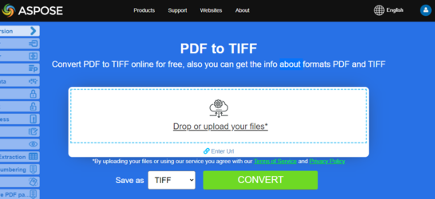

**Aspose.PDF for .NET** uses several approaches to convert PDF to image. Generally speaking, we use two approaches: conversion using the Device approach and conversion using SaveOption. This section will show you how to convert PDF documents to image formats such as BMP, JPEG, GIF, PNG, EMF, TIFF, and SVG formats using one of those approaches.

There are several classes in the library that allow you to use a virtual device to transform images. DocumentDevice is oriented for conversion whole document, but ImageDevice - for a particular page.

## Convert PDF using DocumentDevice class

**Aspose.PDF for .NET** makes a possible to convert PDF Pages to TIFF images.

The TiffDevice (based on DocumentDevice) class allows you to convert PDF pages to TIFF images. This class provides a method named `Process` which allows you to convert all the pages in a PDF file to a single TIFF image.

{}
**Try to convert PDF to TIFF online**

Aspose.PDF for .NET presents you online free application ["PDF to TIFF"](https://products.aspose.app/pdf/conversion/pdf-to-tiff), where you may try to investigate the functionality and quality it works.

[](https://products.aspose.app/pdf/conversion/pdf-to-tiff)
{}

### Convert PDF Pages to One TIFF Image

Aspose.PDF for .NET explain how to convert all pages in a PDF file to a single TIFF image:

1. Create an object of the `Document` class.
1. Call the `Process` method to convert the document.
1. To set the output file's properties, use the `TiffSettings` class.

The following code snippet shows how to convert all the PDF pages to a single TIFF image.

```csharp
public static void ConvertPDFtoTIFF()
{
    // Open document
    Document pdfDocument = new Document(_dataDir + "PageToTIFF.pdf");

    // Create Resolution object
    Resolution resolution = new Resolution(300);

    // Create TiffSettings object
    TiffSettings tiffSettings = new TiffSettings
    {
        Compression = CompressionType.None,
        Depth = ColorDepth.Default,
        Shape = ShapeType.Landscape,
        SkipBlankPages = false
    };

    // Create TIFF device
    TiffDevice tiffDevice = new TiffDevice(resolution, tiffSettings);

    // Convert a particular page and save the image to stream
    tiffDevice.Process(pdfDocument, _dataDir + "AllPagesToTIFF_out.tif");
}
```

### Convert One Page to TIFF Image

Aspose.PDF for .NET allows to convert a particular page in a PDF file to a TIFF image, use an overloaded version of the Process(..) method which takes a page number as an argument for conversion. The following code snippet shows how to convert the first page of a PDF to TIFF format.

```csharp
public static void ConvertPDFtoTiffSinglePage()
{
    // Open document
    Document pdfDocument = new Document(_dataDir + "PageToTIFF.pdf");

    // Create Resolution object
    Resolution resolution = new Resolution(300);

    // Create TiffSettings object
    TiffSettings tiffSettings = new TiffSettings
    {
        Compression = CompressionType.None,
        Depth = ColorDepth.Default,
        Shape = ShapeType.Landscape,
    };

    // Create TIFF device
    TiffDevice tiffDevice = new TiffDevice(resolution, tiffSettings);

    // Convert a particular page and save the image to stream
    tiffDevice.Process(pdfDocument, 1, 1, _dataDir + "PageToTIFF_out.tif");
}
```

### Use Bradley algorithm during conversion

Aspose.PDF for .NET has been supporting the feature to convert PDF to TIF using LZW compression and then with the use of AForge, Binarization can be applied. However one of the customers requested that for some images, they need to get the Threshold using Otsu, so they also would like to use Bradley.

```csharp
  public static void ConvertPDFtoTiffBradleyBinarization()
{
     // Open document
     Document pdfDocument = new Document(_dataDir + "PageToTIFF.pdf");

    string outputImageFile = _dataDir + "resultant_out.tif";
    string outputBinImageFile = _dataDir + "37116-bin_out.tif";

    // Create Resolution object
    Resolution resolution = new Resolution(300);
    // Create TiffSettings object
    TiffSettings tiffSettings = new TiffSettings
    {
        Compression = CompressionType.LZW,
        Depth = Aspose.Pdf.Devices.ColorDepth.Format1bpp
    };
    // Create TIFF device
    TiffDevice tiffDevice = new TiffDevice(resolution, tiffSettings);
    // Convert a particular page and save the image to stream
    tiffDevice.Process(pdfDocument, outputImageFile);

    using (FileStream inStream = new FileStream(outputImageFile, FileMode.Open))
    {
        using (FileStream outStream = new FileStream(outputBinImageFile, FileMode.Create))
        {
            tiffDevice.BinarizeBradley(inStream, outStream, 0.1);
        }
    }
} 
```


## Convert PDF using ImageDevice class

`ImageDevice` is the ancestor for `BmpDevice`, `JpegDevice`, `GifDevice`, `PngDevice` and `EmfDevice`.

- The [BmpDevice](https://reference.aspose.com/pdf/net/aspose.pdf.devices/bmpdevice) class allows you to convert PDF pages to <abbr title="Bitmap Image File">BMP</abbr> images.
- The [EmfDevice](https://reference.aspose.com/pdf/net/aspose.pdf.devices/emfdevice) class allows you to convert PDF pages to <abbr title="Enhanced Meta File">EMF</abbr> images.
- The [JpegDevice](https://reference.aspose.com/pdf/net/aspose.pdf.devices/jpegdevice) class allows you to convert PDF pages to JPEG images.
- The [PngDevice](https://reference.aspose.com/pdf/net/aspose.pdf.devices/pngdevice) class allows you to convert PDF pages to <abbr title="Portable Network Graphics">PNG</abbr> images.
- The [GifDevice](https://reference.aspose.com/pdf/net/aspose.pdf.devices/gifdevice) class allows you to convert PDF pages to <abbr title="Graphics Interchange Format">GIF</abbr> images.

Let's take a look at how to convert a PDF page to an image.

`BmpDevice` class provides a method named [Process](https://reference.aspose.com/pdf/net/aspose.pdf.devices/bmpdevice/methods/process) which allows you to convert a particular page of the PDF file to BMP image format. The other classes have the same method. So, if we need to convert a PDF page to an image, we just instantiate the required class.

The following steps and code snippet in C# shows this possibility
 
 - [Convert PDF to BMP in C#](#csharp-pdf-to-image)
 - [Convert PDF to EMF in C#](#csharp-pdf-to-image)
 - [Convert PDF to JPG in C#](#csharp-pdf-to-image)
 - [Convert PDF to PNG in C#](#csharp-pdf-to-image)
 - [Convert PDF to GIF in C#](#csharp-pdf-to-image)

<a name="csharp-pdf-to-image"><strong>**Steps: PDF to Image (BMP, EMF, JPG, PNG, GIF) in C#**</strong></a>

1. Load the PDF file using **Document** class.
2. Create an instance of subclass of **ImageDevice** i.e.
   * **BmpDevice** (to convert PDF to BMP)
   * **EmfDevice** (to convert PDF to Emf)
   * **JpegDevice** (to convert PDF to JPG)
   * **PngDevice** (to convert PDF to PNG)
   * **GifDevice** (to convert PDF to GIF)
3. Call the **ImageDevice.Process()** method to perform PDF to Image conversion.

```csharp
public static class ExampleConvertPdfToImage
{
     private static readonly string _dataDir = @"C:\Samples\";
    // BMP, JPEG, GIF, PNG, EMF
    public static void ConvertPDFusingImageDevice()
    {
        // Create Resolution object            
        Resolution resolution = new Resolution(300);
        BmpDevice bmpDevice = new BmpDevice(resolution);
        JpegDevice jpegDevice = new JpegDevice(resolution);
        GifDevice gifDevice = new GifDevice(resolution);
        PngDevice pngDevice = new PngDevice(resolution);
        EmfDevice emfDevice = new EmfDevice(resolution);

        Document document = new Document(_dataDir + 
            "ConvertAllPagesToBmp.pdf");
            
        ConvertPDFtoImage(bmpDevice, "bmp", document);
        ConvertPDFtoImage(jpegDevice,"jpeg", document);
        ConvertPDFtoImage(gifDevice, "gif", document);
        ConvertPDFtoImage(pngDevice, "png", document);
        ConvertPDFtoImage(emfDevice, "emf", document);
            
    }
}

public static void ConvertPDFtoImage(ImageDevice imageDevice, 
        string ext, Document pdfDocument)
{
    for (int pageCount = 1; pageCount <= pdfDocument.Pages.Count; pageCount++)
    {
        using (FileStream imageStream = 
        new FileStream($"{_dataDir}image{pageCount}_out.{ext}", 
        FileMode.Create))
        {
            // Convert a particular page and save the image to stream
            imageDevice.Process(pdfDocument.Pages[pageCount], imageStream);

            // Close stream
            imageStream.Close();
        }
    }
}
```

{}
**Try to convert PDF to PNG online**

As an example of how our free applications work please check the next feature.

Aspose.PDF for .NET presents you online free application ["PDF to PNG"](https://products.aspose.app/pdf/conversion/pdf-to-png), where you may try to investigate the functionality and quality it works.

[](https://products.aspose.app/pdf/conversion/pdf-to-png)
{}

## Convert PDF using SaveOptions class

This part of article shows you how to convert PDF to <abbr title="Scalable Vector Graphics">SVG</abbr> using C# and SaveOptions class.

{}
**Try to convert PDF to SVG online**

Aspose.PDF for .NET presents you online free application ["PDF to SVG"](https://products.aspose.app/pdf/conversion/pdf-to-svg), where you may try to investigate the functionality and quality it works.

[](https://products.aspose.app/pdf/conversion/pdf-to-svg)
{}

**Scalable Vector Graphics (SVG)** is a family of specifications of an XML-based file format for two-dimensional vector graphics, both static and dynamic (interactive or animated). The SVG specification is an open standard that has been under development by the World Wide Web Consortium (W3C) since 1999.

SVG images and their behaviors are defined in XML text files. This means that they can be searched, indexed, scripted and if required, compressed. As XML files, SVG images can be created and edited with any text editor, but it is often more convenient to create them with drawing programs such as Inkscape.

Aspose.PDF for .NET supports the feature to convert SVG image to PDF format and also offers the capability to convert PDF files to SVG format. To accomplish this requirement, the [`SvgSaveOptions`](https://reference.aspose.com/pdf/net/aspose.pdf/svgsaveoptions/methods/index) class has been introduced into the Aspose.PDF namespace. Instantiate an object of SvgSaveOptions and pass it as a second argument to the [`Document.Save(..)`](https://reference.aspose.com/pdf/net/aspose.pdf/document/methods/save/index) method.

The following code snippet shows the steps for converting a PDF file to SVG format with .NET.

```csharp
public static void ConvertPDFtoSVG()
{
    // Load PDF document
    Document document = new Document(System.IO.Path.Combine(_dataDir, "input.pdf"));
    // Instantiate an object of SvgSaveOptions
    SvgSaveOptions saveOptions = new SvgSaveOptions
    {
        // Do not compress SVG image to Zip archive
        CompressOutputToZipArchive = false,
        TreatTargetFileNameAsDirectory = true                
    };
            
    // Save the output in SVG files
    document.Save(System.IO.Path.Combine(_dataDir, "PDFToSVG_out.svg"), saveOptions);
}
```
