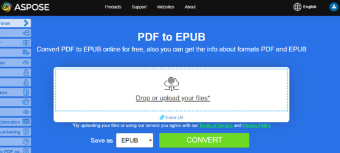

## Convert PDF to EPUB

{}
**Try to convert PDF to EPUB online**

Aspose.PDF for .NET presents you online free application ["PDF to EPUB"](https://products.aspose.app/pdf/conversion/pdf-to-epub), where you may try to investigate the functionality and quality it works.

[](https://products.aspose.app/pdf/conversion/pdf-to-epub)
{}

**<abbr title="Electronic Publication">EPUB</abbr>** is a free and open e-book standard from the International Digital Publishing Forum (IDPF). Files have the extension .epub.
EPUB is designed for reflowable content, meaning that an EPUB reader can optimize text for a particular display device. EPUB also supports fixed-layout content. The format is intended as a single format that publishers and conversion houses can use in-house, as well as for distribution and sale. It supersedes the Open eBook standard.

Aspose.PDF for .NET also supports the feature to convert PDF documents to EPUB format. Aspose.PDF for .NET has a class named EpubSaveOptions which can be used as the second argument to [`Document.Save(..)`](https://apireference.aspose.com/pdf/net/aspose.pdf/document/methods/save/index) method, to generate an EPUB file.
Please try using the following code snippet to accomplish this requirement with C#.

```csharp
// For complete examples and data files, please go to https://github.com/aspose-pdf/Aspose.PDF-for-.NET
// The path to the documents directory.
string dataDir = RunExamples.GetDataDir_AsposePdf_DocumentConversion();
// Load PDF document
Document pdfDocument = new Document(dataDir + "PDFToEPUB.pdf");
// Instantiate Epub Save options
EpubSaveOptions options = new EpubSaveOptions();
// Specify the layout for contents
options.ContentRecognitionMode = EpubSaveOptions.RecognitionMode.Flow;
// Save the ePUB document
pdfDocument.Save(dataDir + "PDFToEPUB_out.epub", options);
```

## Convert PDF to LaTeX/TeX

**Aspose.PDF for .NET** support converting PDF to LaTeX/TeX.
The LaTeX file format is a text file format with the special markup and used in TeX-based document preparation system for high-quality typesetting.

{}
**Try to convert PDF to LaTeX/TeX online**

Aspose.PDF for .NET presents you online free application ["PDF to LaTeX"](https://products.aspose.app/pdf/conversion/pdf-to-tex), where you may try to investigate the functionality and quality it works.

[](https://products.aspose.app/pdf/conversion/pdf-to-tex)
{}

To convert PDF files to TeX, Aspose.PDF has the class [LaTeXSaveOptions](https://apireference.aspose.com/pdf/net/aspose.pdf/latexsaveoptions) which provides the property OutDirectoryPath for saving temporary images during the conversion process.

The following code snippet shows the process of converting PDF files into the TEX format with C#.

```csharp
// For complete examples and data files, please go to https://github.com/aspose-pdf/Aspose.PDF-for-.NET
// The path to the documents directory.
string dataDir = RunExamples.GetDataDir_AsposePdf_DocumentConversion();

// Create Document object
Aspose.Pdf.Document doc = new Aspose.Pdf.Document(dataDir + "PDFToTeX.pdf");

// Instantiate LaTex save option          
LaTeXSaveOptions saveOptions = new LaTeXSaveOptions();

// Specify the output directory
string pathToOutputDirectory = dataDir;

// Set the output directory path for save option object
saveOptions.OutDirectoryPath = pathToOutputDirectory;

// Save PDF file into LaTex format           
doc.Save(dataDir + "PDFToTeX_out.tex", saveOptions);
```

## Convert PDF to Text

**Aspose.PDF for .NET** support converting whole PDF document and single page to a Text file.

### Convert whole PDF document to Text file

You can convert PDF document to TXT file using [Visit](https://apireference.aspose.com/pdf/net/aspose.pdf.text/textabsorber/methods/visit/index) method of [TextAbsorber](https://apireference.aspose.com/pdf/net/aspose.pdf.text/textabsorber) class.

The following code snippet explains how to extract the texts from the all pages.

```csharp
public static void ConvertPDFDocToTXT()
{
    // Open document
    Document pdfDocument = new Document(_dataDir + "demo.pdf");
    TextAbsorber ta = new TextAbsorber();
    ta.Visit(pdfDocument);
    // Save the extracted text in text file
    File.WriteAllText(_dataDir + "input_Text_Extracted_out.txt",ta.Text);
}
```

{}
**Try to convert Convert PDF to Text online**

Aspose.PDF for .NET presents you online free application ["PDF to Text"](https://products.aspose.app/pdf/conversion/pdf-to-txt), where you may try to investigate the functionality and quality it works.

[](https://products.aspose.app/pdf/conversion/pdf-to-txt)
{}

### Convert PDF page to text file

You can convert PDF document to TXT file with Aspose.PDF for .NET. You should use `Visit` method of `TextAbsorber` class for resolve this task.

The following code snippet explains how to extract the texts from the particular pages.

```csharp
public static void ConvertPDFPagestoTXT()
{
    Document pdfDocument = new Document(System.IO.Path.Combine(_dataDir, "demo.pdf"));
    TextAbsorber ta = new TextAbsorber();
    var pages = new [] {1, 3, 4};
    foreach (var page in pages)
    {
        ta.Visit(pdfDocument.Pages[page]);
    }
   
    // Save the extracted text in text file
    File.WriteAllText(System.IO.Path.Combine(_dataDir, "input_Text_Extracted_out.txt"), ta.Text);
}
```

## Convert PDF to XPS

**Aspose.PDF for .NET** gives a possibility to convert PDF files to <abbr title="XML Paper Specification">XPS</abbr> format. Let try to use the presented code snippet for converting PDF files to XPS format with C#.

{}
**Try to convert PDF to SVG online**

Aspose.PDF for .NET presents you online free application ["PDF to XPS"](https://products.aspose.app/pdf/conversion/pdf-to-xps), where you may try to investigate the functionality and quality it works.

[](https://products.aspose.app/pdf/conversion/pdf-to-xps)
{}

The XPS file type is primarily associated with the XML Paper Specification by Microsoft Corporation. The XML Paper Specification (XPS), formerly codenamed Metro and subsuming the Next Generation Print Path (NGPP) marketing concept, is Microsoft's initiative to integrate document creation and viewing into the Windows operating system.

To convert PDF files to XPS, Aspose.PDF has the class [XpsSaveOptions](https://apireference.aspose.com/net/pdf/aspose.pdf/xpssaveoptions) that is used as the second argument to the [Document.Save(..)](https://apireference.aspose.com/pdf/net/aspose.pdf/document/methods/save/index) method to generate the XPS file.

The following code snippet shows the process of converting PDF file into XPS format.

```csharp
// For complete examples and data files, please go to https://github.com/aspose-pdf/Aspose.PDF-for-.NET
// The path to the documents directory.
string dataDir = RunExamples.GetDataDir_AsposePdf_DocumentConversion();

// Load PDF document
Document pdfDocument = new Document(dataDir + "input.pdf");

// Instantiate XPS Save options
Aspose.Pdf.XpsSaveOptions saveOptions = new Aspose.Pdf.XpsSaveOptions();
// Save the XPS document
pdfDocument.Save("PDFToXPS_out.xps", saveOptions)
```
