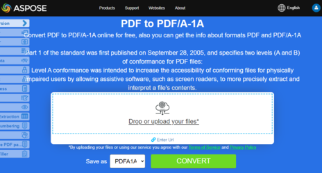

<script type="application/ld+json">
{
    "@context": "https://schema.org",
    "@type": "TechArticle",
    "headline": "Convert PDF to PDF/A formats",
    "alternativeHeadline": "Effortless PDF to PDF/A Conversion with Validation in C#",
    "abstract": "The feature in Aspose.PDF for .NET enables seamless conversion of standard PDF files into various PDF/A compliant formats, including PDF/A-1b, PDF/A-2u, and PDF/A-3a. This feature not only ensures compliance with PDF/A standards through comprehensive validation but also allows for the attachment of additional files and the substitution of missing fonts, enhancing document integrity and accessibility. Explore the robust capabilities of Aspose.PDF for efficient and reliable PDF/A conversions",
    "author": {
        "@type": "Person",
        "name": "Anastasiia Holub",
        "givenName": "Anastasiia",
        "familyName": "Holub",
        "url": "https://www.linkedin.com/in/anastasiia-holub-750430225/"
    },
    "genre": "pdf document generation",
    "wordcount": "1064",
    "proficiencyLevel": "Beginner",
    "publisher": {
        "@type": "Organization",
        "name": "Aspose.PDF for .NET",
        "url": "https://products.aspose.com/pdf",
        "logo": "https://www.aspose.cloud/templates/aspose/img/products/pdf/aspose_pdf-for-net.svg",
        "alternateName": "Aspose",
        "sameAs": [
            "https://facebook.com/aspose.pdf/",
            "https://twitter.com/asposepdf",
            "https://www.youtube.com/channel/UCmV9sEg_QWYPi6BJJs7ELOg/featured",
            "https://www.linkedin.com/company/aspose",
            "https://stackoverflow.com/questions/tagged/aspose",
            "https://aspose.quora.com/",
            "https://aspose.github.io/"
        ],
        "contactPoint": [
            {
                "@type": "ContactPoint",
                "telephone": "+1 903 306 1676",
                "contactType": "sales",
                "areaServed": "US",
                "availableLanguage": "en"
            },
            {
                "@type": "ContactPoint",
                "telephone": "+44 141 628 8900",
                "contactType": "sales",
                "areaServed": "GB",
                "availableLanguage": "en"
            },
            {
                "@type": "ContactPoint",
                "telephone": "+61 2 8006 6987",
                "contactType": "sales",
                "areaServed": "AU",
                "availableLanguage": "en"
            }
        ]
    },
    "url": "/net/convert-pdf-to-pdfa/",
    "mainEntityOfPage": {
        "@type": "WebPage",
        "@id": "/net/convert-pdf-to-pdfa/"
    },
    "dateModified": "2024-11-25",
    "description": "Aspose.PDF can perform not only simple and easy tasks but also cope with more complex goals. Check the next section for advanced users and developers."
}
</script>

**Aspose.PDF for .NET** allows you to convert a PDF file to a <abbr title="Portable Document Format / A">PDF/A</abbr> compliant PDF file. Before doing so, the file must be validated. This topic explains how.

{}

Please note we follow Adobe Preflight and veraPDF for validating PDF/A conformance. All tools on the market have their own “representation” of PDF/A conformance. Please check this article on PDF/A validation tools for reference. We chose Adobe products for verifying how Aspose.PDF produces PDF files because Adobe is at the center of everything connected to PDF.

{}

Convert the file using the Document class Convert method. Before converting the PDF to PDF/A compliant file, validate the PDF using the Validate method. The validation result is stored in an XML file and then this result is also passed to the Convert method. You can also specify the action for the elements which cannot be converted using the ConvertErrorAction enumeration.

{}
**Try to convert PDF to PDF/A online**

Aspose.PDF for .NET presents you online free application ["PDF to PDF/A-1A"](https://products.aspose.app/pdf/conversion/pdf-to-pdfa1a), where you may try to investigate the functionality and quality it works.

[](https://products.aspose.app/pdf/conversion/pdf-to-pdfa1a)
{}

The following code snippet also work with [Aspose.PDF.Drawing](/pdf/net/drawing/) library.

## Supported standards
We support the following standards: PDF/A-1b, PDF/A-1a, PDF/A-2b, PDF/A-2u, PDF/A-2a, PDF/A-3b, PDF/A-3u, PDF/A-3a, PDF/A-4, PDF/A-4e, PDF/A-4f.

## Convert PDF file to PDF/A-1b

The following code snippet shows how to convert PDF files to PDF/A-1b compliant PDF.

```csharp
// For complete examples and data files, please go to https://github.com/aspose-pdf/Aspose.PDF-for-.NET
// The path to the documents directory.
string dataDir = RunExamples.GetDataDir_AsposePdf_DocumentConversion();

// Open document
Document document = new Document(dataDir + "PDFToPDFA.pdf");
           
// Convert to PDF/A compliant document
// During conversion process, the validation is also performed
document.Convert(dataDir + "log.xml", PdfFormat.PDF_A_1B, ConvertErrorAction.Delete);

// Save output document
document.Save(dataDir + "PDFToPDFA_out.pdf");
```

To perform validation only, use the following line of code:

```csharp
// For complete examples and data files, please go to https://github.com/aspose-pdf/Aspose.PDF-for-.NET
// The path to the documents directory.
string dataDir = RunExamples.GetDataDir_AsposePdf_WorkingDocuments();

// Open document
Document document = new Document(dataDir + "ValidatePDFAStandard.pdf");

// Validate PDF for PDF/A-1a
document.Validate(dataDir + "validation-result-A1A.xml", PdfFormat.PDF_A_1B);
```

## Convert PDF file to PDF/A-3b

Aspose.PDF for .NET also supports the feature to convert a PDF file to PDF/A-3b format.

```csharp
/ For complete examples and data files, please go to https://github.com/aspose-pdf/Aspose.PDF-for-.NET
// The path to the documents directory.
string dataDir = RunExamples.GetDataDir_AsposePdf_DocumentConversion();

// Open document
Document document = new Document(dataDir + "input.pdf");           
           
document.Convert(new MemoryStream(), PdfFormat.PDF_A_3B, ConvertErrorAction.Delete);

// Save output document
document.Save(dataDir + "PDFToPDFA3b_out.pdf");
```

## Convert PDF file to PDF/A-2u

Aspose.PDF for .NET also supports the feature to convert a PDF file to PDF/A-2u format.

```csharp
string inFile = "input.pdf";
string outFile = "output.pdf";
Document document = new Document(inFile);
document.Convert(new MemoryStream(), PdfFormat.PDF_A_2U, ConvertErrorAction.Delete);
document.Save(outFile);
```

## Convert PDF file to PDF/A-3u

Aspose.PDF for .NET also supports the feature to convert a PDF file to PDF/A-3u format.

```csharp
string inFile = "input.pdf";
string outFile = "output.pdf";
Document document = new Document(inFile);
document.Convert(new MemoryStream(), PdfFormat.PDF_A_3U, ConvertErrorAction.Delete);
document.Save(outFile);
```

## Convert PDF file to PDF/A-4

Aspose.PDF for .NET also supports the feature to convert a PDF file to PDF/A-3u format.

```csharp
string dataDir = RunExamples.GetDataDir_AsposePdf_DocumentConversion();

using (var document = new Document(dataDir + "input.pdf"))
{
    // If the document version is less than PDF-2.0, it must be converted to PDF-2.0
    document.Convert(Stream.Null, PdfFormat.v_2_0, ConvertErrorAction.Delete);

    document.Convert(dataDir + "log.xml", PdfFormat.PDF_A_4, ConvertErrorAction.Delete);
    document.Save(dataDir + "output.pdf");
}
```

## Add Attachment to PDF/A file

In case you have a requirement to attach files to PDF/A compliance format, then we recommend using PDF_A_3A value from Aspose.PDF.PdfFormat enumeration.
PDF/A_3a is the format that provides the feature to attach any file format as an attachment to PDF/A compliant file.

```csharp
// For complete examples and data files, please go to https://github.com/aspose-pdf/Aspose.PDF-for-.NET
// The path to the documents directory.
string dataDir = RunExamples.GetDataDir_AsposePdf_DocumentConversion();

// Instantiate Document instance to load existing file
Document document = new Document(dataDir + "input.pdf");
// Setup new file to be added as attachment
FileSpecification fileSpecification = new FileSpecification(dataDir + "aspose-logo.jpg", "Large Image file");
// Add attachment to document's attachment collection
document.EmbeddedFiles.Add(fileSpecification);
// Perform conversion to PDF/A_3a so attachment is included in resultnat file
document.Convert(dataDir + "log.txt", Aspose.Pdf.PdfFormat.PDF_A_3A, ConvertErrorAction.Delete);
// Save resultant file
document.Save(dataDir + "AddAttachmentToPDFA_out.pdf");
```

## Replace missing fonts with alternative fonts

As per PDFA standards, fonts should be embedded in PDFA document. However, if the fonts are not embedded in the source document or exist on the machine then PDFA fails the validation. In this case, we have a requirement to substituent missing fonts with some alternative fonts from the machine. We can substitute missing fonts using the SimpleFontSubsituation method as following during PDF to PDFA conversion.

```csharp
// For complete examples and data files, please go to https://github.com/aspose-pdf/Aspose.PDF-for-.NET
// The path to the documents directory.
string dataDir = RunExamples.GetDataDir_AsposePdf_DocumentConversion();

Aspose.Pdf.Text.Font originalFont = null;
try
{
    originalFont = FontRepository.FindFont("AgencyFB");
}
catch (Exception)
{
    // Font is missing on destination machine
    FontRepository.Substitutions.Add(new SimpleFontSubstitution("AgencyFB", "Arial"));
}
var fileNew = new FileInfo(dataDir + "newfile_out.pdf");
var pdf = new Document(dataDir + "input.pdf");
pdf.Convert(dataDir +  "log.xml", PdfFormat.PDF_A_1B, ConvertErrorAction.Delete);
pdf.Save(fileNew.FullName);
```

