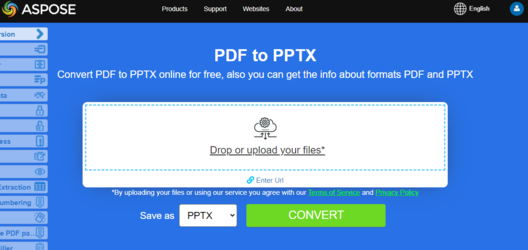

## Ikhtisar

Artikel ini menjelaskan cara **mengonversi PDF ke PowerPoint menggunakan C#**. Ini mencakup topik-topik berikut.

_Format_: **PPTX**
- [C# PDF ke PPTX](#csharp-pdf-to-pptx)
- [C# Konversi PDF ke PPTX](#csharp-pdf-to-pptx)
- [C# Bagaimana mengonversi file PDF ke PPTX](#csharp-pdf-to-pptx)

_Format_: **PowerPoint**
- [C# PDF ke PowerPoint](#csharp-pdf-to-powerpoint)
- [C# Konversi PDF ke PowerPoint](#csharp-pdf-to-powerpoint)
- [C# Bagaimana mengonversi file PDF ke PowerPoint](#csharp-pdf-to-powerpoint)

Potongan kode berikut juga bekerja dengan pustaka [Aspose.PDF.Drawing](/pdf/net/drawing/).

## Konversi PDF ke PowerPoint dan PPTX di C#
## Konversi PDF ke PowerPoint dan PPTX dalam C#

**Aspose.PDF for .NET** memungkinkan Anda melacak kemajuan konversi PDF ke PPTX.

Kami memiliki API bernama Aspose.Slides yang menawarkan fitur untuk membuat serta memanipulasi presentasi PPT/PPTX. API ini juga menyediakan fitur untuk mengonversi file PPT/PPTX ke format PDF. Baru-baru ini kami menerima kebutuhan dari banyak pelanggan kami untuk mendukung kemampuan transformasi PDF ke format PPTX. Mulai rilis Aspose.PDF untuk .NET 10.3.0, kami telah memperkenalkan fitur untuk mengubah dokumen PDF menjadi format PPTX. Selama konversi ini, setiap halaman dari file PDF dikonversi menjadi slide terpisah dalam file PPTX.

Selama konversi PDF ke <abbr title="Microsoft PowerPoint 2007 XML Presentation">PPTX</abbr>, teks ditampilkan sebagai Teks di mana Anda dapat memilih/memperbaruinya.
Selama konversi PDF ke <abbr title="Microsoft PowerPoint 2007 XML Presentation">PPTX</abbr>, teks ditampilkan sebagai Teks di mana Anda dapat memilih/memperbarui.

## Konversi Sederhana PDF ke PowerPoint menggunakan C# dan Aspose.PDF .NET

Untuk mengonversi PDF ke PPTX, Aspose.PDF untuk .NET menyarankan menggunakan langkah kode berikut.

<a name="csharp-pdf-to-powerpoint"><strong>Langkah: Mengonversi PDF ke PowerPoint dalam C#</strong></a> | <a name="csharp-pdf-to-pptx"><strong>Langkah: Mengonversi PDF ke PPTX dalam C#</strong></a>

1. Buat instance dari kelas [Document](https://reference.aspose.com/pdf/net/aspose.pdf/document)
2. Buat instance dari kelas [PptxSaveOptions](https://reference.aspose.com/pdf/net/aspose.pdf/pptxsaveoptions)
3. Gunakan metode **Save** dari objek **Document** untuk menyimpan PDF sebagai PPTX

```csharp
// Untuk contoh lengkap dan file data, silakan kunjungi https://github.com/aspose-pdf/Aspose.PDF-for-.NET
// Jalur ke direktori dokumen.
string dataDir = RunExamples.GetDataDir_AsposePdf_DocumentConversion();
// Muat dokumen PDF
Aspose.Pdf.Document doc = new Aspose.Pdf.Document(dataDir + "input.pdf");
// Buat instance PptxSaveOptions
Aspose.Pdf.PptxSaveOptions pptx_save = new Aspose.Pdf.PptxSaveOptions();
// Simpan output dalam format PPTX
doc.Save(dataDir + "PDFToPPT_out.pptx", pptx_save);
```
## Mengonversi PDF ke PPTX dengan Slide sebagai Gambar

{}
**Coba konversi PDF ke PowerPoint secara online**

Aspose.PDF untuk .NET memperkenalkan Anda aplikasi gratis online ["PDF to PPTX"](https://products.aspose.app/pdf/conversion/pdf-to-pptx), di mana Anda dapat mencoba untuk menginvestigasi fungsionalitas dan kualitas kerjanya.

[](https://products.aspose.app/pdf/conversion/pdf-to-pptx)
{}

Jika Anda perlu mengonversi PDF yang dapat dicari ke PPTX sebagai gambar daripada teks yang dapat dipilih, Aspose.PDF menyediakan fitur tersebut melalui kelas [Aspose.Pdf.PptxSaveOptions](https://reference.aspose.com/pdf/net/aspose.pdf/pptxsaveoptions). Untuk mencapainya, atur properti [SlidesAsImages](https://reference.aspose.com/pdf/net/aspose.pdf/pptxsaveoptions/properties/slidesasimages) dari kelas [PptxSaveOptios](https://reference.aspose.com/pdf/net/aspose.pdf/pptxsaveoptions) menjadi 'true' seperti yang ditunjukkan pada contoh kode berikut.

```csharp
// Untuk contoh lengkap dan file data, silakan kunjungi https://github.com/aspose-pdf/Aspose.PDF-for-.NET
// Jalur ke direktori dokumen.
string dataDir = RunExamples.GetDataDir_AsposePdf_DocumentConversion();
// Muat dokumen PDF
Aspose.Pdf.Document doc = new Aspose.Pdf.Document(dataDir + "input.pdf");
// Instansiasi instans PptxSaveOptions
Aspose.Pdf.PptxSaveOptions pptx_save = new Aspose.Pdf.PptxSaveOptions();
// Simpan keluaran dalam format PPTX
pptx_save.SlidesAsImages = true;
doc.Save(dataDir + "PDFToPPT_out_.pptx", pptx_save);
```
## Detail Kemajuan Konversi PPTX

Aspose.PDF untuk .NET memungkinkan Anda melacak kemajuan konversi PDF ke PPTX. Kelas [Aspose.Pdf.PptxSaveOptions](https://reference.aspose.com/pdf/net/aspose.pdf/pptxsaveoptions) menyediakan properti [CustomProgressHandler](https://reference.aspose.com/pdf/net/aspose.pdf/pptxsaveoptions/properties/customprogresshandler) yang dapat ditentukan ke metode kustom untuk melacak kemajuan konversi seperti yang ditunjukkan dalam contoh kode berikut.

```csharp
// Untuk contoh lengkap dan file data, silakan kunjungi https://github.com/aspose-pdf/Aspose.PDF-for-.NET
// Jalur ke direktori dokumen.
string dataDir = RunExamples.GetDataDir_AsposePdf_DocumentConversion();
// Memuat dokumen PDF
Aspose.Pdf.Document doc = new Aspose.Pdf.Document(dataDir + "input.pdf");
// Membuat instance PptxSaveOptions
Aspose.Pdf.PptxSaveOptions pptx_save = new Aspose.Pdf.PptxSaveOptions();

//Menentukan Custom Progress Handler
pptx_save.CustomProgressHandler = ShowProgressOnConsole;
// Menyimpan hasil dalam format PPTX
doc.Save(dataDir + "PDFToPPTWithProgressTracking_out_.pptx", pptx_save);
```
Berikut adalah metode khusus untuk menampilkan konversi progres.

```csharp
// Untuk contoh lengkap dan file data, silakan kunjungi https://github.com/aspose-pdf/Aspose.PDF-for-.NET
switch (eventInfo.EventType)
{
    case ProgressEventType.TotalProgress:
        Console.WriteLine(String.Format("{0}  - Progres konversi : {1}% .", DateTime.Now.TimeOfDay, eventInfo.Value.ToString()));
        break;
    case ProgressEventType.ResultPageCreated:
        Console.WriteLine(String.Format("{0}  - Halaman hasil {1} dari {2} tata letak dibuat.", DateTime.Now.TimeOfDay, eventInfo.Value.ToString(), eventInfo.MaxValue.ToString()));
        break;
    case ProgressEventType.ResultPageSaved:
        Console.WriteLine(String.Format("{0}  - Halaman hasil {1} dari {2} diekspor.", DateTime.Now.TimeOfDay, eventInfo.Value.ToString(), eventInfo.MaxValue.ToString()));
        break;
    case ProgressEventType.SourcePageAnalysed:
        Console.WriteLine(String.Format("{0}  - Halaman sumber {1} dari {2} dianalisis.", DateTime.Now.TimeOfDay, eventInfo.Value.ToString(), eventInfo.MaxValue.ToString()));

        break;
    default:
        break;
}
```
## Lihat Juga

Artikel ini juga membahas topik-topik berikut. Kode-kodenya sama seperti di atas.

_Format_: **PowerPoint**
- [C# PDF ke PowerPoint Kode](#csharp-pdf-to-powerpoint)
- [C# PDF ke PowerPoint API](#csharp-pdf-to-powerpoint)
- [C# PDF ke PowerPoint Secara Pemrograman](#csharp-pdf-to-powerpoint)
- [C# PDF ke PowerPoint Perpustakaan](#csharp-pdf-to-powerpoint)
- [C# Simpan PDF sebagai PowerPoint](#csharp-pdf-to-powerpoint)
- [C# Hasilkan PowerPoint dari PDF](#csharp-pdf-to-powerpoint)
- [C# Buat PowerPoint dari PDF](#csharp-pdf-to-powerpoint)
- [C# PDF ke PowerPoint Konverter](#csharp-pdf-to-powerpoint)

_Format_: **PPTX**
- [C# PDF ke PPTX Kode](#csharp-pdf-to-pptx)
- [C# PDF ke PPTX API](#csharp-pdf-to-pptx)
- [C# PDF ke PPTX Secara Pemrograman](#csharp-pdf-to-pptx)
- [C# PDF ke PPTX Perpustakaan](#csharp-pdf-to-pptx)
- [C# Simpan PDF sebagai PPTX](#csharp-pdf-to-pptx)
- [C# Hasilkan PPTX dari PDF](#csharp-pdf-to-pptx)
- [C# Buat PPTX dari PDF](#csharp-pdf-to-pptx)
- [C# PDF ke PPTX Konverter](#csharp-pdf-to-pptx)
