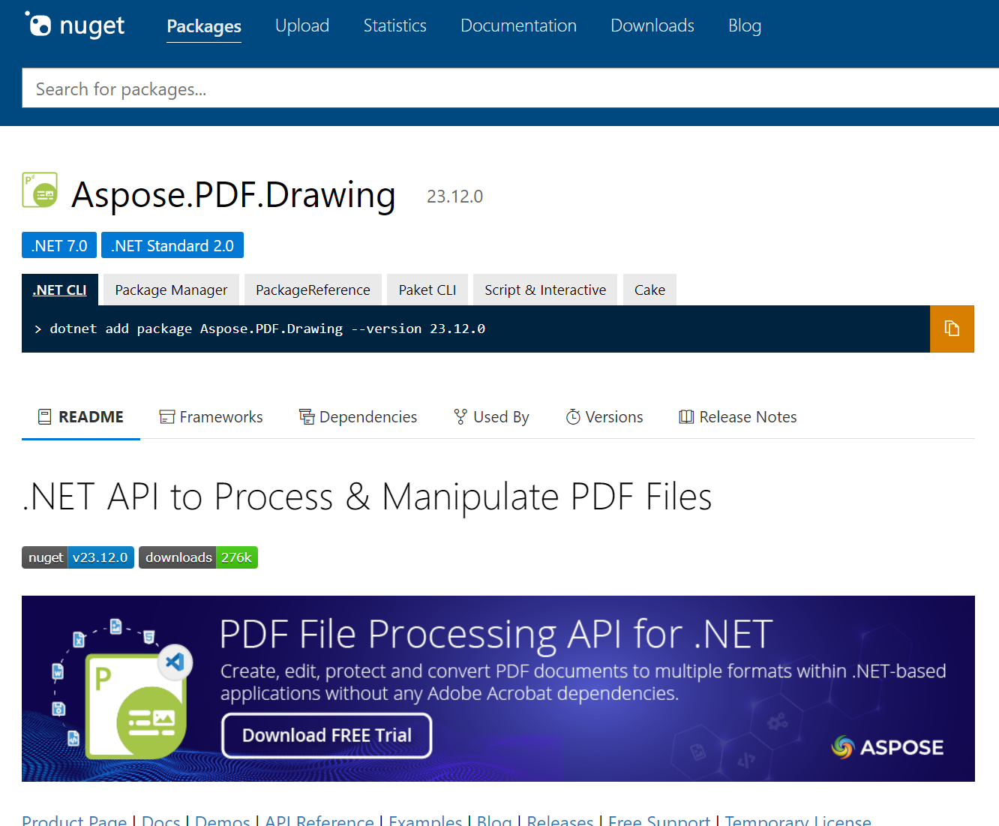

## Introduction

**Aspose.PDF.Drawing for .NET** is a variation of Aspose.PDF, which provides Aspose.Drawing library instead of System.Drawing. 

This component is written in a managed C#, allowing developers to add PDF file creation and management features to their Microsoft applications. NET (WinForms, ASP.NET, and .NET Compact Framework).

It helps to avoid numerous problems and bugs associated with using System.Drawing.Common on non-Windows platforms.

Also, it need to say that the Aspose.PDF.Drawing library successfully works on the Docker platform that allows you to package into a container your application. For more information check [How to run Aspose.PDF in Docker](https://docs.aspose.com/pdf/net/docker/) page.  The 'ttf-mscorefonts-installer' and  'fontconfig' packages are needed for successful work Aspose.PDF.Drawing for .NET library in Docker.

**Aspose.PDF.Drawing for .NET** presents the same functions as Aspose.PDF. It can interact with PDF documents, encompassing elements such as pages, text, images, attachments, fonts, bookmarks, annotations, forms, operators, stamps, watermarks, links, security functions, signatures, and printing.

**Aspose.PDF.Drawing for .NET** boasts an extensive array of features, including options for compressing PDFs, creating and manipulating tables, supporting graph objects, facilitating comprehensive hyperlink functionality, implementing advanced security controls, managing custom fonts, integrating seamlessly with data sources, and enabling the addition or removal of bookmarks. Users can create a table of contents, manipulate attachments and annotations by adding, updating, or deleting them, import or export PDF form data, and modify text and images by adding, replacing, or removing them. Additionally, the software allows for actions such as splitting, concatenating, extracting, or inserting pages, transforming pages into images, and printing PDF documents, among other functionalities. 

## Advantages

Aspose.Drawing presents several advantages over the System.Drawing.Common library:

1. Cross-platform support. Aspose.PDF.Drawing enables the development of drawing applications across diverse platforms, including Windows, Linux, macOS, Android, and iOS.

1. The performance of the Aspose.PDF.Drawing for .NET library is reduced by no more than 2%. 

1. The rendering quality. With Aspose.PDF.Drawing, you can achieve top-notch rendering of text featuring anti-aliasing and hinting. This ensures smooth font edges without jagged artifacts, making text legible across various displays and resolutions. The difference in a document of A4 format is at most 10 pixels per page.

1. Comprehensive feature set. Aspose.PDF.Drawing boasts an extensive array of features for 2D graphics, encompassing shapes, lines, text, images, and charts.

1. API compatibility. Utilizing the System.Drawing namespace, Aspose.PDF.Drawing seamlessly replaces System.Drawing.Common, allowing for the substitution without the need to alter the existing source code.

## Features

1. Vector Graphics Support. Aspose.PDF.Drawing is compatible with the SVG vector image format, enabling developers to craft scalable graphics that maintain their quality when rendered at any resolution.

1. Text Rendering Capabilities. Aspose.PDF.Drawing excels in rendering text with high quality. This ensures smooth font edges, eliminating jagged artifacts and ensuring legibility across diverse displays and resolutions.

1. Shape Formatting Assistance. Aspose.PDF.Drawing offers a range of options for formatting shapes, encompassing features like fill color, stroke color, line thickness, and line style.

1. Image Processing Features. Aspose.PDF.Drawing for .NET provides diverse image processing capabilities, including add, replace, or remove.

The Aspose.PDF.Drawing for .NET supports a wide variety of functions, such as:

- Document compression.
- Table creation and manipulation.
- Support for graph objects.
- Extensive hyperlink functionality.
- Extended security controls.
- Custom font handling.
- Integration with data sources.
- Add or remove bookmarks.
- Create a table of contents.
- Add, update, delete attachments and annotations.
- Import or export PDF form data.
- Add, replace or remove text and images.
- Split, concatenate, extract or inset pages.
- Transform pages to images.
- Print PDF documents and much more.

For printing PDF documents, System.Drawing.Common is used, so it will only work on the Windows platform.

## Licensing

There is no additional license for Aspose.PDF.Drawing, use the same as for Aspose.PDF. Check the [Aspose PDF License](/pdf/net/licensing/) section.

## Installation

To try **Aspose.PDF.Drawing for .NET** just runs `Install-Package Aspose.PDF.Drawing` from Package Manager Console in Visual Studio to fetch the NuGet package. If you already have Aspose.PDF for .NET and want to upgrade the version, please execute `Update-Package Aspose.PDF.Drawing` to get the latest version. More information can be found at the link to [NuGet package](https://www.nuget.org/packages/Aspose.PDF.Drawing/).

Learn classes available in Aspose.PDF.Drawing on [API Reference](https://reference.aspose.com/pdf/net/aspose.pdf.drawing/) site.

Learn more about:

- [Supported File Formats](/pdf/net/supported-file-formats/)
- [System Requirements](/pdf/net/system-requirements/)
- [Licensing](/pdf/net/licensing/)
- [Technical Support](/pdf/net/technical-support/)
