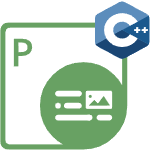

<h2>Welcome to Aspose.PDF for Node.js via C++</h2>

{}

{}

<h2>Chapters</h2>

- [What's new](/pdf/nodejs-cpp/whatsnew/)
- [Overview](/pdf/nodejs-cpp/overview/)
- [Get Started](/pdf/nodejs-cpp/get-started/)
- [Basic operations](/pdf/nodejs-cpp/basic-operations/)
- [Release Notes]()

<h2>Aspose.PDF for Node.js Resources</h2>

The following are the links to some useful resources you may need to accomplish your tasks.

- [Aspose.PDF for Node.js Features](/pdf/nodejs-cpp/key-features/)
- [Aspose.PDF for Node.js Release Notes]()
- [Download Aspose.PDF for Node.js]()
- [Aspose.PDF for Node.js Product Page]()
- [Aspose.PDF for Node.js API Reference Guide](https://reference.aspose.com/pdf/nodejs-cpp/)
- [Aspose.PDF for Node.js Free Support Forum](https://forum.aspose.com/c/pdf/10)
- [Aspose.PDF for Node.js Paid Support Helpdesk](https://helpdesk.aspose.com/)
